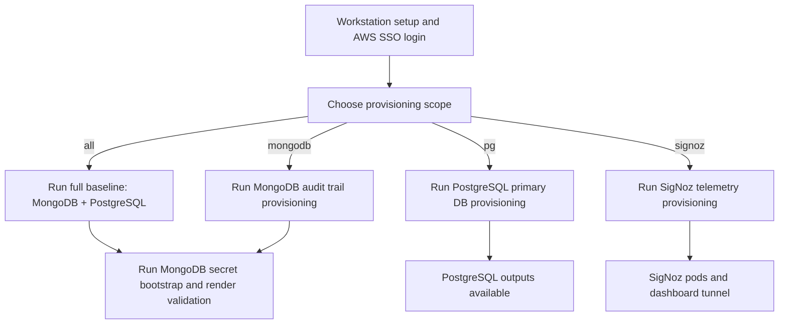

# OMS Data Layer — MongoDB, PostgreSQL, and Telemetry

## Purpose
This repository provisions the data-layer infrastructure for the **OMS (Order Management System)** dev environment on EKS.

The OMS application uses three backend services:

| Service | Role in OMS | Provisioned By |
|---|---|---|
| **PostgreSQL** (Aurora) | Primary application database — stores orders, inventory, and operational data. | `scripts/provision.sh pg` |
| **MongoDB** (Percona) | Audit trail database — stores immutable event records for compliance and traceability. | `scripts/provision.sh mongodb` |
| **SigNoz** | Application telemetry — collects traces, metrics, and logs from OMS services for observability. | `scripts/provision.sh signoz` |

Each service can be provisioned independently or together (`scripts/provision.sh all` runs MongoDB + PostgreSQL).

## Read This First

| I am a... | I want to... | Why | Start here |
|---|---|---|---|
| **Infra Operator** | Provision infrastructure, troubleshoot | You run the scripts that create/destroy real AWS + Kubernetes resources — you need the full setup and step-by-step runbook. | [Environment Setup](docs/guides/environment-setup.md) → [Operator Runbook](docs/guides/operator-runbook.md) |
| **Infra Architect** | Understand components, architecture, maintain | You own the design decisions behind each component and need the full dependency/state picture to change them safely. | [Component Catalog](docs/references/component-catalog.md) → [Architect Reference](docs/guides/architect-reference.md) |
| **Boomi Admin** | Write audit logs, use telemetry | You integrate against this platform (MongoDB + SigNoz) from Boomi — you need the API/library contract, not infrastructure provisioning. | [Boomi Integration Guide](docs/guides/boomi-integration-guide.md) |
| **Enterprise Architect** | Review design, security, compliance | You need risk/compliance/production-readiness context, not hands-on provisioning steps. | [Enterprise Architecture](docs/guides/enterprise-architecture.md) |

Full documentation hub: [docs/index.md](docs/index.md)

| Quick Link | Purpose |
|---|---|
| [docs/index.md](docs/index.md) | Central navigation and system overview |
| [docs/references/verification-commands.md](docs/references/verification-commands.md) | Per-component health checks |
| [docs/references/recovery-procedures.md](docs/references/recovery-procedures.md) | Rollback and disaster recovery |
| [docs/operations/dev-configuration-catalog.md](docs/operations/dev-configuration-catalog.md) | All embedded defaults |
| [docs/history/](docs/history/) | Historical snapshots (not current runbook) |

## Table Of Contents
- [Purpose](#purpose)
- [Read This First](#read-this-first)
- [Onboarding Flow](#onboarding-flow)
- [Provisioning Choices](#provisioning-choices)
- [Script Reference](#script-reference)
- [SigNoz (Application Telemetry)](#signoz-application-telemetry)
- [Documentation Structure](#documentation-structure)

## Onboarding Flow



## Provisioning Choices

Use one of these four options depending on your goal.

| Goal | When To Use It | Command |
|---|---|---|
| Full baseline | First-time environment setup or full convergence check. Provisions MongoDB + PostgreSQL prerequisites, then applies MongoDB k8s components (operator, workload, policies). | `bash scripts/provision.sh all` |
| MongoDB path only | MongoDB prerequisite and k8s component updates without touching PostgreSQL | `bash scripts/provision.sh mongodb` |
| PostgreSQL path only | PostgreSQL prerequisite updates without touching MongoDB | `bash scripts/provision.sh pg` |
| SigNoz (telemetry) | Install or update the application telemetry stack | `bash scripts/provision.sh signoz` |

## Script Reference

This section explains why each script exists, not only the command name.

| Script | Purpose | Typical Time To Use |
|---|---|---|
| [`scripts/provision.sh`](scripts/provision.sh) | Main entrypoint. Chooses scope (`all`, `mongodb`, `pg`, `signoz`) and runs the right steps. Platform admins can add `--bootstrap-platform-controllers` to also install missing cluster controllers and storage driver. | Normal operator usage; platform-admin bootstrap when needed. |
| [`scripts/provision-platform-prereq.sh`](scripts/provision-platform-prereq.sh) | Runs Terraform for infra scopes and picks the correct Terraform root/state key per scope. | Infra-only operations. |
| [`scripts/provision-k8s-components.sh`](scripts/provision-k8s-components.sh) | Applies Kubernetes components by scope (`mongodb`, `signoz`, `operators`, `policies`, `overlay`). | K8s-only operations. |
| [`scripts/open-signoz-ui.sh`](scripts/open-signoz-ui.sh) | Access helper for SigNoz dashboard. Supports dev port-forward and production ingress URL discovery. | Opening SigNoz UI in dev and production. |
| [`scripts/bootstrap-dev-secrets.sh`](scripts/bootstrap-dev-secrets.sh) | Creates MongoDB encryption key and all four Percona operator user credential secrets (backup, clusterAdmin, clusterMonitor, userAdmin). If `.local-dev-user-passwords.txt` exists, reads passwords from it; if the file does not exist, auto-generates all passwords and saves them there. Skips any secret that already exists in the cluster. | After infra provisioning, before MongoDB overlay apply. |
| [`scripts/validate-dev-render.sh`](scripts/validate-dev-render.sh) | Renders and checks dev overlay output locally. | Before applying MongoDB manifests. |
| [`scripts/create-signoz-root-user-secret.sh`](scripts/create-signoz-root-user-secret.sh) | Bootstraps the SigNoz admin account automatically (no manual UI signup) via SigNoz's root-user feature. | Once per environment, before/with `provision.sh signoz`. |
| [`scripts/provision.sh`](scripts/provision.sh) `signoz-observability` | Applies SigNoz dashboards + alert rules as code (K8s, MongoDB, PostgreSQL, OTel Collector, Boomi telemetry) via Terraform. Idempotent — safe to re-run. | After SigNoz is up and a one-time Service Account/API key exists — see [SigNoz Dashboard Import Pack](docs/references/signoz-dashboard-import-pack.md). |
| [`scripts/destroy.sh`](scripts/destroy.sh) | Scoped teardown entrypoint (`mongodb`, `pg`, `signoz`, `signoz-observability`, `all`). | Post-test cleanup and rebuild prep. |

## SigNoz (Application Telemetry)

SigNoz provides distributed tracing, metrics, and log aggregation for OMS application services. It is provisioned separately from the database infrastructure because it has no Terraform prerequisites — only Kubernetes manifests.

Details:
- Open-source edition (no enterprise license required).
- Dev all-in-one profile (single-node ClickHouse backend).
- Dev: internal-only access via local port-forward.
- Production: expose dashboard through ingress (ALB/NGINX) with SSO/OIDC and network restrictions.

How to install:

```bash
bash scripts/provision.sh signoz
```

The admin account is bootstrapped automatically (no manual "Sign Up" race) —
`scripts/provision.sh signoz` auto-creates the required `signoz-root-user`
Secret if it doesn't exist yet (restarting the `signoz` StatefulSet if it was
already running without it), so there's no ordering pitfall between the two
scripts. You can still run `scripts/create-signoz-root-user-secret.sh`
explicitly first if you want to control the timing. Dashboards and alert
rules for K8s, MongoDB, PostgreSQL, the OTel Collector, and Boomi app
telemetry are also managed as code:

```bash
bash scripts/provision.sh signoz-observability --auto-approve
```

See [docs/references/signoz-dashboard-import-pack.md](docs/references/signoz-dashboard-import-pack.md)
for the one-time prerequisite and the full list of what's created.

How to open the dashboard in development:

```bash
bash scripts/open-signoz-ui.sh
```

Equivalent explicit command (dev only):

```bash
kubectl -n signoz port-forward svc/signoz 3301:8080
```

Then open `http://127.0.0.1:3301`.

How to retrieve the production ingress URL (preferred in production):

```bash
bash scripts/open-signoz-ui.sh --mode ingress --namespace signoz --ingress signoz
```

If no host is returned, create/verify ingress first (ALB or NGINX ingress controller), then protect it with SSO/OIDC before granting access.

Test the Boomi Groovy library by writing a sample audit log record and sending matching OTLP telemetry:

```bash
scripts/write-auditlog-and-telemetry.sh
```

Intended usage split:
- `scripts/groovy/boomi/BoomiAuditLogLibrary.groovy`: Boomi-facing reusable library for secret resolution and direct audit-log writes.
- `scripts/write-auditlog-and-telemetry.groovy`: test harness that exercises the library end-to-end.

Use Kubernetes Secret for MongoDB URI:

```bash
scripts/write-auditlog-and-telemetry.sh \
  --mongo-uri-k8s-secret oms-audit-writer \
  --mongo-uri-k8s-namespace mongodb \
  --mongo-uri-k8s-key mongoUri
```

Use AWS Secrets Manager for MongoDB URI:

```bash
scripts/write-auditlog-and-telemetry.sh \
  --mongo-uri-secret-id /oms/dev/mongodb/audit-writer \
  --aws-region ap-east-1
```

If local ports differ, override script inputs with:

```bash
scripts/write-auditlog-and-telemetry.sh \
  --mongo-uri mongodb://127.0.0.1:27018/?directConnection=true \
  --otel-endpoint http://127.0.0.1:3301/v1/logs
```

## Documentation Structure

All documentation lives under `docs/` with persona-based guides.

| Document | Purpose |
|---|---|
| [docs/index.md](docs/index.md) | Central navigation hub — start here to find anything |
| [docs/guides/environment-setup.md](docs/guides/environment-setup.md) | Workstation and environment preparation |
| [docs/guides/operator-runbook.md](docs/guides/operator-runbook.md) | Provisioning, safety gates, troubleshooting |
| [docs/guides/architect-reference.md](docs/guides/architect-reference.md) | Architecture, state model, day-2 maintenance |
| [docs/guides/boomi-integration-guide.md](docs/guides/boomi-integration-guide.md) | Audit log library API, SigNoz, Boomi usage |
| [docs/guides/enterprise-architecture.md](docs/guides/enterprise-architecture.md) | Design rationale, security, compliance, roadmap |
| [docs/references/component-catalog.md](docs/references/component-catalog.md) | Every component: what/why/how/depends-on |
| [docs/references/verification-commands.md](docs/references/verification-commands.md) | Per-component health checks |
| [docs/references/recovery-procedures.md](docs/references/recovery-procedures.md) | Rollback, DR, credential rotation |
| [docs/operations/dev-configuration-catalog.md](docs/operations/dev-configuration-catalog.md) | Embedded defaults and config inventory |
| [platform-prerequisites/terraform/README.md](platform-prerequisites/terraform/README.md) | Terraform quick-start (links to full guides) |
| [docs/history/](docs/history/) | Historical snapshots (not current runbook) |
