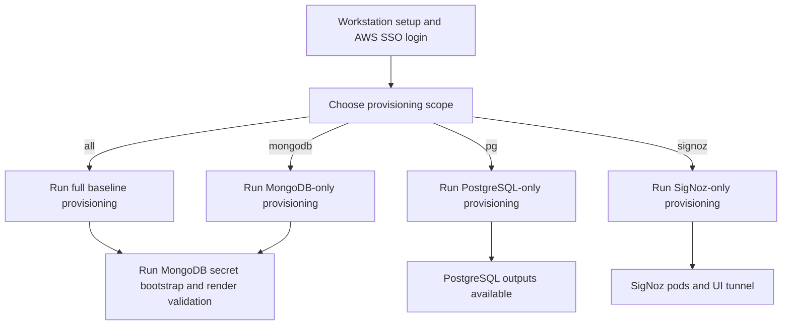

# MongoDB on EKS and PostgreSQL Prerequisites

## Purpose
This repository gives operators a script-driven way to provision and run:
- MongoDB workload resources on EKS
- MongoDB platform prerequisites (IAM, namespace, service account, PBM bucket)
- Dev Aurora PostgreSQL prerequisites
- Optional SigNoz (open-source) observability stack

## Read This First

| Question | Answer |
|---|---|
| Where do I start? | Start with the operator runbook: [platform-prerequisites/terraform/README.md](platform-prerequisites/terraform/README.md). |
| What is this file? | A high-level overview. It explains what to run and when. |
| Where is detailed troubleshooting? | [platform-prerequisites/terraform/README.md](platform-prerequisites/terraform/README.md) under Troubleshooting. |
| Where are all defaults listed? | [docs/operations/dev-configuration-catalog.md](docs/operations/dev-configuration-catalog.md). |
| Where are historical notes? | [docs/history/](docs/history/) (not used as current runbook). |

## Table Of Contents
- [Purpose](#purpose)
- [Read This First](#read-this-first)
- [Onboarding Flow](#onboarding-flow)
- [Provisioning Choices](#provisioning-choices)
- [Script Reference](#script-reference)
- [Optional SigNoz](#optional-signoz)
- [Documentation Structure](#documentation-structure)

## Onboarding Flow



## Provisioning Choices

Use one of these four options depending on your goal.

| Goal | When To Use It | Command |
|---|---|---|
| Full baseline | First-time environment setup or full convergence check | `bash scripts/provision.sh all` |
| MongoDB path only | MongoDB prerequisite updates without PostgreSQL changes | `bash scripts/provision.sh mongodb` |
| PostgreSQL path only | PostgreSQL-only updates without MongoDB changes | `bash scripts/provision.sh pg` |
| SigNoz only | Install or re-apply observability stack only | `bash scripts/provision.sh signoz` |

## Script Reference

This section explains why each script exists, not only the command name.

| Script | Purpose | Typical Time To Use |
|---|---|---|
| `scripts/provision.sh` | Main entrypoint. Chooses scope (`all`, `mongodb`, `pg`, `signoz`) and runs the right steps. | Normal operator usage. |
| `scripts/provision-platform-prereq.sh` | Runs Terraform for infra scopes and picks the correct Terraform root/state key per scope. | Infra-only operations. |
| `scripts/provision-k8s-components.sh` | Applies Kubernetes components by scope (`mongodb`, `signoz`, `operators`, `policies`, `overlay`). | K8s-only operations. |
| `scripts/open-signoz-ui.sh` | Opens local port-forward tunnel to SigNoz frontend service. | Accessing SigNoz UI from workstation. |
| `scripts/bootstrap-dev-secrets.sh` | Creates required MongoDB secrets if missing. | After infra provisioning, before MongoDB overlay apply. |
| `scripts/validate-dev-render.sh` | Renders and checks dev overlay output locally. | Before applying MongoDB manifests. |

## Optional SigNoz

Plain explanation:
- SigNoz is optional observability.
- In this repository, it is open-source mode.
- Default setup is internal-only access.

How to install:

```bash
bash scripts/provision.sh signoz
```

How to open UI locally:

```bash
bash scripts/open-signoz-ui.sh
```

## Documentation Structure

Use these documents by purpose.

| Document | Purpose |
|---|---|
| [README.md](README.md) | Overview and onboarding entrypoint (this file). |
| [platform-prerequisites/terraform/README.md](platform-prerequisites/terraform/README.md) | Canonical operator runbook with detailed steps and troubleshooting. |
| [platform-prerequisites/terraform/mongodb/README.md](platform-prerequisites/terraform/mongodb/README.md) | MongoDB-only Terraform root context. |
| [platform-prerequisites/terraform/postgresql/README.md](platform-prerequisites/terraform/postgresql/README.md) | PostgreSQL-only Terraform root context. |
| [docs/operations/dev-configuration-catalog.md](docs/operations/dev-configuration-catalog.md) | Source of truth for embedded defaults and config inventory. |
| [docs/operations/README.md](docs/operations/README.md) | Operations docs map and ownership rules. |
| [docs/history/](docs/history/) | Historical snapshots/specs/plans for traceability only. |
