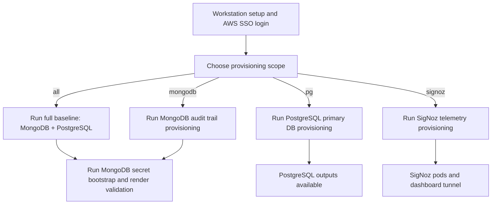

# OMS Data Layer — MongoDB, PostgreSQL, and Telemetry

## Purpose
This repository provisions the data-layer infrastructure for the **OMS (Order Management System)** dev environment on EKS.

The OMS application uses three backend services:

| Service | Role in OMS | Provisioned By |
|---|---|---|
| **PostgreSQL** (Aurora) | Primary application database — stores orders, inventory, and operational data. | `scripts/provision.sh pg` |
| **MongoDB** (Percona) | Audit trail database — stores immutable event records for compliance and traceability. | `scripts/provision.sh mongodb` |
| **SigNoz** | Application telemetry — collects traces, metrics, and logs from OMS services for observability. | `scripts/provision.sh signoz` |

Each service can be provisioned independently or together (`scripts/provision.sh all` runs MongoDB + PostgreSQL).

## Read This First

| Question | Answer |
|---|---|
| Where do I start? | Start with the operator runbook: [platform-prerequisites/terraform/README.md](platform-prerequisites/terraform/README.md). |
| What is this file? | A high-level overview. It explains what to run and when. |
| Where is detailed troubleshooting? | [platform-prerequisites/terraform/README.md](platform-prerequisites/terraform/README.md) under Troubleshooting. |
| Where are all defaults listed? | [docs/operations/dev-configuration-catalog.md](docs/operations/dev-configuration-catalog.md). |
| Where are historical notes? | [docs/history/](docs/history/) (not used as current runbook). |

## Table Of Contents
- [Purpose](#purpose)
- [Read This First](#read-this-first)
- [Onboarding Flow](#onboarding-flow)
- [Provisioning Choices](#provisioning-choices)
- [Script Reference](#script-reference)
- [SigNoz (Application Telemetry)](#signoz-application-telemetry)
- [Documentation Structure](#documentation-structure)

## Onboarding Flow



## Provisioning Choices

Use one of these four options depending on your goal.

| Goal | When To Use It | Command |
|---|---|---|
| Full baseline | First-time environment setup or full convergence check. Provisions MongoDB + PostgreSQL prerequisites, then applies MongoDB k8s components (operator, workload, policies). | `bash scripts/provision.sh all` |
| MongoDB path only | MongoDB prerequisite and k8s component updates without touching PostgreSQL | `bash scripts/provision.sh mongodb` |
| PostgreSQL path only | PostgreSQL prerequisite updates without touching MongoDB | `bash scripts/provision.sh pg` |
| SigNoz (telemetry) | Install or update the application telemetry stack | `bash scripts/provision.sh signoz` |

## Script Reference

This section explains why each script exists, not only the command name.

| Script | Purpose | Typical Time To Use |
|---|---|---|
| `scripts/provision.sh` | Main entrypoint. Chooses scope (`all`, `mongodb`, `pg`, `signoz`) and runs the right steps. Platform admins can add `--bootstrap-platform-controllers` to also install missing cluster controllers and storage driver. | Normal operator usage; platform-admin bootstrap when needed. |
| `scripts/provision-platform-prereq.sh` | Runs Terraform for infra scopes and picks the correct Terraform root/state key per scope. | Infra-only operations. |
| `scripts/provision-k8s-components.sh` | Applies Kubernetes components by scope (`mongodb`, `signoz`, `operators`, `policies`, `overlay`). | K8s-only operations. |
| `scripts/open-signoz-ui.sh` | Opens local port-forward tunnel to SigNoz frontend service. | Accessing SigNoz UI from workstation. |
| `scripts/bootstrap-dev-secrets.sh` | Creates MongoDB encryption key and all four Percona operator user credential secrets (backup, clusterAdmin, clusterMonitor, userAdmin). If `.local-dev-user-passwords.txt` exists, reads passwords from it; if the file does not exist, auto-generates all passwords and saves them there. Skips any secret that already exists in the cluster. | After infra provisioning, before MongoDB overlay apply. |
| `scripts/validate-dev-render.sh` | Renders and checks dev overlay output locally. | Before applying MongoDB manifests. |

## SigNoz (Application Telemetry)

SigNoz provides distributed tracing, metrics, and log aggregation for OMS application services. It is provisioned separately from the database infrastructure because it has no Terraform prerequisites — only Kubernetes manifests.

Details:
- Open-source edition (no enterprise license required).
- Dev all-in-one profile (single-node ClickHouse backend).
- Internal-only access — no public ingress; use a local port-forward to view the dashboard.

How to install:

```bash
bash scripts/provision.sh signoz
```

How to open the dashboard locally:

```bash
bash scripts/open-signoz-ui.sh
```

## Documentation Structure

Use these documents by purpose.

| Document | Purpose |
|---|---|
| [README.md](README.md) | Overview and onboarding entrypoint (this file). |
| [platform-prerequisites/terraform/README.md](platform-prerequisites/terraform/README.md) | Canonical operator runbook with detailed steps and troubleshooting. |
| [platform-prerequisites/terraform/mongodb/README.md](platform-prerequisites/terraform/mongodb/README.md) | MongoDB-only Terraform root context. |
| [platform-prerequisites/terraform/postgresql/README.md](platform-prerequisites/terraform/postgresql/README.md) | PostgreSQL-only Terraform root context. |
| [docs/operations/dev-configuration-catalog.md](docs/operations/dev-configuration-catalog.md) | Source of truth for embedded defaults and config inventory. |
| [docs/operations/README.md](docs/operations/README.md) | Operations docs map and ownership rules. |
| [docs/history/](docs/history/) | Historical snapshots/specs/plans for traceability only. |
