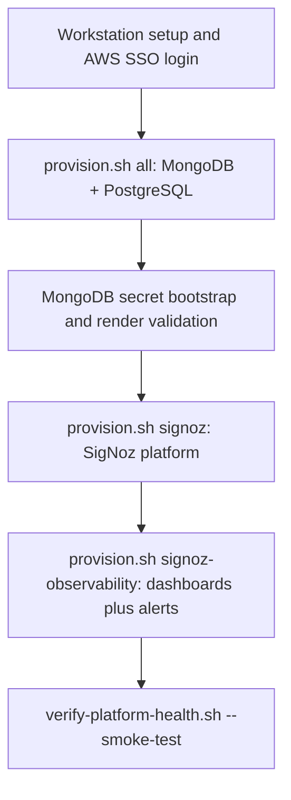
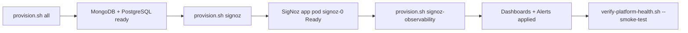

# OMS Data Layer — MongoDB, PostgreSQL, and Telemetry

## Purpose
This repository provisions the data-layer infrastructure for the **OMS (Order Management System)** dev environment on EKS.

The OMS application uses three backend services:

| Service | Role in OMS | Provisioned By |
|---|---|---|
| **PostgreSQL** (Aurora) | Primary application database — stores orders, inventory, and operational data. | `scripts/provision.sh pg` |
| **MongoDB** (Percona) | Audit trail database — stores immutable event records for compliance and traceability. | `scripts/provision.sh mongodb` |
| **SigNoz** | Application telemetry — collects traces, metrics, and logs from OMS services for observability. | `scripts/provision.sh signoz` |

Each service can be provisioned independently, but a full dev environment needs all three. `scripts/provision.sh all` only covers MongoDB + PostgreSQL — SigNoz is a separate step because it has its own lifecycle and failure modes (see [Why These Scopes Are Separate](#why-these-scopes-are-separate)).

Recommended full-stack dev sequence (after first setup) — run these four commands in order, not as alternatives:
1. `bash scripts/provision.sh all --auto-approve`
2. `bash scripts/provision.sh signoz --auto-approve`
3. `bash scripts/provision.sh signoz-observability --auto-approve`
4. `bash scripts/verify-platform-health.sh --smoke-test`

## Read This First

| I am a... | I want to... | Why | Start here |
|---|---|---|---|
| **Infra Operator** | Provision infrastructure, troubleshoot | You run the scripts that create/destroy real AWS + Kubernetes resources — you need the full setup and step-by-step runbook. | [Environment Setup](docs/guides/environment-setup.md) → [Operator Runbook](docs/guides/operator-runbook.md) |
| **Infra Architect** | Understand components, architecture, maintain | You own the design decisions behind each component and need the full dependency/state picture to change them safely. | [Component Catalog](docs/references/component-catalog.md) → [Architect Reference](docs/guides/architect-reference.md) |
| **Boomi Admin** | Write audit logs, use telemetry | You integrate against this platform (MongoDB + SigNoz) from Boomi — you need the API/library contract, not infrastructure provisioning. | [Boomi Integration Guide](docs/guides/boomi-integration-guide.md) |
| **Enterprise Architect** | Review design, security, compliance | You need risk/compliance/production-readiness context, not hands-on provisioning steps. | [Enterprise Architecture](docs/guides/enterprise-architecture.md) |

Full documentation hub: [docs/index.md](docs/index.md)

| Quick Link | Purpose |
|---|---|
| [docs/index.md](docs/index.md) | Central navigation and system overview |
| [docs/references/glossary.md](docs/references/glossary.md) | Plain-language lookup for jargon/acronyms used across these docs |
| [docs/references/verification-commands.md](docs/references/verification-commands.md) | Per-component health checks |
| [docs/references/recovery-procedures.md](docs/references/recovery-procedures.md) | Rollback and disaster recovery |
| [docs/operations/dev-configuration-catalog.md](docs/operations/dev-configuration-catalog.md) | All embedded defaults |
| [docs/history/](docs/history/) | Historical snapshots (not current runbook) |

## Table Of Contents
- [Purpose](#purpose)
- [Read This First](#read-this-first)
- [Onboarding Flow](#onboarding-flow)
- [Why These Scopes Are Separate](#why-these-scopes-are-separate)
- [Persona Journeys](#persona-journeys)
- [Provisioning Choices](#provisioning-choices)
- [Script Reference](#script-reference)
- [SigNoz (Application Telemetry)](#signoz-application-telemetry)
- [SigNoz Monitoring Coverage](#signoz-monitoring-coverage)
- [Newcomer Self-Verification](#newcomer-self-verification)
- [Documentation Structure](#documentation-structure)

## Onboarding Flow

The diagram below shows the full dev-environment sequence. Each stage is also a
valid stopping point if you only need that piece (for example, MongoDB-only
changes never need to touch SigNoz) — see [Provisioning Choices](#provisioning-choices)
for narrower alternatives to step 2.



Narrower alternatives to the full sequence (see [Provisioning Choices](#provisioning-choices)):
- MongoDB only: `bash scripts/provision.sh mongodb`
- PostgreSQL only: `bash scripts/provision.sh pg`

## Why These Scopes Are Separate

Short answer: this split is intentional to make provisioning safer, clearer, and easier to recover.

`all` is intentionally limited to core data-layer provisioning (MongoDB + PostgreSQL).
`signoz` is separate because telemetry stack lifecycle and troubleshooting are independent.
`signoz-observability` is separate because it depends on a live SigNoz API endpoint and credentials, and applies dashboards/alerts as application-level configuration.

Dependency view:



Design rationale:
1. Failure isolation: if SigNoz deploy has startup issues, core databases can still be provisioned and validated.
2. Dependency correctness: observability IaC requires SigNoz API reachability and token bootstrap, which do not exist before `signoz` is healthy.
3. Operational flexibility: teams can update dashboards/alerts without touching database infrastructure.
4. Lower blast radius: changes in telemetry config do not re-run or risk database provisioning steps.

Execution intent by scope:

| Scope | What it creates | Why it is its own step | Typical trigger |
|---|---|---|---|
| `all` | MongoDB + PostgreSQL infra and MongoDB k8s components | Core data services are baseline dependencies for OMS | First setup, infra rebuild, core drift correction |
| `signoz` | SigNoz telemetry platform on Kubernetes | SigNoz app startup and readiness are independent from core DB infra | Telemetry platform install/update |
| `signoz-observability` | SigNoz dashboards and alerts as code | Requires SigNoz API to be live and authenticated | Alert/dashboard rollout or observability tuning |

## Persona Journeys

Use these exact entry paths if you are new to this repository.

### Infra Operator (Day-1 to Day-2)

1. Read [docs/guides/environment-setup.md](docs/guides/environment-setup.md)
2. Run `scripts/verify-platform-health.sh --preflight`
3. Read [docs/guides/operator-runbook.md](docs/guides/operator-runbook.md)
4. Run:
   1. `bash scripts/provision.sh all --auto-approve`
   2. `bash scripts/provision.sh signoz --auto-approve`
   3. `bash scripts/provision.sh signoz-observability --auto-approve`
5. Validate with `bash scripts/verify-platform-health.sh --smoke-test`
6. For incidents, use [docs/references/recovery-procedures.md](docs/references/recovery-procedures.md)

### Infra Architect (design and maintenance)

1. Read [docs/references/component-catalog.md](docs/references/component-catalog.md)
2. Read [docs/guides/architect-reference.md](docs/guides/architect-reference.md)
3. Review monitored signals and alert definitions in [docs/references/signoz-dashboard-import-pack.md](docs/references/signoz-dashboard-import-pack.md)
4. Validate planned changes with [docs/references/verification-commands.md](docs/references/verification-commands.md)

### Boomi Admin (integration and operations)

1. Read [docs/guides/boomi-integration-guide.md](docs/guides/boomi-integration-guide.md)
2. Ask Operator to ensure `scripts/create-audit-writer-secret.sh` and SigNoz provisioning are complete
3. Run `scripts/run-audit-telemetry-test.sh`
4. Confirm logs with `service.name = oms-audit-writer` in SigNoz

### Enterprise Architect (risk, compliance, readiness)

1. Read [docs/guides/enterprise-architecture.md](docs/guides/enterprise-architecture.md)
2. Read [docs/guides/architect-reference.md](docs/guides/architect-reference.md#infrastructure-and-database-monitoring)
3. Review [docs/references/signoz-dashboard-import-pack.md](docs/references/signoz-dashboard-import-pack.md) for baseline alert intent and coverage
4. Review [docs/references/verification-commands.md](docs/references/verification-commands.md) for evidence collection

## Provisioning Choices

Use one of these five options depending on your goal.

| Goal | When To Use It | Command | Why not merged into `all` |
|---|---|---|---|
| Full baseline | First-time environment setup or full convergence check. Provisions MongoDB + PostgreSQL prerequisites, then applies MongoDB k8s components (operator, workload, policies). | `bash scripts/provision.sh all` | This is the baseline itself. |
| MongoDB path only | MongoDB prerequisite and k8s component updates without touching PostgreSQL | `bash scripts/provision.sh mongodb` | Limits blast radius to MongoDB changes. |
| PostgreSQL path only | PostgreSQL prerequisite updates without touching MongoDB | `bash scripts/provision.sh pg` | Limits blast radius to PostgreSQL changes. |
| SigNoz (telemetry) | Install or update the application telemetry stack | `bash scripts/provision.sh signoz` | SigNoz readiness is independent and can fail/recover separately from DB infra. |
| SigNoz observability (dashboards + alerts) | Apply baseline dashboards and alert rules as code after SigNoz app is up | `bash scripts/provision.sh signoz-observability --auto-approve` | Requires live SigNoz API and auth token; this dependency does not exist during `all`. |

## Script Reference

This section explains why each script exists, not only the command name.

| Script | Purpose | Typical Time To Use |
|---|---|---|
| [`scripts/provision.sh`](scripts/provision.sh) | Main entrypoint. Chooses scope (`all`, `mongodb`, `pg`, `signoz`, `signoz-observability`) and runs the right steps. Platform admins can add `--bootstrap-platform-controllers` to also install missing cluster controllers and storage driver. | Normal operator usage; platform-admin bootstrap when needed. |
| [`scripts/provision-platform-prereq.sh`](scripts/provision-platform-prereq.sh) | Runs Terraform for infra scopes and picks the correct Terraform root/state key per scope. | Infra-only operations. |
| [`scripts/provision-k8s-components.sh`](scripts/provision-k8s-components.sh) | Applies Kubernetes components by scope (`mongodb`, `signoz`, `operators`, `policies`, `overlay`). | K8s-only operations. |
| [`scripts/open-signoz-ui.sh`](scripts/open-signoz-ui.sh) | Access helper for SigNoz dashboard. Supports dev port-forward and production ingress URL discovery. | Opening SigNoz UI in dev and production. |
| [`scripts/bootstrap-dev-secrets.sh`](scripts/bootstrap-dev-secrets.sh) | Creates MongoDB encryption key and all four Percona operator user credential secrets (backup, clusterAdmin, clusterMonitor, userAdmin). If `.local-dev-user-passwords.txt` exists, reads passwords from it; if the file does not exist, auto-generates all passwords and saves them there. Skips any secret that already exists in the cluster. | After infra provisioning, before MongoDB overlay apply. |
| [`scripts/validate-dev-render.sh`](scripts/validate-dev-render.sh) | Renders and checks dev overlay output locally. | Before applying MongoDB manifests. |
| [`scripts/create-signoz-root-user-secret.sh`](scripts/create-signoz-root-user-secret.sh) | Bootstraps the SigNoz admin account automatically (no manual UI signup) via SigNoz's root-user feature. | Once per environment, before/with `provision.sh signoz`. |
| [`scripts/provision.sh`](scripts/provision.sh) `signoz-observability` | Applies SigNoz dashboards + alert rules as code (K8s, MongoDB, PostgreSQL, OTel Collector, Boomi telemetry) via Terraform. If API key is missing, bootstrap is automated. Idempotent — safe to re-run. | After SigNoz app is up — see [SigNoz Dashboard Import Pack](docs/references/signoz-dashboard-import-pack.md). |
| [`scripts/destroy.sh`](scripts/destroy.sh) | Scoped teardown entrypoint (`mongodb`, `pg`, `signoz`, `signoz-observability`, `all`). | Post-test cleanup and rebuild prep. |

## SigNoz (Application Telemetry)

SigNoz provides distributed tracing, metrics, and log aggregation for OMS application services. Installing the platform (`signoz` scope) is provisioned separately from the database infrastructure because it uses only Kubernetes manifests — no Terraform prerequisites. Configuring its dashboards and alerts (`signoz-observability` scope) is a further separate step that does use Terraform, but only after the platform is reachable — see [Why These Scopes Are Separate](#why-these-scopes-are-separate).

Details:
- Open-source edition (no enterprise license required).
- Dev all-in-one profile (single-node ClickHouse backend).
- Dev: internal-only access via a local port-forward — a temporary private
  tunnel from your laptop into the cluster (explained with a diagram in
  [Environment Setup § Port-Forwarding](docs/guides/environment-setup.md#port-forwarding-a-temporary-personal-tunnel-into-the-cluster)).
- Production: expose dashboard through ingress (ALB/NGINX) with SSO/OIDC and network restrictions.

How to install:

```bash
bash scripts/provision.sh signoz
```

The admin account is bootstrapped automatically (no manual "Sign Up" race) —
`scripts/provision.sh signoz` auto-creates the required `signoz-root-user`
Secret if it doesn't exist yet (restarting the `signoz` StatefulSet if it was
already running without it), so there's no ordering pitfall between the two
scripts. You can still run `scripts/create-signoz-root-user-secret.sh`
explicitly first if you want to control the timing. Dashboards and alert
rules for K8s, MongoDB, PostgreSQL, the OTel Collector, and Boomi app
telemetry are also managed as code:

```bash
bash scripts/provision.sh signoz-observability --auto-approve
```

See [docs/references/signoz-dashboard-import-pack.md](docs/references/signoz-dashboard-import-pack.md)
for the one-time prerequisite and the full list of what's created.

## SigNoz Monitoring Coverage

This repository currently provisions telemetry pipelines and dashboards for:

| Domain | Primary metrics/logs | Why monitored |
|---|---|---|
| Kubernetes nodes/pods | `k8s.node.*`, `k8s.pod.*` | Detect node pressure and workload saturation before app impact. |
| MongoDB replica set | `mongodb_*` (for example `mongodb_connections_current`) | Detect database availability/collector regressions affecting audit logging. |
| PostgreSQL/Aurora | `aws_rds_*` (for example `aws_rds_cpuutilization_average`) | Detect database stress on primary transactional datastore. |
| OTel collector pipeline | `otelcol_exporter_send_failed_metric_points` | Detect broken telemetry export path before observability blind spots. |
| Boomi app telemetry | logs with `service.name=oms-audit-writer` | Detect ingestion outages in audit telemetry path. |

Baseline dashboards (managed as code):
1. Kubernetes Node Metrics Overview
2. Kubernetes Pod Metrics Overview
3. MongoDB Overview
4. AWS RDS PostgreSQL Overview
5. OpenTelemetry Collector Pipeline Health

Baseline alerts (managed as code) and rationale:

| Alert | Condition | Why this threshold/window |
|---|---|---|
| MongoDB replica set - no metrics received | no data for 10 minutes | Avoid false positives from short scrape gaps but detect prolonged loss of DB observability quickly. |
| PostgreSQL (Aurora writer) - CPU utilization high | CPU > 80% for 10 minutes | Sustained high writer CPU is a strong leading indicator for latency and saturation. |
| K8s node - CPU utilization high | any node CPU > 85% for 15 minutes | Node-level contention causes broad platform instability; longer window reduces noise from brief spikes. |
| OTel Collector - export failures | export failure rate > 0 | Any non-zero export failure indicates telemetry loss and should be investigated quickly. |
| Boomi audit writes - no telemetry received | no logs for 60 minutes | Matches expected cadence for business activity while still detecting silent integration breaks. |

### SigNoz Accounts and Ownership Model

Recommended minimum account model:
1. `admin@oms.local` (automated root admin bootstrap) - break-glass and platform ownership
2. `omsadmin@sml.com` (human admin) - day-to-day platform operations and alert policy ownership
3. `infraadmin@sml.com` (human admin) - infrastructure escalation owner and backup admin
4. one Boomi Editor account - integration operations
5. one Enterprise Viewer account - compliance/reporting only

Where credentials and mappings live:
- `signoz-root-user` Kubernetes Secret in namespace `signoz`: source of truth for root login
- `.local-dev-user-passwords.txt`: convenience local copy for dev only (gitignored, never source of truth)
- `signoz-api-key` Kubernetes Secret: Terraform API token used by `signoz-observability`

Alert ownership recommendation:
- Platform/infrastructure alerts (`k8s_node_cpu_high`, `postgres_cpu_high`, `otel_collector_export_failures`) -> `infraadmin@sml.com`
- Audit/telemetry continuity alerts (`mongodb_no_data`, `app_telemetry_no_data`) -> `omsadmin@sml.com` with Boomi team copied via notification channel routing

Current default behavior:
- Alerts are created with empty notification channels by default in dev.
- Configure Slack/webhook/email channels in SigNoz and map channel IDs through Terraform variable `notification_channels` when you are ready to notify humans.

## Newcomer Self-Verification

If you are new and can complete this checklist without external help, this documentation is working as intended.

1. Can you explain, in your own words, why `all`, `signoz`, and `signoz-observability` are separate steps?
2. Can you point to where each scope is documented and when to use each one?
3. Can you run the recommended full sequence and explain what success looks like at each step?
4. Can you identify where alert ownership, account model, and credential locations are documented?
5. If `signoz-observability` fails, can you identify likely causes (SigNoz readiness, API key/bootstrap, endpoint reachability) and the recovery doc path?

Quick confidence loop:
1. Run: `bash scripts/provision.sh all --auto-approve`
2. Run: `bash scripts/provision.sh signoz --auto-approve`
3. Run: `bash scripts/provision.sh signoz-observability --auto-approve`
4. Run: `bash scripts/verify-platform-health.sh --smoke-test`
5. Confirm: the summary line reads `Result: ALL PASSED` with `0 failures` (the total check count may increase over time as new checks are added — that is expected)

How to open the dashboard in development:

```bash
bash scripts/open-signoz-ui.sh
```

This script wraps `kubectl port-forward` for you. A port-forward is a
temporary, private tunnel from a port on your own laptop into the SigNoz Pod
running inside the cluster — it exists because the cluster's internal
network is not reachable from your laptop by default, and in dev we don't
want to stand up a permanent public URL just to view a dashboard. Full
explanation with a diagram:
[Environment Setup § Port-Forwarding](docs/guides/environment-setup.md#port-forwarding-a-temporary-personal-tunnel-into-the-cluster).

Equivalent explicit command (dev only) — same tunnel, run by hand instead of
via the wrapper script:

```bash
kubectl -n signoz port-forward svc/signoz 3301:8080
```

This opens `127.0.0.1:3301` on your laptop and relays traffic into the
`signoz` Service's port `8080` inside the cluster. The command must keep
running in your terminal — press `Ctrl+C` to close the tunnel when done.
Then open `http://127.0.0.1:3301`.

How to retrieve the production ingress URL (preferred in production):

```bash
bash scripts/open-signoz-ui.sh --mode ingress --namespace signoz --ingress signoz
```

If no host is returned, create/verify ingress first (ALB or NGINX ingress controller), then protect it with SSO/OIDC before granting access.

Test the Boomi Groovy library by writing a sample audit log record and sending matching OTLP telemetry:

```bash
scripts/write-auditlog-and-telemetry.sh
```

Intended usage split:
- `scripts/groovy/boomi/BoomiAuditLogLibrary.groovy`: Boomi-facing reusable library for secret resolution and direct audit-log writes.
- `scripts/write-auditlog-and-telemetry.groovy`: test harness that exercises the library end-to-end.

Use Kubernetes Secret for MongoDB URI:

```bash
scripts/write-auditlog-and-telemetry.sh \
  --mongo-uri-k8s-secret oms-audit-writer \
  --mongo-uri-k8s-namespace mongodb \
  --mongo-uri-k8s-key mongoUri
```

Use AWS Secrets Manager for MongoDB URI:

```bash
scripts/write-auditlog-and-telemetry.sh \
  --mongo-uri-secret-id /oms/dev/mongodb/audit-writer \
  --aws-region ap-east-1
```

If local ports differ, override script inputs with:

```bash
scripts/write-auditlog-and-telemetry.sh \
  --mongo-uri mongodb://127.0.0.1:27018/?directConnection=true \
  --otel-endpoint http://127.0.0.1:3301/v1/logs
```

## Documentation Structure

All documentation lives under `docs/` with persona-based guides.

| Document | Purpose |
|---|---|
| [docs/index.md](docs/index.md) | Central navigation hub — start here to find anything |
| [docs/guides/environment-setup.md](docs/guides/environment-setup.md) | Workstation and environment preparation |
| [docs/guides/operator-runbook.md](docs/guides/operator-runbook.md) | Provisioning, safety gates, troubleshooting |
| [docs/guides/architect-reference.md](docs/guides/architect-reference.md) | Architecture, state model, day-2 maintenance |
| [docs/guides/boomi-integration-guide.md](docs/guides/boomi-integration-guide.md) | Audit log library API, SigNoz, Boomi usage |
| [docs/guides/enterprise-architecture.md](docs/guides/enterprise-architecture.md) | Design rationale, security, compliance, roadmap |
| [docs/references/component-catalog.md](docs/references/component-catalog.md) | Every component: what/why/how/depends-on |
| [docs/references/glossary.md](docs/references/glossary.md) | Jargon/acronym lookup, organized by category, with diagrams |
| [docs/references/verification-commands.md](docs/references/verification-commands.md) | Per-component health checks |
| [docs/references/recovery-procedures.md](docs/references/recovery-procedures.md) | Rollback, DR, credential rotation |
| [docs/operations/dev-configuration-catalog.md](docs/operations/dev-configuration-catalog.md) | Embedded defaults and config inventory |
| [platform-prerequisites/terraform/README.md](platform-prerequisites/terraform/README.md) | Terraform quick-start (links to full guides) |
| [docs/history/](docs/history/) | Historical snapshots (not current runbook) |
