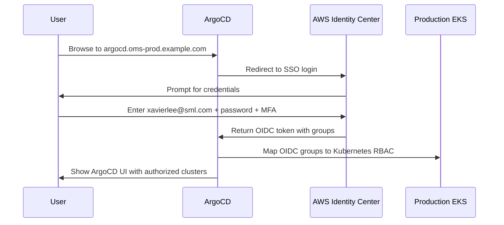

# ArgoCD User Access Design: Single User Group for 4 Clusters

**Author**: Platform Team  
**Date**: 2026-08-07  
**Status**: Design Review

---

## Problem Statement

OMS has **one group of users** (Platform/Ops team) who need to manage Kubernetes workloads across **4 environments**:
- **Production** (account 632674123947)
- **UAT** (account 672172129937)
- **DEV** (account 815402439714)
- **SIT** (account TBD)

**Requirements**:
1. Users should log in **once** and see all 4 environments
2. Users should be able to deploy to **all 4 environments** (no separate logins per environment)
3. Access should follow **Production → Non-Production** security principle
4. RBAC should allow granular permissions (e.g., junior ops can deploy to DEV/SIT but only view UAT/Prod)

---

## Architecture: Centralized ArgoCD in Production

```
┌─────────────────────────────────────────────────────────────────────┐
│  User: alice@sml.com                                                 │
│  Logs in via AWS Identity Center SSO → ArgoCD Web UI                │
└─────────────────────────────────────────────────────────────────────┘
                              │
                              ▼
┌─────────────────────────────────────────────────────────────────────┐
│  Production Account (632674123947)                                   │
│  ┌────────────────────────────────────────────────────────────────┐ │
│  │  ArgoCD Server (oms-prod-eks-cluster)                          │ │
│  │  - Single UI showing all 4 clusters                            │ │
│  │  - RBAC configured via ArgoCD RBAC + Kubernetes ClusterRoles   │ │
│  │  - SSO via AWS Identity Center (OIDC)                          │ │
│  └────────────────────────────────────────────────────────────────┘ │
│                              │                                        │
│         ┌────────────────────┼────────────────────┬─────────────┐   │
│         │                    │                    │             │   │
│         ▼                    ▼                    ▼             ▼   │
│    Production            UAT Cluster         DEV Cluster   SIT Cluster
│    Cluster (local)       (remote)            (remote)      (remote)│
│    kubectl direct        AssumeRole →        AssumeRole →  AssumeRole →
│    access                672172129937        815402439714  <TBD>  │
└─────────────────────────────────────────────────────────────────────┘
```

---

## User Authentication Flow

### Step 1: User Logs Into ArgoCD



### Step 2: ArgoCD Maps User to Permissions

**AWS Identity Center groups** → **ArgoCD RBAC policies** → **Kubernetes ClusterRoles**

| AWS SSO Group | ArgoCD Role | Production | UAT | DEV | SIT |
|---|---|---|---|---|---|
| `ArgoCD-Admin` | `role:admin` | ✅ Full | ✅ Full | ✅ Full | ✅ Full |
| `ArgoCD-Operator` | `role:operator` | 👁️ View | ✅ Deploy | ✅ Deploy | ✅ Deploy |
| `ArgoCD-Viewer` | `role:readonly` | 👁️ View | 👁️ View | 👁️ View | 👁️ View |

---

## Implementation: AWS Identity Center SSO Integration

### Phase 1: Create Permission Sets in AWS Identity Center

**Permission Set 1: ArgoCD-Admin-Production**
- **Accounts**: Production (632674123947)
- **Policies**: 
  - AWS managed: `ReadOnlyAccess` (for EKS describe)
  - Custom inline policy (see below)
- **Assigned to**: 
  - xavierlee@sml.com (Platform Lead)
  - jiaweima@sml.com (Platform Engineer)

**Permission Set 2: ArgoCD-Operator-Production**
- **Accounts**: Production (632674123947)
- **Policies**: Same as Admin (for EKS access), but ArgoCD RBAC limits deployment scope
- **Assigned to**: 
  - yczhang@sml.com (Operations Engineer)
  - vincehuang@sml.com (Operations Engineer)

**Permission Set 3: ArgoCD-Viewer-Production**
- **Accounts**: Production (632674123947)
- **Policies**: Read-only access
- **Assigned to**: 
  - frankcheong@sml.com (Developer/Auditor)
  - Additional developers, auditors, managers as needed

### Inline Policy for ArgoCD Users

```json
{
  "Version": "2012-10-17",
  "Statement": [
    {
      "Sid": "EKSClusterAccess",
      "Effect": "Allow",
      "Action": [
        "eks:DescribeCluster",
        "eks:ListClusters",
        "eks:AccessKubernetesApi"
      ],
      "Resource": "arn:aws:eks:ap-east-1:632674123947:cluster/oms-prod-eks-cluster"
    }
  ]
}
```

---

## Phase 2: Configure ArgoCD SSO (OIDC via AWS Identity Center)

### ArgoCD ConfigMap: `argocd-cm`

```yaml
apiVersion: v1
kind: ConfigMap
metadata:
  name: argocd-cm
  namespace: argocd
data:
  url: https://argocd.oms-prod.example.com
  
  # AWS Identity Center OIDC configuration
  oidc.config: |
    name: AWS SSO
    issuer: https://oidc.ap-east-1.amazonaws.com/id/XXXXXXXXXXXXXX
    clientID: arn:aws:sso::632674123947:application/ssoins-XXXX/apl-XXXX
    clientSecret: $oidc-aws-sso-secret:clientSecret
    requestedScopes:
      - openid
      - profile
      - email
    requestedIDTokenClaims:
      groups:
        essential: true

  # Map AWS SSO groups to ArgoCD roles
  policy.csv: |
    # Admin role - full access to all clusters
    g, ArgoCD-Admin, role:admin
    
    # Operator role - deploy to UAT/DEV/SIT, view Production
    g, ArgoCD-Operator, role:operator
    
    # Viewer role - read-only everywhere
    g, ArgoCD-Viewer, role:readonly

  policy.default: role:readonly
```

---

## Phase 3: Configure ArgoCD RBAC Policies

### ArgoCD RBAC ConfigMap: `argocd-rbac-cm`

```yaml
apiVersion: v1
kind: ConfigMap
metadata:
  name: argocd-rbac-cm
  namespace: argocd
data:
  policy.csv: |
    # ============================================================================
    # Admin Role: Full access to all clusters
    # ============================================================================
    p, role:admin, applications, *, */*, allow
    p, role:admin, clusters, *, *, allow
    p, role:admin, repositories, *, *, allow
    p, role:admin, projects, *, *, allow
    p, role:admin, accounts, *, *, allow
    p, role:admin, exec, create, */*, allow
    
    # ============================================================================
    # Operator Role: Deploy to UAT/DEV/SIT, view Production
    # ============================================================================
    # Can create/update/sync applications in UAT/DEV/SIT
    p, role:operator, applications, create, uat/*, allow
    p, role:operator, applications, update, uat/*, allow
    p, role:operator, applications, sync, uat/*, allow
    p, role:operator, applications, delete, uat/*, allow
    
    p, role:operator, applications, create, dev/*, allow
    p, role:operator, applications, update, dev/*, allow
    p, role:operator, applications, sync, dev/*, allow
    p, role:operator, applications, delete, dev/*, allow
    
    p, role:operator, applications, create, sit/*, allow
    p, role:operator, applications, update, sit/*, allow
    p, role:operator, applications, sync, sit/*, allow
    p, role:operator, applications, delete, sit/*, allow
    
    # Can only VIEW applications in Production (no sync/delete)
    p, role:operator, applications, get, prod/*, allow
    p, role:operator, applications, list, prod/*, allow
    
    # Can view all clusters
    p, role:operator, clusters, get, *, allow
    p, role:operator, clusters, list, *, allow
    
    # Can view repositories
    p, role:operator, repositories, get, *, allow
    p, role:operator, repositories, list, *, allow
    
    # ============================================================================
    # Viewer Role: Read-only everywhere
    # ============================================================================
    p, role:readonly, applications, get, */*, allow
    p, role:readonly, applications, list, */*, allow
    p, role:readonly, clusters, get, *, allow
    p, role:readonly, clusters, list, *, allow
    p, role:readonly, repositories, get, *, allow
    p, role:readonly, repositories, list, *, allow
    p, role:readonly, projects, get, *, allow
  
  policy.default: role:readonly
  scopes: '[groups]'
```

**Key Points**:
- `uat/*`, `dev/*`, `sit/*`, `prod/*` = Application projects per environment
- `role:operator` can **sync** (deploy) to UAT/DEV/SIT but only **get/list** (view) Production
- `role:admin` has full access to everything
- `role:readonly` can only view, no deployments

---

## Phase 4: Create ArgoCD Projects Per Environment

### Production Project

```yaml
apiVersion: argoproj.io/v1alpha1
kind: AppProject
metadata:
  name: prod
  namespace: argocd
spec:
  description: Production environment applications
  sourceRepos:
    - https://github.com/sml-global/mongodb.git
  destinations:
    - namespace: '*'
      server: https://oms-prod-eks-cluster  # Production cluster
  clusterResourceWhitelist:
    - group: '*'
      kind: '*'
  namespaceResourceWhitelist:
    - group: '*'
      kind: '*'
```

### UAT Project

```yaml
apiVersion: argoproj.io/v1alpha1
kind: AppProject
metadata:
  name: uat
  namespace: argocd
spec:
  description: UAT environment applications
  sourceRepos:
    - https://github.com/sml-global/mongodb.git
  destinations:
    - namespace: '*'
      server: https://oms-uat-eks-cluster  # UAT cluster
  clusterResourceWhitelist:
    - group: '*'
      kind: '*'
```

### DEV Project

```yaml
apiVersion: argoproj.io/v1alpha1
kind: AppProject
metadata:
  name: dev
  namespace: argocd
spec:
  description: DEV environment applications
  sourceRepos:
    - https://github.com/sml-global/mongodb.git
  destinations:
    - namespace: '*'
      server: https://oms-dev-eks-cluster  # DEV cluster
  clusterResourceWhitelist:
    - group: '*'
      kind: '*'
```

### SIT Project

```yaml
apiVersion: argoproj.io/v1alpha1
kind: AppProject
metadata:
  name: sit
  namespace: argocd
spec:
  description: SIT environment applications
  sourceRepos:
    - https://github.com/sml-global/mongodb.git
  destinations:
    - namespace: '*'
      server: https://oms-sit-eks-cluster  # SIT cluster
  clusterResourceWhitelist:
    - group: '*'
      kind: '*'
```

---

## User Experience

### Admin User (xavierlee@sml.com or jiaweima@sml.com)

1. **Login**: Browse to `https://argocd.oms-prod.example.com`
2. **Click "Login via AWS SSO"**
3. **Authenticate**: Enter xavierlee@sml.com + password + MFA
4. **Sees**:
   ```
   ArgoCD Dashboard
   ┌─────────────────────────────────────────────────────┐
   │ Clusters: [Production] [UAT] [DEV] [SIT]           │
   │                                                      │
   │ Applications:                                        │
   │  📦 prod/mongodb-prod        ✅ Synced  ✅ Healthy  │
   │  📦 uat/mongodb-uat          ✅ Synced  ✅ Healthy  │
   │  📦 dev/mongodb-dev          ⏸️ OutOfSync ⚠️ Degraded│
   │  📦 sit/mongodb-sit          ✅ Synced  ✅ Healthy  │
   │                                                      │
   │  [+ New App]  [Sync All]  [Settings]               │
   └─────────────────────────────────────────────────────┘
   ```
5. **Can do**:
   - ✅ Create/update/sync/delete apps in **all 4 environments**
   - ✅ Access logs/exec into pods in **all 4 environments**
   - ✅ Rollback deployments in **all 4 environments**

### Operator User (yczhang@sml.com or vincehuang@sml.com)

1. **Login**: Same SSO flow
2. **Sees**: Same dashboard (all 4 clusters visible)
3. **Can do**:
   - ✅ Sync apps in **UAT, DEV, SIT** (has Sync button)
   - 👁️ **View** apps in **Production** (no Sync button, read-only)
   - ✅ View logs in all environments
   - ❌ Cannot exec into Production pods
   - ❌ Cannot delete Production apps

### Viewer User (frankcheong@sml.com)

1. **Login**: Same SSO flow
2. **Sees**: Same dashboard (all 4 clusters visible)
3. **Can do**:
   - 👁️ **View** apps in **all environments** (read-only)
   - ✅ View logs (read-only)
   - ❌ Cannot sync/create/update/delete any apps
   - ❌ Cannot exec into any pods

---

## Security Model

### Identity Chain

```
User (xavierlee@sml.com, yczhang@sml.com, frankcheong@sml.com)
  ↓ (authenticates via)
AWS Identity Center (OIDC)
  ↓ (returns token with groups)
ArgoCD (maps groups → roles)
  ↓ (applies RBAC policies)
Kubernetes (ClusterRole/ClusterRoleBinding)
  ↓ (controls access to)
Target Cluster (Production/UAT/DEV/SIT)
```

### Cross-Account Access Flow

When `yczhang@sml.com` (Operator) syncs an app to **UAT cluster**:

1. **ArgoCD authenticates** to UAT EKS cluster using:
   - IAM role `argocd-cluster-manager-prod` (Production account)
   - AssumeRole to `argocd-target-uat` (UAT account)
   - External ID: `argocd-prod-to-uat`

2. **Kubernetes RBAC in UAT cluster** checks:
   - Is ArgoCD's ServiceAccount authorized? (ClusterRoleBinding)
   - Does ArgoCD's RBAC allow this operation? (ArgoCD policy.csv)

3. **Result**: yczhang@sml.com can deploy to UAT because:
   - ✅ yczhang@sml.com is in `ArgoCD-Operator` group (AWS SSO)
   - ✅ `ArgoCD-Operator` maps to `role:operator` (ArgoCD RBAC)
   - ✅ `role:operator` has `sync` permission for `uat/*` apps
   - ✅ ArgoCD can reach UAT cluster (IAM AssumeRole)

---

## Benefits of This Design

1. ✅ **Single login** - Users authenticate once via AWS SSO
2. ✅ **Single UI** - All 4 clusters visible in one dashboard
3. ✅ **Granular RBAC** - Different permissions per environment
4. ✅ **Audit trail** - All operations logged in ArgoCD (who did what, when)
5. ✅ **Security principle enforced** - Production → Non-Production access only
6. ✅ **No credential sharing** - Users never see/manage kubeconfig or IAM keys
7. ✅ **Easy onboarding** - New users just need AWS SSO group membership

---

## Next Steps

1. **Deploy ArgoCD in Production cluster**
2. **Configure AWS Identity Center SSO integration**
3. **Create ArgoCD Projects** (prod, uat, dev, sit)
4. **Test RBAC** with test users in each role
5. **Register remote clusters** (UAT, DEV, SIT)
6. **Migrate first application** (e.g., MongoDB) to ArgoCD management

---

## References

- [ArgoCD SSO Configuration](https://argo-cd.readthedocs.io/en/stable/operator-manual/user-management/)
- [ArgoCD RBAC](https://argo-cd.readthedocs.io/en/stable/operator-manual/rbac/)
- [AWS Identity Center OIDC](https://docs.aws.amazon.com/singlesignon/latest/userguide/oidc-endpoint.html)
- `ARGOCD-MULTI-ENV-ARCHITECTURE.md` - Cross-account IAM setup
- `platform-prerequisites/terraform/argocd-iam/` - IAM roles for cluster access
