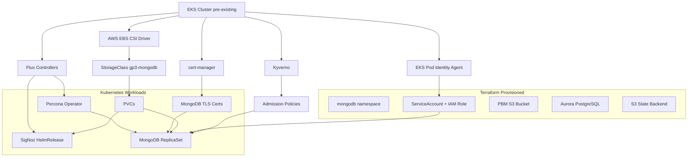
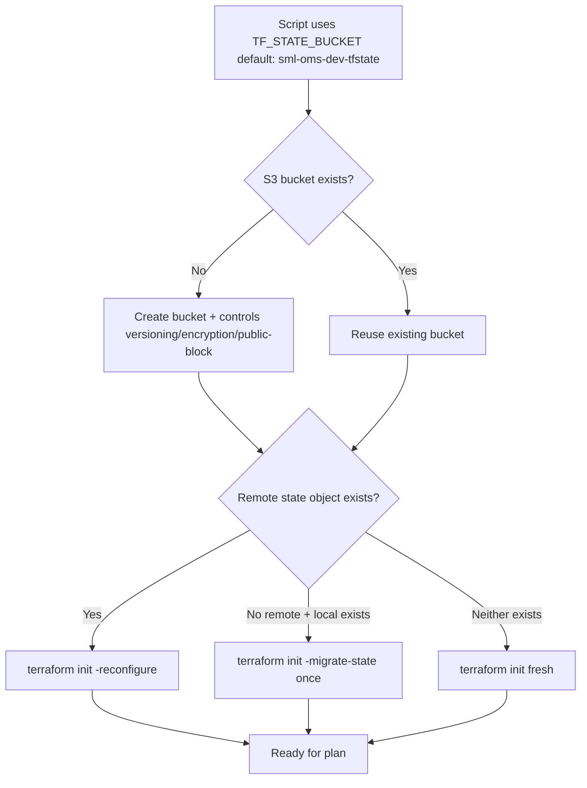
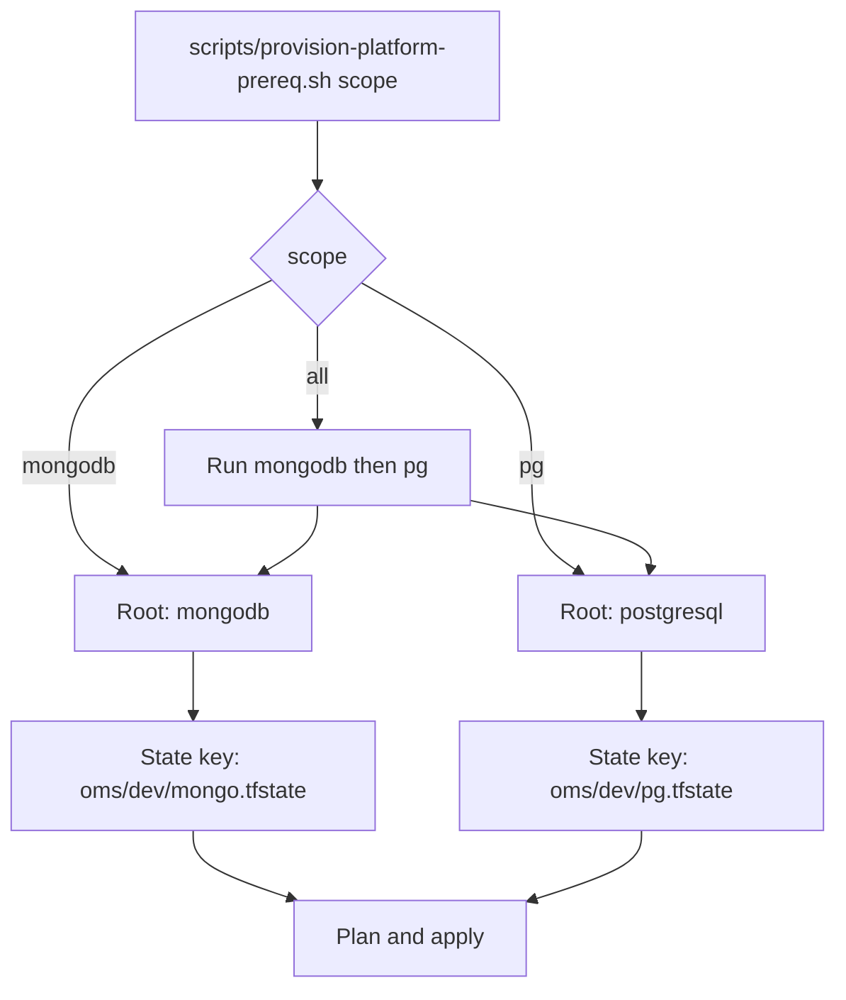
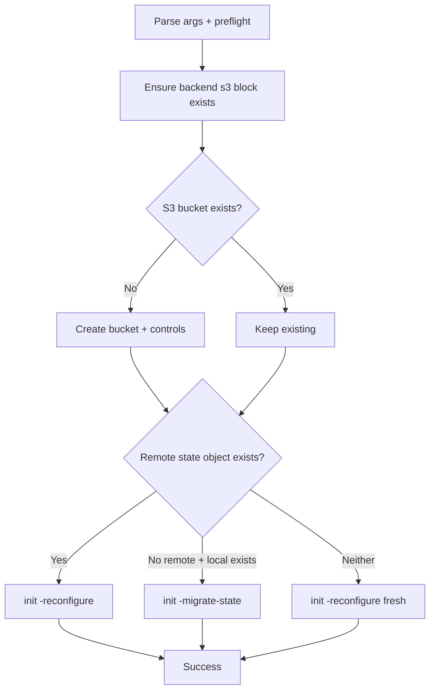
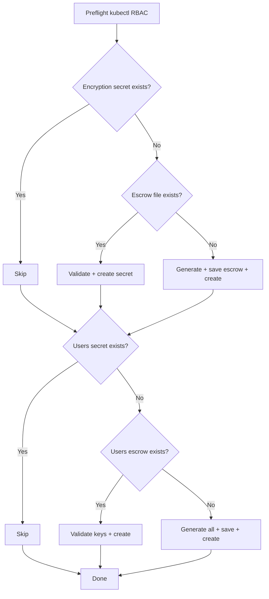
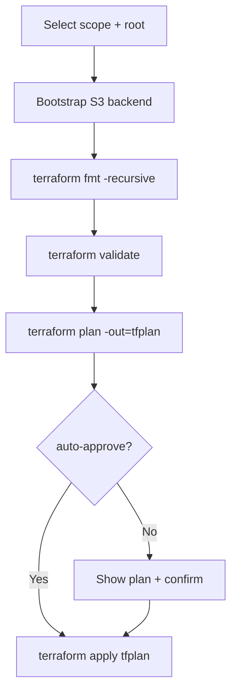
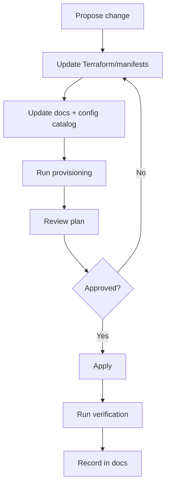

# Architect Reference

Architecture, state model, dependency graph, repository structure, and day-2 maintenance for the OMS data layer.

**Who this is for:** Infra Architects/Admins who design, maintain, and evolve the platform.

**Related docs:**
- [Component Catalog](../references/component-catalog.md) — detailed component descriptions
- [Verification Commands](../references/verification-commands.md) — per-component health checks
- [Enterprise Architecture](enterprise-architecture.md) — design decisions, security, compliance
- [Operator Runbook](operator-runbook.md) — step-by-step provisioning
- [Operator Runbook § Step 7A (SigNoz First-Admin Bootstrap)](operator-runbook.md#step-7a-complete-signoz-first-admin-bootstrap) — ownership and role bootstrap
- [Boomi Integration Guide § Accessing SigNoz Dashboard](boomi-integration-guide.md#accessing-signoz-dashboard) — account model and first-login flow
- [Configuration Catalog](../operations/dev-configuration-catalog.md) — embedded defaults

---

## SigNoz Ownership And Bootstrap (Architect View)

Ownership model for each environment:
- First signup owner: **Infra Architect/Admin** (admin control)
- Boomi Admin: **Editor** (dashboard/alert authoring)
- Enterprise Architect and report consumers: **Viewer**

Run once per environment after `signoz` provisioning:
1. Complete [Operator Runbook Step 7A](operator-runbook.md#step-7a-complete-signoz-first-admin-bootstrap)
2. Validate persona reachability via [Operator Runbook Step 7B](operator-runbook.md#step-7b-validate-signoz-reachability-for-intended-persona)
3. Follow first-login actions in [Boomi Integration Guide § Accessing SigNoz Dashboard](boomi-integration-guide.md#accessing-signoz-dashboard)

---

## Infrastructure And Database Monitoring

By default, SigNoz in this repo only receives **application-level** telemetry: the
audit-log write path (Boomi library and `scripts/run-audit-telemetry-test.sh`)
sends logs (and optionally traces) via OTLP. It does **not**, by default, monitor
the EKS nodes, the MongoDB replica set, or the Aurora PostgreSQL cluster as
infrastructure. This section tracks what monitors what today, what was added,
and what remains to be decided.

### Current Coverage

| Target | Monitored? | Mechanism | Status |
|---|---|---|---|
| Boomi audit-log writes (app telemetry) | Yes | OTLP logs from Boomi library / `run-audit-telemetry-test.sh` | Working (Day-1) |
| EKS nodes / K8s workloads (CPU, memory, pods) | Yes | SigNoz `k8s-infra` Helm chart | Deployed — see below |
| MongoDB replica set (connections, ops, replication, memory) | Yes | Custom OTel Collector with `mongodb` receiver | Deployed — see below |
| PostgreSQL / Aurora (CPU, IOPS, connections, replication lag) | Yes | CloudWatch Exporter + OTel Collector `prometheus` receiver | Deployed — see below |

### K8s Infrastructure Metrics (Node/Pod/Cluster)

Deployed via the official SigNoz `k8s-infra` Helm chart, added as a second
HelmRelease alongside the main SigNoz stack:

- Manifest: [gitops/signoz/base/helmrelease-k8s-infra.yaml](../../gitops/signoz/base/helmrelease-k8s-infra.yaml)
- Applied by the same command as the rest of SigNoz: `bash scripts/provision.sh signoz`
- Deploys a DaemonSet agent (`signoz-k8s-infra-otel-agent`, one pod per node,
  collects host metrics via the `hostmetrics` receiver) and a Deployment
  (`signoz-k8s-infra-otel-deployment`, collects cluster-level k8s object state)
- Sends metrics/logs directly to the existing `signoz-otel-collector` service
  over OTLP/HTTP — no new AWS IAM permissions or secrets required
- View in SigNoz: **Infrastructure Monitoring → Hosts** tab

**Known limitation (dev cluster capacity):** the DaemonSet agent requests
`100m` CPU per node. In the current dev node group, several nodes are already
near 100% CPU request allocation from MongoDB + SigNoz + other workloads, so
not every node's agent pod may reach `Running` (check with
`kubectl -n signoz get pods -l app.kubernetes.io/name=k8s-infra`). This is a
node-capacity constraint, not a configuration defect — fix by either scaling
the node group / using larger instance types, or accept partial node coverage
in dev. As a direct consequence, `kubectl -n signoz get helmrelease
signoz-k8s-infra` commonly shows `Ready=False` with message `timeout waiting
for: [DaemonSet/.../otel-agent status: 'InProgress']` — Helm's own
install-timeout expires while waiting for full DaemonSet rollout. Verified
during a full teardown/rebuild: 2 of 4 agent pods stayed Pending, the
cluster-metrics Deployment and 2 agent pods ran fine, and metrics still flowed
— treat this `Ready=False` as expected in capacity-constrained dev, not a
failed deployment.

### MongoDB Metrics

Deployed as a dedicated lightweight OTel Collector in the `mongodb` namespace,
using the OpenTelemetry Collector's native `mongodb` receiver:

- Manifest: [k8s/base/mongodb-metrics-collector.yaml](../../k8s/base/mongodb-metrics-collector.yaml)
- Applied by the same command as MongoDB workloads: `kubectl apply -k k8s/overlays/dev`
  (also picked up automatically by `bash scripts/provision.sh mongodb`)
- Connects to all three `psmdb-rs0-*` pods, authenticating with the
  `MONGODB_CLUSTER_MONITOR_USER`/`MONGODB_CLUSTER_MONITOR_PASSWORD` credentials
  the Percona Operator already provisions in `psmdb-secrets` (`clusterMonitor`
  role — read-only). No new secrets or credentials were created.
- Uses the existing `psmdb-ssl-internal` cert-manager secret for TLS
  (`ca.crt`/`tls.crt`/`tls.key`), matching the pattern used by
  `scripts/run-audit-telemetry-test.sh`
- Exports metrics via OTLP/gRPC directly to `signoz-otel-collector:4317`
- View in SigNoz: **Dashboards** → create/search a Mongo dashboard, or query
  `mongodb_*` metrics directly in **Dashboards → New Panel**

**Known limitation:** the `clusterMonitor` role does not include per-collection
`read` access, so the receiver's index-access-count sub-metric
(`$indexStats`) will log a recurring `Unauthorized` scrape error. All other
MongoDB metrics (connections, operations, memory, cache, network,
replication) are unaffected. To fix, grant the monitoring user an additional
`read` role on the databases you want index-access stats for — this was
intentionally **not** done automatically to avoid modifying an
operator-managed user's role set without an explicit decision.

Verify it is running and connected:

```bash
kubectl -n mongodb get pods -l app.kubernetes.io/name=mongodb-metrics-collector
kubectl -n mongodb logs deployment/mongodb-metrics-collector --tail=50
```

### PostgreSQL / Aurora Metrics

Aurora PostgreSQL metrics (CPU, IOPS, connections, replication lag, volume
usage) are natively published to **AWS CloudWatch** (namespace `AWS/RDS`) —
no agent runs on Aurora since it is a fully-managed service. Deployed as a
two-container pod in the `mongodb` namespace:

- Manifest: [k8s/base/postgres-metrics-collector.yaml](../../k8s/base/postgres-metrics-collector.yaml)
- IAM role + Pod Identity association: `platform-prerequisites/terraform/postgresql/main.tf`
  (`aws_iam_role.postgres_cloudwatch_monitor`, `aws_eks_pod_identity_association.postgres_cloudwatch_monitor`)
- Applied by: `bash scripts/provision-platform-prereq.sh pg` (creates the IAM
  role/pod identity) then `kubectl apply -k k8s/overlays/dev` (creates the pod)
- **Container 1** (`cloudwatch-exporter`): the official Prometheus CloudWatch
  Exporter (`quay.io/prometheus/cloudwatch-exporter:v0.18.0`), configured to
  poll `AWS/RDS` cluster-level metrics (`DBClusterIdentifier=pg18-dev`) and
  instance-level metrics (`DBInstanceIdentifier=pg18-dev-writer`) from
  CloudWatch, exposing them as Prometheus metrics on port 9106
- **Container 2** (`otel-collector`): scrapes the exporter's `localhost:9106`
  endpoint via the `prometheus` receiver and forwards via OTLP/gRPC to
  `signoz-otel-collector:4317` — identical export pattern to the MongoDB
  collector
- IAM permissions are **strictly read-only**: `cloudwatch:ListMetrics`,
  `cloudwatch:GetMetricData`, `cloudwatch:GetMetricStatistics`. No database
  credentials, no write access to any AWS resource.
- View in SigNoz: **Dashboards** — query `aws_rds_*` metrics, or **Services**
  (`service.name = aurora-pg18-dev`)

**Optional follow-up (not implemented):** the OTel Collector's native
`postgresql` receiver can connect directly to the Aurora writer endpoint for
DB-level stats (locks, deadlocks, sequential scans) not exposed via
CloudWatch. This needs a dedicated read-only DB user (e.g. via PostgreSQL's
built-in `pg_monitor` role) and was left out to avoid creating new database
credentials without a separate explicit decision.

Verify it is running and connected:

```bash
kubectl -n mongodb get pods -l app.kubernetes.io/name=postgres-metrics-collector
kubectl -n mongodb logs deployment/postgres-metrics-collector -c cloudwatch-exporter --tail=50
kubectl -n mongodb logs deployment/postgres-metrics-collector -c otel-collector --tail=50
```

**Known "No Data" panels on the "AWS RDS Postgres" SigNoz dashboard:** this
dashboard is a generic upstream template shared across all RDS engines, so a
few panels will legitimately never populate for this Aurora PostgreSQL setup:

- **ReplicaLag** — AWS only publishes this metric when a cross-region/RDS
  read replica exists; this dev environment runs a single Aurora writer only.
  Aurora's own internal storage-layer lag is a different metric
  (`AuroraReplicaLag`, already collected, shown as `aws_rds_replica_lag_average`
  is *not* the same series — do not confuse the two).
- **CheckpointLag** — not published by AWS for Aurora PostgreSQL at all
  (confirmed via `aws cloudwatch list-metrics --namespace AWS/RDS`).
- **FreeStorageSpace** — Aurora publishes `FreeLocalStorage` instead (already
  collected, see `postgres-cloudwatch-exporter-config`), because Aurora's
  cluster volume storage model has no direct equivalent to classic RDS's
  `FreeStorageSpace`. The dashboard panel queries the wrong (RDS-only) metric
  name for an Aurora cluster; this is an upstream template limitation, not a
  gap in our collector config.
- **EBSByteBalance%** — the upstream dashboard template queries the same
  underlying metric (`aws_rds_ebsiobalance__average`) for both the
  "EBSByteBalance%" and "EBSIOBalance%" panels (a known quirk in the vendor
  JSON, not something introduced by this repo's Terraform). Only
  "EBSIOBalance%" will show real data as a result.

All other panels (CPUUtilization, DatabaseConnections, FreeableMemory,
Read/Write Latency, Read/Write IOPS, Read/Write Throughput, DiskQueueDepth,
SwapUsage, Network transmit/receive) are backed by metrics this repo's
CloudWatch Exporter config actually collects and should show live data.

### Dashboards & Alerts (as Code)

Data collection (above) is only half the picture -- SigNoz dashboards and
alert rules for all of it (K8s nodes, MongoDB, PostgreSQL, the OTel Collector
pipelines themselves, and Boomi app telemetry) are also managed as code, not
clicked together by hand:

- Terraform root: [platform-prerequisites/terraform/signoz-observability](../../platform-prerequisites/terraform/signoz-observability)
  using the official `SigNoz/signoz` Terraform provider
- Applied by: `bash scripts/provision.sh signoz-observability`
- Ships 5 dashboards (Kubernetes Node Metrics, Kubernetes Pod Metrics,
  MongoDB, PostgreSQL/Aurora, OTel Collector pipeline health) sourced from
  vendored templates in
  [dashboards/signoz-import-pack](../../dashboards/signoz-import-pack), and 5
  baseline alerts (MongoDB no-data, PostgreSQL CPU high, K8s node CPU high,
  OTel Collector export failures, Boomi app-telemetry no-data)
- The K8s dashboards use the `k8s-infra-metrics/kubernetes-node-metrics-overall.json`
  and `kubernetes-pod-metrics-overall.json` templates (metric names
  `k8s.node.*` / `k8s.pod.*`, matching what the `signoz-k8s-infra` Helm chart
  actually emits). An earlier revision used the generic
  `hostmetrics/hostmetrics-k8s.json` template (`system.cpu.*` /
  `system.memory.*` naming) which is for the plain OTel `hostmetrics`
  receiver, not the k8s-infra chart — every panel showed a literal `0`. If a
  future re-import ever shows all-zero K8s panels again, check the dashboard
  is using the `k8s-infra-metrics/` template family, not `hostmetrics/`.
- Both custom collectors (`mongodb-metrics-collector`,
  `postgres-metrics-collector`) also scrape and forward their own internal
  `otelcol_*` self-telemetry (via a `prometheus/self` receiver on
  `127.0.0.1:8888`, tagged with a distinct `service.name`) so the
  "OpenTelemetry Collector Pipeline Health" dashboard has data for them. The
  vendor `signoz-k8s-infra` otel-agent/otel-deployment pods are not currently
  wired to export their own self-telemetry the same way — their rows on that
  dashboard will stay empty until that's added too.
- **Known follow-up (not yet fixed):** the `k8s_node_cpu_high` alert queries
  a `k8s_node_cpu_utilization` metric name that was never valid (no
  ready-made node-level CPU utilization *percentage* metric exists — the
  dashboard computes it as a ratio of `k8s.node.cpu.time` over
  `k8s.node.allocatable_cpu`). This alert will currently never fire and
  needs to be rewritten as a formula-based (two-query) alert to match the
  dashboard's own approach.
- **Fully automated Service Account/API key bootstrap**: SigNoz requires a
  Service Account + API key before its Terraform provider can authenticate,
  but this is no longer a manual step -- `scripts/provision-signoz-observability.sh`
  auto-invokes `scripts/bootstrap-signoz-service-account.sh` (a headless
  Chromium/Playwright script) the first time it runs and the
  `signoz-api-key` Secret doesn't exist yet. Combined with the SigNoz *admin
  account* bootstrap (root-user env vars, see
  [docs/references/signoz-dashboard-import-pack.md](../references/signoz-dashboard-import-pack.md)),
  no manual UI interaction is required anywhere in this flow.
- A manual JSON-import fallback (no Terraform, no API key) also exists for
  quick one-off dashboard viewing -- see the same doc.

---

## Architecture Summary

The OMS data layer separates shared Terraform logic from runnable roots and Kubernetes manifests.

```
platform-prerequisites/terraform/
  reusable/          ← Shared module: MongoDB prerequisites (IAM, S3, namespace, SA)
  mongodb/           ← Runnable root: MongoDB scope (state: oms/dev/mongo.tfstate)
  postgresql/        ← Runnable root: PostgreSQL scope (state: oms/dev/pg.tfstate)

k8s/
  base/              ← Base Kubernetes manifests (PSMDB CR, StorageClass, certs, PDB)
  overlays/dev/      ← Dev overlay patches (sizing, storage, backup config)

gitops/
  operators/base/    ← Percona Operator HelmRelease + HelmRepository
  signoz/base/       ← SigNoz HelmRelease + HelmRepository + namespace

policies/
  kyverno/           ← Admission policies (storage class, sidecar resources, secrets)

scripts/             ← All operational scripts (provision, bootstrap, validate, verify)
```

Execution contract:
- One selected root per run (`mongodb` or `postgresql`; `all` runs both)
- One plan artifact (`tfplan`) in that root
- One state key for that root

## Dependency Graph



## State Partitioning Strategy

Terraform root and state key are selected by script scope:

| Scope | Terraform Root | State Key |
|---|---|---|
| `all` | Runs `mongodb` then `pg` sequentially | Two separate keys |
| `mongodb` | `platform-prerequisites/terraform/mongodb` | `oms/dev/mongo.tfstate` |
| `pg` | `platform-prerequisites/terraform/postgresql` | `oms/dev/pg.tfstate` |

Safety rules:
- `all` is a shortcut that runs both — does not create a third state
- Each scope always uses its own root and state key
- Never reuse one state key across multiple roots

## State Backend Strategy

Backend migration is intentionally idempotent. Script: `scripts/bootstrap-terraform-s3-backend.sh`



Important rules:
- Keep the same `TF_STATE_KEY` for the same environment
- Changing the key splits infrastructure ownership
- Migration is one-time; later runs reuse remote state

## Terraform Provisioning Model



## Provisioned Resource Inventory

### AWS Resources

| Resource | Purpose | Owner File |
|---|---|---|
| PBM S3 bucket | Stores MongoDB backup archives | `reusable/main.tf` |
| PBM bucket controls (versioning, encryption, public block) | Baseline security | `reusable/main.tf` |
| MongoDB PBM IAM role | Assumed by workload SA for S3/KMS | `reusable/main.tf` |
| MongoDB PBM IAM inline policy | Grants S3 + optional KMS access | `reusable/main.tf` |
| EKS Pod Identity association | Binds SA to IAM role | `reusable/main.tf` |
| Terraform state S3 bucket | Stores Terraform state | `bootstrap-terraform-s3-backend.sh` |
| Aurora PostgreSQL subnet group | Places Aurora in private subnets | `postgresql/main.tf` |
| Aurora PostgreSQL security group | Controls network access | `postgresql/main.tf` |
| Aurora PostgreSQL cluster | Dev database cluster | `postgresql/main.tf` |
| Aurora PostgreSQL writer instance | Single provisioned writer | `postgresql/main.tf` |

### Kubernetes Resources

| Resource | Purpose | Owner File |
|---|---|---|
| `mongodb` namespace | Workload boundary | `reusable/main.tf` |
| MongoDB workload ServiceAccount | IAM identity for pods | `reusable/main.tf` |
| `psmdb-encryption-key` secret | MongoDB encryption key | `bootstrap-dev-secrets.sh` |
| `psmdb-secrets` secret | Operator user credentials | `bootstrap-dev-secrets.sh` |
| Percona HelmRepository + HelmRelease | Operator delivery | `gitops/operators/base/` |
| SigNoz namespace + HelmRepository + HelmRelease | Telemetry delivery | `gitops/signoz/base/` |
| StorageClass `gp3-mongodb` | EBS gp3 storage with WaitForFirstConsumer | `k8s/base/` |
| MongoDB certificates + issuer | TLS for replica set | `k8s/base/certificates.yaml` |
| PerconaServerMongoDB CR | MongoDB replica set definition | `k8s/base/` + `k8s/overlays/dev/` |
| PodDisruptionBudget | Availability during disruption | `k8s/base/pdb.yaml` |
| Kyverno policies | Storage class, sidecar, secret guardrails | `policies/kyverno/` |

### Local-Only Files

| File | Purpose |
|---|---|
| `platform-prerequisites/terraform/mongodb/tfplan` | MongoDB scope plan artifact |
| `platform-prerequisites/terraform/postgresql/tfplan` | PostgreSQL scope plan artifact |
| `.local-dev-encryption-key.txt` | Encryption key escrow |
| `.local-dev-user-passwords.txt` | User credentials escrow |
| `/tmp/mongodb-dev.yaml` | Rendered dev overlay for validation |

## Repository Structure

| Path | Role |
|---|---|
| `platform-prerequisites/terraform/reusable` | Shared module: MongoDB prerequisites |
| `platform-prerequisites/terraform/mongodb` | MongoDB runnable root |
| `platform-prerequisites/terraform/postgresql` | PostgreSQL runnable root |
| `k8s/base/` | Base Kubernetes manifests |
| `k8s/overlays/dev/` | Dev overlay patches |
| `gitops/operators/base/` | Percona Operator HelmRelease |
| `gitops/signoz/base/` | SigNoz HelmRelease |
| `policies/kyverno/` | Admission policies |
| `scripts/` | All operational scripts |
| `docs/` | Documentation hub |

## Script Contracts

| Script | Inputs | Exit Behavior |
|---|---|---|
| `bootstrap-terraform-s3-backend.sh` | `--tf-dir`, `--bucket`, `--region`, `--key` | Non-zero on AWS/TF failures |
| `provision-platform-prereq.sh` | Scope, optional `--auto-approve`, `TF_STATE_*` env | Non-zero on any TF step failure |
| `provision-k8s-components.sh` | Scope, optional `--bootstrap-platform-controllers` | Non-zero on kubectl failures |
| `provision.sh` | Scope, optional flags | Non-zero if any step fails |
| `bootstrap-dev-secrets.sh` | kubectl access to `mongodb` ns | Non-zero on RBAC/tool/creation failure |
| `validate-dev-render.sh` | `kustomize` + `rg` | Non-zero on render/check failure |
| `verify-dev-identity.sh` | Optional: namespace, SA name | 0=ok, 1=no pods, 2=SA mismatch |
| `verify-platform-health.sh` | Optional: `--preflight` | Non-zero if any check fails |

## Script Execution Flows

### bootstrap-terraform-s3-backend.sh



### bootstrap-dev-secrets.sh



### provision-platform-prereq.sh



## Configuration Reference

| File | Owns | Typical Changes |
|---|---|---|
| `reusable/variables.tf` | Shared module defaults | Baseline defaults |
| `reusable/main.tf` | Resources and IAM/S3/K8s wiring | Architecture changes |
| `mongodb/variables.tf` | MongoDB root inputs | Region/cluster/IAM/SA |
| `mongodb/main.tf` | Root execution + module call | Provider/backend |
| `postgresql/variables.tf` | PostgreSQL root inputs | Region/network/sizing |
| `postgresql/main.tf` | Aurora resources | Resource topology |
| `*.tfvars.sample` | Operator templates | Sample values |

Full catalog: [Configuration Catalog](../operations/dev-configuration-catalog.md)

## Day-2 Maintenance

### Routine Workflow
- Rerun `bash scripts/provision-platform-prereq.sh <scope>` after code/default changes
- Review plan output before apply
- Keep `terraform.tfvars.sample` aligned with variable contracts
- Validate MongoDB render and secrets before workload deployment

### Change Flow



### Upgrade Procedures

Current versions and latest available: see [Component Catalog § Version Inventory](../references/component-catalog.md#version-inventory).

#### Percona Operator (MongoDB)

Current: chart 1.18.0 → Latest: 1.22.0

**Where to find versions:**
```bash
helm search repo percona/psmdb-operator --versions | head -10
```

**Upgrade path** (one minor version at a time):
1. Check release notes: https://docs.percona.com/percona-operator-for-mongodb/ReleaseNotes/
2. Update `gitops/operators/base/helmreleases.yaml`:
   ```yaml
   chart:
     spec:
       version: "1.19.0"   # one step at a time
   ```
3. Commit and push — Flux reconciles automatically
4. Verify: `kubectl -n mongodb get pods` (operator restarts, then rolling update of mongod pods)
5. If failed: revert chart version in git, Flux rolls back

**Rollback:** Change version back in git → commit → push → Flux reconciles to previous.

#### SigNoz

Current: chart 0.130.1 → Latest: 0.131.0

**Where to find versions:**
```bash
helm search repo signoz/signoz --versions | head -5
```

**Steps:**
1. Update `gitops/signoz/base/helmreleases.yaml`:
   ```yaml
   chart:
     spec:
       version: "0.131.0"
   ```
2. Commit and push
3. Verify: `kubectl -n signoz get pods` + dashboard health check

**Rollback:** Revert version in git → Flux reconciles.

#### PostgreSQL (Aurora)

Current: 18.3

**Where to find versions:**
```bash
aws rds describe-db-engine-versions --engine aurora-postgresql \
  --query 'DBEngineVersions[*].EngineVersion' --region ap-east-1 --output text
```

**Steps:**
1. Update `platform-prerequisites/terraform/postgresql/variables.tf` → `engine_version`
2. Run `bash scripts/provision-platform-prereq.sh pg`
3. Review plan — Aurora performs in-place upgrade (brief downtime for writer)

**Rollback:** Aurora does not support downgrade. Restore from snapshot if needed.

#### EBS CSI Driver

**Where to find versions:**
```bash
aws eks describe-addon-versions --addon-name aws-ebs-csi-driver \
  --query 'addons[0].addonVersions[*].addonVersion' --output text | tr '\t' '\n' | head -5
```

**Steps:**
```bash
aws eks update-addon \
  --cluster-name EKS-boomi-runtime-cluster \
  --addon-name aws-ebs-csi-driver \
  --addon-version <new-version> \
  --resolve-conflicts OVERWRITE
```

**Rollback:** Same command with previous version.

#### MongoDB Server Image

**Where to find compatible images:** Check Percona release notes for the operator version you're running.

**Steps:**
1. Update `k8s/base/psmdb-cluster.yaml` → `spec.image`
2. Apply overlay: `bash scripts/provision-k8s-components.sh overlay`
3. Operator performs rolling upgrade of replica set members

**Rollback:** Revert image in YAML → re-apply.

#### Terraform + Providers

Pinned via `.terraform-version` (tfenv) and `main.tf` constraints.

**Steps:**
1. Update `.terraform-version` to new version
2. Run `tfenv install && tfenv use`
3. Update provider constraints in `platform-prerequisites/terraform/mongodb/main.tf` if needed
4. Run `terraform init -upgrade` in each root
5. Run plan to verify no unexpected changes

### Maintenance Checklist
- Verify provider versions remain compatible
- Review IAM policy scope when integrations change
- Check certificate expiry dates: [Verification Commands § cert-manager](../references/verification-commands.md#cert-manager)
- Confirm backup bucket is receiving objects
- Keep documentation synchronized with behavior changes
