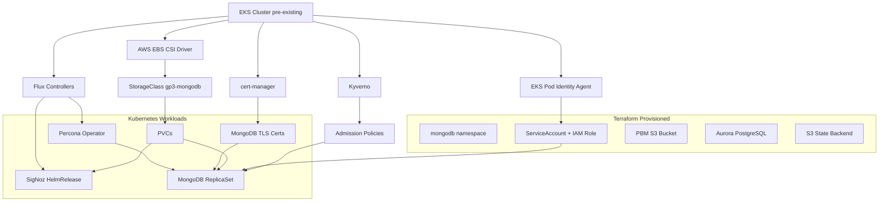
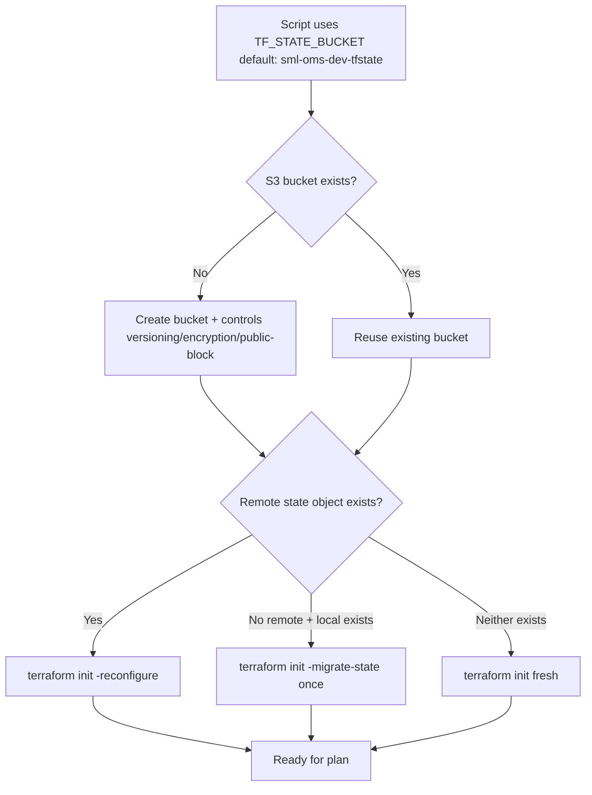
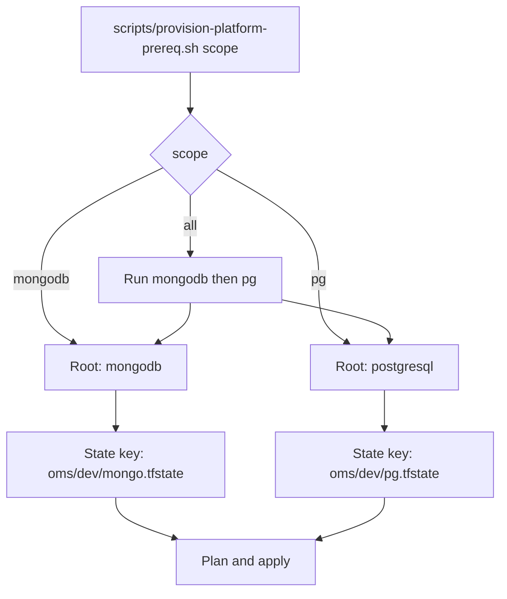
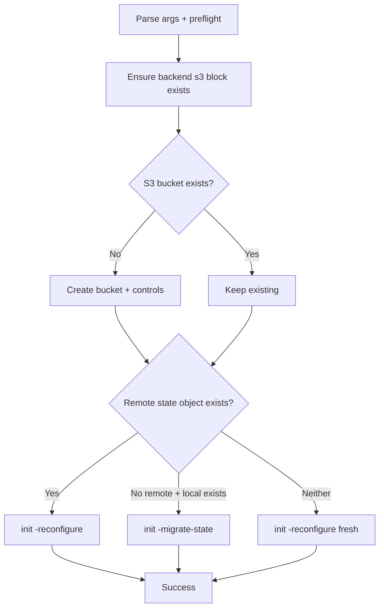
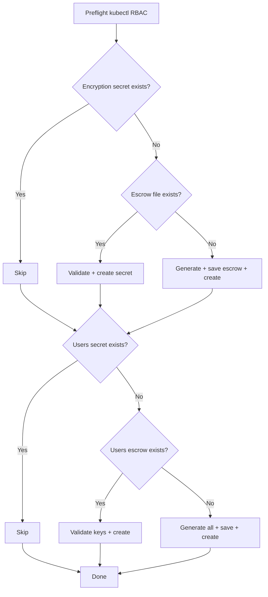
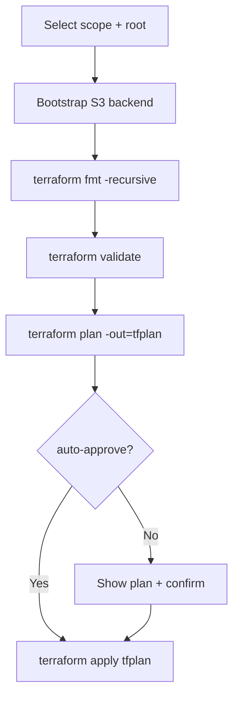
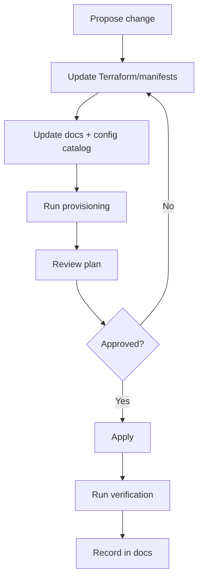

# Architect Reference

Architecture, state model, dependency graph, repository structure, and day-2 maintenance for the OMS data layer.

**Who this is for:** Infra Architects/Admins who design, maintain, and evolve the platform.

**Related docs:**
- [Component Catalog](../references/component-catalog.md) — detailed component descriptions
- [Verification Commands](../references/verification-commands.md) — per-component health checks
- [Enterprise Architecture](enterprise-architecture.md) — design decisions, security, compliance
- [Operator Runbook](operator-runbook.md) — step-by-step provisioning
- [Configuration Catalog](../operations/dev-configuration-catalog.md) — embedded defaults

---

## Architecture Summary

The OMS data layer separates shared Terraform logic from runnable roots and Kubernetes manifests.

```
platform-prerequisites/terraform/
  reusable/          ← Shared module: MongoDB prerequisites (IAM, S3, namespace, SA)
  mongodb/           ← Runnable root: MongoDB scope (state: oms/dev/mongo.tfstate)
  postgresql/        ← Runnable root: PostgreSQL scope (state: oms/dev/pg.tfstate)

k8s/
  base/              ← Base Kubernetes manifests (PSMDB CR, StorageClass, certs, PDB)
  overlays/dev/      ← Dev overlay patches (sizing, storage, backup config)

gitops/
  operators/base/    ← Percona Operator HelmRelease + HelmRepository
  signoz/base/       ← SigNoz HelmRelease + HelmRepository + namespace

policies/
  kyverno/           ← Admission policies (storage class, sidecar resources, secrets)

scripts/             ← All operational scripts (provision, bootstrap, validate, verify)
```

Execution contract:
- One selected root per run (`mongodb` or `postgresql`; `all` runs both)
- One plan artifact (`tfplan`) in that root
- One state key for that root

## Dependency Graph



## State Partitioning Strategy

Terraform root and state key are selected by script scope:

| Scope | Terraform Root | State Key |
|---|---|---|
| `all` | Runs `mongodb` then `pg` sequentially | Two separate keys |
| `mongodb` | `platform-prerequisites/terraform/mongodb` | `oms/dev/mongo.tfstate` |
| `pg` | `platform-prerequisites/terraform/postgresql` | `oms/dev/pg.tfstate` |

Safety rules:
- `all` is a shortcut that runs both — does not create a third state
- Each scope always uses its own root and state key
- Never reuse one state key across multiple roots

## State Backend Strategy

Backend migration is intentionally idempotent. Script: `scripts/bootstrap-terraform-s3-backend.sh`



Important rules:
- Keep the same `TF_STATE_KEY` for the same environment
- Changing the key splits infrastructure ownership
- Migration is one-time; later runs reuse remote state

## Terraform Provisioning Model



## Provisioned Resource Inventory

### AWS Resources

| Resource | Purpose | Owner File |
|---|---|---|
| PBM S3 bucket | Stores MongoDB backup archives | `reusable/main.tf` |
| PBM bucket controls (versioning, encryption, public block) | Baseline security | `reusable/main.tf` |
| MongoDB PBM IAM role | Assumed by workload SA for S3/KMS | `reusable/main.tf` |
| MongoDB PBM IAM inline policy | Grants S3 + optional KMS access | `reusable/main.tf` |
| EKS Pod Identity association | Binds SA to IAM role | `reusable/main.tf` |
| Terraform state S3 bucket | Stores Terraform state | `bootstrap-terraform-s3-backend.sh` |
| Aurora PostgreSQL subnet group | Places Aurora in private subnets | `postgresql/main.tf` |
| Aurora PostgreSQL security group | Controls network access | `postgresql/main.tf` |
| Aurora PostgreSQL cluster | Dev database cluster | `postgresql/main.tf` |
| Aurora PostgreSQL writer instance | Single provisioned writer | `postgresql/main.tf` |

### Kubernetes Resources

| Resource | Purpose | Owner File |
|---|---|---|
| `mongodb` namespace | Workload boundary | `reusable/main.tf` |
| MongoDB workload ServiceAccount | IAM identity for pods | `reusable/main.tf` |
| `psmdb-encryption-key` secret | MongoDB encryption key | `bootstrap-dev-secrets.sh` |
| `psmdb-secrets` secret | Operator user credentials | `bootstrap-dev-secrets.sh` |
| Percona HelmRepository + HelmRelease | Operator delivery | `gitops/operators/base/` |
| SigNoz namespace + HelmRepository + HelmRelease | Telemetry delivery | `gitops/signoz/base/` |
| StorageClass `gp3-mongodb` | EBS gp3 storage with WaitForFirstConsumer | `k8s/base/` |
| MongoDB certificates + issuer | TLS for replica set | `k8s/base/certificates.yaml` |
| PerconaServerMongoDB CR | MongoDB replica set definition | `k8s/base/` + `k8s/overlays/dev/` |
| PodDisruptionBudget | Availability during disruption | `k8s/base/pdb.yaml` |
| Kyverno policies | Storage class, sidecar, secret guardrails | `policies/kyverno/` |

### Local-Only Files

| File | Purpose |
|---|---|
| `platform-prerequisites/terraform/mongodb/tfplan` | MongoDB scope plan artifact |
| `platform-prerequisites/terraform/postgresql/tfplan` | PostgreSQL scope plan artifact |
| `.local-dev-encryption-key.txt` | Encryption key escrow |
| `.local-dev-user-passwords.txt` | User credentials escrow |
| `/tmp/mongodb-dev.yaml` | Rendered dev overlay for validation |

## Repository Structure

| Path | Role |
|---|---|
| `platform-prerequisites/terraform/reusable` | Shared module: MongoDB prerequisites |
| `platform-prerequisites/terraform/mongodb` | MongoDB runnable root |
| `platform-prerequisites/terraform/postgresql` | PostgreSQL runnable root |
| `k8s/base/` | Base Kubernetes manifests |
| `k8s/overlays/dev/` | Dev overlay patches |
| `gitops/operators/base/` | Percona Operator HelmRelease |
| `gitops/signoz/base/` | SigNoz HelmRelease |
| `policies/kyverno/` | Admission policies |
| `scripts/` | All operational scripts |
| `docs/` | Documentation hub |

## Script Contracts

| Script | Inputs | Exit Behavior |
|---|---|---|
| `bootstrap-terraform-s3-backend.sh` | `--tf-dir`, `--bucket`, `--region`, `--key` | Non-zero on AWS/TF failures |
| `provision-platform-prereq.sh` | Scope, optional `--auto-approve`, `TF_STATE_*` env | Non-zero on any TF step failure |
| `provision-k8s-components.sh` | Scope, optional `--bootstrap-platform-controllers` | Non-zero on kubectl failures |
| `provision.sh` | Scope, optional flags | Non-zero if any step fails |
| `bootstrap-dev-secrets.sh` | kubectl access to `mongodb` ns | Non-zero on RBAC/tool/creation failure |
| `validate-dev-render.sh` | `kustomize` + `rg` | Non-zero on render/check failure |
| `verify-dev-identity.sh` | Optional: namespace, SA name | 0=ok, 1=no pods, 2=SA mismatch |
| `verify-platform-health.sh` | Optional: `--preflight` | Non-zero if any check fails |

## Script Execution Flows

### bootstrap-terraform-s3-backend.sh



### bootstrap-dev-secrets.sh



### provision-platform-prereq.sh



## Configuration Reference

| File | Owns | Typical Changes |
|---|---|---|
| `reusable/variables.tf` | Shared module defaults | Baseline defaults |
| `reusable/main.tf` | Resources and IAM/S3/K8s wiring | Architecture changes |
| `mongodb/variables.tf` | MongoDB root inputs | Region/cluster/IAM/SA |
| `mongodb/main.tf` | Root execution + module call | Provider/backend |
| `postgresql/variables.tf` | PostgreSQL root inputs | Region/network/sizing |
| `postgresql/main.tf` | Aurora resources | Resource topology |
| `*.tfvars.sample` | Operator templates | Sample values |

Full catalog: [Configuration Catalog](../operations/dev-configuration-catalog.md)

## Day-2 Maintenance

### Routine Workflow
- Rerun `bash scripts/provision-platform-prereq.sh <scope>` after code/default changes
- Review plan output before apply
- Keep `terraform.tfvars.sample` aligned with variable contracts
- Validate MongoDB render and secrets before workload deployment

### Change Flow



### Upgrade Procedures

| Component | How to Upgrade |
|---|---|
| Percona Operator | Update chart version in `gitops/operators/base/helmreleases.yaml`, Flux reconciles |
| SigNoz | Update chart version in `gitops/signoz/base/helmreleases.yaml`, Flux reconciles |
| EBS CSI Driver | `aws eks update-addon --addon-name aws-ebs-csi-driver --addon-version <new>` |
| Terraform providers | Update version constraints in root `versions.tf` |
| MongoDB replica set | Update image/version in PerconaServerMongoDB CR, operator handles rolling upgrade |

### Maintenance Checklist
- Verify provider versions remain compatible
- Review IAM policy scope when integrations change
- Check certificate expiry dates: [Verification Commands § cert-manager](../references/verification-commands.md#cert-manager)
- Confirm backup bucket is receiving objects
- Keep documentation synchronized with behavior changes
