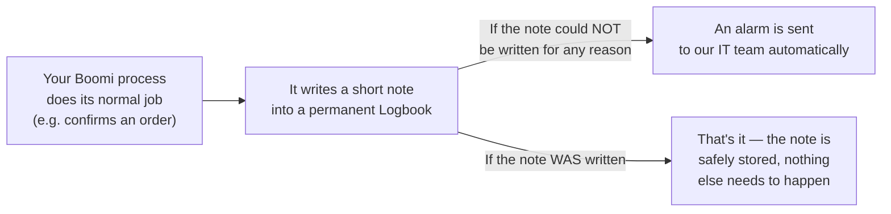
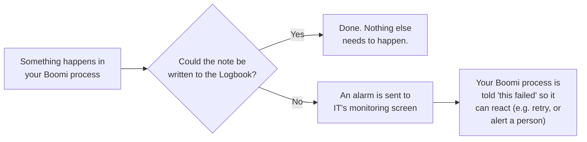
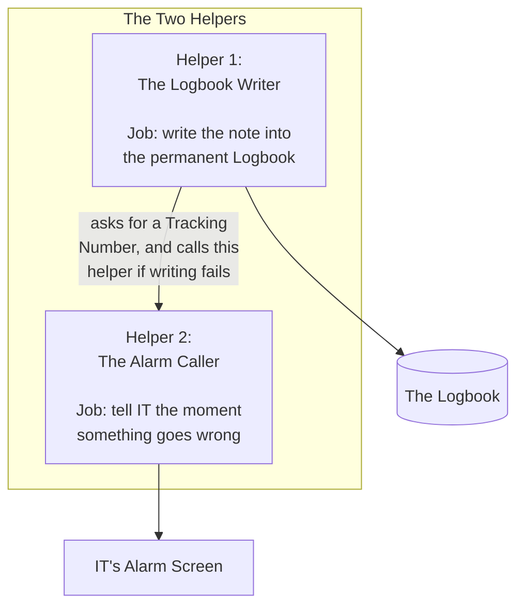
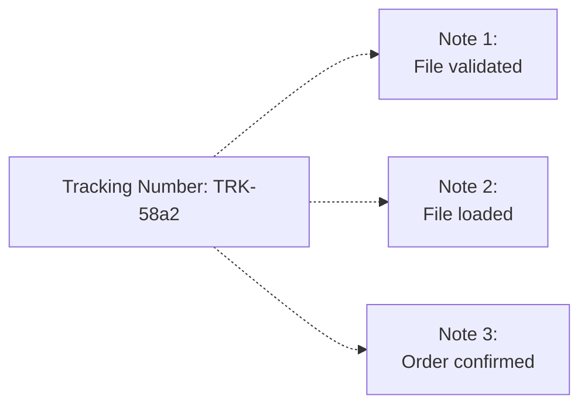
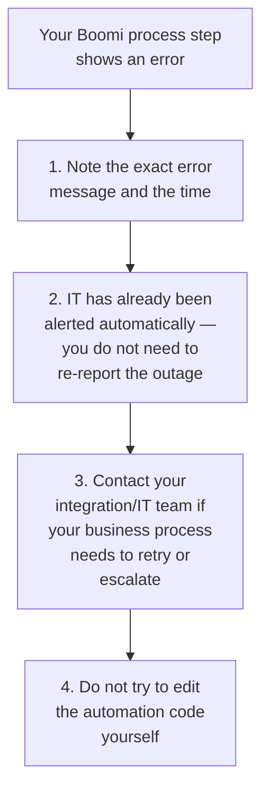

# Boomi Audit Log Guide (Process Owner Edition)

A plain-language guide for Boomi process owners — no coding or IT background
needed. This document explains, in everyday words, what happens behind the
scenes when your Boomi process records that something important happened,
and what happens if that recording ever fails.

**Who this is for:** Anyone who owns or configures a Boomi process, even if
you have never written code and don't know what "MongoDB" or "OpenTelemetry"
mean. Every technical word this guide uses is explained the first time it
appears, and again in the [Glossary](#11-glossary-plain-english-dictionary) at
the end.

**If you get stuck:** see [Where To Get Help](#where-to-get-help) at the
bottom of this page.

---

## 1. The Big Picture (Read This First)

Before any details, here is the entire idea in one picture:

In one sentence: **every time your Boomi process does something important,
it writes a short, permanent note about it — and if that note ever fails to
get written, IT is told immediately, automatically, without anyone having to
notice or report it.**

That's the whole idea. Everything else in this guide just explains that one
picture in more detail, gives you real examples, and tells you what (if
anything) you need to fill in.

---

## 2. Background: Why Do We Keep A "Logbook" At All?

Think of the Logbook like a bank's transaction history, or a security
guard's sign-in sheet at a building entrance. It answers questions like:

- "Who confirmed order ORD-2024-001, and when?"
- "Did this file from a trading partner (a company we exchange data files
  with, sometimes called an **EDI** partner) load successfully or not?"
- "What did the order's status change from and to?"

This matters for a few very ordinary business reasons:

| Reason | Plain example |
|---|---|
| **Resolving disputes** | A customer says their order was never confirmed. The Logbook shows exactly when it was confirmed, and by whom. |
| **Compliance / audits** | An auditor asks "prove that only authorized staff changed this order." The Logbook is that proof. |
| **Troubleshooting** | An order got stuck. The Logbook shows every step that happened (or didn't happen) to it, in order, like a paper trail. |

The Logbook is never edited or deleted — new notes are only ever added, like
pages in a diary. That's what makes it trustworthy as a record.

> **Technical name, for reference:** the "Logbook" is a database called
> **MongoDB**. You do not need to know anything about databases to read this
> guide — "the Logbook" is all you need to picture.

---

## 3. Background: What's This "Alarm To IT"?

Sometimes, for reasons entirely outside your Boomi process's control (a
network hiccup, a server restart, something on IT's side), the note cannot
be written into the Logbook. When that happens, we don't want to just quietly
lose that note and have nobody notice for weeks. So the moment a note fails
to be written, an automatic alarm is sent to a screen that IT watches.

Picture it like a smoke detector: it doesn't put out the fire itself, but it
makes sure someone finds out immediately instead of discovering the damage
much later.

> **Technical name, for reference:** IT's monitoring screen is a tool called
> **SigNoz**. The alarm itself is sent using a widely-used technical
> standard called **OpenTelemetry**. Again — you do not need to understand
> either of these; "IT's alarm screen" is all you need to picture.

The same screen also works like a **stopwatch** for longer processes (for
example one that loads a file, checks it, and files it away). It quietly
times each part, so if a run ever feels slower than usual, IT can see
exactly which part took the longest, instead of guessing. Turning the
stopwatch on is part of your process setup — Section 6 shows the handful of
short commands that do it.

---

## 4. Meet The Two Helpers Working Behind The Scenes

Everything in sections 1–3 above is actually done by two small, separate
helpers, working as a team. Each helper only does **one** job — this keeps
each of them simple and reliable, the same way a restaurant has one person
taking orders and a different person cooking, instead of one person trying
to do both at once.

**Why does this matter to you as a process owner?** You never configure how
these helpers work inside — but you (with your Boomi Admin's help at first)
**do call them**, using a handful of short one-line commands: one to write a
note, and a few to start/stop the stopwatch for each part of your process.
Section 6 shows exactly which call to use, when, and what to pass. It also
helps to know the helpers' names, in case an IT engineer mentions them:

| Everyday name in this guide | Technical name (only IT will use this) |
|---|---|
| The Logbook Writer | `BoomiAuditLogLibrary` |
| The Alarm Caller | `BoomiOtelLibrary` |
| The Logbook | MongoDB |
| IT's Alarm Screen | SigNoz |
| Tracking Number | Trace ID |

**Why two separate helpers instead of one?** The Logbook Writer's only job is
writing notes correctly. The Alarm Caller's only job is telling IT about
problems. Keeping them separate means:

- If IT ever needs to upgrade how alarms are sent, they don't risk breaking
  how notes are written, and vice versa.
- The Alarm Caller can be reused by other, completely unrelated automated
  helpers in the future that have nothing to do with the Logbook — it's a
  general-purpose "tell IT something broke" helper, not tied to audit notes
  specifically.

---

## 5. What Is A "Tracking Number" And Why Do I See It?

When your Boomi process writes a note, it's given a **Tracking Number** —
just like a parcel tracking number from a courier. If several notes are all
part of the same overall event (for example, "validate the file," then
"load the file," then "confirm the order"), they can all share the same
Tracking Number, so anyone looking at the Logbook later can follow the whole
story in order, just like tracking a parcel's journey step by step.

You don't need to invent this number yourself — it is generated
automatically. If your Boomi process is already part of a bigger tracked
operation, the same Tracking Number is reused automatically so everything
stays connected; otherwise, a brand new one is created for you.

For example, loading one file might create three separate notes, all
sharing the same Tracking Number `TRK-58a2`:

Later, anyone reviewing the Logbook can search for `TRK-58a2` and see all
three notes together, in the order they happened — like following one
parcel's tracking history from "shipped" to "out for delivery" to
"delivered," instead of three unrelated-looking entries.

---

## 6. What You Need To Fill In

This is the only part that involves you (or the Boomi developer helping you)
actually doing something. When a Boomi process step writes a note, it fills
in a small form. Here is that form, explained one line at a time, in plain
language, with a realistic example for each line.

> Not every line needs to be filled in. Lines marked **Must fill in** are
> required; everything else can be left blank and the system will either
> fill in something sensible automatically, or simply leave it empty.

| Plain-language name | Must fill in? | What it means | Example |
|---|---|---|---|
| **What Happened** | ✅ Must fill in | A short action verb from the approved list | `confirm` |
| **What Kind Of Thing** | ✅ Must fill in | The category of business item this note is about | `orders.order` (this note is about an order) |
| **Technical Details** | Usually automatic | Where this event came from (an automatic system, not a person, filled this in for you most of the time) | Filled in automatically for you — see note below |
| **Which One** | Optional, but recommended | The specific item's ID/number | `ORD-2024-001` |
| **Who Did It** | Optional, but recommended | The person or system that did this | `usr:jane.lee` (a person named Jane) or `sys:boomi-service` (an automated system) |
| **Did It Work?** | Optional | Leave blank if it succeeded. Fill in a short code if it failed. | Blank = success. `BOM-OD-0001` = Boomi, Order module, registered error 0001. Copy the complete code exactly rather than memorizing it. |
| **Short Message** | Optional | A plain sentence describing what happened, for a human reading the Logbook later | `"Order confirmed by customer service agent"` |
| **What Changed** | Optional | If something's status changed, what it changed from and to | Status changed from `PENDING` to `CONFIRMED` |

> **About "Technical Details":** this line exists because the Logbook was
> originally designed for our website/app (which naturally has things like
> "which web address was used"). Since your Boomi process isn't a website,
> this line is filled in automatically for you with a sensible Boomi-shaped
> default. In practice, your Boomi Admin may set this to include process
> identity (process ID + main/sub program code) for easier reporting. You only
> need to touch it if an IT engineer specifically asks you to customize it.

### The Calls You Will Use (Which One, When, Passing What)

Besides the form above, there are only **four short commands** you will ever
use in a process. Your Boomi Admin sets them up with you the first time;
after that, you mostly just decide *where* they go in your process and
*what business values* they carry:

| When | What you call | What you pass | In plain words |
|---|---|---|---|
| Your process run begins | `startSpan(...)` | Your process's name, e.g. `boomi.process.edi_order_load` | "Start the stopwatch for the whole run" |
| You want to record a business fact | `writeAuditLog(...)` | The form from the table above (What Happened, Which One, Who Did It...) | "Write a note in the Logbook" |
| A part of your process starts and ends | `withSpan(...) { ... }` | The part's name, e.g. `...load_file`, wrapped around that part's work | "Time this one part — the stopwatch stops by itself, even if the part fails" |
| Your process run ends | `endSpan(...)` | The handle `startSpan` gave you — and the error, if one happened | "Stop the whole run's stopwatch (and mark it red if it failed)" |

A complete run of the file-loading example from Section 5 is just:

1. `startSpan` ("run started") → `writeAuditLog` ("note: file received")
2. `withSpan` around loading the file, `withSpan` around converting it,
   `withSpan` around filing it away — three timed parts
3. `writeAuditLog` ("note: file loaded — or failed, with the reason") →
   `endSpan` ("run finished")

That's the entire pattern. When you need the exact spelling of each call and
its parameters, they are listed (with a copy-paste example of this same
file-loading process) in the
[Boomi Integration Guide § Public API](boomi-integration-guide.md#public-api)
and its
[step-by-step tracking recipe](boomi-integration-guide.md#process-tracing-in-signoz)
— ask your Boomi Admin to walk through it with you the first time.

---

## 7. Worked Example: A Successful Confirmation

Imagine your Boomi process confirmed one incoming file payload.
Here is what gets filled in, and what
it means in plain language:

| Line | What you'd write | In plain words |
|---|---|---|
| What Happened | `confirm` | "A confirmation action happened" |
| What Kind Of Thing | `boomi.document` | "This note is about an incoming Boomi document" |
| Which One | `TCHIBO-0001.csv` | "Specifically, file TCHIBO-0001.csv" |
| Who Did It | `null` | "An automated process did this (no human user)" |
| Did It Work? | *(left blank)* | "Yes, it succeeded" |
| Short Message | `Order confirmed by customer service agent` | A plain-English summary |
| What Changed | Status: `PENDING` → `CONFIRMED` | "The order's status flipped from Pending to Confirmed" |

**What happens next:** the note is written into the Logbook. Nothing appears
on IT's alarm screen, because nothing went wrong. If a compliance reviewer
ever asks "who confirmed this order, and when?", this note answers that
question completely.

---

## 8. Worked Example: A Failed File Load

Now imagine a different scenario: your Boomi process tried to load a file
from a trading partner, but the file was missing required information, so
the load failed.

| Line | What you'd write | In plain words |
|---|---|---|
| What Happened | `load` | "We tried to load an incoming file" |
| What Kind Of Thing | `boomi.document` | "This note is about an incoming data file" |
| Which One | `LOAD-48391` | "Specifically, load number LOAD-48391" |
| Who Did It | `sys:boomi-service` | "An automated system did this, not a person" |
| Did It Work? | `BOM-OD-0001` | "No — here's the specific reason it failed" |
| Short Message | `Source file validation failed` | A plain-English summary |

**What happens next:** the note is written into the Logbook (yes, even
failures get a permanent note — that's important, because "it failed" is
itself a fact worth keeping a record of). Nobody needs to do anything extra
here, because the failure is the business outcome itself, not a system
breakdown.

**This is different from the alarm in Section 3.** The alarm in Section 3 is
only sent when the note itself could not be written at all (for example, the
Logbook was temporarily unreachable) — not simply because the business event
itself was "a failure." A failed order confirmation is successfully written
as "this failed, here's why." An alarm is only about the writing process
breaking down, not about the business outcome.

---

## 9. When Something Goes Wrong

If the Logbook truly cannot be reached (which should be rare), your Boomi
process step will show an error message instead of completing normally.

In plain terms: **you will know immediately if something failed, because
your own Boomi step will tell you. You do not need to separately check
whether IT was told — that already happened automatically.** Your job is
simply to decide, from a business point of view, what should happen next
(try again later? escalate to a person? pause the process?) — that business
decision is not something the automation can make for you.

---

## 10. Frequently Asked Questions

**Do I need to know how to code?**
Only a little — and never alone. The four calls in Section 6 are one-liners;
your Boomi Admin sets them up with you the first time and reviews your
processes afterward. Your real job is the business knowledge: deciding
*which* events deserve a note, *what* values go in the form, and *which*
parts of your process are worth timing.

**What happens if I leave an optional line blank?**
Nothing bad. Optional lines are either filled in automatically with a
sensible default, or simply left empty. Only the two lines marked "Must fill
in" in Section 6 are required.

**Can I see the Logbook myself?**
Usually the Logbook is reviewed by your compliance or IT team using their
own tools. If you regularly need to look things up yourself, ask your IT
team to set you up with read-only (look but don't touch) access.

**What if the same order needs multiple notes (e.g. validated, then
confirmed, then shipped)?**
That's normal and expected — each step gets its own note, and they all share
the same Tracking Number (Section 5) so they can be read together as one
story, in order.

**Who do I talk to if I'm not sure what to put in one of the lines?**
Your Boomi developer or integration engineer — see
[Where To Get Help](#where-to-get-help) below.

---

## 11. Glossary (Plain-English Dictionary)

| Term | Plain-English meaning |
|---|---|
| **Audit log / "the Logbook"** | A permanent, tamper-proof written record of important business events — who did what, and when. |
| **MongoDB** | The technical name for the system that stores the Logbook. You never need to interact with it directly. |
| **SigNoz** | The technical name for IT's monitoring/alarm screen. |
| **OpenTelemetry** | A widely-used technical standard for sending alarms/monitoring information. It's the "language" the Alarm Caller speaks to IT's screen. |
| **Trace ID / "Tracking Number"** | A shared reference number that links several related notes together, like a parcel tracking number. |
| **Boomi process** | The automated workflow you build and own in Boomi. |
| **Groovy script / "the recipe"** | A small piece of automation code, usually written once by a developer, that does the actual work of writing a note or sending an alarm. |
| **Field** | One line of the "form" described in Section 6 (for example "What Happened" or "Who Did It"). |
| **`BoomiAuditLogLibrary`** | The technical name for "The Logbook Writer" helper (Section 4). |
| **`BoomiOtelLibrary`** | The technical name for "The Alarm Caller" helper (Section 4). |

---

## Where To Get Help

- **"What should I put in this field for my specific business scenario?"** —
  ask your Boomi developer or integration engineer.
- **"Something failed and I don't know why."** — contact your IT/integration
  team; mention the exact error message and the approximate time.
- **You are an IT engineer or developer reading this by mistake** — you
  probably want
  [Boomi Integration Guide](boomi-integration-guide.md) (how to call the
  library),
  [Boomi Groovy Library Architecture](../references/boomi-groovy-library-architecture.md)
  (why the code is structured the way it is), or the
  [Audit Log Contract](../references/audit-log-contract.md) (the exact
  record fields and rules) — not this document.
