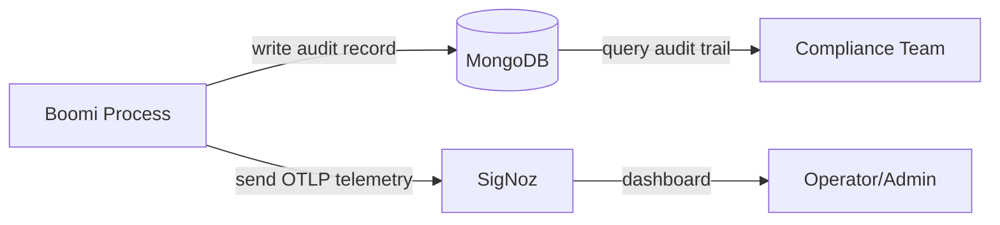
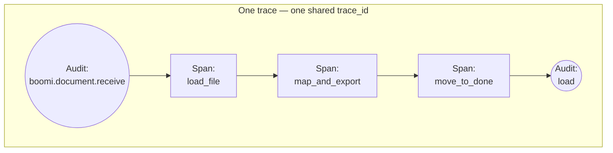
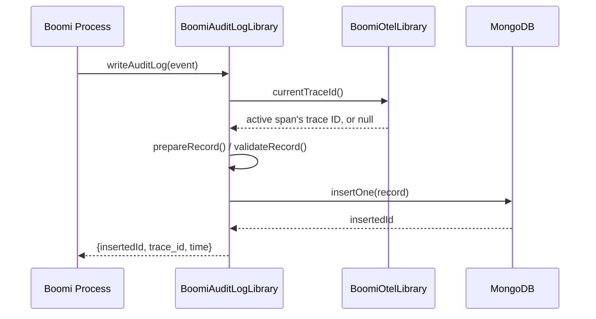
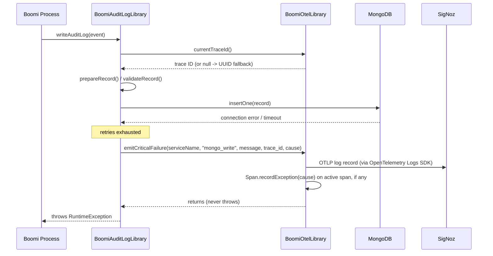

 Boomi Integration Guide

How to use the audit log library and telemetry from Boomi processes.

**Who this is for:** Boomi Admins — the people with in-depth knowledge of the audit log and telemetry libraries who build the harder integrations, troubleshoot, and **train process owners**. If you are a Boomi process owner, start with the [Boomi Audit Log Guide (Process Owner Edition)](boomi-audit-log-owner-guide.md) — it explains the what and why in plain language, plus the handful of calls you use day-to-day; come back to this guide's [Public API](#public-api) and [tracing recipe](#process-tracing-in-signoz) when you need exact parameters.

### Which Document Do I Need? (By Role)

Each role has its own reading path, on a need-to-know basis — no role should
need material outside its own list:

| Role | Daily job | Knowledge depth | Read | You do NOT need |
|---|---|---|---|---|
| **Boomi Process Owner** | Build/configure processes: decide what business events to record, call `writeAuditLog` and the span (stopwatch) calls with the right business values | *Use-case level* — which call, when, passing what, and why | [Process Owner Edition](boomi-audit-log-owner-guide.md) first; then this guide's [Public API](#public-api) + [tracing recipe](#process-tracing-in-signoz) for exact parameters | Library internals, reliability tuning, credentials, secrets, account administration |
| **Boomi Admin** | Everything the owner does, **plus**: train owners, review their processes, triage errors, monitor via SigNoz dashboards, run test workflows | *In-depth* — full API semantics, contract rules, failure behavior, testing | **This whole guide** + [Audit Log Contract](../references/audit-log-contract.md) | Credentials, secrets, MongoDB accounts, SigNoz account administration — operator-owned; library source internals — maintainer-owned |
| **Library Maintainer** (dev/architect of the Groovy code) | Change, build, test, and ship the two `*.groovy` library files | *Internals* — split rationale, signatures, build/test/deploy | [Boomi Groovy Library Architecture](../references/boomi-groovy-library-architecture.md) + this guide for the caller's view | Boomi business-process design, secrets/accounts |
| **Infra Operator / Admin** | Provision the platform, secrets, and accounts | Platform internals | [Operator Runbook](operator-runbook.md), esp. [§ Boomi Audit Writer: Credentials, Secrets, And Accounts](operator-runbook.md#boomi-audit-writer-credentials-secrets-and-accounts) | Boomi process design or library call patterns |
| **Enterprise Architect** | Review design, security, compliance | Design level | [Enterprise Architecture](enterprise-architecture.md) + [Audit Log Contract](../references/audit-log-contract.md); [Library Architecture](../references/boomi-groovy-library-architecture.md) for code-level design | Operational runbooks, secret formats, API call recipes |

A typical flow: the process owner decides *what* to record and implements the
calls at use-case level; the Boomi Admin trains and reviews them with this
guide's full depth and validates field rules against the contract; the infra
operator provisions the secret once; and the EA reviews the contract and
architecture — nobody needs another role's material.

**Related docs:**
- [Audit Log Contract](../references/audit-log-contract.md) — canonical document shape, field meanings, naming, and module extension rules
- [Glossary](../references/glossary.md) — jargon/acronym lookup (OTLP, trace ID, audit trail, and more)
- [Component Catalog § MongoDB](../references/component-catalog.md#mongodb-percona-server-for-mongodb) — what MongoDB does in OMS
- [Component Catalog § SigNoz](../references/component-catalog.md#signoz) — what SigNoz does in OMS
- [Verification Commands § End-to-End](../references/verification-commands.md#end-to-end-smoke-test) — validate the full path
- [Environment Setup](environment-setup.md) — workstation setup (if running test harness locally)

## Quick Start: First Audit Log And Telemetry Flow

Use this path when you want a fast confidence check before deep customization.

Why this path is the default:
1. It uses the existing Kubernetes Secret workflow already provisioned by operators.
2. It avoids extra cost and moving parts from AWS Secrets Manager in dev.
3. It validates both audit-write and telemetry paths together in one run.

1. Confirm your role access.
  - Write/integration testing: Boomi Admin (Editor)
  - Read-only reporting: Viewer
2. Ensure prerequisites:
  - `scripts/create-audit-writer-secret.sh` already run by operator
  - SigNoz is reachable (`scripts/open-signoz-ui.sh` in dev)
3. Run the end-to-end test:

```bash
scripts/run-audit-telemetry-test.sh
```

4. Validate outputs:
  - Test reports successful write/read-back from MongoDB
  - In SigNoz Logs, filter `service.name = oms-audit-test-pod`
5. Then continue with this guide for schema, API usage, and production integration patterns.

> **You never handle database credentials.** The library resolves the MongoDB
> connection internally from a secret an operator provisioned once. If a
> query or test fails with `Unauthorized`, hand it to your infra operator —
> their reference is
> [Operator Runbook § Boomi Audit Writer: Credentials, Secrets, And Accounts](operator-runbook.md#boomi-audit-writer-credentials-secrets-and-accounts).

---

## System Overview For Boomi

Boomi processes interact with two backend services:



| Service | What Boomi Does With It | Endpoint |
|---|---|---|
| **MongoDB** | Writes immutable audit log records | MongoDB URI (from K8s Secret — see below) |
| **SigNoz** | Sends OTLP log/trace telemetry for observability | OTLP endpoint (HTTP, cluster-internal or via ingress) |

The library resolves both connections internally — you never configure a
MongoDB URI, an OTLP endpoint, or a Kubernetes Secret yourself. It is split
into two small components (one only ever talks to MongoDB, the other only
ever talks to SigNoz); the deployment/network detail behind that (where the
code runs, how it reads the connection secret, port-forwards vs. cluster
DNS) is infra/architecture-level material, not a Boomi Admin's daily
concern — see
[Boomi Groovy Library Architecture § Execution Topology](../references/boomi-groovy-library-architecture.md#execution-topology)
if you need it, or
[Boomi Audit Log Guide (Process Owner Edition)](boomi-audit-log-owner-guide.md)
for a plain-language walkthrough of the same idea.

How the MongoDB secret is provisioned, which MongoDB accounts exist, and the
alternative AWS Secrets Manager path are operator concerns — see
[Operator Runbook § Boomi Audit Writer: Credentials, Secrets, And Accounts](operator-runbook.md#boomi-audit-writer-credentials-secrets-and-accounts).

## Audit Log Library

### Location

```
scripts/groovy/boomi/BoomiAuditLogLibrary.groovy   # writes audit records to MongoDB
scripts/groovy/boomi/BoomiOtelLibrary.groovy       # trace-ID correlation + SigNoz failure telemetry
```

These are the production libraries; deploy both together (the first depends on the second). The file
at `scripts/write-auditlog-and-telemetry.groovy` is only a test harness. See
[Boomi Groovy Library Architecture](../references/boomi-groovy-library-architecture.md) for why there
are two files instead of one, and what each one owns.

### Public API

#### `BoomiAuditLogLibrary.writeAuditLog(Map event)`

**This is the only method a Boomi process needs to call.** Pass a Map with the
business fields the [Audit Log Contract](../references/audit-log-contract.md)
requires — nothing else. The library resolves the MongoDB connection, the
fixed database, and the fixed collection internally; resolves `trace_id` from
an active OpenTelemetry span when one exists (otherwise a fresh UUID),
and generates `time` (a native BSON
Date) when you omit it; retries transient connection errors internally; and
emits critical SigNoz telemetry (via the OpenTelemetry Logs SDK, with the
exception recorded on the active span if any) before throwing on any failure.

**Fields** (see the contract for full definitions):

| Key | Required | Description |
|---|---|---|
| `action` | Yes | Action verb from the documented list, e.g. `confirm`, `cancel`, `load`, `receive`. |
| `resource_type` | Yes | Namespaced noun, e.g. `boomi.document`. |
| `meta` | Yes\* | `[method: ..., path: ..., status: ...]` — required in the persisted document, but you may omit it entirely: the library then defaults it to `[method: 'BOOMI', path: action, status: (error_code ? 500 : 200)]`. See [`meta` For Non-HTTP Producers](../references/audit-log-contract.md#meta-for-non-http-producers-boomiedi). |
| `error_code` | No | `null` on success; failure values use `<SYSTEM>-<MODULE>-<NNNN>`. See [Audit Log Contract](../references/audit-log-contract.md#success-and-failure) for the complete rules. Defaults to `null`. |
| `resource_id` | No | Identifier of the resource — the external system's own ID is preferred for an EDI/Boomi entity (for example a stable load/interchange identifier; see the caveat under the example below), or a UUID for an internally-generated entity. Defaults to `null`. |
| `user_id` | No | For Boomi process writes this should be `null` (no human actor). |
| `impersonator_id` | No | ID of a user acting on behalf of another. Boomi processes typically have no impersonator; defaults to `null`. |
| `message` | No | Short sanitized summary. Defaults to `null`. |
| `tpl_message` | No | `[key: ..., params: [...]]` — OMS message-rendering payload only. `key` is the i18n template lookup key, and `params` are the template substitution values. Do not use this object to carry transport/process identity metadata. Defaults to `null`; omit entirely if there's nothing structured to say. |
| `resource_changes` | No | `[field_name: [old_value, new_value]]` for a state transition. Defaults to `null`; typically stays `null` for EDI-loading actions since there's no natural before/after diff, but the library validates it if you do supply one. |
| `trace_id` | No | Reused from an active OpenTelemetry span's trace ID when one exists (an opaque hex string, not a UUID); otherwise a fresh UUID is generated. |
| `ip` | No | Client IP or `null`; defaults to `null`. |
| `time` | No | ISO-8601 String or `Date`; defaults to now (stored as a BSON Date either way). |

**Returns:** `Map` with `insertedId`, `trace_id`, and `time` (the resolved values).

**Throws:** `IllegalArgumentException` on a contract validation failure, or the
underlying MongoDB exception (wrapped in a `RuntimeException`) after retries
are exhausted. **There is no fail-soft variant** — the calling Boomi process
must catch the exception and decide how to react (retry the business step,
alert, or halt). Before throwing, the library emits a critical, sanitized
telemetry event to SigNoz via the OpenTelemetry Logs SDK, and records the
exception on the active span if one exists — see
[Write Failure Handling](../references/audit-log-contract.md#write-failure-handling).

**Example** (a Boomi process only ever runs as a system actor loading/mapping
EDI data, never a human "confirm this order" action — so this uses a
realistic EDI-load scenario):

```groovy
import boomi.BoomiAuditLogLibrary

Map event = [
  action: 'load',
  resource_type: 'boomi.document',
  resource_id: 'TCHIBO-0001.csv',
  user_id: null,                       // Boomi runs as a system process -- no human actor to name
  message: 'EDI order file loaded successfully',
  tpl_message: [
    key: 'boomi.document.loaded',
    params: [
      contract_version: '2.2',
      tenant_id: 'HK_RETAIL'
    ]
  ],
  meta: [
    boomi_process_id: 'EU-TC-0001',
    main_program_code: 'EU',
    sub_program_code: 'TC'
  ]
]

try {
  def result = BoomiAuditLogLibrary.writeAuditLog(event)
  println "Audit write OK: ${result.insertedId} (trace_id ${result.trace_id})"
} catch (Exception e) {
  // The library already emitted critical telemetry to SigNoz. Decide here how
  // this Boomi process reacts: retry, alert, or halt the business flow.
  println "Audit write failed: ${e.message}"
}
```

> **On `resource_id` here:** using the plain file name keeps this first
> example simple, but the contract recommends against it for production use
> — trading partners resend the same logical interchange under a different
> filename, and reuse filenames for different content, so a raw file name is
> not a reliable long-term identity. Prefer a stable load/interchange
> identifier instead; see
> [Audit Log Contract § Boomi EDI Document Load Failed](../references/audit-log-contract.md#boomi-edi-document-load-failed)
> for the production-shaped version of this same scenario.

You do **not** need to resolve a MongoDB URI, pick a database/collection name,
configure retries, or generate `trace_id`/`time` yourself. You do need to pass
the Boomi process identity inside `meta`.

For SigNoz and audit correlation, keep using `trace_id` as the primary key
across traces/logs/audit documents, and use `boomi_process_id` plus
program codes for additional grouping in dashboards and operational reports.

`tpl_message` exists for OMS rendering: `key` is the i18n lookup key and
`params` are template substitution values. In OMS frontend this is handled by
`vue-i18n`.

#### `BoomiAuditLogLibrary.closeAllClients()`

Closes and clears all pooled MongoClients, and shuts down the shared
`BoomiOtelLibrary` telemetry logger (see below). Call this at the end of
short-lived batch jobs or test runs that need a clean shutdown; not
required for long-running Boomi runtimes, which should keep reusing the
pooled connection.

### `BoomiOtelLibrary` (Telemetry & Tracing Helper)

`writeAuditLog` already calls this for you for trace-ID correlation and
failure telemetry — you don't need to touch it just to write audit records.
Call it directly when you want SigNoz to show a **trace** of your Boomi
process: when it started, how long each lengthy subprocess took, and when it
completed. The full step-by-step how-to is
[Process Tracing In SigNoz](#process-tracing-in-signoz) just below; this
table is the method reference.

| Method | Purpose |
|---|---|
| `BoomiOtelLibrary.startSpan(serviceName, spanName, parentTraceparent = null)` | Starts a timed span (process- or subprocess-level). Returns a handle Map (`span`, `scope`, `traceparent`, `traceId`, `spanId`) to pass to `endSpan`. |
| `BoomiOtelLibrary.endSpan(spanHandle, error = null)` | Ends a span, recording its duration. Pass `error` to mark it failed and emit a SigNoz failure log automatically. |
| `BoomiOtelLibrary.withSpan(serviceName, spanName, parentTraceparent = null) { handle -> ... }` | Runs a block of work as a timed span, always ending it (even on exception) — the recommended way to time a subprocess. |
| `BoomiOtelLibrary.recordError(serviceName, spanHandle, message, cause)` | Records an error on a span **without** ending it, and always emits a SigNoz failure log. |
| `BoomiOtelLibrary.currentTraceId()` | Returns the active OpenTelemetry span's trace ID, or `null` if there is none. |
| `BoomiOtelLibrary.emitCriticalFailure(serviceName, failureType, message, traceId, cause)` | Sends a critical, sanitized failure log to SigNoz and records `cause` on the active span, if any. Never throws. |
| `BoomiOtelLibrary.resolveEndpoint()` / `resolveTracesEndpoint()` | Return the OTLP/HTTP endpoints telemetry is sent to (`BOOMI_AUDIT_OTEL_ENDPOINT` for logs, `BOOMI_AUDIT_OTEL_TRACES_ENDPOINT` for traces — the latter defaults to the former with `/v1/logs` swapped for `/v1/traces`). |
| `BoomiOtelLibrary.shutdown()` | Shuts down the cached telemetry logger and tracer. Also called by `BoomiAuditLogLibrary.closeAllClients()`. |

### Process Tracing In SigNoz

This is the authoritative how-to for timing a Boomi process in SigNoz —
process owners and admins both use it. It runs through one concrete,
realistic process end to end: **loading an EDI order file from a trading
partner**, which naturally breaks into three parts:

1. **Load the file** — retrieve `orders-20260713.edi` from the trading-partner drop location.
2. **Map and export** — translate the EDI fields and write `orders-20260713.import.json`.
3. **Move to done** — move the original file to a "done"/archive location.

One run becomes **one trace** with **one process-level span** (the whole run)
and **three subprocess spans** nested underneath, bracketed by two audit-log
records (`receive` at the start, `load` at the end):



#### Full worked example (single script)

The common case: the whole process runs as one Groovy script, so every span
automatically nests under whichever span is already active — no parent
wiring needed.

```groovy
import boomi.BoomiOtelLibrary
import boomi.BoomiAuditLogLibrary

final String SERVICE_NAME = 'oms-audit-writer'
String fileName = 'orders-20260713.edi'
String loadId = 'LOAD-48391'
String processId = 'EU-TC-0001'

// 1) Start the trace + the process-level span, and record that the file was
//    received (the contract's completed-fact form of "the run started").
def processHandle = BoomiOtelLibrary.startSpan(SERVICE_NAME, 'boomi.process.edi_order_load')
BoomiAuditLogLibrary.writeAuditLog([
  action: 'receive',
  resource_type: 'boomi.document',
  resource_id: 'TCHIBO-0001.csv',
  user_id: null,
  meta: [
    boomi_process_id: processId,
    main_program_code: 'EU',
    sub_program_code: 'TC'
  ],
  tpl_message: [key: 'boomi.document.received', params: [file_name: fileName]]
])

// 2) Subprocess 1: load the EDI file from the trading-partner drop location.
BoomiOtelLibrary.withSpan(SERVICE_NAME, 'boomi.process.edi_order_load.load_file') { handle ->
  // ... read `fileName` from the SFTP/AS2 drop location ...
}

// 3) Subprocess 2: map EDI fields to the internal format and export the result.
BoomiOtelLibrary.withSpan(SERVICE_NAME, 'boomi.process.edi_order_load.map_and_export') { handle ->
  // ... apply the EDI-to-JSON mapping, write orders-20260713.import.json ...
}

// 4) Subprocess 3: move the original EDI file to the "done" archive location.
BoomiOtelLibrary.withSpan(SERVICE_NAME, 'boomi.process.edi_order_load.move_to_done') { handle ->
  // ... move fileName into the done/archive folder ...
}

// 5) Record the completed load milestone (error_code omitted = null = success),
//    and end the process span.
BoomiAuditLogLibrary.writeAuditLog([
  action: 'load',
  resource_type: 'boomi.document',
  resource_id: 'TCHIBO-0001.csv',
  user_id: null,
  meta: [
    boomi_process_id: processId,
    main_program_code: 'EU',
    sub_program_code: 'TC'
  ],
  tpl_message: [key: 'boomi.document.loaded', params: [file_name: fileName]]
])
BoomiOtelLibrary.endSpan(processHandle)
```

Both audit writes automatically share the process span's trace ID — no extra
wiring. `trace_id` and `time` may be omitted on purpose because the library
resolves/generates them automatically. `meta` should be supplied explicitly
with `boomi_process_id`, `main_program_code`, and `sub_program_code`.
Naming follows the [contract](../references/audit-log-contract.md#action-verb-from-registry):
the beginning is the completed fact `receive`, the end is the
milestone `load` whose outcome lives only in `error_code`.

#### Which call, when

| Part of your process | Start tracking | End tracking | What SigNoz shows |
|---|---|---|---|
| The whole process run | `startSpan(SVC, 'boomi.process.<name>')` in your first Groovy step | `endSpan(processHandle)` in your last Groovy step | One parent bar spanning the entire run |
| A part inside one Groovy step | `withSpan(SVC, 'boomi.process.<name>.<part>') { ... }` | (automatic — ends when the closure ends, even on error) | One child bar with that part's duration |
| A part crossing several shapes | `startSpan(SVC, 'boomi.process.<name>.<part>', parentTraceparent)` in the shape where it begins | `endSpan(partHandle)` in the shape where it finishes | Same child bar, timed across the shapes |
| A part that failed | — | `endSpan(partHandle, exception)` (or let `withSpan` catch it) | The bar turns red, with the exception attached |

Rules of thumb:

- **Every `startSpan` must be matched by exactly one `endSpan`** — an
  unmatched span never gets an end time and shows as incomplete in SigNoz.
  This is why `withSpan` is preferred when the part fits in one step: it
  can never leak a span, even when the work throws.
- Start spans in order, end them in reverse order (a part's span should be
  ended before the process span that contains it).

#### Reading the trace in SigNoz

Open SigNoz → **Traces** tab → filter `service.name = oms-audit-writer` →
open the trace. Each part appears as its own timed bar under the process
bar — a "waterfall" (durations illustrative):

```text
boomi.process.edi_order_load                                    total: 10.4s
├─ load_file          ▓▓▓                                           0.6s
├─ map_and_export      ▓▓▓▓▓▓▓▓▓▓▓▓▓▓▓▓▓▓▓▓▓▓▓▓▓▓▓▓▓▓▓▓▓▓▓▓▓▓▓▓▓▓▓  8.4s  <- slow, worth investigating
└─ move_to_done                                                 ▓▓   0.5s
```

Without subprocess spans, all you would know is "this run took 10.4s." With
them, you know `map_and_export` is where nearly all the time went.

> **Why the three parts are spans, not audit records.** Only the
> process-level `receive`/`load` pair is written to the audit log; the three
> timing bars are SigNoz spans. Timing is telemetry, not a business fact
> (contract [Non-Goals](../references/audit-log-contract.md#non-goals--what-this-collection-is-not-for)):
> SigNoz answers "which step was slow"; the audit log answers "did the load
> succeed, and when." Neither duplicates the other.

#### Handling errors

- **A part fails and the process should stop** — for example
  `map_and_export` hits a file missing a required EDI segment:

  ```groovy
  try {
    BoomiOtelLibrary.withSpan(SERVICE_NAME, 'boomi.process.edi_order_load.map_and_export') { handle ->
      if (!hasRequiredInterchangeHeader) {
        throw new IllegalStateException('Required interchange header segment is missing')
      }
      // ... mapping work ...
    }
  } catch (Exception e) {
    // withSpan already marked the span failed, recorded the exception on it,
    // and emitted a critical failure log to SigNoz — before re-throwing here.
    BoomiAuditLogLibrary.writeAuditLog([
      action: 'boomi.document.load',
      error_code: 'BOM-OD-0001',
      resource_type: 'boomi.document',
      resource_id: loadId,
      message: 'EDI document load failed: required interchange header segment missing'
    ])
    BoomiOtelLibrary.endSpan(processHandle, e)
    throw e
  }
  ```

  `BOM-OD-0001` identifies a Boomi-owned (`BOM`) Order-module (`OD`) error;
  the suffix is the stable registry number, and the adjacent message is the
  human-readable reason.

  You still write the `boomi.document.load` record — the *same* milestone
  action as the success path, with the failure carried **only** in
  `error_code` (a failed attempt is still a completed business fact worth
  recording), and you end the process span with the same error.
- **An error happens but the part continues** (for example a transient SFTP
  hiccup that an internal retry resolves): call
  `recordError(SERVICE_NAME, spanHandle, message, cause)` — it attaches the
  exception to the span and logs it to SigNoz, without ending the span or
  stopping the part.

#### Continuing a trace across separate Boomi shapes

A span object only lives in the memory of the script execution that created
it — it cannot stay "open" across two separate Boomi shape executions. But a
later span only needs its parent's **trace ID + span ID**, carried as a
portable string, to nest correctly. `startSpan`'s handle exposes exactly
that: `handle.traceparent` (W3C format, e.g.
`00-1ee79875...-761fc1b3...-01`). Store it in a Boomi Dynamic Process
Property; a later shape reads it back and passes it as `parentTraceparent`:

```groovy
// Shape 1 (process start, then load_file)
def handle = BoomiOtelLibrary.startSpan('oms-audit-writer', 'boomi.process.edi_order_load')
BoomiAuditLogLibrary.writeAuditLog([action: 'boomi.document.receive', resource_type: 'boomi.document', resource_id: 'LOAD-48391'])
// ... load_file work here, in the same span/scope ...
// store handle.traceparent in a Dynamic Process Property, e.g. DPP_TRACEPARENT

// Shape 2, a separate script execution (map_and_export)
String parentTraceparent = /* read DPP_TRACEPARENT */
def mapHandle = BoomiOtelLibrary.startSpan('oms-audit-writer', 'boomi.process.edi_order_load.map_and_export', parentTraceparent)
// ... mapping work ...
BoomiOtelLibrary.endSpan(mapHandle)

// Shape 3, a separate script execution (move_to_done, then process complete)
def moveHandle = BoomiOtelLibrary.startSpan('oms-audit-writer', 'boomi.process.edi_order_load.move_to_done', parentTraceparent)
// ... move work ...
BoomiOtelLibrary.endSpan(moveHandle)
BoomiAuditLogLibrary.writeAuditLog([action: 'load', resource_type: 'boomi.document', resource_id: 'TCHIBO-0001.csv'])
```

Every shape's span lands under the same trace in SigNoz even though they ran
as separate executions. The one tradeoff: no single execution can
`endSpan(processHandle)` for the overall run, so the whole-run duration is
best read from the two audit timestamps (`load.time` minus
`boomi.document.receive.time`) rather than one continuously-open span.

For the design-level "why it works this way" (ambient span nesting, the
`traceparent` propagation mechanism), see
[Boomi Groovy Library Architecture](../references/boomi-groovy-library-architecture.md).

#### Diagnostic Methods (Operator Use Only)

`BoomiAuditLogLibrary` also exposes `resolveMongoUri()`, `redactUri(uri)`,
`readKubernetesSecretValue(...)`, and `readAwsSecretString(...)`. These exist
for an infra operator diagnosing connection resolution — a Boomi process
calling `writeAuditLog` never needs them and never sees a connection string
at all. They are documented in
[Operator Runbook § Diagnostic Library Methods](operator-runbook.md#diagnostic-library-methods-operator-use-only).

---

## Audit Log Document Schema

The authoritative schema and field semantics are defined in the
[Audit Log Contract](../references/audit-log-contract.md). That contract is
shared by Boomi and every other OMS audit producer; this integration guide does
not define a separate Boomi-specific document shape.

In particular:

- only `time`, `action`, `resource_type`, and `meta` are required — every other field, including `resource_id`, `user_id`, and `tpl_message`, is optional; for Boomi flows, `meta` carries `boomi_process_id`, `main_program_code`, and `sub_program_code`;
- `action` is a verb from the documented action list (for example `confirm`, `cancel`, `load`, `receive`);
- `resource_type` is a namespaced noun;
- `error_code` carries the success/failure contract;
- `user_id` should be `null` for Boomi cron-driven process writes (no human actor);
- `tpl_message`, when present, contains exactly `key` (i18n template lookup key) and `params` (template substitution values for OMS message rendering);
- `resource_changes` (`{field: [old, new]}`) is the preferred way to record a state transition;
- `trace_id` reuses an active OpenTelemetry span's trace ID when one exists, otherwise a generated UUID; either way it is shared correlation data and must not have a unique index.

Read the contract before registering a new template key or params schema.

---

## SigNoz Telemetry

### Endpoint Contract

| Environment | Endpoint | Authentication |
|---|---|---|
| Dev (port-forward) | `http://127.0.0.1:3301/v1/logs` | None |
| Production (ingress) | `https://<signoz-ingress-host>/v1/logs` | Network-restricted (SSO/OIDC on dashboard, OTLP open internally) |

### OTLP Log Format

The library builds this via the OpenTelemetry Logs SDK (not a hand-built
payload); the wire format sent to the `/v1/logs` endpoint looks like:

```json
{
  "resourceLogs": [{
    "resource": {
      "attributes": [
        {"key": "service.name", "value": {"stringValue": "oms-audit-writer"}},
        {"key": "deployment.environment", "value": {"stringValue": "dev"}}
      ]
    },
    "scopeLogs": [{
      "scope": {"name": "boomi.BoomiAuditLogLibrary"},
      "logRecords": [{
        "timeUnixNano": "1720263000000000000",
        "severityNumber": 17,
        "severityText": "ERROR",
        "body": {"stringValue": "Audit write failed: mongo_write"},
        "attributes": [
          {"key": "failure.type", "value": {"stringValue": "mongo_write"}},
          {"key": "failure.message", "value": {"stringValue": "..."}},
          {"key": "trace_id", "value": {"stringValue": "abc123"}},
          {"key": "exception.type", "value": {"stringValue": "com.mongodb.MongoTimeoutException"}},
          {"key": "exception.message", "value": {"stringValue": "..."}},
          {"key": "exception.stacktrace", "value": {"stringValue": "..."}}
        ]
      }]
    }]
  }]
}
```

This is only emitted on a failure (see
[Write Failure Handling](../references/audit-log-contract.md#write-failure-handling))
— a successful write emits no telemetry event, since a successful write is
itself the audit record.

### Accessing SigNoz Dashboard (Quick)

**Dev:** `scripts/open-signoz-ui.sh` → opens `http://127.0.0.1:3301`

**Production:** `scripts/open-signoz-ui.sh --mode ingress`

In the dashboard, navigate to **Logs** → filter `service.name = oms-audit-writer`.

For first-time login and full navigation guide, see [Accessing SigNoz Dashboard](#accessing-signoz-dashboard) below.

### Boomi Admin View-Only Path (No Editor Permissions)

If your account is intentionally restricted to **Viewer**:

1. Open SigNoz with `scripts/open-signoz-ui.sh` (or ingress mode).
2. Go to **Logs** and apply filter `service.name = oms-audit-writer`.
3. Save links/queries for operational reporting.
4. Request an Editor account only when dashboard authoring or alert changes are required.

This path supports separation-of-duties for teams where telemetry authorship is controlled by platform operations.

---

## Runtime Dependencies

The Groovy library uses `@Grab` annotations for automatic dependency resolution:

| Dependency | Version | Purpose |
|---|---|---|
| `org.mongodb:mongodb-driver-sync` | 5.1.2 | MongoDB Java driver (used internally by the library) |
| `software.amazon.awssdk:secretsmanager` | 2.25.48 | Used internally for the operator-configured connection resolution — you never call it or handle what it reads |

For Boomi deployment, either:
- Include these JARs in the Boomi process classpath, OR
- Use Groovy's `@Grab` for automatic resolution (requires internet access from runtime)

External tools required (for Kubernetes secret resolution only):
- `kubectl` available in PATH

---

## Testing The Library

Run the test harness from the repository root:

```bash
# Requires: groovy installed, MongoDB accessible, SigNoz accessible
scripts/write-auditlog-and-telemetry.sh
```

**Test audit-log write only** (no telemetry dependency):

```bash
scripts/write-auditlog-and-telemetry.sh --otel-endpoint http://localhost:1/noop
```

This validates the MongoDB write path independently of SigNoz availability.

The harness also accepts explicit secret-source flags for verifying each
connection-resolution path — that is an operator task, documented in
[Operator Runbook § Testing Secret Resolution Paths](operator-runbook.md#testing-secret-resolution-paths).

---

## Reliability: Timeouts, Retries, And Failure Telemetry

**Core principle: an audit write failure must never be silent.** `writeAuditLog`
always throws on a validation error or an exhausted retry, after first emitting
a critical, sanitized telemetry event to SigNoz (see
[Write Failure Handling](../references/audit-log-contract.md#write-failure-handling)
in the contract). There is no fail-soft variant — the calling Boomi process
must catch the exception and decide how to react: retry the business step
through the process's own retry shape, alert a human, or halt the flow.

### Sequence: Successful Write



`BoomiOtelLibrary` is consulted only for `trace_id` resolution on the happy
path — it does not participate in the MongoDB write itself.

### Sequence: Failed Write



`emitCriticalFailure` is best-effort and swallows its own errors internally
(for example if SigNoz itself is unreachable) — it must never mask or
replace the real exception `BoomiAuditLogLibrary` is already propagating to
the Boomi process. This is why the arrow from `Otel` back to `Audit` is
annotated "returns (never throws)": whatever happens inside
`emitCriticalFailure`, `writeAuditLog` still throws the original MongoDB or
validation exception afterward.

### Timeout and retry defaults (fixed, not configurable)

These are internal to the library — there is no `options` map to tune, which
keeps the caller's surface to a single event Map:

| Setting | Value | Why |
|---|---|---|
| Server selection timeout | 5s | Bounds how long a write waits to find a usable MongoDB node before failing. |
| Connect timeout | 5s | Bounds TCP/TLS handshake time. |
| Socket read timeout | 8s | Bounds how long a single operation can block on the wire. |
| Max retries | 2 (3 attempts total) | Bounded exponential backoff: 250ms → 500ms → 1000ms. |

Only **transient** errors are retried: connection timeouts, socket errors, and
driver-flagged `RetryableWriteError` conditions. Validation errors and write
errors such as duplicate keys are never retried — retrying these would not
change the outcome. If the retry backoff sleep itself is interrupted (for
example the JVM/thread is shutting down), this is a terminal failure, not an
uncaught `InterruptedException`.

### Connection reuse

The library keeps one pooled `MongoClient` per distinct URI (cached process-wide), instead of
creating and closing a new client — and paying a fresh TCP/TLS/auth handshake — on every single
audit write. Call `BoomiAuditLogLibrary.closeAllClients()` only when you need a clean shutdown
(short-lived batch jobs, test runs); long-running Boomi runtimes should leave the pool open.

### What happens on validation or write failure

`writeAuditLog` emits a critical, sanitized telemetry event to SigNoz via the
OpenTelemetry Logs SDK (OTLP/HTTP) — containing the failure class, producer,
exception type/message/stack trace, and `trace_id` when valid — and, if there
is a currently active OpenTelemetry span, records the same exception on that
span (`Span.recordException`) so it appears inline on the trace. It then
throws:

- `IllegalArgumentException` for a contract validation failure (missing required field, malformed
  `tpl_message`, or an unparsable `time`).
- The underlying MongoDB exception, wrapped in a `RuntimeException`, after retries are exhausted or
  for a non-retryable Mongo error.

Because the exception always propagates, the platform's
`Boomi audit writes - no telemetry received` alert (see
[SigNoz Dashboard Import Pack](../references/signoz-dashboard-import-pack.md)) remains a backstop:
if a Boomi process catches the exception and does nothing further, missing telemetry is still
detected independently.

### Security: never log a raw Mongo URI

A Boomi process calling `writeAuditLog` never sees a MongoDB URI or any
credential at all — the library resolves the connection internally. If you
are an operator doing connection diagnostics, use the redaction helper
documented in
[Operator Runbook § Diagnostic Library Methods](operator-runbook.md#diagnostic-library-methods-operator-use-only)
rather than ever printing a raw URI.

---

## Error Handling

Errors you can fix yourself (your event Map or the environment):

| Error | Cause | Resolution |
|---|---|---|
| `Audit record is missing required field(s): ...` | The event Map passed to `writeAuditLog` is missing one or more required contract fields | Populate all required fields listed in [Audit Log Document Schema](#audit-log-document-schema) before calling the library |
| `action '...' must start with resource_type '...'` | `action` is not `resource_type` + `.` + verb | Fix the action per the [contract's naming rules](../references/audit-log-contract.md#action-resource_typeverb) |
| `tpl_message, when present, must be a Map with at least "key"` | `tpl_message` is not a Map, or is missing `key` | Pass `tpl_message: [key: ..., params: [...]]`, or omit `tpl_message` entirely |
| `time must be a valid ISO-8601 UTC timestamp, got: ...` | `time` was supplied as a String the library could not parse | Omit `time` (the library uses now), or pass a valid ISO-8601 UTC string with milliseconds |
| `MongoTimeoutException` / `MongoSocketException` | MongoDB unreachable, or slower than the configured timeout | Check network access, port-forward if dev; these are retried automatically before surfacing |

Errors that belong to your infra operator (secret/credential resolution —
you cannot fix these from Boomi process code): anything mentioning
`Kubernetes secret`, `Secret JSON`, `Secret payload`,
`Unable to resolve MongoDB connection`, or a
`falling back to local dev default` warning. Hand these to the operator —
their reference is
[Operator Runbook § Secret-Resolution Errors](operator-runbook.md#secret-resolution-errors).

---

## Accessing SigNoz Dashboard

### Getting An Account

SigNoz accounts are administered by the infra operator — workspace
bootstrap, user invitations, roles, and notification channels are their
job, not yours. As a Boomi Admin you should simply **receive an invite**:

- **Editor** role if you build dashboards/alerts for integration flows;
- **Viewer** role if you only read logs, traces, and reports.

If you have no account, or you believe you have the wrong role, ask the
operator (their reference is
[Operator Runbook § Step 7A](operator-runbook.md#step-7a-signoz-admin-account-bootstrap-automated-no-manual-signup)).
Then log in:

```bash
# Dev (port-forward)
scripts/open-signoz-ui.sh
# Then open http://127.0.0.1:3301

# Production (ingress)
scripts/open-signoz-ui.sh --mode ingress
```

### Navigating the Dashboard

After login:

| Tab | What You See | Use Case |
|---|---|---|
| **Logs** | All OTLP log records received | Filter by `service.name`, `trace_id`, `action` |
| **Traces** | Distributed traces across services | End-to-end request flow visualization |
| **Dashboards** | Custom charts and panels | Create operational views |
| **Alerts** | Alert rules and firing status | Set up notifications for anomalies |
| **Services** | Auto-discovered service list | See which services are sending telemetry |
| **Infrastructure Monitoring → Hosts** | EKS node CPU/memory/disk/network | Cluster-level capacity and health (see [Architect Reference § Infrastructure Monitoring](architect-reference.md#infrastructure-and-database-monitoring)) |

### Visualizing `run-audit-telemetry-test.sh` Output (Beginner Walkthrough)

If you have never used SigNoz before, this is the fastest way to see real data end to end.

1. Run the smoke test and keep the trace ID it prints:
   ```bash
   scripts/run-audit-telemetry-test.sh
   ```
   Note the line `Trace ID: test-xxxxxxxxxxxxxxxx` in the output.
2. Open the dashboard: `scripts/open-signoz-ui.sh`, then browse to `http://127.0.0.1:3301`.
3. Go to the **Logs** tab (left sidebar).
4. In the search bar, filter by the test pod's service name (this script uses a
   different service name than the production Boomi library — see note below):
   ```
   service.name = oms-audit-test-pod
   ```
5. You should see one log line with `body = "boomi.process.flag"`. Click it to expand
   attributes — you will see `trace_id`, `action`, and `pod_name` matching what
   the script printed.
6. Go to the **Services** tab — `oms-audit-test-pod` should now be listed as a
   service that has sent telemetry (it may take up to ~1 minute to appear).

> **Note:** `scripts/run-audit-telemetry-test.sh` only sends a **log** record (via
> `/v1/logs`), not a trace span, so the **Traces** tab will stay empty for this
> script. It also uses `service.name = oms-audit-test-pod`, distinct from the
> production Boomi library's `service.name = oms-audit-writer` used in real audit
> writes (see [Finding Audit Events](#finding-audit-events-in-signoz) below).

### Finding Audit Events in SigNoz

1. Go to **Logs** tab
2. In the filter bar, type: `service.name = oms-audit-writer`
3. You can further filter by:
   - `trace_id = <specific-trace-id>` — find one specific event
  - `action = confirm` — find all events of a type
   - `resource_id = ORD-2024-001` — find events for a specific resource
4. Click any log entry to expand full attributes
5. Copy the `trace_id` to cross-reference with MongoDB audit record

---

## Viewing Your Audit Records

As a Boomi Admin you have two windows into what your process recorded — and
neither requires a MongoDB client or database credentials:

1. **SigNoz (your normal window).** Every audit *failure* shows up as a log
   record in SigNoz, and every process *trace* (spans) shows up in the
   Traces tab. Use [Finding Audit Events in SigNoz](#finding-audit-events-in-signoz)
   above — filter `service.name = oms-audit-writer`. This is your day-to-day
   "did it work?" check.
2. **The automated smoke test.** `scripts/run-audit-telemetry-test.sh`
   writes a record **and reads it back from MongoDB for you**, reporting
   pass/fail — you never run a database query yourself. See
   [Complete Testing Workflow](#complete-testing-workflow).

> **Need to query the MongoDB audit store directly?** That is a compliance/
> analyst task that needs a read-only database account and a MongoDB client
> (MongoDB Compass or `mongosh`) your infra operator sets up — you do not
> handle database credentials. Ask your operator; their reference is
> [Operator Runbook § Read-Only Audit Querying](operator-runbook.md#read-only-audit-querying-operators--analysts).

---

## Complete Testing Workflow

Recommended cadence:
- After integration code changes: run Option A or Option B before release
- Weekly confidence check in active environments: run Option A
- Incident follow-up: rerun test immediately after remediation

### Option A: In-Cluster Test Pod (Recommended)

Deploys a test Pod inside the cluster that writes to MongoDB and sends telemetry to SigNoz using internal service endpoints. No port-forwards needed.

```bash
scripts/run-audit-telemetry-test.sh
```

What it does:
1. Creates a temporary Pod in namespace `mongodb`
2. Pod writes a sample audit record to `oms_audit.auditlogs` via internal MongoDB service
3. Pod sends matching OTLP telemetry to SigNoz via internal service
4. Pod reads back the record from MongoDB to verify
5. Shows Pod logs (pass/fail)
6. **Deletes the Pod** automatically

The **audit record stays in MongoDB** (not deleted) — it serves as evidence that the pipeline works.

**Keep the pod for debugging:**
```bash
scripts/run-audit-telemetry-test.sh --keep
```

**Expected output:**
```
Deploying test pod: audit-telemetry-test-1720263000
  Namespace: mongodb
  MongoDB: psmdb-rs0.mongodb.svc.cluster.local / oms_audit.auditlogs
  SigNoz: signoz.signoz.svc.cluster.local:8080
  Trace ID: test-a1b2c3d4

Pod created. Waiting for completion...

─── Pod Logs ───
=== Audit + Telemetry Test Pod ===
[1/3] Writing audit record to MongoDB...
  MongoDB write: OK
[2/3] Sending OTLP telemetry to SigNoz...
  SigNoz telemetry: OK (HTTP 200)
[3/3] Verifying record in MongoDB...
  Read-back: OK (record verified in MongoDB)

=== ALL TESTS PASSED ===
────────────────

Result: PASSED
Deleting test pod...
Pod deleted.
```

### Option B: Local Test (Groovy Library)

> Mostly a **library-maintainer** path — use it when changing the Groovy
> library code itself. For a normal "is my environment working?" check,
> Option A (above) needs no port-forwards. Maintainers also see
> [Library Architecture § Compiling And Testing Both Files Together](../references/boomi-groovy-library-architecture.md#compiling-and-testing-both-files-together).

Runs the Groovy test harness locally — requires port-forwards and Groovy installed.

**Prerequisites:**
- `groovy` installed (see [Environment Setup](environment-setup.md))
- Port-forwards active:
  ```bash
  kubectl -n mongodb port-forward svc/psmdb-rs0 27017:27017
  kubectl -n signoz port-forward svc/signoz 3301:8080
  ```

**Run:**
```bash
scripts/write-auditlog-and-telemetry.sh
```

This exercises the Boomi Groovy library directly. Useful for testing library code changes.

**Test write-only (no SigNoz dependency):**
```bash
scripts/write-auditlog-and-telemetry.sh --otel-endpoint http://localhost:1/noop
```

### Verifying Results

The in-cluster test (Option A) **verifies MongoDB for you** — it reads the
record back and reports `Read-back: OK`, so there is no database query for
you to run. To confirm the telemetry side in **SigNoz**:

1. Open SigNoz dashboard (`scripts/open-signoz-ui.sh`)
2. Go to the **Logs** tab
3. Filter: `service.name = oms-audit-test-pod`
4. Find the entry with the matching trace_id the script printed

If you specifically need to inspect the persisted audit record in MongoDB
(a compliance/analyst need), that requires an operator-provisioned read-only
account and a MongoDB client — see
[Operator Runbook § Read-Only Audit Querying](operator-runbook.md#read-only-audit-querying-operators--analysts).

### Automated Verification

```bash
scripts/verify-platform-health.sh --smoke-test
```

This runs the full write → read-back cycle from within the cluster automatically.

---

## Operator Setup (Moved)

Credential, secret, and MongoDB-account material intentionally does **not**
live in this guide — a Boomi developer never needs it. Operators: see
[Operator Runbook § Boomi Audit Writer: Credentials, Secrets, And Accounts](operator-runbook.md#boomi-audit-writer-credentials-secrets-and-accounts).
