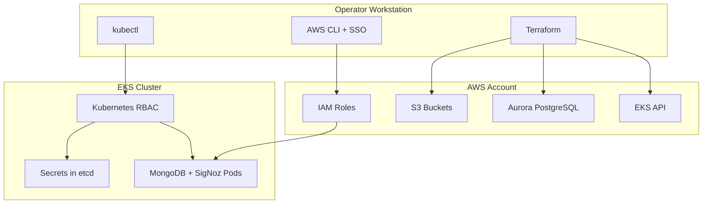
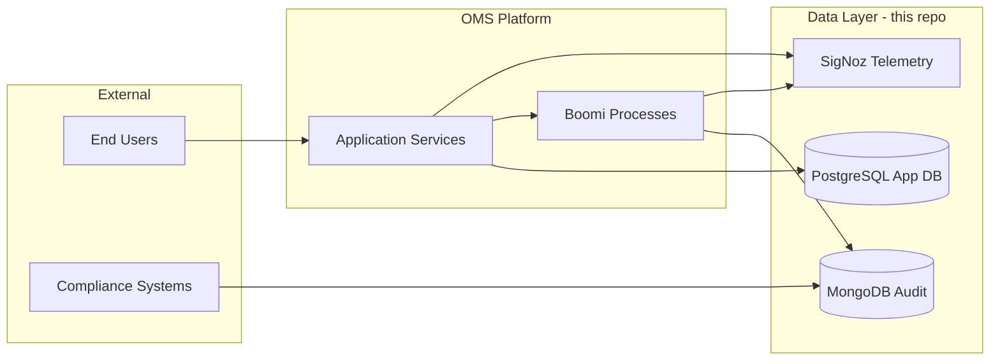

# Enterprise Architecture

Design decisions, security posture, compliance rationale, integration boundaries, and production roadmap.

**Who this is for:** Enterprise Architects who need full system understanding, risk awareness, and strategic context.

**Related docs:**
- [Component Catalog](../references/component-catalog.md) — all components with dependencies
- [Architect Reference](architect-reference.md) — infrastructure architecture and state model
- [Boomi Integration Guide](boomi-integration-guide.md) — application integration contract
- [Recovery Procedures](../references/recovery-procedures.md) — disaster recovery

## Executive Summary

- The OMS data layer intentionally separates concerns: MongoDB for immutable audit trail, PostgreSQL for transactional records, SigNoz for observability.
- Current environment is dev-leaning but production-aligned in structure; key remaining gaps are secrets lifecycle, network hardening, and automated operations.
- SigNoz admin bootstrap is automated (root-user env vars, no manual signup race); dashboards and alert rules for every monitored signal are also managed as code via Terraform. The Service Account/API key SigNoz's own design requires is also fully automated, via a headless-browser (Playwright) script invoked automatically on first run -- no manual UI interaction anywhere in the flow. See [Operator Runbook § Step 7A/7B](operator-runbook.md#step-7a-bootstrap-the-signoz-admin-account-automated-no-manual-signup).
- The target operating model is clear day-1 provisioning plus recurring day-2 verification and controlled change management.

If you only need reporting and governance context, start with:
1. [Per-Persona Access Requirements](#per-persona-access-requirements)
2. [Production Readiness Assessment](#production-readiness-assessment)
3. [Compliance And Governance](#compliance-and-governance)

---

## Design Rationale

### Why MongoDB for Audit Trail?

| Requirement | How MongoDB Satisfies It |
|---|---|
| Immutable append-only records | Capped collections + write-only application access pattern |
| Flexible schema | Document model accepts evolving audit event shapes without migrations |
| Nested data | `resource_changes`, `tpl_message`, `meta` are natural document structures |
| High write throughput | Replica set handles concurrent audit writes from multiple Boomi processes |
| Compliance queryability | Rich query language for filtering by time, action, resource, user |
| Encryption at rest | Percona's built-in encryption with customer-managed key |

### Why Aurora PostgreSQL for Application Data?

| Requirement | How Aurora Satisfies It |
|---|---|
| ACID transactions | Orders, inventory, payments need strong consistency |
| Relational integrity | Foreign keys enforce data relationships |
| Managed operations | Automated backups, patching, failover |
| Cost efficiency (dev) | Single provisioned writer; scales to multi-AZ in production |

### Why SigNoz for Telemetry?

| Requirement | How SigNoz Satisfies It |
|---|---|
| Unified observability | Traces + metrics + logs in one dashboard |
| Open-source | No enterprise license, no vendor lock-in |
| OTLP-native | Standard protocol — any OTLP-compatible source can send data |
| Correlation | `trace_id` links audit log writes to telemetry events |
| Self-hosted | Data stays within the cluster (compliance) |

### Why Separate Databases?

Audit trail (MongoDB) and application data (PostgreSQL) are intentionally separated:
- **Different access patterns:** Audit is append-heavy, rarely updated. Application data is transactional.
- **Different retention policies:** Audit logs may have regulatory retention requirements independent of application data lifecycle.
- **Blast radius isolation:** A problem in one does not cascade to the other.
- **Independent scaling:** Each can scale based on its own load profile.

---

## Security Posture

### Current Dev Posture

| Aspect | Current State | Production Direction |
|---|---|---|
| MongoDB credentials | Generated locally, stored in Kubernetes Secrets + local escrow | Secrets Manager with automatic rotation |
| PostgreSQL password | Manual in `terraform.tfvars`, stored in Terraform state | Secrets Manager-backed, no state exposure |
| Terraform state | S3 with versioning + encryption | Add DynamoDB locking + restricted IAM |
| MongoDB encryption | Customer-managed key (generated, escrowed locally) | KMS-managed key with audit trail |
| Network access | EKS public endpoint, SigNoz internal-only | Private endpoint + VPN/bastion |
| SigNoz dashboard | Port-forward (dev) | Ingress with SSO/OIDC + network restrictions |
| Backup bucket | Public access blocked, versioned, encrypted | Add lifecycle rules + cross-region replication |

### Data Sensitivity Map

| Data | Sensitivity | Location | Protection |
|---|---|---|---|
| Terraform state | **High** (contains PG password) | S3 `sml-oms-dev-tfstate` | Encryption, versioning, IAM |
| Local `terraform.tfvars` | **High** (contains PG password) | Operator workstation | Not committed, local only |
| Escrow files | **High** (encryption key + credentials) | Operator workstation | Mode 600, gitignored |
| MongoDB encryption key | **High** | Kubernetes Secret + escrow | Encrypted at rest in etcd |
| MongoDB user credentials | **High** | Kubernetes Secret + escrow | Encrypted at rest in etcd |
| Audit log content | **Medium** (business events) | MongoDB volumes (EBS) | Encrypted at rest (MongoDB + EBS) |
| IAM role/policy metadata | **Medium** | Terraform state + AWS | IAM audit trail |
| PostgreSQL endpoint | **Low** (non-public) | Terraform outputs | VPC-internal |

### Operational Safeguards

- Do not commit `terraform.tfvars` or escrow files
- Restrict backend bucket access to least privilege
- Treat Terraform state as sensitive data
- Rotate dev credentials in shared environments
- Monitor IAM role assumption via CloudTrail

---

## Credential Inventory

All credentials in the system and how to access them:

| Credential | Where Stored | Who Needs It | How to Get |
|---|---|---|---|
| AWS SSO login | AWS IAM Identity Center | All infra roles | `aws sso login --profile default` |
| MongoDB operator users (4) | K8s Secret `psmdb-secrets` + local escrow | Operators (bootstrap only) | `scripts/bootstrap-dev-secrets.sh` auto-creates |
| MongoDB encryption key | K8s Secret `psmdb-encryption-key` + escrow | Operators (bootstrap only) | `scripts/bootstrap-dev-secrets.sh` auto-creates |
| MongoDB audit-writer URI | K8s Secret `oms-audit-writer` | Boomi library (automatic) | `scripts/create-audit-writer-secret.sh` (one-time) |
| MongoDB audit reader | Created in MongoDB | Boomi Admin, Compliance | `scripts/create-audit-reader.sh` (one-time) |
| PostgreSQL master password | `terraform.tfvars` (local) + TF state | Operators (provision only) | Set manually in tfvars |
| SigNoz dashboard login | SigNoz internal DB | All who view telemetry | Root user auto-created at pod startup (`scripts/create-signoz-root-user-secret.sh`); Infra Architect/Admin then invites Editor/Viewer users |
| SigNoz ClickHouse (internal) | HelmRelease values | No one (internal only) | Chart value — **must change placeholder before production** |
| Terraform state | S3 bucket (encrypted) | Operators with S3 access | AWS IAM permissions |
| PBM S3 bucket | IAM role (Pod Identity) | MongoDB pods (automatic) | No manual credential needed |

### Per-Persona Access Requirements

| Persona | Needs Access To | Does NOT Need |
|---|---|---|
| **Infra Operator** | AWS SSO, kubectl, Terraform state, escrow files | MongoDB data, SigNoz dashboard |
| **Infra Architect** | Everything operator has + SigNoz admin + MongoDB userAdmin | Application data directly |
| **Boomi Admin** | SigNoz dashboard (Editor), MongoDB audit_reader (read-only) | AWS console, Terraform, kubectl |
| **Enterprise Architect** | SigNoz dashboard (Viewer), read access to all docs | Direct cluster access, write credentials |

First-time SigNoz admin bootstrap owner: **Infra Architect/Admin**. This avoids assigning permanent administrative control to integration or viewer personas.

For Enterprise Architects without operational duties, Viewer access is sufficient for telemetry review and governance reporting.

---

## Access And Permissions Model

### Required AWS Permissions

The identity running Terraform needs:
- IAM: create/manage roles and policies
- S3: create/manage buckets (PBM + state)
- EKS: read cluster info, manage addons and pod identity associations
- RDS: create/manage Aurora clusters
- EC2: manage security groups and VPC resources

### Required Kubernetes Permissions

- Namespace creation (`mongodb`)
- ServiceAccount creation
- Secret creation and reading (for bootstrap)
- CRD access (for workload apply)

### Trust Boundaries

---

## Cross-System Integration

### OMS System Context

### Integration Points

| From | To | Protocol | Data Flow |
|---|---|---|---|
| Boomi processes | MongoDB | MongoDB wire protocol (TLS) | Audit log writes |
| Boomi processes | SigNoz | OTLP/HTTP | Telemetry (logs, traces) |
| Application services | PostgreSQL | PostgreSQL wire protocol (TLS) | Transactional data |
| Application services | SigNoz | OTLP/HTTP | Telemetry (logs, traces) |
| Compliance team | MongoDB | MongoDB wire protocol (read-only) | Audit trail queries |
| Operators | SigNoz dashboard | HTTPS (ingress) | Observability |

---

## Production Readiness Assessment

### What's Dev-Only vs Production-Ready

| Aspect | Current (Dev) | Gap for Production |
|---|---|---|
| MongoDB replica count | 3 nodes | ✓ Production-ready |
| MongoDB encryption | Active with local key | Need KMS-managed key |
| MongoDB backup | PBM configured | Need verified restore procedure |
| PostgreSQL | Single writer, manual password | Need multi-AZ, Secrets Manager |
| SigNoz access | Port-forward | Need ingress + SSO/OIDC |
| Terraform state | S3 encrypted + versioned | Need DynamoDB locking |
| Network | Public EKS endpoint | Need private endpoint + VPN |
| Monitoring | Manual verification scripts | Need automated alerting |
| Credential rotation | Manual | Need automated rotation |
| DR/failover | Not tested | Need documented runbook + drill |

### Migration Path to Production

1. **Secrets management:** Move credentials to AWS Secrets Manager with rotation policies
2. **Network hardening:** Private EKS endpoint, VPN-only access, security group tightening
3. **State locking:** Add DynamoDB table for Terraform state locking
4. **Ingress:** Deploy ALB/NGINX ingress controller with SSO/OIDC for SigNoz
5. **Monitoring:** Add CloudWatch/Prometheus alerts for component health
6. **DR testing:** Document and drill restore procedures quarterly
7. **Multi-environment:** Parameterize for staging/prod with separate state keys

---

## Cost And Ownership Model

### Resource Ownership

| Resource | Owner Team | Cost Driver |
|---|---|---|
| EKS cluster | Platform team | Node count × instance type |
| MongoDB (EBS volumes) | Data team | 3 × 20Gi gp3 ($0.08/GB/month) |
| PostgreSQL (Aurora) | Data team | db.t4g.medium + storage |
| SigNoz (ClickHouse storage) | Platform team | PVC size × gp3 rate |
| S3 (state + backup) | Platform team | Storage + requests (minimal) |
| IAM roles | Platform team | Free (no direct cost) |

### Scaling Considerations

| If workload grows... | What changes | Who decides |
|---|---|---|
| Audit write rate increases | MongoDB node sizing or sharding | Infra Architect |
| Application data grows | Aurora scaling (instance class, read replicas) | Infra Architect |
| Telemetry volume grows | ClickHouse storage, retention policies | Platform team |
| More environments needed | Additional Terraform roots/state keys | Enterprise Architect |

---

## Compliance And Governance

### Audit Trail Requirements

- Audit records are append-only (application has write-only access)
- Records are encrypted at rest (MongoDB encryption + EBS encryption)
- Records include: who, what, when, where (user, action, time, IP)
- Retention: configurable per regulatory requirement (no automatic deletion in current posture)

### Change Management Rules

When changing Terraform behavior:
- Keep root/state contracts intact unless intentionally redesigning
- Update documentation in the same change
- Prefer additive defaults with explicit migration notes

When changing security-sensitive settings:
- Document threat/risk tradeoff
- Include rollback and verification steps in same change set

### Handoff To Central Platform Terraform

This repository keeps the reusable Terraform layer intentionally portable for later integration into a central platform Terraform monorepo. The reusable layer has:
- No provider lock-in (provider config is in roots only)
- No backend lock-in (backend config is in roots only)
- Clean module interface via `variables.tf` and `outputs.tf`

When the central platform team is ready to adopt:
1. Copy `platform-prerequisites/terraform/reusable/` as a module source
2. Wire provider and backend in the central repo's root
3. Import existing state from `sml-oms-dev-tfstate`
4. Decommission this repo's Terraform roots
