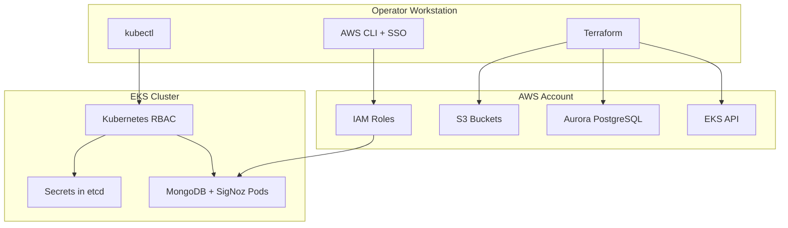
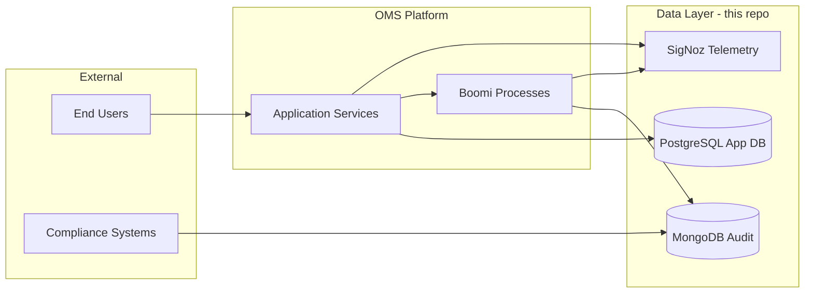

# Enterprise Architecture

Design decisions, security posture, compliance rationale, integration boundaries, and production roadmap.

**Who this is for:** Enterprise Architects who need full system understanding, risk awareness, and strategic context.

**Related docs:**
- [Audit Log Contract](../references/audit-log-contract.md) — canonical audit document semantics and producer rules
- [Glossary](../references/glossary.md) — jargon/acronym lookup
- [Component Catalog](../references/component-catalog.md) — all components with dependencies
- [Architect Reference](architect-reference.md) — infrastructure architecture and state model
- [Boomi Integration Guide](boomi-integration-guide.md) — application integration contract
- [Recovery Procedures](../references/recovery-procedures.md) — disaster recovery

## Executive Summary

- The OMS data layer intentionally separates concerns: MongoDB for immutable audit trail, PostgreSQL for transactional records, SigNoz for observability.
- Current environment is dev-leaning but production-aligned in structure; key remaining gaps are secrets lifecycle, network hardening, and automated operations.
- SigNoz admin bootstrap is automated (root-user env vars, no manual signup race); dashboards and alert rules for every monitored signal are also managed as code via Terraform. The Service Account/API key SigNoz's own design requires is also fully automated, via a headless-browser (Playwright) script invoked automatically on first run -- no manual UI interaction anywhere in the flow. See [Operator Runbook § Step 7A/7B](operator-runbook.md#step-7a-signoz-admin-account-bootstrap-automated-no-manual-signup).
- The target operating model is clear day-1 provisioning plus recurring day-2 verification and controlled change management.

If you only need reporting and governance context, start with:
1. [Per-Persona Access Requirements](#per-persona-access-requirements)
2. [Production Readiness Assessment](#production-readiness-assessment)
3. [Compliance And Governance](#compliance-and-governance)

---

## Design Rationale

### Why MongoDB for Audit Trail?

| Requirement | How MongoDB Satisfies It |
|---|---|
| Append-only audit records | Insert-only application behavior, restricted update/delete privileges, and governed administrative access |
| Controlled schema evolution | Fixed producer fields with module-owned data limited to `tpl_message.params` |
| Controlled module extension | `tpl_message.params` carries module-owned data within the fixed audit contract |
| High write throughput | Replica set handles concurrent audit writes from multiple Boomi processes |
| Compliance queryability | Rich query language for filtering by time, action, resource, user |
| Encryption at rest | Percona's built-in encryption with customer-managed key |

### Why Aurora PostgreSQL for Application Data?

| Requirement | How Aurora Satisfies It |
|---|---|
| ACID transactions | Orders, inventory, payments need strong consistency |
| Relational integrity | Foreign keys enforce data relationships |
| Managed operations | Automated backups, patching, failover |
| Cost efficiency (dev) | Single provisioned writer; scales to multi-AZ in production |

### Why SigNoz for Telemetry?

| Requirement | How SigNoz Satisfies It |
|---|---|
| Unified observability | Traces + metrics + logs in one dashboard |
| Open-source | No enterprise license, no vendor lock-in |
| OTLP-native | Standard protocol — any OTLP-compatible source can send data |
| Correlation | `trace_id` links audit log writes to telemetry events |
| Self-hosted | Data stays within the cluster (compliance) |

### Why Separate Databases?

Audit trail (MongoDB) and application data (PostgreSQL) are intentionally separated:
- **Different access patterns:** Audit is append-heavy, rarely updated. Application data is transactional.
- **Different retention policies:** Audit logs may have regulatory retention requirements independent of application data lifecycle.
- **Blast radius isolation:** A problem in one does not cascade to the other.
- **Independent scaling:** Each can scale based on its own load profile.

---

## Security Posture

### Current Dev Posture

| Aspect | Current State | Production Direction |
|---|---|---|
| MongoDB credentials | Generated locally, stored in Kubernetes Secrets + local escrow | **Prod only:** Secrets Manager with automatic rotation. Dev/SIT/UAT stay on K8s Secrets (cost-driven, see [Production Readiness Assessment](#production-readiness-assessment)). |
| PostgreSQL password | Manual in `terraform.tfvars`, stored in Terraform state | **Prod only:** Secrets Manager-backed, no state exposure. Dev/SIT/UAT unchanged. |
| Terraform state | S3 with versioning + encryption | S3 native locking (`use_lockfile = true`, Terraform >= 1.10) + restricted IAM \u2014 not DynamoDB, which this repo has already moved away from on 4 of 8 roots |
| MongoDB encryption | Customer-managed key (generated, escrowed locally) | KMS-managed key with audit trail (deferred, see Production Readiness Assessment) |
| Network access | EKS public endpoint, SigNoz internal-only | Private endpoint + VPN/bastion (deferred) |
| SigNoz dashboard | Port-forward (dev) | Ingress with SSO/OIDC + network restrictions (active backlog item) |
| Backup bucket | Public access blocked, versioned, encrypted | Add lifecycle rules + cross-region replication (active backlog item) |

### Data Sensitivity Map

| Data | Sensitivity | Location | Protection |
|---|---|---|---|
| Terraform state | **High** (contains PG password) | S3 `sml-oms-dev-tfstate` (one bucket, per-root state keys -- see [Component Catalog § Terraform S3 State Backend](../references/component-catalog.md#terraform-s3-state-backend) for the exact key per root) | Encryption, versioning, IAM |
| Local `terraform.tfvars` | **High** (contains PG password) | Operator workstation | Not committed, local only |
| Escrow files | **High** (encryption key + credentials) | Operator workstation | Mode 600, gitignored |
| MongoDB encryption key | **High** | Kubernetes Secret + escrow | Encrypted at rest in etcd |
| MongoDB user credentials | **High** | Kubernetes Secret + escrow | Encrypted at rest in etcd |
| Audit log content | **Medium** (business events) | MongoDB volumes (EBS) | Encrypted at rest (MongoDB + EBS) |
| IAM role/policy metadata | **Medium** | Terraform state + AWS | IAM audit trail |
| PostgreSQL endpoint | **Low** (non-public) | Terraform outputs | VPC-internal |

### Operational Safeguards

- Do not commit `terraform.tfvars` or escrow files
- Restrict backend bucket access to least privilege
- Treat Terraform state as sensitive data
- Rotate dev credentials in shared environments
- Monitor IAM role assumption via CloudTrail

---

## Credential Inventory

All credentials in the system and how to access them:

| Credential | Where Stored | Who Needs It | How to Get |
|---|---|---|---|
| AWS SSO login | AWS IAM Identity Center | All infra roles | `aws sso login --profile default` |
| MongoDB operator users (4) | K8s Secret `psmdb-secrets` + local escrow | Operators (bootstrap only) | `scripts/bootstrap-dev-secrets.sh` auto-creates |
| MongoDB encryption key | K8s Secret `psmdb-encryption-key` + escrow | Operators (bootstrap only) | `scripts/bootstrap-dev-secrets.sh` auto-creates |
| MongoDB audit-writer URI | K8s Secret `oms-audit-writer` | Boomi library (automatic) | `scripts/create-audit-writer-secret.sh` (one-time) |
| MongoDB audit reader | Created in MongoDB | Boomi Admin, Compliance | `scripts/create-audit-reader.sh` (one-time) |
| PostgreSQL master password | `terraform.tfvars` (local) + TF state | Operators (provision only) | Set manually in tfvars |
| SigNoz dashboard login | SigNoz internal DB | All who view telemetry | Root user auto-created at pod startup (`scripts/create-signoz-root-user-secret.sh`); Infra Architect/Admin then invites Editor/Viewer users |
| SigNoz ClickHouse (internal) | HelmRelease values | No one (internal only) | Chart value — **must change placeholder before production** |
| Terraform state | S3 bucket (encrypted) | Operators with S3 access | AWS IAM permissions |
| PBM S3 bucket | IAM role (Pod Identity) | MongoDB pods (automatic) | No manual credential needed |

### Per-Persona Access Requirements

| Persona | Needs Access To | Does NOT Need |
|---|---|---|
| **Infra Operator** | AWS SSO, kubectl, Terraform state, escrow files | MongoDB data, SigNoz dashboard |
| **Infra Architect** | Everything operator has + SigNoz admin + MongoDB userAdmin | Application data directly |
| **Boomi Admin** | SigNoz dashboard (Editor), MongoDB audit_reader (read-only) | AWS console, Terraform, kubectl |
| **Enterprise Architect** | SigNoz dashboard (Viewer), read access to all docs | Direct cluster access, write credentials |

First-time SigNoz admin bootstrap owner: **Infra Architect/Admin**. This avoids assigning permanent administrative control to integration or viewer personas.

For Enterprise Architects without operational duties, Viewer access is sufficient for telemetry review and governance reporting.

---

## Access And Permissions Model

### Required AWS Permissions

The identity running Terraform needs:
- IAM: create/manage roles and policies
- S3: create/manage buckets (PBM + state)
- EKS: read cluster info, manage addons and pod identity associations
- RDS: create/manage Aurora clusters
- EC2: manage security groups and VPC resources

### Required Kubernetes Permissions

- Namespace creation (`mongodb`)
- ServiceAccount creation
- Secret creation and reading (for bootstrap)
- CRD access (for workload apply)

### Trust Boundaries

```mermaid
flowchart TD
  subgraph operator[Operator Workstation]
    AWSCLI[AWS CLI + SSO]
    KUBECTL[kubectl]
    TF[Terraform]
  end

  subgraph aws[AWS Account]
    IAM[IAM Roles]
    S3[S3 Buckets]
    RDS[Aurora PostgreSQL]
    EKS_API[EKS API]
  end

  subgraph eks[EKS Cluster]
    RBAC[Kubernetes RBAC]
    SECRETS[Secrets in etcd]
    WORKLOADS[MongoDB + SigNoz Pods]
  end

  AWSCLI --> IAM
  TF --> S3
  TF --> RDS
  TF --> EKS_API
  KUBECTL --> RBAC
  RBAC --> SECRETS
  RBAC --> WORKLOADS
  IAM --> WORKLOADS
```

---

## Cross-System Integration

### OMS System Context

```mermaid
flowchart LR
  subgraph oms[OMS Platform]
    BOOMI[Boomi Processes]
    APP[Application Services]
  end

  subgraph data_layer[Data Layer - this repo]
    MONGO[(MongoDB Audit)]
    PG[(PostgreSQL App DB)]
    SIGNOZ[SigNoz Telemetry]
  end

  subgraph external[External]
    USERS[End Users]
    COMPLIANCE[Compliance Systems]
  end

  USERS --> APP
  APP --> PG
  APP --> BOOMI
  BOOMI --> MONGO
  BOOMI --> SIGNOZ
  APP --> SIGNOZ
  COMPLIANCE --> MONGO
```

### Integration Points

| From | To | Protocol | Data Flow |
|---|---|---|---|
| Boomi processes | MongoDB | MongoDB wire protocol (TLS) | Audit log writes |
| Boomi processes | SigNoz | OTLP/HTTP | Telemetry (logs, traces) |
| Application services | PostgreSQL | PostgreSQL wire protocol (TLS) | Transactional data |
| Application services | SigNoz | OTLP/HTTP | Telemetry (logs, traces) |
| Compliance team | MongoDB | MongoDB wire protocol (read-only) | Audit trail queries |
| Operators | SigNoz dashboard | HTTPS (ingress) | Observability |

---

## Production Readiness Assessment

Reprioritized 2026-08-02 against actual cost/risk tradeoffs. Two tracks:
**Now** (active backlog) and **Later** (intentionally deferred, tracked here
so it isn't lost). Items are cross-referenced with
[Audit Enforcement Gaps](#audit-enforcement-gaps-target-state) where they overlap.

### Now

| Item | Current State | Target | Why now |
|---|---|---|---|
| Terraform state locking | 4 of 8 roots (`access-governance`, `eks-access`, `eks-platform`, `workload-identity`) already use Terraform's native S3 conditional-write locking (`use_lockfile = true`, requires Terraform >= 1.10 — DynamoDB-based locking is the now-superseded approach). Not yet applied to `mongodb`, `postgresql`, `signoz-observability` (all already >= 1.10) or `dr-drill` (pinned to >= 1.5.0). | Enable `use_lockfile = true` on the remaining 3 roots; bump `dr-drill/versions.tf` to `>= 1.10.0` first. No DynamoDB table anywhere. | Closes the last gap in a pattern already adopted elsewhere in this repo; no new infra to provision. |
| Backup bucket hardening | Public access blocked, versioned, encrypted; no lifecycle rules or cross-region replication | Add lifecycle rules (transition/expire) + cross-region replication | Backup integrity is a standing risk — prioritized ahead of convenience items |
| SigNoz ingress | Port-forward only | ALB/NGINX ingress + SSO/OIDC | Approved; unblocks dashboard access beyond operators |
| Aurora Multi-AZ | Single-AZ everywhere Aurora is used (UAT today; Prod not yet provisioned) | **Prod only** → multi-AZ Aurora. UAT stays single-AZ to cut cost. Dev/SIT don't use Aurora at all (self-managed CNPG) — not applicable. | Cost-driven: only prod needs the failover guarantee, contingent on backups already being in place |
| DR restore documentation | CNPG (Dev/SIT) and MongoDB PBM restore steps exist in [Recovery Procedures](../references/recovery-procedures.md), not yet consolidated into one drill runbook | Consolidate/complete restore documentation for both engines | Documentation is cheap and high-value; actually *running* the drill on a cadence is deferred (see Later) |
| Multi-environment parameterization | Dev/UAT/Prod partially parameterized (see [Per-Environment Feature Map](#per-environment-feature-map)); SIT not yet provisioned | Full parameterization across dev/sit/uat/prod state keys and tfvars, ready for SIT once its AWS account exists | Blocks nothing else on this list; needed before further per-environment hardening |
| Insert-only MongoDB writer role | Audit-writer secret currently uses the same db-admin identity as operators | Create a **new, additional** MongoDB role scoped to `insert`-only on `oms_audit.auditlogs`, used only by the Boomi audit-writer secret. **The existing db-admin/userAdmin identity is untouched and keeps full rights** — this only narrows the one identity embedded in the Boomi-facing secret, it does not restrict administrators. | Closes an audit-integrity gap without reducing operator capability |
| Secrets Manager | K8s Secrets + local escrow everywhere | **Prod only.** Dev/SIT/UAT remain on K8s Secrets — Secrets Manager has a per-secret + API-call cost not justified pre-prod. | Cost-driven; prod is the only environment where the compliance/rotation benefit outweighs the spend |

### Later (deferred, tracked not forgotten)

| Item | Note |
|---|---|
| Network hardening (private EKS endpoint + VPN/bastion) | Revisit after Now items land |
| Automated CloudWatch/Prometheus alerting | Manual verification scripts remain sufficient for now |
| DR drill *execution* (quarterly cadence) | Documentation is Now; scheduling/running the drill is deferred |
| MongoDB encryption → KMS-managed key | Local escrowed key remains acceptable pre-prod |
| Tamper evidence (signed digest / hash-chain sealing) | See [Audit Enforcement Gaps](#audit-enforcement-gaps-target-state) |
| Trusted recorded-at (NTP/chrony enforcement, clock-skew alerting) | See [Audit Enforcement Gaps](#audit-enforcement-gaps-target-state) |
| Payload lifecycle coupling | See [Audit Enforcement Gaps](#audit-enforcement-gaps-target-state) — clarified below |
| Break-glass payload access service | See [Audit Enforcement Gaps](#audit-enforcement-gaps-target-state) |
| Retention & legal hold (local download-and-purge, not S3 archival) | See [Audit Enforcement Gaps](#audit-enforcement-gaps-target-state) — decided 2026-08-02, needs its own design pass before implementation |

### Per-Environment Feature Map

| Aspect | Dev | SIT | UAT | Prod |
|---|---|---|---|---|
| Status | Implemented | **Deferred** — requires a new AWS account that does not exist yet | Implemented | Target account currently running Sandbox; becomes Prod after Sandbox is torn down |
| AWS Account | `815402439714` | TBD (not provisioned) | `672172129937` | `632674123947` |
| PostgreSQL engine | CNPG (self-managed, in-cluster) | CNPG (self-managed, in-cluster) — planned | Aurora (managed) | Aurora (managed) |
| Aurora Multi-AZ | N/A (not Aurora) | N/A (not Aurora) | Single-AZ (cost) | Multi-AZ (Now item above) |
| Secrets storage | K8s Secrets + local escrow | K8s Secrets + local escrow (planned) | K8s Secrets + local escrow | AWS Secrets Manager (Now item above) |
| MongoDB encryption key | Local escrowed key | Local escrowed key (planned) | Local escrowed key | Local escrowed key (KMS migration is Later) |
| SigNoz access | Port-forward today → ingress+SSO (Now) | Port-forward (planned) | Port-forward today → ingress+SSO (Now) | Port-forward today → ingress+SSO (Now) |
| Network exposure | Public EKS endpoint | Public EKS endpoint (planned) | Public EKS endpoint | Public EKS endpoint (private endpoint/VPN is Later, all envs) |

This table exists to keep environment-specific decisions (like "multi-AZ only
in prod" or "Secrets Manager only in prod") from getting lost in prose —
update it whenever a Now/Later item lands or an environment's scope changes.

---

## Cost And Ownership Model

### Resource Ownership

| Resource | Owner Team | Cost Driver |
|---|---|---|
| EKS cluster | Platform team | Node count × instance type |
| MongoDB (EBS volumes) | Data team | 3 × 20Gi gp3 ($0.08/GB/month) |
| PostgreSQL (Aurora) | Data team | db.t4g.medium + storage |
| SigNoz (ClickHouse storage) | Platform team | PVC size × gp3 rate |
| S3 (state + backup) | Platform team | Storage + requests (minimal) |
| IAM roles | Platform team | Free (no direct cost) |

### Scaling Considerations

| If workload grows... | What changes | Who decides |
|---|---|---|
| Audit write rate increases | MongoDB node sizing or sharding | Infra Architect |
| Application data grows | Aurora scaling (instance class, read replicas) | Infra Architect |
| Telemetry volume grows | ClickHouse storage, retention policies | Platform team |
| More environments needed | Additional Terraform roots/state keys | Enterprise Architect |

---

## Compliance And Governance

The record-level shape and producer rules are defined in the
[Audit Log Contract](../references/audit-log-contract.md). This section owns the
operational guarantees that contract depends on.

### Audit Trail Requirements

- Audit records are append-only (application has write-only access)
- Records are encrypted at rest (MongoDB encryption + EBS encryption)
- Records include: who, what, when, where (user, action, time, IP)
- Retention: configurable per regulatory requirement (no automatic deletion in current posture)

### Audit Enforcement Gaps (Target State)

These are required for a defensible audit trail and are **not yet enforced**;
the contract's Conformance Status table points here. Priority column added
2026-08-02 (see [Production Readiness Assessment](#production-readiness-assessment)
for the full Now/Later backlog this feeds into).

| Gap | Priority | Current state | Target |
|---|---|---|---|
| **Insert-only writer role** | **Now** | The audit-writer secret uses a database-admin identity that can update/delete (`scripts/create-audit-writer-secret.sh`). "Immutable" is convention, not enforced. | Add a **new**, narrower MongoDB role granting only `insert` on `oms_audit.auditlogs`, used solely by the audit-writer secret; `update`/`remove`/`dropCollection`/index admin denied for that identity only. **Existing db-admin/userAdmin identities are unaffected and keep full rights** — this change only swaps which identity the Boomi-facing secret uses. Read-back for tests uses a separate identity. |
| **Tamper evidence** | Later | RBAC only; a privileged admin could alter history undetectably. | Periodic signed digest / hash-chain sealing so admin-side mutation is detectable independent of RBAC. |
| **Trusted recorded-at** | Later | `time` is caller-supplied; even the ObjectId timestamp is client-generated, so backdating is undetectable. | Treat `_id` generation time as de-facto recorded-at for drift forensics; enforce NTP/chrony on producers and alert on clock skew beyond tolerance. |
| **Payload lifecycle** | Later | `std.payload_uri` objects have no coupled lifecycle. Concretely: some audit records reference a large payload stored outside MongoDB (e.g. an S3 object) instead of embedding it; nothing today keeps that external object's lifetime in sync with the audit record's own retention. | Offloaded-object storage lifetime ≥ audit retention; store `std.payload_sha256` for integrity/404 detection; delete the object in coordination with its audit row so no orphaned payload outlives its index. |
| **Right-to-be-forgotten** | **N/A** | Decided 2026-08-02: this is a B2B platform, not a consumer-facing service — `user_id`/`ip` identify the individual (client-company employee or internal operator) who performed an action, and retaining that identity is the explicit *purpose* of the audit trail (attributing responsibility when something goes wrong), not incidental PII collection. | **Not applicable, by design — do not build RTBF.** Erasing `who`/`ip` from an audit record would defeat the record's own reason for existing. No pseudonymization or erasable-identity-mapping work is planned. If a future contractual/regulatory obligation ever requires erasure for a specific individual, that will need a dedicated design at that time — this decision covers the current B2B scope only, not a hypothetical future consumer-facing use case. |
| **Break-glass payload access** | Later | Ad-hoc; SRE may lack access mid-incident. | An audited retrieval service resolving `std.payload_uri` behind JIT access, MFA, incident/ticket reason, RBAC by data class, masked-by-default preview, and immutable access logging — not direct bucket/KMS grants. |
| **Retention & legal hold** | Later | No automatic deletion; no archive tier. **This is about the MongoDB audit collection's own long-term archive — it has no relationship to Aurora's backup mechanism**, which is a separate, already-in-place operational recovery concern (RTO/RPO for the application database, not audit-trail legal retention). | **Decided 2026-08-02: local download-and-purge, not S3 archival.** Multi-year continuous S3 storage (even Glacier Deep Archive) costs more over the retention horizon this system expects than a one-time export to an operator-controlled local/offline copy, followed by removing the aged-out records from the live MongoDB collection to cap its growth. **Accepted trade-off:** this gives up S3 Object Lock's cloud-native WORM/tamper-evidence guarantee — the exported copy's integrity depends on operator handling, not object storage immutability. Not yet designed: export trigger (age threshold/manual), export format/encryption, custody/access control for the offline copy, and the exact purge-after-export sequencing — needs its own brainstorming pass before implementation (tracked as future work, still Later priority). Do **not** use a TTL index (the string `time` field is TTL-incompatible and TTL deletion can breach legal hold). |

### Change Management Rules

When changing Terraform behavior:
- Keep root/state contracts intact unless intentionally redesigning
- Update documentation in the same change
- Prefer additive defaults with explicit migration notes

When changing security-sensitive settings:
- Document threat/risk tradeoff
- Include rollback and verification steps in same change set

### Handoff To Central Platform Terraform

This repository keeps the reusable Terraform layer intentionally portable for later integration into a central platform Terraform monorepo. The reusable layer has:
- No provider lock-in (provider config is in roots only)
- No backend lock-in (backend config is in roots only)
- Clean module interface via `variables.tf` and `outputs.tf`

When the central platform team is ready to adopt:
1. Copy `platform-prerequisites/terraform/reusable/` as a module source
2. Wire provider and backend in the central repo's root
3. Import existing state from `sml-oms-dev-tfstate`
4. Decommission this repo's Terraform roots
