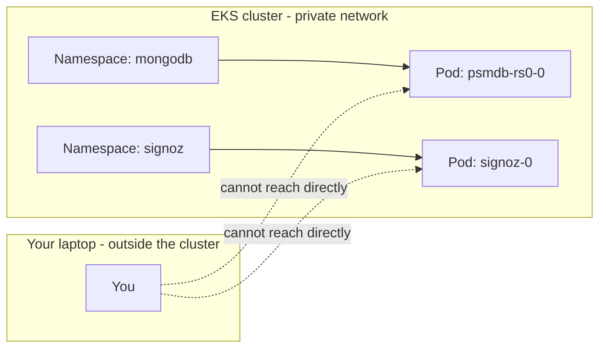
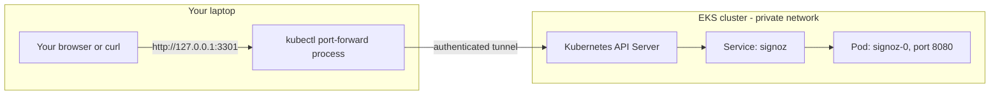

# Environment Setup Guide

Complete this guide once per workstation before running any provisioning commands.

**Who this is for:** All personas (Infra Operator, Infra Architect, Boomi Admin, Enterprise Architect).

**Typical effort:**
- Infra Operator / Infra Architect: 45-90 minutes on a fresh workstation
- Boomi Admin (local harness use): 30-60 minutes
- Viewer-only report consumer: 10-20 minutes (SSO + dashboard access only)

**Access needed before you start:**
- Internet access to AWS endpoints
- Local admin rights to install tools
- AWS SSO start URL and assigned permission set

**Related docs:**
- After setup, operators proceed to the [Operator Runbook](operator-runbook.md)
- Boomi admins proceed to the [Boomi Integration Guide](boomi-integration-guide.md)
- Full component context in the [Component Catalog](../references/component-catalog.md)

## Persona-Specific Setup Paths

Use the smallest setup path that matches your role. The "Why" column explains
why your role needs (or doesn't need) each piece — so you're not just
following steps blindly.

| Persona | What You Need To Do | Why |
|---|---|---|
| Infra Operator | Complete this full guide | You run Terraform and kubectl directly to provision/destroy infrastructure — you need every tool this guide installs. |
| Infra Architect | Complete this full guide | You review and modify the same Terraform/Kubernetes definitions the Operator applies, and need to reproduce/validate changes locally before they're rolled out. |
| Boomi Admin (integration development) | AWS SSO + required tools + optional Groovy + optional kubectl (if local testing) | You call the audit-log library and read telemetry — you don't provision infrastructure, so Terraform/kustomize aren't needed. Groovy/kubectl are only needed if you run the test harness locally instead of relying on an Operator-provisioned environment. |
| Enterprise Architect / report viewer | AWS SSO login + SigNoz dashboard access only (tool installation not required) | Your job is reviewing telemetry/compliance reports and design posture, not changing infrastructure — no CLI tooling touches production state on your behalf. |

If you are only reviewing telemetry reports, skip Terraform and kubectl sections.

---

## Core Concepts (Read Before You Run Any Command)

If you have never worked with Kubernetes, AWS, or Terraform before, read this
section first. It explains the "what" and "why" behind terms this repo's docs
and scripts use constantly (`kubectl`, `port-forward`, `Secret`, `Terraform
state`) — so commands stop looking like magic incantations you copy blindly.
If you already know these terms, skip ahead to [Prerequisites Checklist](#prerequisites-checklist).

### The Cluster Is A Private Network You Are Not Automatically Inside Of

This repository provisions software that runs inside an **EKS cluster** — a
managed Kubernetes cluster in AWS. Kubernetes runs your applications inside
**Pods** (the smallest running unit — think "one running instance of a
program"), grouped into **Namespaces** (logical folders, like `mongodb` or
`signoz`, that keep one application's resources separate from another's).

Your laptop is not automatically part of this private network. By design,
you cannot open a browser and type a Pod's internal address directly — the
cluster's internal network is isolated from the public internet as a
security boundary. Every tool and technique described below exists to solve
one problem: **how do I, sitting outside the cluster, safely reach something
running inside it?**



### `kubectl`: Your Remote Control For The Cluster

`kubectl` is the command-line tool that talks to the cluster's API server on
your behalf, using your AWS/Kubernetes identity. Every `kubectl ...` command
you see in this repo's scripts is asking the cluster to do something (create
a resource, read a Secret, open a tunnel) — it does not run anything on your
laptop except the `kubectl` process itself.

### Port-Forwarding: A Temporary, Personal Tunnel Into The Cluster

**What it is:** `kubectl port-forward` opens a port on your own laptop (for
example `127.0.0.1:3301`) and relays any traffic sent to it, through the
cluster's API server, into a specific Pod's port inside the cluster (for
example the SigNoz Pod's port `8080`).

**Why we need it:** In dev, we don't want to stand up a permanent public URL
(an Ingress protected by SSO) just so one operator can glance at a
dashboard. Port-forward gives you a private, temporary, zero-infrastructure
way to reach one internal service for as long as the command keeps running —
nothing is exposed to anyone else, and closing the terminal (or `Ctrl+C`)
closes the tunnel immediately.

**How it works:**



1. You run: `kubectl -n signoz port-forward svc/signoz 3301:8080`.
2. `kubectl` opens `127.0.0.1:3301` on your laptop and keeps running in your
   terminal — this is a foreground tunnel, not a background service, so the
   terminal must stay open for as long as you need access.
3. Anything you send to `http://127.0.0.1:3301` (for example, opening it in a
   browser) is relayed through the API server into the SigNoz Pod's port
   `8080`.
4. Stop the tunnel any time with `Ctrl+C` — nothing was ever made public, so
   there is nothing to clean up afterward.

**When to use it vs. the alternative:**

| Situation | Use | Why |
|---|---|---|
| Local dev, one person, temporary | Port-forward (`scripts/open-signoz-ui.sh`) | No infrastructure to set up or tear down; automatically private to you |
| Shared/production, many users, permanent | Ingress (`scripts/open-signoz-ui.sh --mode ingress`) | Gives a real, stable URL protected by SSO/OIDC; no terminal needs to stay open |

### Secrets: Where Passwords And Keys Actually Live

A Kubernetes **Secret** is a small piece of cluster-stored data (a password,
API key, or connection string) that Pods can read without that value ever
being written into a YAML file you edit by hand. Scripts in this repo (for
example `scripts/bootstrap-dev-secrets.sh`) create these Secrets so you
rarely handle raw passwords yourself — when you do need one (to log in
somewhere), you read it back with a command like:

```bash
kubectl -n signoz get secret signoz-root-user -o jsonpath='{.data.password}' | base64 -d
```

### Terraform State: Why We Never Run `terraform apply` By Hand Here

**Terraform** is the tool that creates real AWS resources (S3 buckets, IAM
roles, the Aurora database) from code. Every time it runs, it needs to know
what it already created — that record is the **Terraform state**, stored in
an S3 bucket (`sml-oms-dev-tfstate`) rather than on your laptop, so any
operator can pick up from the same shared state. This repo's wrapper scripts
(`scripts/provision.sh`, `scripts/provision-platform-prereq.sh`) always point
Terraform at the correct state file for you — this is why the runbooks tell
you to use those scripts instead of running bare `terraform apply` yourself.

---

## Prerequisites Checklist

Before starting, get these values from the platform or AWS account owner:

| Value | Why You Need It |
|---|---|
| AWS SSO start URL | Used by `aws configure sso` to create a login profile |
| AWS SSO region | Region where IAM Identity Center is configured (may differ from workload region) |
| AWS account ID | Confirms you are logged into the intended account |
| AWS SSO permission set/role | Determines what Terraform and kubectl can do |
| Workload AWS region | Used by Terraform providers and AWS CLI (`ap-east-1` for OMS dev) |
| EKS cluster name | Used by `aws eks update-kubeconfig` (`EKS-boomi-runtime-cluster` for OMS dev) |
| VPC ID and private subnet IDs | Required for Aurora PostgreSQL networking (pg scope only) |
| Remote state bucket name | Required for shared Terraform state (`sml-oms-dev-tfstate` for OMS dev) |

## Install Required Tools

### Required Commands

| Tool | Purpose | Minimum Version |
|---|---|---|
| `aws` | AWS CLI for SSO auth, EKS, S3, IAM operations | v2.x |
| `tfenv` + `terraform` | Terraform version management + provisioning | tfenv latest; TF pinned via `.terraform-version` |
| `kubectl` | Kubernetes cluster operations | within ±1 of server (currently: v1.34–v1.36) |
| `kustomize` | Manifest rendering and overlays | v5.x |
| `rg` (ripgrep) | Fast text search for validation scripts | any |
| `openssl` | Secret generation (random bytes, base64) | any |
| `python3` | URL-encodes passwords in `scripts/create-audit-writer-secret.sh` (required for Day-1 MongoDB setup) | v3.8+ |
| `helm` | Only for platform admin bootstrap mode | v3.x |
| `groovy` | Only for Boomi audit log library testing | v4.x |
| `playwright` (Python package) | Only for the SigNoz Service Account/API key bootstrap (`scripts/bootstrap-signoz-service-account.sh`) -- drives a headless browser so no manual UI step is needed | v1.x |

> **Note:** `python3` is required, not optional — `scripts/create-audit-writer-secret.sh` fails without it. It is not covered by `scripts/verify-platform-health.sh --preflight`, so verify it manually with `python3 --version` on every platform.

> **Note:** `playwright` is only needed by whoever runs `scripts/provision.sh signoz-observability` for the first time in an environment (typically the Infra Operator/Architect) -- install it once with:
> ```bash
> python3 -m pip install playwright
> python3 -m playwright install chromium
> ```

### Terraform Version Management (tfenv)

This repo uses [tfenv](https://github.com/tfutils/tfenv) for Terraform version management. The file `.terraform-version` in the repo root pins the exact version (currently `1.15.7`).

**Why tfenv?** Different projects may need different Terraform versions. tfenv auto-switches when you `cd` into this repo.

Install tfenv first, then Terraform is managed automatically:

```bash
# macOS
brew install tfenv

# Linux
git clone https://github.com/tfutils/tfenv.git ~/.tfenv
echo 'export PATH="$HOME/.tfenv/bin:$PATH"' >> ~/.bashrc

# Then install the pinned version (reads .terraform-version automatically)
tfenv install
tfenv use
terraform version   # should show 1.15.7
```

If you prefer not to use tfenv, install Terraform `1.15.7` directly — but you are responsible for version alignment.

### macOS

> **Homebrew prerequisite:** these commands assume Homebrew is already installed. On a fresh Mac, install it first:
> ```bash
> /bin/bash -c "$(curl -fsSL https://raw.githubusercontent.com/Homebrew/install/HEAD/install.sh)"
> ```

```bash
# tfenv + terraform: already covered by "Terraform Version Management (tfenv)" above
#   brew install tfenv && tfenv install && tfenv use
brew install awscli kubectl kustomize ripgrep openssl python3
# Optional (platform admin): brew install helm
# Optional (Boomi admin): brew install groovy
```

> macOS no longer ships `python3` by default (Xcode Command Line Tools only provide a stub that prompts an install). `brew install python3` guarantees it is present.

### Ubuntu/Debian

```bash
# Base packages (includes python3, which ships by default on Ubuntu but is listed
# explicitly since minimal/container base images may omit it)
sudo apt-get update
sudo apt-get install -y curl wget unzip gnupg lsb-release ca-certificates ripgrep openssl python3

# AWS CLI v2
curl "https://awscli.amazonaws.com/awscli-exe-linux-x86_64.zip" -o "awscliv2.zip"
unzip awscliv2.zip && sudo ./aws/install && rm -rf aws awscliv2.zip

# Terraform: do NOT install via apt here — it installs the latest version and
# bypasses the tfenv version pinning described above. Instead, follow
# "Terraform Version Management (tfenv)" above:
#   git clone https://github.com/tfutils/tfenv.git ~/.tfenv
#   echo 'export PATH="$HOME/.tfenv/bin:$PATH"' >> ~/.bashrc && source ~/.bashrc
#   tfenv install && tfenv use

# kubectl
sudo install -d -m 0755 /etc/apt/keyrings
curl -fsSL https://pkgs.k8s.io/core:/stable:/v1.30/deb/Release.key | sudo gpg --dearmor -o /etc/apt/keyrings/kubernetes-apt-keyring.gpg
echo 'deb [signed-by=/etc/apt/keyrings/kubernetes-apt-keyring.gpg] https://pkgs.k8s.io/core:/stable:/v1.30/deb/ /' | sudo tee /etc/apt/sources.list.d/kubernetes.list
sudo apt-get update && sudo apt-get install -y kubectl

# kustomize
curl -s "https://raw.githubusercontent.com/kubernetes-sigs/kustomize/master/hack/install_kustomize.sh" | bash
sudo mv kustomize /usr/local/bin/kustomize

# Optional (platform admin): helm
curl https://raw.githubusercontent.com/helm/helm/main/scripts/get-helm-3 | bash

# Optional (Boomi admin): groovy, via SDKMAN (apt does not carry a current groovy package)
curl -s "https://get.sdkman.io" | bash
source "$HOME/.sdkman/bin/sdkman-init.sh"
sdk install groovy
```

### Windows

> **tfenv note:** tfenv is a bash tool and has no native Windows build. Either run the setup inside WSL2 (Ubuntu) and follow the Ubuntu/Debian instructions above, or pin the exact Terraform version manually on native Windows (see below) instead of installing an unpinned "latest" version.

Using `winget`:

```powershell
winget install --id Amazon.AWSCLI -e
winget install --id Hashicorp.Terraform -e   # installs latest; pin manually, see note below
winget install --id Kubernetes.kubectl -e
winget install --id Kubernetes.kustomize -e
winget install --id BurntSushi.ripgrep.MSVC -e
winget install --id ShiningLight.OpenSSL.Light -e
winget install --id Python.Python.3.12 -e
# Optional (platform admin):
winget install --id Helm.Helm -e
# Optional (Boomi admin) — groovy has no winget package; install via SDKMAN in WSL2,
# or download the Groovy Windows installer from https://groovy.apache.org/download.html
```

To pin Terraform to `1.15.7` on native Windows instead of the winget "latest" package:

```powershell
choco install terraform --version=1.15.7 -y
terraform version   # should show 1.15.7
```

Using Chocolatey:

> **Chocolatey prerequisite:** unlike winget, Chocolatey does not ship with Windows. Install it first (in an elevated PowerShell prompt) — see the [official install docs](https://chocolatey.org/install) — or use the winget path above instead.

```powershell
choco install awscli terraform --version=1.15.7 kubernetes-cli kustomize ripgrep openssl python3 -y
# Optional (platform admin):
choco install kubernetes-helm -y
```

### Verify Installation

```bash
command -v aws terraform kubectl kustomize rg openssl python3
terraform version
aws --version
kubectl version --client
python3 --version
```

On Windows PowerShell:

```powershell
Get-Command aws, terraform, kubectl, kustomize, rg, openssl, python
terraform version
aws --version
kubectl version --client
python --version
```

## Configure AWS CLI With SSO

AWS SSO (IAM Identity Center) is your centralized login. You authenticate once in a browser and then CLI tools use temporary credentials instead of long-lived access keys.

This repository uses AWS SSO session `oms-dev`.

Configured accounts/profiles:
- Account `815402439714` (OMS dev): profile `default` and `AdministratorAccess-815402439714`
- Account `307506882994`: profile `AdministratorAccess-307506882994`

### Quick Setup (OMS dev account)

```bash
aws sso login --profile default
export AWS_PROFILE=default
export AWS_REGION=ap-east-1
aws sts get-caller-identity
```

Expected result: account `815402439714`, role `AdministratorAccess`, region `ap-east-1`.

### First-Time Profile Creation

If SSO profile is missing on a new workstation:

```bash
aws configure sso --profile default
```

The prompt asks for: SSO start URL, SSO region, AWS account, permission set/role, default workload region, output format (`json`).

Then login and export:

```bash
aws sso login --profile default
export AWS_PROFILE=default
export AWS_REGION=ap-east-1
```

On Windows PowerShell:

```powershell
$env:AWS_PROFILE = "default"
$env:AWS_REGION = "ap-east-1"
```

### Verify AWS Access

```bash
aws sts get-caller-identity
aws configure get region
```

### Available Profiles

```bash
aws configure list-profiles
cat ~/.aws/config
```

On Windows PowerShell:

```powershell
aws configure list-profiles
Get-Content "$env:USERPROFILE\.aws\config"
```

## UAT Workforce Access Prerequisite

This section is the workstation handoff for the UAT access foundation. It does
not replace the existing dev setup above or authorize changes to dev.

The workflow may mutate only UAT account `672172129937` in `ap-east-1`, for
cluster `EKS-boomi-runtime-cluster` and namespace `boomi-uat`. Dev account
`815402439714` is evidence/read-only and must not be mutated by this workflow.
No other AWS account may be accessed.

The UAT access-foundation roots require Terraform `>= 1.10.0`. They use the
S3 backend's native lockfile support in addition to the repository entrypoint's
local orchestration lock. This UAT-specific requirement does not change the
existing dev workflow or its Terraform roots.

AWS IAM Identity Center is an external prerequisite owned by the authorized
identity owner. This repository neither manages nor inspects Identity Center.
There is no SAML-role or IAM-user fallback. Before an operator runs the UAT
workflow, the identity owner must create and assign exactly this initial
contract:

| Permission set | Initial members | EKS access created by this foundation |
|---|---|---|
| `UATInfraAdminEA` | `frankcheong` | Cluster administrator |
| `UATApplicationDeveloper` | `yczhang`, `xavierlee`, `jiaweima` | Cluster administrator |
| `UATBoomiAdmin` | `JesusRosario`, `jacklee` | Administrator in `boomi-uat` only |
| `UATBoomiProcessOwner` | None | No EKS access entry |

### Authorized UAT Workstation Setup

On an authorized UAT workstation, create a clearly separated UAT profile:

```bash
aws configure sso --profile oms-uat
```

The authorized Identity Center owner supplies the portal start URL, Identity
Center session region, UAT account assignment, and approved permission set.
Do not invent these values. At the account prompt, choose UAT account
`672172129937`; at the role prompt, choose the approved role for the operator.
Set the default workload region to `ap-east-1`.

Authenticate and make that profile and workload region active:

```bash
aws sso login --profile oms-uat
export AWS_PROFILE=oms-uat
export AWS_REGION=ap-east-1
aws sts get-caller-identity --query Account --output text
```

The final command must print exactly `672172129937`. Stop immediately if it
prints another account or fails; do not continue with UAT setup or
provisioning.

Create or select the UAT kubeconfig context, then display the selected context:

```bash
aws eks update-kubeconfig --region ap-east-1 --name EKS-boomi-runtime-cluster --profile oms-uat
kubectl config current-context
```

Do not run mutating `kubectl` commands during access setup. A context alias is
acceptable, but the platform environment helper resolves the selected
context's cluster reference and requires the canonical value
`arn:aws:eks:ap-east-1:672172129937:cluster/EKS-boomi-runtime-cluster`.

The external EKS cluster must already use authentication mode `API` or
`API_AND_CONFIG_MAP`. An authorized operator can check this read-only
prerequisite with:

```bash
aws eks describe-cluster \
  --name EKS-boomi-runtime-cluster \
  --region ap-east-1 \
  --query 'cluster.accessConfig.authenticationMode' \
  --output text
```

Stop if the result is `CONFIG_MAP`, empty, or the command fails. The UAT
entrypoint performs the same check before principal validation, generated
output, backend initialization, or Terraform; it does not change the cluster's
authentication mode.

After those assignments produce IAM roles, the identity owner supplies the
four role ARNs in the gitignored file
`config/environments/uat-workforce-principals.json`. The offline validator
requires exactly the following four keys. The values below are deliberately
non-runnable placeholders; replace each `<...>` segment with the corresponding
value supplied by the identity owner, including the actual generated suffix.

```json
{
  "infra_admin_role_arn": "arn:aws:iam::672172129937:role/aws-reserved/sso.amazonaws.com/<identity-center-region>/AWSReservedSSO_UATInfraAdminEA_<generated-suffix>",
  "application_developer_role_arn": "arn:aws:iam::672172129937:role/aws-reserved/sso.amazonaws.com/<identity-center-region>/AWSReservedSSO_UATApplicationDeveloper_<generated-suffix>",
  "boomi_admin_role_arn": "arn:aws:iam::672172129937:role/aws-reserved/sso.amazonaws.com/<identity-center-region>/AWSReservedSSO_UATBoomiAdmin_<generated-suffix>",
  "process_owner_role_arn": "arn:aws:iam::672172129937:role/aws-reserved/sso.amazonaws.com/<identity-center-region>/AWSReservedSSO_UATBoomiProcessOwner_<generated-suffix>"
}
```

Do not commit this input or invent role ARN suffixes. The validator checks the
exact keys, UAT account, permission-set prefixes, role shape, and uniqueness
without calling AWS. Continue with the
[UAT Access Foundation Procedure](operator-runbook.md#uat-access-foundation-procedure)
only after the identity owner has supplied all four ARNs and deployment
authorization exists. The approved boundaries are defined in the
[UAT Workforce Access Design](../superpowers/specs/2026-07-21-uat-workforce-access-design.md)
and implemented by the
[UAT Access Foundation Plan](../superpowers/plans/2026-07-21-uat-access-foundation.md).

## Configure Kubernetes Access

### Update Kubeconfig

```bash
aws eks update-kubeconfig \
  --name EKS-boomi-runtime-cluster \
  --region ap-east-1 \
  --profile "$AWS_PROFILE"
```

On Windows PowerShell:

```powershell
aws eks update-kubeconfig `
  --name EKS-boomi-runtime-cluster `
  --region ap-east-1 `
  --profile $env:AWS_PROFILE
```

### Verify Cluster Connectivity

```bash
kubectl config current-context
kubectl cluster-info
kubectl get ns
```

### Verify Required Permissions

For MongoDB provisioning:

```bash
kubectl auth can-i get secrets -n mongodb
kubectl auth can-i create secrets -n mongodb
```

For SigNoz provisioning:

```bash
kubectl auth can-i get pods -n signoz
kubectl auth can-i create helmreleases -n signoz
```

## Confirm Repository Location

All scripts must run from the repository root:

```bash
pwd
test -d platform-prerequisites/terraform/mongodb && echo "repo root confirmed"
```

On Windows PowerShell:

```powershell
Get-Location
Test-Path platform-prerequisites/terraform/mongodb
```

## Run Preflight Verification

**DEV ONLY:** The unified preflight below belongs to the existing dev workflow.
Do not use it as UAT access-foundation verification. For UAT, continue to the
[UAT Access Foundation Procedure](operator-runbook.md#uat-access-foundation-procedure)
and its linked UAT verification section.

After completing dev setup, run the unified preflight check:

```bash
scripts/verify-platform-health.sh --preflight
```

This checks:
- All required CLI tools are available with minimum versions
- AWS SSO session is active and identity is confirmed
- Kubernetes cluster is reachable and context is correct
- Required CRDs exist (Flux, Kyverno, cert-manager)
- EBS CSI driver is present
- Repository root is confirmed

If any check fails, the output explains what to fix.

See [Verification Commands](../references/verification-commands.md) for the full reference.

## Network Access Requirements

| Target | Protocol | Port | From Where |
|---|---|---|---|
| AWS APIs (sts, s3, eks, iam, rds, ec2) | HTTPS | 443 | Workstation → internet |
| EKS Kubernetes API | HTTPS | 443 | Workstation → EKS endpoint |
| Aurora PostgreSQL | TCP | 5432 | Application pods / approved CIDRs → VPC |
| SigNoz dashboard (dev) | HTTP | 3301 (local) | Workstation localhost via port-forward |
| SigNoz dashboard (prod) | HTTPS | 443 | Browser → ingress endpoint |

No VPN or bastion is required for the current dev environment — EKS public endpoint is enabled. Production environments may restrict this.

## Next Steps

| Persona | Go to |
|---|---|
| Infra Operator | [Operator Runbook](operator-runbook.md) — start provisioning |
| Infra Architect | [Architect Reference](architect-reference.md) — understand architecture |
| Boomi Admin | [Boomi Integration Guide](boomi-integration-guide.md) — use the audit library |
| Enterprise Architect | [Enterprise Architecture](enterprise-architecture.md) — review design |
