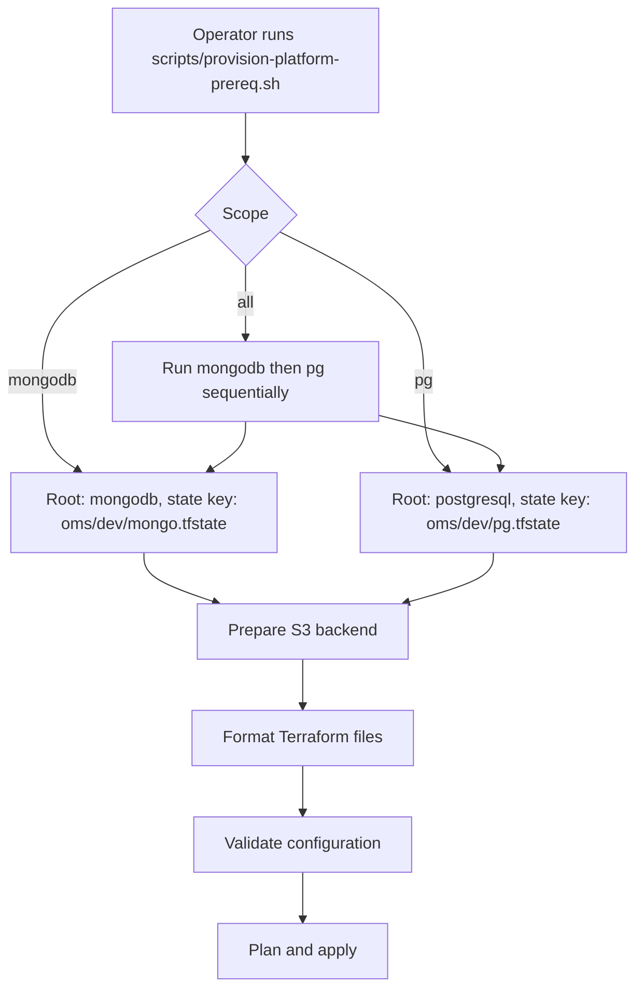

# Operator Runbook

Step-by-step provisioning guide, safety gates, runbook commands, and troubleshooting.

**Who this is for:** Infra Operators who need to provision and maintain the OMS data layer.

**Pre-requisite:** Complete [Environment Setup](environment-setup.md) first.

**Related docs:**
- [Component Catalog](../references/component-catalog.md) — what each component does
- [Verification Commands](../references/verification-commands.md) — per-component health checks
- [Recovery Procedures](../references/recovery-procedures.md) — when things go wrong
- [Configuration Catalog](../operations/dev-configuration-catalog.md) — all embedded defaults

---

## Quick Start (Experienced Operators)

Use this only after you understand the target environment and state location.

```bash
# Create tfvars for both roots
cp platform-prerequisites/terraform/mongodb/terraform.tfvars.sample platform-prerequisites/terraform/mongodb/terraform.tfvars
cp platform-prerequisites/terraform/postgresql/terraform.tfvars.sample platform-prerequisites/terraform/postgresql/terraform.tfvars
nano platform-prerequisites/terraform/mongodb/terraform.tfvars
nano platform-prerequisites/terraform/postgresql/terraform.tfvars

# Provision everything
bash scripts/provision-platform-prereq.sh all
scripts/bootstrap-dev-secrets.sh
scripts/create-audit-writer-secret.sh
scripts/validate-dev-render.sh

# Verify
scripts/verify-platform-health.sh
```

This shortcut does not replace plan review. Stop before apply if the generated plan does not match the intended change.

---

## Provisioning Choices

| Goal | When To Use It | Command |
|---|---|---|
| Full baseline | First-time setup or convergence check | `bash scripts/provision.sh all` |
| MongoDB only | MongoDB updates without touching PostgreSQL | `bash scripts/provision.sh mongodb` |
| PostgreSQL only | PostgreSQL updates without touching MongoDB | `bash scripts/provision.sh pg` |
| SigNoz (telemetry) | Install or update the telemetry stack | `bash scripts/provision.sh signoz` |

## Standard Operator Procedure

### Step 0: Confirm Environment

Purpose: confirms your workstation is ready.

```bash
scripts/verify-platform-health.sh --preflight
```

Expected: all preflight checks pass. If not, return to [Environment Setup](environment-setup.md).

### Step 1: Choose Scope and Create Variables File

Scope-to-root mapping:
- `all` → runs `mongodb` then `pg` sequentially (create BOTH tfvars files)
- `mongodb` → `platform-prerequisites/terraform/mongodb`
- `pg` → `platform-prerequisites/terraform/postgresql`

For `mongodb`:

```bash
cp platform-prerequisites/terraform/mongodb/terraform.tfvars.sample platform-prerequisites/terraform/mongodb/terraform.tfvars
```

For `pg`:

```bash
cp platform-prerequisites/terraform/postgresql/terraform.tfvars.sample platform-prerequisites/terraform/postgresql/terraform.tfvars
```

Expected: selected root has local `terraform.tfvars` file (not committed to git).

### Step 2: Fill Required Values

Required minimum values:
- **mongodb**: `cluster_name`
- **pg**: `vpc_id`, `private_subnet_ids`, `db_master_password` (at least 8 chars, printable ASCII, no `/`, `"`, or `@`)
- **all**: fill both files

Expected: no required value is empty or left as a placeholder.

### Step 3: Run Provisioning

```bash
bash scripts/provision-platform-prereq.sh all
```

Alternative scopes:

```bash
bash scripts/provision-platform-prereq.sh mongodb
bash scripts/provision-platform-prereq.sh pg
```

Optional — skip interactive plan confirmation (use only for known-good reruns):

```bash
bash scripts/provision-platform-prereq.sh mongodb --auto-approve
```

What this does:
- Uses remote S3 state (bucket `sml-oms-dev-tfstate` in `ap-east-1`)
- Bootstraps the backend bucket if needed
- Runs `terraform fmt`, `validate`, `plan`, `apply`

Expected: scope applies successfully.

### Step 4: Create MongoDB Secrets (MongoDB scope only)

Skip this step if you only ran the `pg` scope.

```bash
scripts/bootstrap-dev-secrets.sh
```

The script auto-decides:
- Secret already exists → skip
- Escrow file exists on disk → use it
- Nothing exists → generate, save escrow, create secret

Expected: `psmdb-encryption-key` and `psmdb-secrets` exist in namespace `mongodb`.

> **Important:** Copy escrow files (`.local-dev-encryption-key.txt`, `.local-dev-user-passwords.txt`) to a secure location immediately. If lost and cluster secrets are deleted, encrypted MongoDB data may be permanently inaccessible.

### Step 5: Create Audit Writer Secret (MongoDB scope only)

Skip this step if you only ran the `pg` scope.

```bash
scripts/create-audit-writer-secret.sh
```

This creates the `oms-audit-writer` Kubernetes Secret that the Boomi audit log library reads.
If it already exists, the script skips safely.

Expected: Secret `oms-audit-writer` exists in namespace `mongodb`.

### Step 6: Validate MongoDB Overlay (MongoDB scope only)

Skip this step if you only ran the `pg` scope.

```bash
scripts/validate-dev-render.sh
```

Expected: render succeeds, structural checks pass.

### Step 7: Provision SigNoz (if needed)

```bash
bash scripts/provision.sh signoz
```

Expected: SigNoz pods running in namespace `signoz`.

> **Note:** SigNoz uses a first-user signup model. The first person to open the dashboard becomes the admin. See [Boomi Integration Guide § SigNoz Dashboard](boomi-integration-guide.md#accessing-signoz-dashboard).

> **Security:** The ClickHouse password in `gitops/signoz/base/helmreleases.yaml` is set to a placeholder (`CHANGE_ME_BEFORE_PRODUCTION`). Replace it with a real password before deploying to any shared or production environment.

### Step 8: Verify Deployment

```bash
scripts/verify-platform-health.sh
```

Or check specific components — see [Verification Commands](../references/verification-commands.md).

---

## What Happens When The Script Runs



The script stops on any error (init, format, validate, plan, or apply).

---

## Required Safety Gates

Do not apply infrastructure until these gates are satisfied.

| Gate | Required Evidence | Stop If |
|---|---|---|
| Environment | AWS account, region, cluster confirmed | Any target value is guessed |
| Access | AWS identity has permissions, kubectl works | Returns Unauthorized/Forbidden |
| Tooling | All required CLIs available | Any command missing |
| Configuration | `terraform.tfvars` exists with real values | Values are empty or placeholders |
| State | Using correct S3 bucket and key | State location changed accidentally |
| Plan/Apply | Provisioning script succeeds | Any step fails |
| Controllers | Flux, Kyverno, cert-manager, EBS CSI exist | CRD preflight fails |
| MongoDB readiness | Secret bootstrap and render check pass | Secret or render fails |

---

## Runbook Commands

| Command | What It Does | When To Run |
|---|---|---|
| `bash scripts/provision.sh <all\|mongodb\|pg\|signoz>` | Full provisioning for scope | Day-1 and selective reruns |
| `bash scripts/provision.sh <scope> --bootstrap-platform-controllers` | Same + installs missing controllers | Platform-admin bootstrap |
| `bash scripts/provision-platform-prereq.sh <all\|mongodb\|pg>` | Terraform-only provisioning | Infra-only changes |
| `bash scripts/provision-k8s-components.sh <scope>` | Kubernetes manifests only | K8s-only changes |
| `scripts/bootstrap-dev-secrets.sh` | Create MongoDB secrets | After Terraform, before workload |
| `scripts/validate-dev-render.sh` | Render check for MongoDB overlay | Before applying manifests |
| `scripts/verify-dev-identity.sh` | Check pod ServiceAccount | After MongoDB pods start |
| `scripts/verify-platform-health.sh` | Full platform verification | After any provisioning |
| `scripts/verify-platform-health.sh --preflight` | Environment-only check | Before provisioning |
| `scripts/open-signoz-ui.sh` | SigNoz dashboard access (dev) | When viewing telemetry |
| `scripts/open-signoz-ui.sh --mode ingress` | SigNoz dashboard URL (prod) | Production access |

---

## Troubleshooting

### Common First-Run Issues

| What Was Missed | How To Check | Fix |
|---|---|---|
| Wrong AWS account or region | `aws sts get-caller-identity` | Switch profile/region |
| AWS SSO not logged in | `aws sts get-caller-identity` | `aws sso login --profile default` |
| Wrong Kubernetes context | `kubectl config current-context` | Update kubeconfig |
| `terraform.tfvars` not created | Check root for file | Copy from sample |
| Placeholder values left | Review tfvars content | Replace with real values |
| State bucket override | `echo "$TF_STATE_BUCKET"` | `unset TF_STATE_BUCKET` |
| Missing CLI tools | `command -v terraform aws kubectl` | Install and reopen shell |
| Missing platform controllers | `kubectl get crd helmreleases.helm.toolkit.fluxcd.io` | Use `--bootstrap-platform-controllers` |
| No RBAC in mongodb namespace | `kubectl auth can-i create secrets -n mongodb` | Fix EKS Access Entry |

### AWS SSO And Credentials

| Symptom | Fix |
|---|---|
| `The config profile could not be found` | `aws configure sso --profile default` |
| Browser login expired | `aws sso login --profile default` |
| `Unable to locate credentials` | `export AWS_PROFILE=default` |
| Wrong region | `export AWS_REGION=ap-east-1` |
| `AccessDenied` | Ask account owner for correct permission set |

### Kubernetes Access

| Symptom | Fix |
|---|---|
| `kubectl` points to wrong cluster | `aws eks update-kubeconfig --name EKS-boomi-runtime-cluster --region ap-east-1` |
| `You must be logged in to the server` | `aws sso login --profile default` then retry |
| `Forbidden` after auth succeeds | Fix EKS Access Entry or RBAC for your role |
| Namespace `mongodb` not found | Run Terraform prerequisites first |

### Terraform Issues

| Symptom | Fix |
|---|---|
| Plan asks for variables | Create `terraform.tfvars` from sample |
| Wrong cluster in plan | Fix `cluster_name` in tfvars |
| PostgreSQL subnet error | Ensure `private_subnet_ids` belong to `vpc_id` |
| State bucket not found | Check `TF_STATE_BUCKET` override; ensure bucket exists |
| Unexpected state migration prompt | Confirm this is first remote-state run before accepting |

### MongoDB Issues

| Symptom | Fix |
|---|---|
| PVC stays `Pending` | Check EBS CSI driver: `kubectl get csidriver ebs.csi.aws.com` |
| `cannot create secrets` | Fix RBAC: `kubectl auth can-i create secrets -n mongodb` |
| Escrow file invalid | Restore from backup or regenerate for fresh environment |
| Pod CrashLooping | Check logs: `kubectl -n mongodb logs <pod> -c mongod --tail=60` |
| Wrong ServiceAccount | Run `scripts/verify-dev-identity.sh` to identify mismatch |

### SigNoz Issues

| Symptom | Fix |
|---|---|
| Pods Pending (PVC) | Check StorageClass and EBS CSI driver |
| HelmRelease not reconciling | Check Flux: `kubectl -n flux-system logs deployment/helm-controller --tail=30` |
| Dashboard unreachable | Verify port-forward: `kubectl -n signoz port-forward svc/signoz 3301:8080` |
| Telemetry send fails | Use frontend endpoint (`3301/v1/logs`), not collector directly |

### Render And Identity Checks

| Symptom | Fix |
|---|---|
| `kustomize build` fails | Fix manifest syntax in `k8s/overlays/dev` |
| Render succeeds but rg finds nothing | Check overlay patches and resource inclusion |
| `verify-dev-identity.sh` exits 1 | No pods yet — apply workload manifests first |
| `verify-dev-identity.sh` exits 2 | Pod uses wrong ServiceAccount — fix workload spec |

---

## Remote State

Remote S3 state is always enabled. No local-state mode exists.

- Bucket: `sml-oms-dev-tfstate` (region `ap-east-1`)
- MongoDB key: `oms/dev/mongo.tfstate`
- PostgreSQL key: `oms/dev/pg.tfstate`

Override only if intentionally targeting a different bucket:

```bash
export TF_STATE_BUCKET="my-other-bucket"
export TF_STATE_REGION="us-east-1"
```

See [Architect Reference § State Strategy](architect-reference.md#state-backend-strategy) for the full state model.
