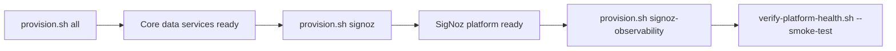
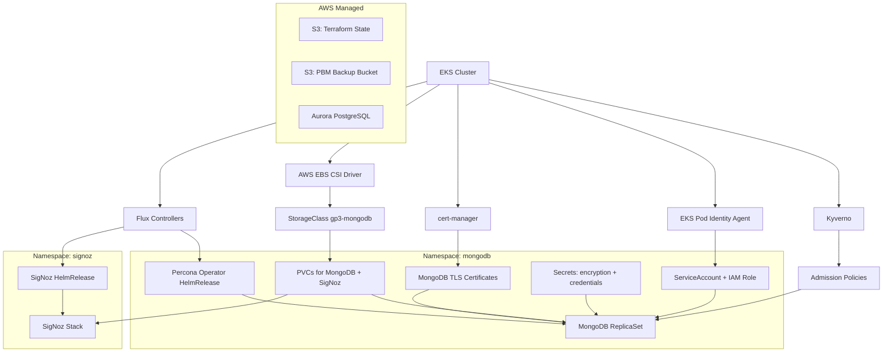

# OMS Data Layer — Documentation Hub

## Who Are You?

| I am a... | I want to... | Start here |
|---|---|---|
| **Boomi Process Owner** (builds processes; use-case-level knowledge) | Understand what/why to record, then call `writeAuditLog` and the span (stopwatch) calls with the right business values | [Process Owner Edition](guides/boomi-audit-log-owner-guide.md) → [Integration Guide § Public API](guides/boomi-integration-guide.md#public-api) for exact parameters |
| **Boomi Admin** (in-depth; trains process owners) | Master the libraries end-to-end: API semantics, contract rules, failure behavior, testing, SigNoz monitoring | [Boomi Integration Guide](guides/boomi-integration-guide.md) → [Audit Log Contract](references/audit-log-contract.md) |
| **Infra Operator** | Provision infrastructure (including the Boomi audit-writer secret), run day-2 maintenance, troubleshoot issues, run verification | [Environment Setup](guides/environment-setup.md) → [Operator Runbook](guides/operator-runbook.md) |
| **Infra Architect / Admin** | Understand components, architecture, maintain the platform | [Component Catalog](references/component-catalog.md) → [Architect Reference](guides/architect-reference.md) |
| **Enterprise Architect** | Understand design decisions, security, compliance, roadmap, review telemetry reports | [Enterprise Architecture](guides/enterprise-architecture.md) |

Each persona's path is need-to-know: credential/secret/account material
lives only in the [Operator Runbook](guides/operator-runbook.md) — the
Boomi-facing guides deliberately contain none of it.

## Quick Access By Topic

| Topic | Document | Description |
|---|---|---|
| Unfamiliar term or acronym | [Glossary & Concept Reference](references/glossary.md) | Plain-language lookup for every jargon term used in these docs, organized by category, with diagrams for the trickiest concepts |
| Audit logging explained without jargon | [Boomi Audit Log Guide (Process Owner Edition)](guides/boomi-audit-log-owner-guide.md) | Plain-language walkthrough for non-technical process owners — what gets recorded and what to fill in |
| Canonical audit record schema | [Audit Log Contract](references/audit-log-contract.md) | Fixed fields, naming rules, template-key format, module-owned params, and data-protection constraints |
| Boomi Groovy library internals | [Boomi Groovy Library Architecture](references/boomi-groovy-library-architecture.md) | For people who maintain the two Groovy library files: why two libraries, precise signatures, design mechanisms, build/test/deploy (callers use the Integration Guide instead) |
| Boomi audit-writer secret & accounts | [Operator Runbook § Boomi Audit Writer](guides/operator-runbook.md#boomi-audit-writer-credentials-secrets-and-accounts) | Secret provisioning/formats, MongoDB account mapping, diagnostic methods (operators only) |
| Full reprovision sequence (new cluster/day-1) | [Operator Runbook](guides/operator-runbook.md#standard-operator-procedure) | Exact order: all -> signoz -> signoz-observability -> smoke verification |
| First-time workstation setup | [Environment Setup](guides/environment-setup.md) | Tools, AWS SSO, Kubernetes access, preflight checks |
| Provisioning commands and troubleshooting | [Operator Runbook](guides/operator-runbook.md) | Step-by-step, safety gates, runbook commands, error resolution |
| SigNoz first-login actions | [Operator Runbook § SigNoz First-Login Checklist](guides/operator-runbook.md#step-7a1-signoz-first-login-checklist-do-this-in-order) | What to click (and skip) in the SigNoz dashboard after signup |
| Ongoing day-2 operations | [Operator Runbook](guides/operator-runbook.md#day-2-operations-ongoing-maintenance) | Recurring health checks, routine maintenance, trigger-based actions |
| Component inventory (what/why/how) | [Component Catalog](references/component-catalog.md) | Every platform component: purpose, value, dependencies |
| Architecture and state model | [Architect Reference](guides/architect-reference.md) | Diagrams, dependency graph, state strategy, day-2 maintenance |
| Audit log library and telemetry | [Boomi Integration Guide](guides/boomi-integration-guide.md) | Library API, canonical-contract usage, SigNoz access, endpoint contracts |
| Design rationale and security | [Enterprise Architecture](guides/enterprise-architecture.md) | Design decisions, security posture, compliance, production roadmap |
| Per-component health checks | [Verification Commands](references/verification-commands.md) | Health check commands for every component + end-to-end smoke test |
| SigNoz dashboards & alerts (as code) | [SigNoz Dashboard Import Pack](references/signoz-dashboard-import-pack.md) | Fully-automated Terraform IaC path (recommended) + manual JSON-import fallback for K8s, MongoDB, PostgreSQL, and OTel collector dashboards/alerts |
| Rollback, recovery, credential rotation | [Recovery Procedures](references/recovery-procedures.md) | What to do when things go wrong |
| Embedded defaults and constants | [Configuration Catalog](operations/dev-configuration-catalog.md) | Source of truth for hardcoded values |
| Infrastructure/MongoDB/PostgreSQL monitoring | [Architect Reference § Infrastructure And Database Monitoring](guides/architect-reference.md#infrastructure-and-database-monitoring) | What SigNoz monitors today across K8s, MongoDB, and PostgreSQL/Aurora (CloudWatch import), with coverage and verification notes |

## Why Provisioning Is Split

The standard day-1 flow intentionally separates:
1. `all` for core data services (MongoDB + PostgreSQL)
2. `signoz` for telemetry platform deployment
3. `signoz-observability` for dashboards and alerts as code

This separation improves failure isolation and ensures dependency correctness
(observability IaC requires a live SigNoz API and auth token).

## Journey Map (Day-1 vs Day-2)

| Persona | Day-1 (first setup) | Day-2 (ongoing) |
|---|---|---|
| **Boomi Process Owner** | [Process Owner Edition](guides/boomi-audit-log-owner-guide.md) | [Integration Guide § Public API](guides/boomi-integration-guide.md#public-api) + [§ tracing recipe](guides/boomi-integration-guide.md#process-tracing-in-signoz) |
| **Boomi Admin** | [Boomi Integration Guide](guides/boomi-integration-guide.md#quick-start-first-audit-log-and-telemetry-flow) | [Boomi Integration Guide](guides/boomi-integration-guide.md#complete-testing-workflow) |
| **Infra Operator** | [Environment Setup](guides/environment-setup.md) → [Operator Runbook](guides/operator-runbook.md#standard-operator-procedure) | [Operator Runbook](guides/operator-runbook.md#day-2-operations-ongoing-maintenance) + [§ Boomi Audit Writer secrets](guides/operator-runbook.md#boomi-audit-writer-credentials-secrets-and-accounts) |
| **Infra Architect / Admin** | [Component Catalog](references/component-catalog.md) + [Enterprise Architecture](guides/enterprise-architecture.md) | [Architect Reference](guides/architect-reference.md) + [Recovery Procedures](references/recovery-procedures.md) |
| **Enterprise Architect** | [Enterprise Architecture](guides/enterprise-architecture.md) | [Enterprise Architecture](guides/enterprise-architecture.md#production-readiness-assessment) + [Verification Commands](references/verification-commands.md#signoz) |

## System Overview

The OMS data layer provisions three backend services on EKS:

| Service | Role | Namespace | Provisioned By |
|---|---|---|---|
| **MongoDB** (Percona) | Audit trail — immutable compliance event records | `mongodb` | `scripts/provision.sh mongodb` |
| **PostgreSQL** (Aurora) | Primary application database — orders, inventory, operations | N/A (AWS managed) | `scripts/provision.sh pg` |
| **SigNoz** | Application telemetry — traces, metrics, logs | `signoz` | `scripts/provision.sh signoz` |

Supporting platform components:

| Component | Role | Namespace | Details |
|---|---|---|---|
| Flux (Helm + Source) | GitOps delivery — reconciles Helm charts from git | `flux-system` | [Component Catalog § Flux](references/component-catalog.md#flux-helm--source-controllers) |
| Kyverno | Policy enforcement — admission-time resource validation | `kyverno` | [Component Catalog § Kyverno](references/component-catalog.md#kyverno) |
| cert-manager | TLS automation — issues and renews certificates | `cert-manager` | [Component Catalog § cert-manager](references/component-catalog.md#cert-manager) |
| AWS EBS CSI Driver | Block storage — provisions gp3 EBS volumes for PVCs | `kube-system` | [Component Catalog § EBS CSI](references/component-catalog.md#aws-ebs-csi-driver) |
| EKS Pod Identity Agent | IAM binding — maps ServiceAccounts to IAM roles | `kube-system` | [Component Catalog § Pod Identity](references/component-catalog.md#eks-pod-identity-agent) |
| SigNoz K8s Infra Monitoring | Node/pod/cluster metrics via SigNoz `k8s-infra` chart | `signoz` | [Component Catalog § SigNoz K8s Infra Monitoring](references/component-catalog.md#signoz-k8s-infra-monitoring) |
| MongoDB Metrics Collector | Replica-set metrics (connections, ops, replication) into SigNoz | `mongodb` | [Component Catalog § MongoDB Metrics Collector](references/component-catalog.md#mongodb-metrics-collector) |
| PostgreSQL Metrics Collector | Aurora CloudWatch metrics (CPU, IOPS, connections, replication lag) into SigNoz | `mongodb` | [Component Catalog § PostgreSQL Metrics Collector](references/component-catalog.md#postgresql-metrics-collector) |

## Dependency Graph

## Deployment Order

Components must be deployed in this sequence due to dependencies:

1. **EKS cluster** (pre-existing)
2. **Platform controllers** (parallel): EBS CSI Driver, Flux, Kyverno, cert-manager, Pod Identity Agent
3. **Terraform prerequisites** (after controllers): namespaces, IAM roles, S3 buckets, Aurora PostgreSQL
4. **Kubernetes secrets** (after Terraform): encryption key, user credentials, audit-writer URI
5. **Workload manifests** (after secrets): Percona operator → MongoDB CR, SigNoz HelmRelease
6. **Application setup** (after workloads): audit reader user, SigNoz admin signup
7. **Verification** (after all): health checks, smoke tests

### Key Scripts (in deployment order)

| Script | Purpose | Run By | Cadence |
|---|---|---|---|
| `scripts/provision.sh <scope>` | Full provisioning entrypoint | Operator | Day-1 and change-driven reruns |
| `scripts/destroy.sh <scope>` | Scoped teardown entrypoint (`mongodb`, `pg`, `signoz`, `all`) | Operator | Post-test cleanup and rebuild prep |
| `scripts/bootstrap-dev-secrets.sh` | Create MongoDB encryption + credential secrets | Operator | Day-1 or when secrets are intentionally regenerated |
| `scripts/create-audit-writer-secret.sh` | Create K8s Secret with MongoDB URI for Boomi library | Operator | Day-1 and when Mongo URI changes |
| `scripts/create-audit-reader.sh` | Create read-only MongoDB user for querying audit logs | Operator/Architect | Day-1 and user onboarding |
| `scripts/create-signoz-root-user-secret.sh` | Bootstrap SigNoz admin account (no manual signup) | Operator | Once per environment, before/with `provision.sh signoz` |
| `scripts/provision.sh signoz-observability` | Apply SigNoz dashboards + alerts as code (auto-bootstraps Service Account/API key via headless browser if needed) | Operator | Once per environment, then safe to re-run |
| `scripts/verify-platform-health.sh` | Validate all components are healthy | All infra roles | Recurring (daily/weekly) and post-change |
| `scripts/verify-platform-health.sh --smoke-test` | End-to-end write + read-back (local, needs port-forwards) | All infra roles | Post-change verification |
| `scripts/run-audit-telemetry-test.sh` | Deploy test Pod in cluster: write + telemetry + verify + delete pod | All roles | Post-change verification |
| `scripts/write-auditlog-and-telemetry.sh` | Local Groovy test harness for Boomi library (needs port-forwards) | Boomi Admin | Local development and troubleshooting |
| `scripts/open-signoz-ui.sh` | Access SigNoz dashboard | All | As needed |

See [Verification Commands](references/verification-commands.md) for per-step health checks.

## Terminology Primer

This section used to hold a short table of terms. That table is now the
[Glossary & Concept Reference](references/glossary.md) — a single,
categorized, growing appendix instead of a short list duplicated (and going
stale) in multiple places. If you're brand new to Kubernetes/AWS/Terraform,
start with
[Environment Setup § Core Concepts](guides/environment-setup.md#core-concepts-read-before-you-run-any-command)
for the foundational ideas with diagrams, then use the Glossary for
everything else.

## Document Maintenance Rules

When behavior changes:
1. Update the relevant guide(s) in `docs/guides/`
2. Update [Component Catalog](references/component-catalog.md) if a component was added/removed/changed
3. Update [Configuration Catalog](operations/dev-configuration-catalog.md) if defaults changed
4. Update this index if navigation paths changed
5. Keep cross-document links working — use relative paths

All cross-references between documents use relative markdown links.
