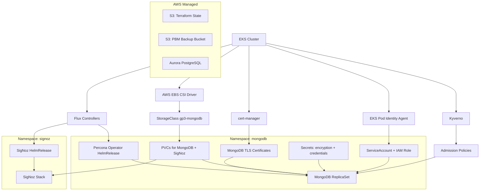

# OMS Data Layer — Documentation Hub

## Who Are You?

| I am a... | I want to... | Start here |
|---|---|---|
| **Infra Operator** | Provision infrastructure, troubleshoot issues, run verification | [Environment Setup](guides/environment-setup.md) → [Operator Runbook](guides/operator-runbook.md) |
| **Infra Architect / Admin** | Understand components, architecture, maintain the platform | [Component Catalog](references/component-catalog.md) → [Architect Reference](guides/architect-reference.md) |
| **Boomi Admin** | Write audit logs, use telemetry, integrate with the platform | [Boomi Integration Guide](guides/boomi-integration-guide.md) |
| **Enterprise Architect** | Understand design decisions, security, compliance, roadmap | [Enterprise Architecture](guides/enterprise-architecture.md) |

## Quick Access By Topic

| Topic | Document | Description |
|---|---|---|
| First-time workstation setup | [Environment Setup](guides/environment-setup.md) | Tools, AWS SSO, Kubernetes access, preflight checks |
| Provisioning commands and troubleshooting | [Operator Runbook](guides/operator-runbook.md) | Step-by-step, safety gates, runbook commands, error resolution |
| Component inventory (what/why/how) | [Component Catalog](references/component-catalog.md) | Every platform component: purpose, value, dependencies |
| Architecture and state model | [Architect Reference](guides/architect-reference.md) | Diagrams, dependency graph, state strategy, day-2 maintenance |
| Audit log library and telemetry | [Boomi Integration Guide](guides/boomi-integration-guide.md) | Library API, schema, SigNoz access, endpoint contracts |
| Design rationale and security | [Enterprise Architecture](guides/enterprise-architecture.md) | Design decisions, security posture, compliance, production roadmap |
| Per-component health checks | [Verification Commands](references/verification-commands.md) | Health check commands for every component + end-to-end smoke test |
| Rollback, recovery, credential rotation | [Recovery Procedures](references/recovery-procedures.md) | What to do when things go wrong |
| Embedded defaults and constants | [Configuration Catalog](operations/dev-configuration-catalog.md) | Source of truth for hardcoded values |

## System Overview

The OMS data layer provisions three backend services on EKS:

| Service | Role | Namespace | Provisioned By |
|---|---|---|---|
| **MongoDB** (Percona) | Audit trail — immutable compliance event records | `mongodb` | `scripts/provision.sh mongodb` |
| **PostgreSQL** (Aurora) | Primary application database — orders, inventory, operations | N/A (AWS managed) | `scripts/provision.sh pg` |
| **SigNoz** | Application telemetry — traces, metrics, logs | `signoz` | `scripts/provision.sh signoz` |

Supporting platform components:

| Component | Role | Namespace | Details |
|---|---|---|---|
| Flux (Helm + Source) | GitOps delivery — reconciles Helm charts from git | `flux-system` | [Component Catalog § Flux](references/component-catalog.md#flux-helm--source-controllers) |
| Kyverno | Policy enforcement — admission-time resource validation | `kyverno` | [Component Catalog § Kyverno](references/component-catalog.md#kyverno) |
| cert-manager | TLS automation — issues and renews certificates | `cert-manager` | [Component Catalog § cert-manager](references/component-catalog.md#cert-manager) |
| AWS EBS CSI Driver | Block storage — provisions gp3 EBS volumes for PVCs | `kube-system` | [Component Catalog § EBS CSI](references/component-catalog.md#aws-ebs-csi-driver) |
| EKS Pod Identity Agent | IAM binding — maps ServiceAccounts to IAM roles | `kube-system` | [Component Catalog § Pod Identity](references/component-catalog.md#eks-pod-identity-agent) |

## Dependency Graph

## Deployment Order

Components must be deployed in this sequence due to dependencies:

1. **EKS cluster** (pre-existing)
2. **Platform controllers** (parallel): EBS CSI Driver, Flux, Kyverno, cert-manager, Pod Identity Agent
3. **Terraform prerequisites** (after controllers): namespaces, IAM roles, S3 buckets, Aurora PostgreSQL
4. **Kubernetes secrets** (after Terraform): encryption key, user credentials
5. **Workload manifests** (after secrets): Percona operator → MongoDB CR, SigNoz HelmRelease
6. **Verification** (after workloads): health checks, smoke tests

See [Verification Commands](references/verification-commands.md) for per-step health checks.

## Document Maintenance Rules

When behavior changes:
1. Update the relevant guide(s) in `docs/guides/`
2. Update [Component Catalog](references/component-catalog.md) if a component was added/removed/changed
3. Update [Configuration Catalog](operations/dev-configuration-catalog.md) if defaults changed
4. Update this index if navigation paths changed
5. Keep cross-document links working — use relative paths

All cross-references between documents use relative markdown links.
