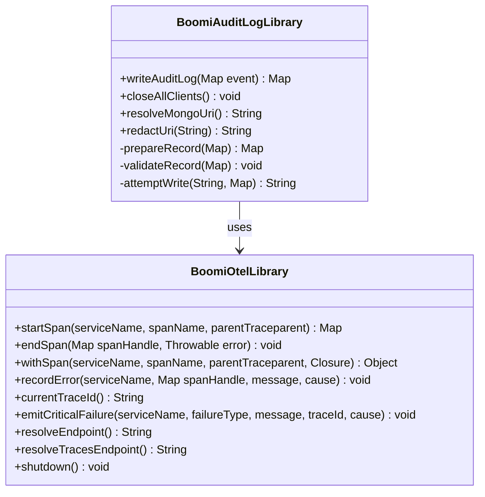
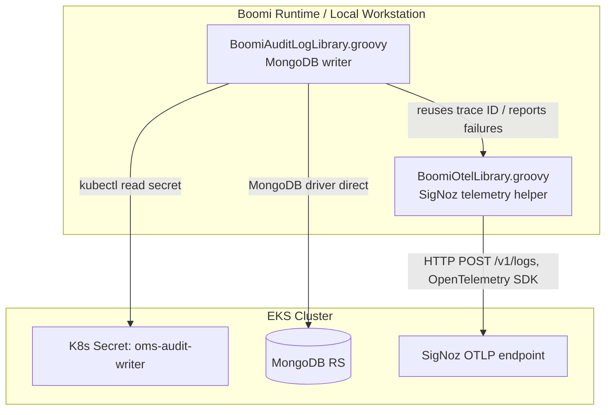

# Boomi Groovy Library Architecture

Design rationale for why the Boomi-facing Groovy code is split into two
independent libraries, how they depend on each other, and how to build,
test, and extend them.

**Who this is for:** Developers/architects who **maintain or extend the two
Groovy library files themselves** (`scripts/groovy/boomi/*.groovy`) — not
people who merely call them. This document is deliberately narrow: the split
rationale, the class/sequence design, precise internal signatures, and how
to build, test, and ship the code. It assumes familiarity with Groovy,
MongoDB, and OpenTelemetry.

> **If you only *call* these libraries** (write audit records, add SigNoz
> tracing to a Boomi process), you do **not** need this document. Use the
> [Boomi Integration Guide](../guides/boomi-integration-guide.md) — it owns
> the full how-to, including the
> [step-by-step process-tracing recipe](../guides/boomi-integration-guide.md#process-tracing-in-signoz).
> For a plain-language overview, see the
> [Process Owner Edition](../guides/boomi-audit-log-owner-guide.md).

**Related docs:**
- [Boomi Integration Guide](../guides/boomi-integration-guide.md) — how callers use these libraries (audit writes + process tracing)
- [Audit Log Contract](audit-log-contract.md) — the record shape `BoomiAuditLogLibrary` writes
- [Boomi Audit Log Guide (Process Owner Edition)](../guides/boomi-audit-log-owner-guide.md) — plain-language version for non-technical process owners

---

## The Two Libraries At A Glance

`scripts/groovy/boomi/` contains two classes, each with exactly one job:

| Class | Job | Knows about |
|---|---|---|
| `BoomiOtelLibrary` | Process/subprocess tracing, trace-ID correlation, and critical-failure telemetry to SigNoz | OpenTelemetry only |
| `BoomiAuditLogLibrary` | Validate and write one audit record to MongoDB | MongoDB, the audit-log contract, **and** `BoomiOtelLibrary` |

That is all a caller needs to know to use them: `writeAuditLog(...)` for
audit records, `startSpan`/`withSpan`/`endSpan` for tracing. Connections,
endpoints, credentials, and retries are all resolved inside the libraries —
a caller never supplies any of them. The design rationale for the split,
with class and sequence diagrams, is in
[Appendix: Design Rationale](#appendix-design-rationale).

---

## Tracing: Where The How-To Lives

The **caller-facing** how-to for process/subprocess tracing — worked
examples, the which-call-when table, the SigNoz waterfall, error patterns,
and continuing a trace across Boomi shapes — lives in the
[Boomi Integration Guide § Process Tracing In SigNoz](../guides/boomi-integration-guide.md#process-tracing-in-signoz).
It is not duplicated here.

This section records only the two **design mechanisms** a maintainer needs
to understand when changing the tracing code:

1. **Ambient span nesting.** `startSpan`/`withSpan` call
   `Span.makeCurrent()` and return a `Scope`. A span started while another
   is current becomes its child automatically (no explicit parent), because
   the OTel context is thread-local. `BoomiAuditLogLibrary.writeAuditLog`
   picks up that same ambient trace ID through its existing
   `BoomiOtelLibrary.currentTraceId()` call in `prepareRecord()` — which is
   why audit records auto-correlate to the active process span with no extra
   wiring. The corollary maintainers must preserve: every `makeCurrent()`
   scope must be closed in `endSpan` (reverse order), or the thread-local
   context leaks.
2. **Cross-execution propagation.** A span object is per-JVM-execution and
   cannot survive across separate Boomi shape executions. `startSpan`
   therefore also exports the span context as a W3C `traceparent` string
   (via `W3CTraceContextPropagator`), returned in the handle as
   `handle.traceparent`; `startSpan(..., parentTraceparent)` re-imports it.
   This is the standard W3C format, so any W3C-Trace-Context-compliant
   system can join the same trace — do not replace it with a bespoke
   encoding.

---

## `BoomiOtelLibrary` Reference

| Method | Signature | Notes |
|---|---|---|
| `startSpan(...)` | `static Map startSpan(String serviceName, String spanName, String parentTraceparent = null)` | Starts a span; returns a handle `[span, scope, traceparent, traceId, spanId]`. Inherits the ambient current span as parent when `parentTraceparent` is omitted, or starts a new trace if none is active. Calls `span.makeCurrent()`. |
| `endSpan(...)` | `static void endSpan(Map spanHandle, Throwable error = null)` | Ends a span started by `startSpan`, closing its `Scope`. When `error` is given: marks the span `StatusCode.ERROR`, records the exception on it, and calls `emitCriticalFailure`. Never throws. |
| `withSpan(...)` | `static Object withSpan(String serviceName, String spanName, String parentTraceparent = null, Closure work)` | Starts a span, runs `work`, and always ends the span (marking it failed and re-throwing if `work` throws). Preferred over manual `startSpan`/`endSpan` pairs. |
| `recordError(...)` | `static void recordError(String serviceName, Map spanHandle, String message, Throwable cause)` | Records an exception on a span **without** ending it, and always emits a critical failure log. `spanHandle` may be `null` (log-only). |
| `currentTraceId()` | `static String currentTraceId()` | Returns `Span.current().getSpanContext().getTraceId()` when a valid span is active, else `null`. Never throws. |
| `emitCriticalFailure(...)` | `static void emitCriticalFailure(String serviceName, String failureType, String message, String traceId, Throwable cause = null)` | Emits an OTel Logs SDK log record (`severity=ERROR`) with `failure.type`, `failure.message`, `trace_id`, and (if `cause` is given) `exception.type`/`exception.message`/`exception.stacktrace` attributes. Also calls `Span.recordException(cause)` on the active span, if one exists and `cause` is non-null. Never throws. |
| `resolveEndpoint()` | `static String resolveEndpoint()` | Returns `BOOMI_AUDIT_OTEL_ENDPOINT` env var, or the in-cluster SigNoz collector default (logs, `/v1/logs`). |
| `resolveTracesEndpoint()` | `static String resolveTracesEndpoint()` | Returns `BOOMI_AUDIT_OTEL_TRACES_ENDPOINT` env var, or `resolveEndpoint()` with `/v1/logs` swapped for `/v1/traces`. |
| `shutdown()` | `static void shutdown()` | Clears the cached `Logger`/`Tracer` and their SDK providers, calling `shutdown()` on both. Call from short-lived jobs/tests; not required for long-running Boomi runtimes. |

**Implementation notes:**
- The `SdkLoggerProvider`/`SdkTracerProvider` are each cached per
  `(endpoint, serviceName)` pair in a `ConcurrentHashMap`, mirroring
  `BoomiAuditLogLibrary`'s `MongoClient` caching pattern — avoid rebuilding
  an exporter/provider on every call.
- Uses `SimpleLogRecordProcessor` / `SimpleSpanProcessor` (synchronous
  export), not a batching processor. Boomi/script JVM processes can be
  short-lived, so a batched, asynchronous processor risks losing a critical
  failure event or a span if the process exits before the batch flushes.
  The added latency on this path is an acceptable trade for delivery.
- Cross-shape trace continuation uses the standard W3C `traceparent` text
  format (`TextMapPropagator`/`W3CTraceContextPropagator`), not a
  hand-rolled encoding — any other W3C-Trace-Context-compliant system
  (including Boomi's own instrumentation, if it ever adds any) can
  participate in the same trace.
- Dependencies: `io.opentelemetry:opentelemetry-{api,sdk,exporter-otlp}:1.51.0`
  via `@Grab`. Bumping this version only requires re-validating this one
  file.

---

## `BoomiAuditLogLibrary` Reference

Unchanged from the reader's perspective — see
[Boomi Integration Guide § Public API](../guides/boomi-integration-guide.md#public-api)
for the full field-level contract. Internally, it now:

- calls `BoomiOtelLibrary.currentTraceId()` inside `prepareRecord()` instead
  of reading `Span.current()` itself;
- calls `BoomiOtelLibrary.emitCriticalFailure(SERVICE_NAME, failureType,
  message, record?.trace_id, cause)` from its private `emitFailureTelemetry`
  helper, at each of the three failure points (validation, MongoDB URI
  resolution, MongoDB write);
- calls `BoomiOtelLibrary.shutdown()` from `closeAllClients()`.

Dependencies: `org.mongodb:mongodb-driver-sync:5.1.2`,
`software.amazon.awssdk:secretsmanager:2.25.48` via `@Grab`. It no longer
`@Grab`s any `io.opentelemetry:*` artifact directly — those now live solely
in `BoomiOtelLibrary`.

---

## File Layout And Deployment

```
scripts/groovy/boomi/
  BoomiOtelLibrary.groovy       # package boomi; no dependency on BoomiAuditLogLibrary
  BoomiAuditLogLibrary.groovy   # package boomi; imports boomi.BoomiOtelLibrary
```

Both files must be deployed together wherever `BoomiAuditLogLibrary` runs —
as a Boomi Custom Library, or as two Script Components in the same Boomi
process/folder that share a classpath. `BoomiOtelLibrary` alone can be
deployed independently by a future component that only needs telemetry, but
`BoomiAuditLogLibrary` never works without `BoomiOtelLibrary` present.

---

## Compiling And Testing Both Files Together

Because one file imports the other, compiling/parsing them independently
with a single-file tool call is not sufficient — the import will fail to
resolve. Two supported approaches:

**Pure compile-check** (compiles both, does not run anything):

```bash
groovyc -d /tmp/boomi-groovy-build \
  scripts/groovy/boomi/BoomiOtelLibrary.groovy \
  scripts/groovy/boomi/BoomiAuditLogLibrary.groovy
```

**Compile-and-run smoke test** (needed to exercise `@Grab`-resolved
dependencies at runtime): parse `BoomiOtelLibrary.groovy` into a
`GroovyClassLoader` *first*, then parse `BoomiAuditLogLibrary.groovy` into
the *same* loader, so the second file's `import boomi.BoomiOtelLibrary`
resolves against the already-loaded class:

```groovy
GroovyClassLoader gcl = new GroovyClassLoader()
Class otelCls = gcl.parseClass(new File('scripts/groovy/boomi/BoomiOtelLibrary.groovy'))
Class auditCls = gcl.parseClass(new File('scripts/groovy/boomi/BoomiAuditLogLibrary.groovy'))
```

A plain `groovy -cp <dir-of-precompiled-classes>` invocation does **not**
also resolve `@Grab` dependencies, and will fail with a confusing
`MissingMethodException` rather than a clear classpath error — prefer one of
the two approaches above for validation.

---

## Extension Points

- A future Boomi Groovy component that needs SigNoz failure telemetry but
  has nothing to do with MongoDB (for example a file-transfer retry script)
  can `import boomi.BoomiOtelLibrary` and call `emitCriticalFailure` /
  `currentTraceId` directly, without touching `BoomiAuditLogLibrary` at all.
- If a second MongoDB-backed writer is ever needed (for example a
  higher-volume bulk loader with different retry semantics), it can reuse
  `BoomiOtelLibrary` the same way `BoomiAuditLogLibrary` does, keeping
  telemetry behavior consistent across every Mongo-writing component.

---

## Appendix: Design Rationale

> Reference material — nothing here is needed to *use* the libraries.

### Class Diagram

The dependency is one-directional: `BoomiAuditLogLibrary` calls
`BoomiOtelLibrary`. `BoomiOtelLibrary` has zero knowledge of MongoDB, the
audit-log contract, or Boomi-specific concepts — it is a general-purpose
tracing/telemetry helper that any Boomi Groovy component could use, not just
the audit writer.



### Why Two Classes Instead Of One

Before this split (contract v2.0 and earlier), all of this lived in a single
`BoomiAuditLogLibrary` class, including the OpenTelemetry SDK setup, log
export, and span-exception recording. That worked, but conflated two
unrelated concerns:

1. **Single responsibility.** Writing a validated record to MongoDB and
   emitting telemetry to SigNoz are orthogonal jobs. Bundling them meant a
   change to one (for example bumping the OpenTelemetry SDK version, or
   adding a new OTLP exporter option) touched a class whose primary
   responsibility is the audit-log contract, increasing the chance of an
   unrelated regression.
2. **Reuse beyond audit writing.** `BoomiOtelLibrary` has no MongoDB driver
   dependency and no audit-log-contract knowledge, so any other Boomi Groovy
   component that wants correlated tracing or SigNoz failure telemetry — for
   example a future file-transfer or webhook-retry script — can call
   `BoomiOtelLibrary` directly without pulling in the MongoDB driver or the
   AWS SDK at all. The tracing requirement ("trace the whole process, time
   every subprocess, propagate across shape executions") proved this out: it
   is a large, self-contained API surface with nothing to do with MongoDB.
3. **Independent dependency upgrades.** The OpenTelemetry SDK
   (`io.opentelemetry:*`) and the MongoDB driver / AWS SDK evolve on
   separate release cadences. Splitting means a version bump of one
   dependency set has a smaller, more obviously-scoped blast radius.
4. **Testability.** Telemetry behavior (log record shape, attribute names,
   span-exception recording) can be exercised or mocked independently of a
   real or fake MongoDB connection, and vice versa.
5. **Failure isolation while reading the code.** A future maintainer
   debugging "why didn't my audit write succeed" no longer has to read
   through OpenTelemetry SDK setup code that is irrelevant to that question,
   and a maintainer debugging "why isn't telemetry reaching SigNoz" doesn't
   have to read through MongoDB retry/backoff logic.

The split was an internal refactor only — **the public
`writeAuditLog(Map event)` signature and behavior are unchanged.** No
existing Boomi process needed to change anything.

### Execution Topology

The Groovy library runs **inside the Boomi runtime** (or locally for
testing), NOT as a Kubernetes pod. This is the internal network/deployment
picture -- relevant to infra operators (network/access prerequisites),
architects, and maintainers; a Boomi Admin does not need it (the library
resolves everything internally):



**Key points:**
- `BoomiAuditLogLibrary` uses `kubectl` to read the MongoDB URI from a Kubernetes Secret -- this requires `kubectl` in PATH and valid kubeconfig on whatever host runs the Boomi Atom/script.
- MongoDB write happens directly via the Java MongoDB driver (not through a K8s service proxy).
- `BoomiAuditLogLibrary` never talks to SigNoz itself -- it delegates to `BoomiOtelLibrary`, which is the only component that sends OTLP telemetry.
- In dev, both MongoDB and SigNoz are accessed via local port-forwards; in production, use cluster-internal service DNS (the Boomi runtime must have network access to the cluster).
- How the secret itself is provisioned, and which MongoDB accounts exist, are documented in [Operator Runbook § Boomi Audit Writer: Credentials, Secrets, And Accounts](../guides/operator-runbook.md#boomi-audit-writer-credentials-secrets-and-accounts).

The caller-visible request/response sequence for a successful write and a
failed write -- what a Boomi Admin actually needs to reason about failure
behavior -- now lives in
[Boomi Integration Guide § Reliability: Timeouts, Retries, And Failure Telemetry](../guides/boomi-integration-guide.md#reliability-timeouts-retries-and-failure-telemetry),
not duplicated here.

---

## Changelog

| Date | Change |
|---|---|
| 2026-07-14 | Swapped Appendix content: moved the two write-path sequence diagrams (successful/failed write) to [Boomi Integration Guide § Reliability](../guides/boomi-integration-guide.md#reliability-timeouts-retries-and-failure-telemetry) (caller-visible failure behavior -- a Boomi Admin concern), and moved the Execution Topology flowchart (Boomi runtime / K8s Secret / network paths) here from the Integration Guide's "Execution Model" (infra/architecture-level, not a Boomi Admin daily concern). |
| 2026-07-14 | Refocused this document to library **maintainers only**: moved the caller-facing tracing how-to (worked EDI example, waterfall, error patterns, cross-shape continuation) to [Boomi Integration Guide § Process Tracing In SigNoz](../guides/boomi-integration-guide.md#process-tracing-in-signoz), leaving here just the split rationale, precise signatures, design mechanisms, and build/test/deploy. |
| 2026-07-14 | Added full process/subprocess tracing to `BoomiOtelLibrary`: `startSpan`/`endSpan`/`withSpan` (span lifecycle, ambient nesting within one script execution), `recordError` (non-terminal error recording), `resolveTracesEndpoint()`, and W3C `traceparent` export/import for continuing a trace across separate Boomi shape executions. No change to `currentTraceId()`/`emitCriticalFailure()`/`resolveEndpoint()`/`shutdown()` signatures (fully backward compatible); `shutdown()` now also tears down the tracer provider. |
| 2026-07-14 | Split the single `BoomiAuditLogLibrary` class into `BoomiOtelLibrary` (telemetry only) and `BoomiAuditLogLibrary` (MongoDB writer, depends on `BoomiOtelLibrary`). No change to the public `writeAuditLog` contract. |
