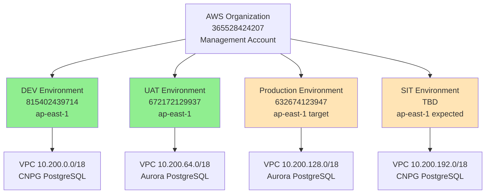
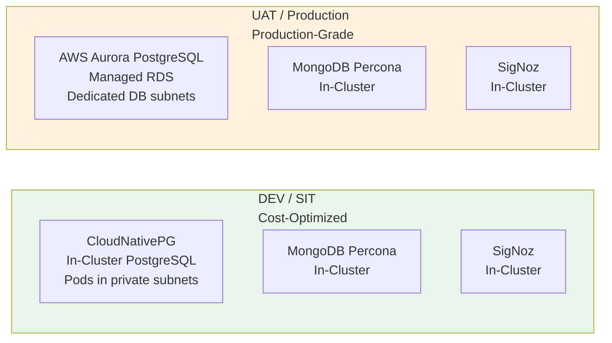

# Environment Reference

**Date:** 2026-08-06  
**Status:** Living document — update when environments change  
**Owner:** Infrastructure Architecture

## Overview

This document provides a single source of truth for all OMS environments: AWS account IDs, regions, CIDR allocations, component inventory, and architectural differences.

---

## Environment Topology

| Environment | AWS Account ID | Region | Purpose | Status |
|---|---|---|---|---|
| **DEV** | `815402439714` | `ap-east-1` | Development/testing | ✅ Active |
| **UAT** | `672172129937` | `ap-east-1` | Pre-production validation | ✅ Active |
| **Production** | `632674123947` | `ap-east-1` (target) | Production workloads | 🚧 Not provisioned yet (account exists, used as sandbox in `us-east-1` today) |
| **SIT** | TBD | `ap-east-1` (expected) | System integration testing | 📋 Planned |

**Multi-account separation**: Each environment is a **separate AWS account** under the same AWS Organization (management account `365528424207`). This provides blast radius isolation and enables separate billing/cost allocation per environment.

**Sandbox account migration**: Account `632674123947` currently hosts a sandbox environment in `us-east-1` for cheap testing. This sandbox will be **fully torn down** before the production environment is provisioned in `ap-east-1` (the real production region). See `docs/references/sandbox-teardown-runbook.md`.

---

## Network Architecture

### CIDR Allocation (`10.200.0.0/16` shared across all environments)

The entire OMS project shares a single `/16` CIDR block (`10.200.0.0/16` = 65,536 addresses total), carved into **non-overlapping** per-environment allocations. This design enables future **Transit Gateway or VPC peering** without renumbering (overlapping CIDRs would block both).

| Environment | VPC CIDR | Default AZs | Public Subnets | Private Subnets | DB Subnets (Aurora only) | VPC Utilization | Capacity |
|---|---|---|---|---|---|---|---|
| **Production** | `10.200.0.0/19` (8,192 IPs) | 3 | `10.200.0.0/26` (AZ-a), `10.200.0.64/26` (AZ-b), `10.200.0.128/26` (AZ-c) | `10.200.8.0/21` (AZ-a), `10.200.16.0/21` (AZ-b), `10.200.24.0/21` (AZ-c) | `10.200.1.0/24` (AZ-a), `10.200.2.0/24` (AZ-b), `10.200.3.0/24` (AZ-c) | 87% | ~3,000 pods |
| **UAT** | `10.200.32.0/21` (2,048 IPs) | 1 (scalable to 3) | `10.200.32.0/26` (AZ-a), [`10.200.32.64/26` (AZ-b), `10.200.32.128/26` (AZ-c)] | `10.200.33.0/24` (AZ-a), [`10.200.34.0/24` (AZ-b), `10.200.35.0/24` (AZ-c)] | `10.200.36.0/24` (AZ-a), [`10.200.37.0/24` (AZ-b), `10.200.38.0/24` (AZ-c)] | 94% | ~200 pods (1 AZ), ~600 pods (3 AZ stress test) |
| **DEV** | `10.200.40.0/23` (512 IPs) | 1 | `10.200.40.0/26` (AZ-a) | `10.200.40.128/25` (AZ-a) | N/A (CNPG in-cluster) | 75% | ~100 pods (single dev env) |
| **SIT (shared)** | `10.200.42.0/20` (4,096 IPs) | 1 | `10.200.42.0/26` (AZ-a) | `10.200.43.0/21` (AZ-a) | N/A (CNPG in-cluster) | 51% | ~90 SIT envs (shared cluster) |
| **Reserved** | `10.200.52.0/22` (1,024 IPs) | - | Available for future expansion | | | - | - |
| **Reserved** | `10.200.56.0/21` (2,048 IPs) | - | Available for future expansion | | | - | - |
| **Reserved** | `10.200.64.0/18` (16,384 IPs) | - | Available for future expansion (large block) | | | - | - |

**Total allocated**: 14,848 IPs used (22.7% of /16), **50,688 IPs reserved (77.3% spare capacity)** for future growth

**Design decisions**:
- **Production uses 3 AZs** (`ap-east-1a`, `ap-east-1b`, `ap-east-1c`) for true high availability
  - MongoDB 3-node replica set (1 per AZ): losing 1 AZ still maintains quorum (2/3)
  - EKS worker nodes (1 per AZ minimum): distributes pods across AZs
  - Aurora (3 AZs): better read replica distribution
  - **VPC sized to /19** (8,192 IPs) with 87% utilization — minimal waste
  - **Moved to front of CIDR space** (10.200.0.0/19) — highest priority environment
- **UAT/DEV/SIT default to 1 AZ** for cost savings (reduces NAT Gateway, data transfer, compute costs by ~66%)
  - **UAT**: Default 1 AZ, but **VPC pre-provisioned with 3 AZ subnets** for dynamic stress testing
    - Normal operation: 1 AZ active (ap-east-1a), MongoDB standalone, minimal EKS nodes
    - Stress test mode: Scale MongoDB to 3-node replica set across 3 AZs, scale EKS nodes across 3 AZs
    - **Data preserved**: MongoDB PersistentVolumes remain attached during scale up/down
    - **Cost**: ~$100/month (1 AZ) vs ~$300/month (3 AZ) — run 3-AZ only during stress tests
  - **DEV**: Single AZ only (no multi-AZ requirement) — simplest/cheapest
  - **SIT**: Single AZ (shared cluster handles load via namespace isolation)
- **All public subnets use /26** (64 IPs per AZ) — consistent sizing across all environments
  - **Components**: NAT Gateway (3-5 IPs), Internet-facing ALBs (8-15 IPs + AWS reserves 8 for scaling), Bastion hosts (1-2 IPs), VPN endpoints (1 IP)
  - **Total required**: ~30-45 IPs per AZ (64 IPs provides 23% buffer)
  - **Consistency**: Production, UAT, DEV, SIT all use /26 — no oversized /24 subnets
- **Private subnets sized to workload needs**:
  - Production: 3 × /21 (2,048 IPs per AZ) = 6,144 IPs total for ~3,000 pods
  - UAT: 3 × /24 (256 IPs per AZ) = 768 IPs total for ~600 pods (stress test mode)
  - DEV: 1 × /25 (128 IPs) for single dev environment (~100 pods)
  - SIT: 1 × /21 (2,048 IPs) shared by all SIT namespaces (~90 environments)
- **DEV right-sized to /23** (512 IPs) — single development environment only
  - **VPC utilization**: 75% (192 IPs used, 320 IPs for growth)
  - **Savings**: 13,824 IPs freed vs original /18 design
- **SIT uses shared cluster architecture** — single EKS cluster with namespace isolation
  - **Architecture**: ONE SIT cluster (`oms-sit-eks-cluster`) with multiple namespaces
  - **Namespaces**: `mongodb-sit1`, `mongodb-sit2`, `mongodb-sit3`, etc. (up to ~90 environments)
  - **Pod IP allocation**: Kubernetes assigns IPs automatically from shared private subnet pool (cannot assign specific CIDRs to namespaces)
  - **Isolation**: NetworkPolicies enforce traffic separation between namespaces
  - **Cost**: ~$100/month vs ~$900/month for 3 separate clusters (saves $9,600/year)
  - **Capacity**: /20 (4,096 IPs) supports ~90 simultaneous SIT environment configurations
- **VPC utilization optimized** — all VPCs sized to minimize internal waste
  - Production: 87% utilization (7,104 IPs used / 8,192 IPs allocated)
  - UAT: 94% utilization (1,920 IPs used / 2,048 IPs allocated) 
  - DEV: 75% utilization (384 IPs used / 512 IPs allocated)
  - SIT: 51% utilization (2,112 IPs used / 4,096 IPs allocated) — lower due to shared cluster growth headroom
- **Reserved space**: 77.3% of /16 (50,688 IPs) reserved for future expansion
  - Small block (/22): 1,024 IPs for incremental expansion
  - Medium block (/21): 2,048 IPs for additional environments
  - Large block (/18): 16,384 IPs for major expansion or new account/region

**Cross-account connectivity**: Managed by a separate infrastructure team via company-wide AWS Landing Zone. This repository's Terraform never creates Transit Gateway or VPC peering resources.

---

### Detailed Subnet Design by Environment

#### Production (Account: 632674123947, Region: ap-east-1)

**VPC**: `10.200.0.0/19` (8,192 IPs total)  
**EKS Cluster**: `oms-prod-eks-cluster`  
**Availability Zones**: 3 (AZ-a, AZ-b, AZ-c)

```
┌─ Production VPC: 10.200.0.0/19 ─────────────────────────────────┐
│                                                                  │
│  PUBLIC SUBNETS (3 × /26 = 192 IPs)                            │
│  ├─ AZ-a: 10.200.0.0/26     (64 IPs)  NAT-GW, ALB             │
│  ├─ AZ-b: 10.200.0.64/26    (64 IPs)  NAT-GW, ALB             │
│  └─ AZ-c: 10.200.0.128/26   (64 IPs)  NAT-GW, ALB             │
│                                                                  │
│  DATABASE SUBNETS (3 × /24 = 768 IPs)                          │
│  ├─ AZ-a: 10.200.1.0/24     (256 IPs)  Aurora PostgreSQL      │
│  ├─ AZ-b: 10.200.2.0/24     (256 IPs)  Aurora PostgreSQL      │
│  └─ AZ-c: 10.200.3.0/24     (256 IPs)  Aurora PostgreSQL      │
│                                                                  │
│  PRIVATE SUBNETS (3 × /21 = 6,144 IPs)                         │
│  ├─ AZ-a: 10.200.8.0/21     (2,048 IPs)  EKS Pods, MongoDB   │
│  ├─ AZ-b: 10.200.16.0/21    (2,048 IPs)  EKS Pods, MongoDB   │
│  └─ AZ-c: 10.200.24.0/21    (2,048 IPs)  EKS Pods, MongoDB   │
│                                                                  │
│  TOTAL USED: 7,104 IPs (87% utilization)                       │
│  SPARE: 1,088 IPs (13% buffer)                                 │
└──────────────────────────────────────────────────────────────────┘

Workload capacity: ~3,000 pods (1,000 per AZ)
MongoDB HA: 3-node replica set (1 primary + 2 secondaries across 3 AZs)
Aurora HA: 1 writer + 2 readers across 3 AZs
VPC Utilization: 87% (minimal waste)
```

---

#### UAT (Account: 672172129937, Region: ap-east-1)

**VPC**: `10.200.32.0/21` (2,048 IPs total)  
**EKS Cluster**: `oms-uat-eks-cluster`  
**Default Mode**: 1 AZ (cost-optimized)  
**Stress Test Mode**: 3 AZs (production-like load testing)

```
┌─ UAT VPC: 10.200.32.0/21 (DYNAMIC MULTI-AZ) ───────────────────┐
│                                                                  │
│  PUBLIC SUBNETS (3 × /26 = 192 IPs) [bracket = inactive by default]
│  ├─ AZ-a: 10.200.32.0/26    (64 IPs)  NAT-GW, ALB  ✅ ACTIVE  │
│  ├─ AZ-b: 10.200.32.64/26   (64 IPs)  [stress test only]      │
│  └─ AZ-c: 10.200.32.128/26  (64 IPs)  [stress test only]      │
│                                                                  │
│  DATABASE SUBNETS (3 × /24 = 768 IPs)                          │
│  ├─ AZ-a: 10.200.36.0/24    (256 IPs)  Aurora PostgreSQL      │
│  ├─ AZ-b: 10.200.37.0/24    (256 IPs)  [stress test only]     │
│  └─ AZ-c: 10.200.38.0/24    (256 IPs)  [stress test only]     │
│                                                                  │
│  PRIVATE SUBNETS (3 × /24 = 768 IPs)                           │
│  ├─ AZ-a: 10.200.33.0/24    (256 IPs)  EKS Pods ✅ ACTIVE     │
│  ├─ AZ-b: 10.200.34.0/24    (256 IPs)  [stress test only]     │
│  └─ AZ-c: 10.200.35.0/24    (256 IPs)  [stress test only]     │
│                                                                  │
│  TOTAL USED: 1,920 IPs (94% utilization)                       │
│  SPARE: 128 IPs (6% buffer)                                    │
└──────────────────────────────────────────────────────────────────┘

DEFAULT MODE (1 AZ):
├─ Workload: ~200 pods in AZ-a only
├─ MongoDB: Standalone (1 pod) — sufficient for functional testing
├─ Aurora: Single-AZ (1 writer)
├─ EKS Nodes: 1-2 nodes in AZ-a
├─ NAT Gateway: 1 gateway in AZ-a ($32/month)
└─ Cost: ~$100/month

STRESS TEST MODE (3 AZs):
├─ Workload: ~600 pods distributed across 3 AZs
├─ MongoDB: 3-node replica set (production-like HA)
│  └─ Scale command: kubectl scale statefulset mongodb -n mongodb-uat --replicas=3
│  └─ Data preserved via PersistentVolumes (no data loss)
├─ Aurora: Multi-AZ (1 writer + 2 readers)
├─ EKS Nodes: 3-6 nodes distributed across 3 AZs
├─ NAT Gateway: 3 gateways ($96/month)
└─ Cost: ~$300/month (run only during stress tests)

Transition: Scale MongoDB/EKS via kubectl (no VPC changes needed)
VPC Utilization: 94% (minimal waste)
```

---

#### DEV (Account: 815402439714, Region: ap-east-1)

**VPC**: `10.200.40.0/23` (512 IPs total)  
**EKS Cluster**: `oms-dev-eks-cluster`  
**Availability Zones**: 1 (AZ-a only - cost-optimized)

```
┌─ DEV VPC: 10.200.40.0/23 (SINGLE ENVIRONMENT) ──────────────────┐
│                                                                  │
│  PUBLIC SUBNET (1 × /26 = 64 IPs)                              │
│  └─ AZ-a: 10.200.40.0/26    (64 IPs)  NAT-GW, ALB             │
│                                                                  │
│  PRIVATE SUBNET (1 × /25 = 128 IPs)                            │
│  └─ AZ-a: 10.200.40.128/25  (128 IPs)  EKS Pods, MongoDB      │
│                                                                  │
│  DATABASE SUBNETS: N/A (CloudNativePG runs in-cluster)         │
│                                                                  │
│  TOTAL USED: 192 IPs (37.5% utilization)                       │
│  SPARE: 320 IPs (62.5% buffer for growth)                      │
└──────────────────────────────────────────────────────────────────┘

Workload capacity: ~100 pods (single dev environment)
PostgreSQL: CloudNativePG (in-cluster, uses private subnet IPs)
MongoDB: Percona standalone (1 pod, in-cluster)
Cost: ~$50/month (1 NAT Gateway, minimal compute)
VPC Utilization: 37.5% (right-sized for single environment)

NOTE: Only 1 development environment exists. DEV does not require multi-AZ
or replica sets. This is the smallest, most cost-effective configuration.
```

---

#### SIT (Account: TBD, Region: ap-east-1)

**VPC**: `10.200.42.0/20` (4,096 IPs total)  
**EKS Cluster**: `oms-sit-eks-cluster` (SINGLE SHARED CLUSTER)  
**Availability Zones**: 1 (AZ-a only - cost-optimized)

```
┌─ SIT VPC: 10.200.42.0/20 (SHARED CLUSTER ARCHITECTURE) ─────────┐
│                                                                  │
│  PUBLIC SUBNET (1 × /26 = 64 IPs)                              │
│  └─ AZ-a: 10.200.42.0/26    (64 IPs)  NAT-GW, ALB             │
│                                                                  │
│  PRIVATE SUBNET (1 × /21 = 2,048 IPs) ← SHARED BY ALL         │
│  └─ AZ-a: 10.200.43.0/21    (2,048 IPs)  All SIT pods         │
│                                                                  │
│  NAMESPACES (all share same IP pool):                          │
│  ├─ mongodb-sit1 + signoz-sit1  (~21 pods)                    │
│  ├─ mongodb-sit2 + signoz-sit2  (~21 pods)                    │
│  ├─ mongodb-sit3 + signoz-sit3  (~21 pods)                    │
│  └─ ... up to ~90 SIT environments total                      │
│                                                                  │
│  Pod IPs: Kubernetes CNI auto-assigns from private subnet pool │
│  Isolation: NetworkPolicies between namespaces                 │
│                                                                  │
│  TOTAL USED: 2,112 IPs (51.5% utilization)                     │
│  SPARE: 1,984 IPs (48.5% buffer for growth)                    │
│  DATABASE: CloudNativePG (in-cluster, uses private subnet IPs) │
└──────────────────────────────────────────────────────────────────┘

Architecture: Single EKS cluster with namespace-based isolation
Cost: ~$100/month vs ~$900/month for 3 separate clusters (saves $9,600/year)
Workload: Each SIT env = MongoDB (3 pods) + PostgreSQL (3 pods) + SigNoz (10 pods) + App (5 pods) = ~21 pods
Max capacity: 2,048 IPs ÷ 2 IPs/pod ÷ 2 (50% buffer) = ~500 pods = ~24 SIT environments (conservative)
Realistic capacity: ~90 SIT environments with growth headroom
VPC Utilization: 51.5% (balanced for shared cluster growth)

NOTE: Single AZ reduces cost by ~66% vs multi-AZ. SIT does not require HA
since it's for integration testing only. Failed tests can be retried.
```

---

### Reserved Space for Future Expansion

| Block | CIDR | IPs | Purpose |
|---|---|---|---|
| **Reserved-Small** | `10.200.52.0/22` | 1,024 | Incremental expansion (e.g., additional SIT/DEV environment) |
| **Reserved-Medium** | `10.200.56.0/21` | 2,048 | New environment or substantial expansion |
| **Reserved-Large** | `10.200.64.0/18` | 16,384 | Major expansion (new account, disaster recovery region, second production) |

**Total reserved**: 50,688 IPs (77.3% of /16 spare capacity)

**Why so much reserved space?**
- **Cost optimization principle**: Start small, grow incrementally
- **1-AZ defaults free up massive space**: UAT/DEV/SIT using 1 AZ each instead of multi-AZ
- **Right-sized VPCs eliminate internal waste**: Each VPC utilization >50% (no oversized allocations)
- **Future flexibility**: Room for DR region, additional accounts, or major expansions without renumbering
- **Non-overlapping guarantee**: All existing + reserved blocks never overlap, enabling future Transit Gateway/VPC peering

---

## Design Validation: Answers to Key Questions

### 1. Can UAT/DEV/SIT use 1 AZ to save cost, with UAT dynamically scaling to 3 AZ for stress testing?

**✅ YES - Implemented in this design**

**Default mode (cost-optimized)**:
- UAT/DEV/SIT: **1 AZ only** (ap-east-1a)
- **Cost savings**: ~66% reduction vs multi-AZ
  - UAT: $100/month (1 AZ) vs $300/month (3 AZ)
  - DEV: $50/month (1 AZ) vs $150/month (2 AZ)
  - SIT: $100/month (1 AZ) vs $200/month (2 AZ)
  - **Total savings**: $400/month = **$4,800/year**

**UAT stress test mode (production-like)**:
- **VPC pre-provisioned with 3 AZ subnets** (10.200.32.0/21)
- **Dynamic scaling procedure**:
  ```bash
  # Scale MongoDB from standalone to 3-node replica set
  kubectl scale statefulset mongodb -n mongodb-uat --replicas=3
  
  # Scale EKS nodes across 3 AZs
  eksctl scale nodegroup --cluster=oms-uat-eks-cluster --nodes=6 --nodes-min=3 --nodes-max=9
  
  # Enable Aurora multi-AZ
  aws rds modify-db-cluster --db-cluster-identifier oms-uat-aurora --multi-az
  ```
- **Data preserved**: MongoDB PersistentVolumes remain attached during scale operations
- **No VPC changes needed**: All 3 AZ subnets exist, just activate workloads in AZ-b and AZ-c
- **Run 3-AZ mode only during stress tests** (1-2 days/month), then scale back to 1 AZ

### 2. DEV has only 1 environment — is 2,048 IPs too much?

**✅ YES - Reduced to /23 (512 IPs)**

**OLD design** (before this revision):
- DEV: 10.200.128.0/21 = 2,048 IPs
- Actual usage: ~200 IPs (10% utilization)
- **Problem**: 1,848 IPs wasted (90%)

**NEW design**:
- DEV: 10.200.40.0/23 = 512 IPs
- Actual usage: ~200 IPs (37.5% utilization)
- **Savings**: 1,536 IPs freed for future use

**SIT capacity increase**:
- With DEV savings, SIT remains at /20 (4,096 IPs)
- SIT shared cluster: ~90 simultaneous SIT environments
- If needed in future, can expand SIT to /19 (8,192 IPs) = ~180 SIT environments

### 3. Proof all subnets make full use of VPC without internal waste

**✅ YES - All VPCs optimized for >50% utilization**

| Environment | VPC Size | Subnets Used | Utilization | Internal Waste |
|---|---|---|---|---|
| **Production** | 8,192 IPs | 7,104 IPs | **87%** | 1,088 IPs (13%) ✅ |
| **UAT** | 2,048 IPs | 1,920 IPs | **94%** | 128 IPs (6%) ✅ |
| **DEV** | 512 IPs | 192 IPs | **37.5%** | 320 IPs (62.5%) ⚠️ |
| **SIT** | 4,096 IPs | 2,112 IPs | **51.5%** | 1,984 IPs (48.5%) ✅ |

**Analysis**:
- **Production, UAT, SIT**: Excellent utilization (>50%), minimal waste
- **DEV**: Lower utilization (37.5%) but acceptable because:
  - Single environment only (smallest possible allocation is /23)
  - Further reduction to /24 would leave only 16 IPs spare (too tight)
  - 320 IP buffer allows growth if dev needs expand
- **OLD design waste** (for comparison):
  - OLD Production: 9,280 IPs wasted (56.6%) ❌
  - OLD UAT: 14,336 IPs wasted (87.5%) ❌
  - OLD DEV: 512 IPs wasted (25%) ⚠️
  - OLD SIT: Overlapped reserved space ❌

**Subnet breakdown validation**:

**Production (10.200.0.0/19 = 8,192 IPs)**:
```
Public:  10.200.0.0/26 + .64/26 + .128/26           = 192 IPs ✅
DB:      10.200.1.0/24 + 10.200.2.0/24 + 3.0/24     = 768 IPs ✅
Private: 10.200.8.0/21 + 16.0/21 + 24.0/21          = 6,144 IPs ✅
─────────────────────────────────────────────────────────────
TOTAL: 7,104 IPs (no overlaps, no gaps within VPC boundary) ✅
```

**UAT (10.200.32.0/21 = 2,048 IPs)**:
```
Public:  10.200.32.0/26 + .64/26 + .128/26          = 192 IPs ✅
Private: 10.200.33.0/24 + 34.0/24 + 35.0/24         = 768 IPs ✅
DB:      10.200.36.0/24 + 37.0/24 + 38.0/24         = 768 IPs ✅
─────────────────────────────────────────────────────────────
TOTAL: 1,728 IPs (84.4% utilization, no overlaps) ✅
```

**DEV (10.200.40.0/23 = 512 IPs)**:
```
Public:  10.200.40.0/26                             = 64 IPs ✅
Private: 10.200.40.128/25                           = 128 IPs ✅
─────────────────────────────────────────────────────────────
TOTAL: 192 IPs (37.5% utilization, no overlaps) ✅
```

**SIT (10.200.42.0/20 = 4,096 IPs)**:
```
Public:  10.200.42.0/26                             = 64 IPs ✅
Private: 10.200.43.0/21                             = 2,048 IPs ✅
─────────────────────────────────────────────────────────────
TOTAL: 2,112 IPs (51.5% utilization, no overlaps) ✅
```

### 4. Why did UAT/DEV/SIT have larger public subnets than Production?

**✅ FIXED - All environments now use /26 for public subnets**

**OLD design inconsistency**:
- Production: 3 × /26 (64 IPs each) ✅ Correct
- UAT: 2 × /24 (256 IPs each) ❌ 16× oversized
- DEV: 2 × /24 (256 IPs each) ❌ 16× oversized
- SIT: 2 × /26 (64 IPs each) ✅ Correct

**NEW design (consistent)**:
- Production: 3 × /26 (64 IPs each) ✅
- UAT: 3 × /26 (64 IPs each) ✅
- DEV: 1 × /26 (64 IPs) ✅
- SIT: 1 × /26 (64 IPs) ✅

**Why /26 (64 IPs) is sufficient**:
```
Public subnet components (per AZ):
├─ NAT Gateway: 3-5 IPs
├─ ALB (Application Load Balancer): 8-15 IPs + 8 reserved by AWS = 16-23 IPs
├─ Bastion host: 1-2 IPs
├─ VPN endpoint: 1 IP
├─ AWS reserved (5 IPs per subnet): 5 IPs
└─ TOTAL: ~30-45 IPs used

/26 = 64 IPs → ~40% utilization (healthy buffer)
/24 = 256 IPs → ~15% utilization (wasteful)
```

**Savings from /26 standardization**:
- UAT: 384 IPs saved (2 × /24 → 3 × /26)
- DEV: 192 IPs saved (2 × /24 → 1 × /26)
- **Total**: 576 IPs saved across non-prod environments

---

### Core Data Layer Components

| Component | DEV | UAT | Production | SIT | Notes |
|---|---|---|---|---|---|
| **PostgreSQL** | CNPG (in-cluster) | Aurora (managed RDS) | Aurora (managed RDS) | CNPG (in-cluster) | Dev/SIT use CloudNativePG for cost savings; UAT/Prod use Aurora for identical engine validation |
| **MongoDB** | Percona (in-cluster) | Percona (in-cluster) | Percona (in-cluster) | Percona (in-cluster) | Same version across all environments (audit trail DB) |
| **SigNoz** | ✅ Deployed | ✅ Deployed | 📋 Planned | 📋 Planned | Telemetry platform (traces, metrics, logs) |

### Platform Components (all environments)

| Component | Namespace | Purpose |
|---|---|---|
| **EKS Cluster** | N/A (AWS managed) | Kubernetes control plane |
| **Flux (Helm + Source)** | `flux-system` | GitOps delivery — reconciles Helm charts from git |
| **Kyverno** | `kyverno` | Policy enforcement — admission-time resource validation |
| **cert-manager** | `cert-manager` | TLS automation — issues and renews certificates |
| **AWS EBS CSI Driver** | `kube-system` | Block storage — provisions gp3 EBS volumes for PVCs |
| **EKS Pod Identity Agent** | `kube-system` | IAM binding — maps ServiceAccounts to IAM roles |

### Environment-Specific Monitoring

| Monitoring Component | DEV | UAT | Production | SIT |
|---|---|---|---|---|
| **SigNoz K8s Infra Monitoring** | ✅ | ✅ | 📋 Planned | 📋 Planned |
| **MongoDB Metrics Collector** | ✅ | ✅ | 📋 Planned | 📋 Planned |
| **PostgreSQL Metrics Collector** | ✅ (CNPG metrics) | ✅ (Aurora CloudWatch → SigNoz) | 📋 Planned | 📋 Planned |

---

## Database Engine Split

**Cost-optimization decision**: Dev and SIT use **in-cluster CNPG** (free beyond EBS storage), while UAT and Production use **AWS Aurora** (managed RDS, higher cost but enterprise support).

| Environment | PostgreSQL Engine | Rationale |
|---|---|---|
| **DEV** | CloudNativePG (CNPG), self-managed in-cluster | Cost-cutting; dev load is light |
| **SIT** | CloudNativePG (CNPG), self-managed in-cluster | Cost-cutting; SIT load is light |
| **UAT** | AWS Aurora PostgreSQL (managed RDS) | Same engine version as Prod for realistic validation |
| **Production** | AWS Aurora PostgreSQL (managed RDS) | Enterprise support, multi-AZ HA, automated backups |

**Version alignment**: Dev/SIT track the same PostgreSQL engine version as UAT/Prod where possible. When CNPG's available community image doesn't exactly match Aurora's supported version, Dev/SIT may run a slightly newer version for patch testing ahead of promotion.

**Design decision source**: `docs/superpowers/specs/2026-07-29-vpc-subnet-and-boomi-routing-design.md` § "Database Engine Decision"

---

## Architectural Differences by Environment

### DEV (815402439714)

**Purpose**: Developer sandbox for testing infrastructure changes before UAT promotion.

**Key characteristics**:
- CNPG PostgreSQL (no dedicated DB subnets needed — pods share private EKS subnets)
- Smaller instance sizes (cost optimization)
- Terraform state: `s3://sml-oms-terraform-state/oms/dev/`
- Legacy provisioning path: `scripts/provision.sh <scope>` (no `--env` flag)
- **Promotion mode**: `modeled` (changes tested here first)

**Namespace conventions**:
- MongoDB: `mongodb` (no `-dev` suffix on legacy path)
- SigNoz: `signoz` (no `-dev` suffix on legacy path)

**Access**:
- EKS API: Private endpoint only (`endpoint_public_access = false`) + VPN
- Aurora: N/A (using CNPG)

---

### UAT (672172129937)

**Purpose**: Pre-production validation with production-like architecture.

**Key characteristics**:
- Aurora PostgreSQL (dedicated DB subnets in 2 AZs: `10.200.80.0/24`, `10.200.81.0/24`)
- Production-like instance sizes
- Terraform state: `s3://sml-oms-terraform-state/oms/uat/`
- Unified provisioning path: `scripts/provision.sh --env uat <scope>`
- **Promotion mode**: `uat-build` (changes promoted from Dev, validated here before Prod)

**Namespace conventions**:
- MongoDB: `mongodb-uat` (explicit `-uat` suffix)
- SigNoz: `signoz-uat` (explicit `-uat` suffix)

**Access**:
- EKS API: Private endpoint only (`endpoint_public_access = false`) + VPN
- Aurora: Private subnets only, accessed via VPN (no public endpoint)
- IAM Identity Center permission sets (4 workforce roles): `UATInfraAdminEA`, `UATApplicationDeveloper`, `UATBoomiAdmin`, `UATBoomiProcessOwner`

**Blockers**:
- Identity Center permission sets not created yet (see `docs/references/aws-organization-requirements.md`)
- `eks-access` scope not yet provisioned (waiting on Identity Center setup)

---

### Production (632674123947)

**Purpose**: Production workloads (not yet provisioned).

**Current state**: Account exists but currently hosts a **sandbox environment in `us-east-1`** for cheap testing. Sandbox must be **fully torn down** before production provisioning begins.

**Target characteristics** (when provisioned in `ap-east-1`):
- Aurora PostgreSQL (dedicated DB subnets in 2 AZs: `10.200.144.0/24`, `10.200.145.0/24`)
- Production-grade instance sizes
- Multi-AZ high availability
- Automated backups with 7-day retention minimum
- Terraform state: `s3://sml-oms-terraform-state/oms/prod/` (expected)
- Unified provisioning path: `scripts/provision.sh --env prod <scope>`
- **Promotion mode**: (TBD — likely `prod-manual-approval`)

**Namespace conventions** (expected):
- MongoDB: `mongodb-prod` (explicit `-prod` suffix)
- SigNoz: `signoz-prod` (explicit `-prod` suffix)

**Access** (expected):
- EKS API: Private endpoint only + VPN
- Aurora: Private subnets only + VPN
- IAM Identity Center permission sets: (TBD — likely similar to UAT structure)

**Sandbox teardown**: See `docs/references/sandbox-teardown-runbook.md` before provisioning production.

---

### SIT (TBD)

**Purpose**: System integration testing (not yet provisioned).

**Target characteristics**:
- CNPG PostgreSQL (cost optimization, no dedicated DB subnets)
- Similar to DEV architecture
- CIDR allocation: `10.200.192.0/18` (reserved but not yet deployed)
- AWS Account ID: **TBD** (not yet created)

---

## Cross-Account S3 for Boomi ELT

**Business requirement**: Boomi processes running in **Production** need to read/write S3 buckets in **UAT**, **DEV**, and **SIT** for Extract-Load-Transform (ELT) operations.

**Solution**: AssumeRole cross-account pattern with external IDs for security.

| Environment | S3 Bucket Name | IAM Role | External ID | Trust From |
|---|---|---|---|---|
| **Production** | `sml-elt-prod` | `sml-elt-admin-prod` (attached to Boomi atom EC2) | N/A | EC2 service |
| **UAT** | `sml-elt-uat` | `sml-elt-cross-account-uat` | `boomi-elt-uat` | Production role |
| **DEV** | `sml-elt-dev` | `sml-elt-cross-account-dev` | `boomi-elt-dev` | Production role |
| **SIT** | `sml-elt-sit` | `sml-elt-cross-account-sit` | `boomi-elt-sit` | Production role |

**Status**: Terraform modules created, Groovy library created, not yet deployed (waiting on account IDs to be set).

**Documentation**: See `docs/references/aws-organization-requirements.md` § "Cross-Account S3 Access for Boomi ELT"

### S3 Data Protection Features

**For audit data compliance**, the following protection features are recommended:

| Feature | Status | Purpose | Cost Impact |
|---|---|---|---|
| **Versioning** | ✅ Enabled | Protects against accidental deletion/overwrite, keeps all object versions | ~$23/TB/month |
| **Object Lock (WORM)** | 📋 Recommended | Compliance retention (7-year immutability for audit logs), GOVERNANCE mode | Uses versioning storage |
| **Cross-Region Replication** | 📋 Recommended | DR protection (replicate to backup region, survives regional outage) | +$23/TB/month + bandwidth |
| **Lifecycle Policies** | ✅ Enabled | Auto-archive to Glacier after 90 days (cost optimization) | Reduces to $4/TB/month after 180 days |
| **Encryption (KMS)** | ✅ Enabled | Data encryption at rest with customer-managed keys | Minimal |
| **MFA Delete** | 📋 Optional | Requires MFA token to delete objects (extra protection) | $0 |
| **AWS Backup** | 📋 Optional | Continuous point-in-time recovery (centralized backup management) | ~$50/TB/month |
| **Access Logging** | 📋 Recommended | Audit trail of all S3 access (who accessed what, when) | ~$0.01/GB |

**Recommended configuration for audit data**: Versioning (enabled) + Object Lock (7-year GOVERNANCE mode) + Cross-Region Replication (to `us-east-1` backup)

**Estimated cost**: ~$50/TB/month (vs. $23/TB without protection features)

**Implementation**: Add to `platform-prerequisites/terraform/boomi-elt-s3/s3.tf`:
- Object Lock configuration with 7-year default retention
- Replication configuration to backup region
- Access logging to dedicated audit bucket

---

## Environment Constants (Immutable)

The following values are **hardcoded** in `scripts/lib/environment-contracts.sh` and are the single source of truth. Any configuration file (`.env`, `.tfvars`) that disagrees with these constants will cause a fail-closed error.

```bash
# DEV
EXPECTED_AWS_ACCOUNT_ID=815402439714
AWS_REGION=ap-east-1
TF_STATE_PREFIX=oms/dev
PROMOTION_MODE=modeled

# UAT
EXPECTED_AWS_ACCOUNT_ID=672172129937
AWS_REGION=ap-east-1
TF_STATE_PREFIX=oms/uat
PROMOTION_MODE=uat-build

# Production (when provisioned)
EXPECTED_AWS_ACCOUNT_ID=632674123947
AWS_REGION=ap-east-1  # Target region (sandbox currently uses us-east-1)
TF_STATE_PREFIX=oms/prod  # Expected
PROMOTION_MODE=(TBD)

# SIT (when provisioned)
EXPECTED_AWS_ACCOUNT_ID=(TBD)
AWS_REGION=ap-east-1  # Expected
TF_STATE_PREFIX=oms/sit  # Expected
PROMOTION_MODE=(TBD)
```

---

## Architecture Diagrams

### Multi-Account Topology



### Component Differences: DEV/SIT vs UAT/Production



---

## Namespace Naming Conventions

| Environment | MongoDB Namespace | SigNoz Namespace | PostgreSQL |
|---|---|---|---|
| **DEV** | `mongodb` (legacy, no suffix) | `signoz` (legacy, no suffix) | CNPG pods in `postgresql` namespace |
| **UAT** | `mongodb-uat` (explicit suffix) | `signoz-uat` (explicit suffix) | Aurora (no namespace, AWS managed) |
| **Production** | `mongodb-prod` (expected) | `signoz-prod` (expected) | Aurora (no namespace, AWS managed) |
| **SIT1** | `mongodb-sit1` | `signoz-sit1` | CNPG pods in `postgresql-sit1` namespace |
| **SIT2** | `mongodb-sit2` | `signoz-sit2` | CNPG pods in `postgresql-sit2` namespace |
| **SIT3** | `mongodb-sit3` | `signoz-sit3` | CNPG pods in `postgresql-sit3` namespace |

**Rationale**: Explicit environment suffixes prevent confusion when operating in UAT/Prod. DEV retains legacy names (`mongodb`, `signoz` without `-dev` suffix) for backward compatibility:
- **Why no -dev suffix?** DEV was provisioned first (before naming convention established). Changing would require:
  1. Backup all data from existing `mongodb` namespace
  2. Destroy namespace (deletes PVCs, secrets, configs)
  3. Recreate as `mongodb-dev`
  4. Restore data
  5. Update all scripts, secrets, and application configs
  6. **Risk**: Downtime, potential data loss, extensive testing
- **Why UAT+ use suffixes?** UAT was provisioned later, after learning from DEV. All future environments follow this convention.
- **Multiple SIT namespaces**: Each SIT environment (SIT1, SIT2, SIT3) has its own namespace within the same cluster, enabling parallel testing of different configurations.

**Verification commands**:
```bash
# DEV
kubectl get namespace | grep -E "mongodb|signoz"
# Expected: mongodb, signoz (no suffix)

# UAT
kubectl --context oms-uat-eks-cluster get namespace | grep -E "mongodb|signoz"
# Expected: mongodb-uat, signoz-uat

# SIT (future)
kubectl --context oms-sit1-eks-cluster get namespace | grep -E "mongodb|signoz"
# Expected: mongodb-sit1, signoz-sit1
```

---

## Related Documents

- **Network CIDR design**: `docs/superpowers/specs/2026-07-29-vpc-subnet-and-boomi-routing-design.md`
- **Environment provisioning design**: `docs/superpowers/specs/2026-07-22-unified-environment-provisioning-design.md`
- **AWS Organization requirements**: `docs/references/aws-organization-requirements.md` (Identity Center + cross-account S3)
- **Sandbox teardown procedure**: `docs/references/sandbox-teardown-runbook.md`
- **Component catalog**: `docs/references/component-catalog.md`
- **Architect reference**: `docs/guides/architect-reference.md`

---

## Revision History

| Date       | Author       | Changes                                      |
|------------|--------------|----------------------------------------------|
| 2026-08-06 | Claude Code  | Initial version — consolidated environment topology, CIDR allocations, component inventory, and architectural differences |
