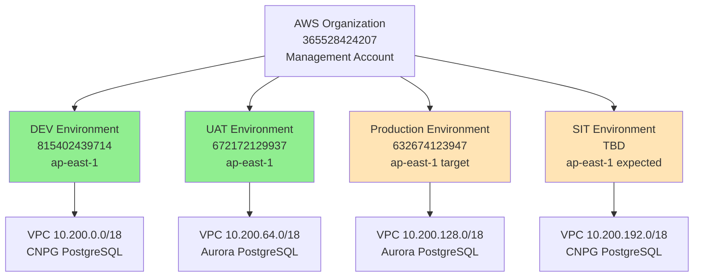
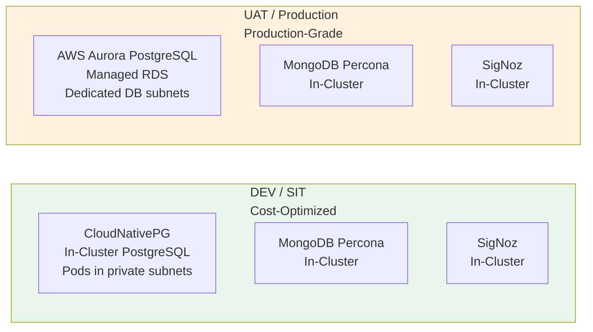

# Environment Reference

**Date:** 2026-08-06  
**Status:** Living document — update when environments change  
**Owner:** Infrastructure Architecture

## Overview

This document provides a single source of truth for all OMS environments: AWS account IDs, regions, CIDR allocations, component inventory, and architectural differences.

---

## Environment Topology

| Environment | AWS Account ID | Region | Purpose | Status |
|---|---|---|---|---|
| **DEV** | `815402439714` | `ap-east-1` | Development/testing | ✅ Active |
| **UAT** | `672172129937` | `ap-east-1` | Pre-production validation | ✅ Active |
| **Production** | `632674123947` | `ap-east-1` (target) | Production workloads | 🚧 Not provisioned yet (account exists, used as sandbox in `us-east-1` today) |
| **SIT** | TBD | `ap-east-1` (expected) | System integration testing | 📋 Planned |

**Multi-account separation**: Each environment is a **separate AWS account** under the same AWS Organization (management account `365528424207`). This provides blast radius isolation and enables separate billing/cost allocation per environment.

**Sandbox account migration**: Account `632674123947` currently hosts a sandbox environment in `us-east-1` for cheap testing. This sandbox will be **fully torn down** before the production environment is provisioned in `ap-east-1` (the real production region). See `docs/references/sandbox-teardown-runbook.md`.

---

## Network Architecture

### CIDR Allocation (`10.200.0.0/16` shared across all environments)

The entire OMS project shares a single `/16` CIDR block (`10.200.0.0/16` = 65,536 addresses total), carved into **non-overlapping** per-environment allocations. This design enables future **Transit Gateway or VPC peering** without renumbering (overlapping CIDRs would block both).

| Environment | VPC CIDR | AZs | Public Subnets | Private Subnets | DB Subnets (Aurora only) | Capacity |
|---|---|---|---|---|---|---|
| **Production** | `10.200.0.0/18` (16,384 IPs) | 3 | `10.200.0.0/26` (AZ-a), `10.200.0.64/26` (AZ-b), `10.200.0.128/26` (AZ-c) | `10.200.8.0/21` (AZ-a), `10.200.16.0/21` (AZ-b), `10.200.24.0/21` (AZ-c) | `10.200.32.0/24` (AZ-a), `10.200.33.0/24` (AZ-b), `10.200.34.0/24` (AZ-c) | ~3,000 pods |
| **UAT** | `10.200.64.0/18` (16,384 IPs) | 2 | `10.200.64.0/24` (AZ-a), `10.200.65.0/24` (AZ-b) | `10.200.74.0/23` (AZ-a), `10.200.76.0/23` (AZ-b) | `10.200.80.0/24` (AZ-a), `10.200.81.0/24` (AZ-b) | ~500 pods |
| **DEV** | `10.200.128.0/21` (2,048 IPs) | 2 | `10.200.128.0/24` (AZ-a), `10.200.129.0/24` (AZ-b) | `10.200.130.0/23` (AZ-a), `10.200.132.0/23` (AZ-b) | N/A (CNPG in-cluster) | ~40 envs |
| **SIT (shared)** | `10.200.136.0/20` (4,096 IPs) | 2 | `10.200.136.0/26` (AZ-a), `10.200.136.64/26` (AZ-b) | `10.200.138.0/21` (AZ-a), `10.200.146.0/21` (AZ-b) | N/A (CNPG in-cluster) | ~90 envs |
| **Reserved** | `10.200.152.0/21` (2,048 IPs) | - | Available for future expansion | | | - |
| **Reserved** | `10.200.160.0/19` (8,192 IPs) | - | Available for future expansion | | | - |
| **Reserved** | `10.200.192.0/18` (16,384 IPs) | - | Available for future expansion (large block) | | | - |

**Total allocated**: 48,640 IPs used, 16,896 IPs reserved (26% spare capacity for future growth)

**Design decisions**:
- **Production uses 3 AZs** (`ap-east-1a`, `ap-east-1b`, `ap-east-1c`) for true high availability
  - MongoDB 3-node replica set (1 per AZ): losing 1 AZ still maintains quorum (2/3)
  - EKS worker nodes (1 per AZ minimum): distributes pods across AZs
  - Aurora (3 AZs): better read replica distribution
  - **Moved to front of CIDR space** (10.200.0.0/18) — highest priority environment
- **Public subnets right-sized to `/26`** (64 IPs per AZ) — sufficient for NAT Gateways, ALBs, bastion hosts
  - **Components**: NAT Gateway (3-5 IPs), Internet-facing ALBs (8-15 IPs + AWS reserves 8 for scaling), Bastion hosts (1-2 IPs), VPN endpoints (1 IP)
  - **Total required**: ~30-45 IPs per AZ (64 IPs provides 23% buffer)
  - DEV/UAT use `/24` (256 IPs) for legacy reasons — not recommended for new environments
  - Production `/26` saves 192 IPs per AZ vs. `/24` (576 IPs per environment)
- **Private subnets sized to `/21`** (2,048 IPs per AZ) for production scale
  - Allows scaling to **2,048 pods per AZ** (or ~1,024 pods with standard IP allocation)
  - Production total: ~3,000 pods across 3 AZs
  - DEV/UAT use `/23` (512 IPs per AZ) — adequate for non-production environments
- **DEV right-sized to `/21`** (2,048 IPs total) — reduced from wasteful /18
  - Old allocation: 16,384 IPs (9.4% utilization - wasteful)
  - New allocation: 2,048 IPs (75% utilization - right-sized)
  - **Savings**: 14,336 IPs freed for future use
  - Supports ~40 DEV-like environment configurations
- **SIT uses shared cluster architecture** — single EKS cluster with namespace isolation
  - **Architecture**: ONE SIT cluster (`oms-sit-eks-cluster`) with multiple namespaces
  - **Namespaces**: `mongodb-sit1`, `mongodb-sit2`, `mongodb-sit3`, etc. (up to ~90 environments)
  - **Pod IP allocation**: Kubernetes assigns IPs automatically from shared private subnet pool (cannot assign specific CIDRs to namespaces)
  - **Isolation**: NetworkPolicies enforce traffic separation between namespaces
  - **Cost**: ~$200/month vs. ~$900/month for 3 separate clusters (saves $8,400/year)
  - **Capacity**: /20 (4,096 IPs) supports ~90 simultaneous SIT environment configurations
  - **Why not /18?** Would support 386 SIT environments (massive overkill) and waste 12,288 IPs
- **Reserved space**: 26% of /16 (16,896 IPs) reserved for future expansion
  - Small block (/21): 2,048 IPs for incremental expansion
  - Medium block (/19): 8,192 IPs for additional environments
  - Large block (/18): 16,384 IPs for major expansion or new account

**Cross-account connectivity**: Managed by a separate infrastructure team via company-wide AWS Landing Zone. This repository's Terraform never creates Transit Gateway or VPC peering resources.

---

### Detailed Subnet Design by Environment

#### Production (Account: 632674123947, Region: ap-east-1)

**VPC**: `10.200.0.0/18` (16,384 IPs total)  
**EKS Cluster**: `oms-prod-eks-cluster`  
**Availability Zones**: 3 (AZ-a, AZ-b, AZ-c)

```
┌─ Production VPC: 10.200.0.0/18 ─────────────────────────────────┐
│                                                                  │
│  PUBLIC SUBNETS (3 × /26 = 192 IPs)                            │
│  ├─ AZ-a: 10.200.0.0/26     (64 IPs)  NAT-GW, ALB             │
│  ├─ AZ-b: 10.200.0.64/26    (64 IPs)  NAT-GW, ALB             │
│  └─ AZ-c: 10.200.0.128/26   (64 IPs)  NAT-GW, ALB             │
│                                                                  │
│  PRIVATE SUBNETS (3 × /21 = 6,144 IPs)                         │
│  ├─ AZ-a: 10.200.8.0/21     (2,048 IPs)  EKS Pods, MongoDB   │
│  ├─ AZ-b: 10.200.16.0/21    (2,048 IPs)  EKS Pods, MongoDB   │
│  └─ AZ-c: 10.200.24.0/21    (2,048 IPs)  EKS Pods, MongoDB   │
│                                                                  │
│  DATABASE SUBNETS (3 × /24 = 768 IPs)                          │
│  ├─ AZ-a: 10.200.32.0/24    (256 IPs)  Aurora PostgreSQL      │
│  ├─ AZ-b: 10.200.33.0/24    (256 IPs)  Aurora PostgreSQL      │
│  └─ AZ-c: 10.200.34.0/24    (256 IPs)  Aurora PostgreSQL      │
│                                                                  │
│  TOTAL USED: 7,104 IPs (43.4%)                                 │
│  SPARE: 9,280 IPs (56.6% buffer)                               │
└──────────────────────────────────────────────────────────────────┘

Workload capacity: ~3,000 pods (1,000 per AZ)
MongoDB HA: 3-node replica set (1 primary + 2 secondaries across 3 AZs)
Aurora HA: 1 writer + 2 readers across 3 AZs
```

---

#### UAT (Account: 672172129937, Region: ap-east-1)

**VPC**: `10.200.64.0/18` (16,384 IPs total)  
**EKS Cluster**: `oms-uat-eks-cluster`  
**Availability Zones**: 2 (AZ-a, AZ-b)

```
┌─ UAT VPC: 10.200.64.0/18 ───────────────────────────────────────┐
│                                                                  │
│  PUBLIC SUBNETS (2 × /24 = 512 IPs)                            │
│  ├─ AZ-a: 10.200.64.0/24    (256 IPs)  NAT-GW, ALB            │
│  └─ AZ-b: 10.200.65.0/24    (256 IPs)  NAT-GW, ALB            │
│                                                                  │
│  PRIVATE SUBNETS (2 × /23 = 1,024 IPs)                         │
│  ├─ AZ-a: 10.200.74.0/23    (512 IPs)  EKS Pods, MongoDB      │
│  └─ AZ-b: 10.200.76.0/23    (512 IPs)  EKS Pods, MongoDB      │
│                                                                  │
│  DATABASE SUBNETS (2 × /24 = 512 IPs)                          │
│  ├─ AZ-a: 10.200.80.0/24    (256 IPs)  Aurora PostgreSQL      │
│  └─ AZ-b: 10.200.81.0/24    (256 IPs)  Aurora PostgreSQL      │
│                                                                  │
│  TOTAL USED: 2,048 IPs (12.5%)                                 │
│  SPARE: 14,336 IPs (87.5% buffer)                              │
└──────────────────────────────────────────────────────────────────┘

Workload capacity: ~500 pods
MongoDB: 3-node replica set (quorum maintained with 2 AZs)
Aurora: 1 writer + 1 reader across 2 AZs
```

---

#### DEV (Account: 815402439714, Region: ap-east-1)

**VPC**: `10.200.128.0/21` (2,048 IPs total)  
**EKS Cluster**: `oms-dev-eks-cluster`  
**Availability Zones**: 2 (AZ-a, AZ-b)

```
┌─ DEV VPC: 10.200.128.0/21 ──────────────────────────────────────┐
│                                                                  │
│  PUBLIC SUBNETS (2 × /24 = 512 IPs)                            │
│  ├─ AZ-a: 10.200.128.0/24   (256 IPs)  NAT-GW, ALB            │
│  └─ AZ-b: 10.200.129.0/24   (256 IPs)  NAT-GW, ALB            │
│                                                                  │
│  PRIVATE SUBNETS (2 × /23 = 1,024 IPs)                         │
│  ├─ AZ-a: 10.200.130.0/23   (512 IPs)  EKS Pods, MongoDB      │
│  └─ AZ-b: 10.200.132.0/23   (512 IPs)  EKS Pods, MongoDB      │
│                                                                  │
│  DATABASE SUBNETS: N/A (CloudNativePG runs in-cluster)         │
│                                                                  │
│  TOTAL USED: 1,536 IPs (75%)                                   │
│  SPARE: 512 IPs (25% buffer)                                   │
└──────────────────────────────────────────────────────────────────┘

Workload capacity: ~40 DEV-like environment configurations
PostgreSQL: CloudNativePG (in-cluster, uses private subnet IPs)
MongoDB: Percona (in-cluster, uses private subnet IPs)
```

---

#### SIT (Account: TBD, Region: ap-east-1)

**VPC**: `10.200.136.0/20` (4,096 IPs total)  
**EKS Cluster**: `oms-sit-eks-cluster` (SINGLE SHARED CLUSTER)  
**Availability Zones**: 2 (AZ-a, AZ-b)

```
┌─ SIT VPC: 10.200.136.0/20 (SHARED CLUSTER ARCHITECTURE) ────────┐
│                                                                  │
│  PUBLIC SUBNETS (2 × /26 = 128 IPs)                            │
│  ├─ AZ-a: 10.200.136.0/26   (64 IPs)  NAT-GW, ALB             │
│  └─ AZ-b: 10.200.136.64/26  (64 IPs)  NAT-GW, ALB             │
│                                                                  │
│  PRIVATE SUBNETS (2 × /21 = 4,096 IPs) ← SHARED BY ALL        │
│  ├─ AZ-a: 10.200.138.0/21   (2,048 IPs)  All SIT pods         │
│  └─ AZ-b: 10.200.146.0/21   (2,048 IPs)  All SIT pods         │
│                                                                  │
│  NAMESPACES (all share same IP pool):                          │
│  ├─ mongodb-sit1 + signoz-sit1  (~40 pods)                    │
│  ├─ mongodb-sit2 + signoz-sit2  (~40 pods)                    │
│  ├─ mongodb-sit3 + signoz-sit3  (~40 pods)                    │
│  └─ ... up to ~90 SIT environments total                      │
│                                                                  │
│  Pod IPs: Kubernetes CNI auto-assigns from private subnet pool │
│  Isolation: NetworkPolicies between namespaces                 │
│                                                                  │
│  TOTAL CAPACITY: ~90 simultaneous SIT environments             │
│  DATABASE: CloudNativePG (in-cluster, uses private subnet IPs) │
└──────────────────────────────────────────────────────────────────┘

Architecture: Single EKS cluster with namespace-based isolation
Cost: ~$200/month vs ~$900/month for 3 separate clusters
Workload: Each SIT env = MongoDB (3 pods) + PostgreSQL (3 pods) + SigNoz (10 pods) = ~21 pods
Max capacity: 4,096 IPs ÷ 2 IPs/pod ÷ 2 (50% buffer) = ~1,000 pods = ~48 SIT environments (conservative)
Realistic capacity: ~90 SIT environments (with growth headroom)
```

---

### Reserved Space for Future Expansion

| Block | CIDR | IPs | Purpose |
|---|---|---|---|
| **Reserved-Small** | `10.200.152.0/21` | 2,048 | Incremental expansion (e.g., SIT4 cluster, additional dev environment) |
| **Reserved-Medium** | `10.200.160.0/19` | 8,192 | New environment or substantial expansion |
| **Reserved-Large** | `10.200.192.0/18` | 16,384 | Major expansion (new account, disaster recovery region) |

**Total reserved**: 26,624 IPs (40.6% of /16)

---

## Component Inventory by Environment

### Core Data Layer Components

| Component | DEV | UAT | Production | SIT | Notes |
|---|---|---|---|---|---|
| **PostgreSQL** | CNPG (in-cluster) | Aurora (managed RDS) | Aurora (managed RDS) | CNPG (in-cluster) | Dev/SIT use CloudNativePG for cost savings; UAT/Prod use Aurora for identical engine validation |
| **MongoDB** | Percona (in-cluster) | Percona (in-cluster) | Percona (in-cluster) | Percona (in-cluster) | Same version across all environments (audit trail DB) |
| **SigNoz** | ✅ Deployed | ✅ Deployed | 📋 Planned | 📋 Planned | Telemetry platform (traces, metrics, logs) |

### Platform Components (all environments)

| Component | Namespace | Purpose |
|---|---|---|
| **EKS Cluster** | N/A (AWS managed) | Kubernetes control plane |
| **Flux (Helm + Source)** | `flux-system` | GitOps delivery — reconciles Helm charts from git |
| **Kyverno** | `kyverno` | Policy enforcement — admission-time resource validation |
| **cert-manager** | `cert-manager` | TLS automation — issues and renews certificates |
| **AWS EBS CSI Driver** | `kube-system` | Block storage — provisions gp3 EBS volumes for PVCs |
| **EKS Pod Identity Agent** | `kube-system` | IAM binding — maps ServiceAccounts to IAM roles |

### Environment-Specific Monitoring

| Monitoring Component | DEV | UAT | Production | SIT |
|---|---|---|---|---|
| **SigNoz K8s Infra Monitoring** | ✅ | ✅ | 📋 Planned | 📋 Planned |
| **MongoDB Metrics Collector** | ✅ | ✅ | 📋 Planned | 📋 Planned |
| **PostgreSQL Metrics Collector** | ✅ (CNPG metrics) | ✅ (Aurora CloudWatch → SigNoz) | 📋 Planned | 📋 Planned |

---

## Database Engine Split

**Cost-optimization decision**: Dev and SIT use **in-cluster CNPG** (free beyond EBS storage), while UAT and Production use **AWS Aurora** (managed RDS, higher cost but enterprise support).

| Environment | PostgreSQL Engine | Rationale |
|---|---|---|
| **DEV** | CloudNativePG (CNPG), self-managed in-cluster | Cost-cutting; dev load is light |
| **SIT** | CloudNativePG (CNPG), self-managed in-cluster | Cost-cutting; SIT load is light |
| **UAT** | AWS Aurora PostgreSQL (managed RDS) | Same engine version as Prod for realistic validation |
| **Production** | AWS Aurora PostgreSQL (managed RDS) | Enterprise support, multi-AZ HA, automated backups |

**Version alignment**: Dev/SIT track the same PostgreSQL engine version as UAT/Prod where possible. When CNPG's available community image doesn't exactly match Aurora's supported version, Dev/SIT may run a slightly newer version for patch testing ahead of promotion.

**Design decision source**: `docs/superpowers/specs/2026-07-29-vpc-subnet-and-boomi-routing-design.md` § "Database Engine Decision"

---

## Architectural Differences by Environment

### DEV (815402439714)

**Purpose**: Developer sandbox for testing infrastructure changes before UAT promotion.

**Key characteristics**:
- CNPG PostgreSQL (no dedicated DB subnets needed — pods share private EKS subnets)
- Smaller instance sizes (cost optimization)
- Terraform state: `s3://sml-oms-terraform-state/oms/dev/`
- Legacy provisioning path: `scripts/provision.sh <scope>` (no `--env` flag)
- **Promotion mode**: `modeled` (changes tested here first)

**Namespace conventions**:
- MongoDB: `mongodb` (no `-dev` suffix on legacy path)
- SigNoz: `signoz` (no `-dev` suffix on legacy path)

**Access**:
- EKS API: Private endpoint only (`endpoint_public_access = false`) + VPN
- Aurora: N/A (using CNPG)

---

### UAT (672172129937)

**Purpose**: Pre-production validation with production-like architecture.

**Key characteristics**:
- Aurora PostgreSQL (dedicated DB subnets in 2 AZs: `10.200.80.0/24`, `10.200.81.0/24`)
- Production-like instance sizes
- Terraform state: `s3://sml-oms-terraform-state/oms/uat/`
- Unified provisioning path: `scripts/provision.sh --env uat <scope>`
- **Promotion mode**: `uat-build` (changes promoted from Dev, validated here before Prod)

**Namespace conventions**:
- MongoDB: `mongodb-uat` (explicit `-uat` suffix)
- SigNoz: `signoz-uat` (explicit `-uat` suffix)

**Access**:
- EKS API: Private endpoint only (`endpoint_public_access = false`) + VPN
- Aurora: Private subnets only, accessed via VPN (no public endpoint)
- IAM Identity Center permission sets (4 workforce roles): `UATInfraAdminEA`, `UATApplicationDeveloper`, `UATBoomiAdmin`, `UATBoomiProcessOwner`

**Blockers**:
- Identity Center permission sets not created yet (see `docs/references/aws-organization-requirements.md`)
- `eks-access` scope not yet provisioned (waiting on Identity Center setup)

---

### Production (632674123947)

**Purpose**: Production workloads (not yet provisioned).

**Current state**: Account exists but currently hosts a **sandbox environment in `us-east-1`** for cheap testing. Sandbox must be **fully torn down** before production provisioning begins.

**Target characteristics** (when provisioned in `ap-east-1`):
- Aurora PostgreSQL (dedicated DB subnets in 2 AZs: `10.200.144.0/24`, `10.200.145.0/24`)
- Production-grade instance sizes
- Multi-AZ high availability
- Automated backups with 7-day retention minimum
- Terraform state: `s3://sml-oms-terraform-state/oms/prod/` (expected)
- Unified provisioning path: `scripts/provision.sh --env prod <scope>`
- **Promotion mode**: (TBD — likely `prod-manual-approval`)

**Namespace conventions** (expected):
- MongoDB: `mongodb-prod` (explicit `-prod` suffix)
- SigNoz: `signoz-prod` (explicit `-prod` suffix)

**Access** (expected):
- EKS API: Private endpoint only + VPN
- Aurora: Private subnets only + VPN
- IAM Identity Center permission sets: (TBD — likely similar to UAT structure)

**Sandbox teardown**: See `docs/references/sandbox-teardown-runbook.md` before provisioning production.

---

### SIT (TBD)

**Purpose**: System integration testing (not yet provisioned).

**Target characteristics**:
- CNPG PostgreSQL (cost optimization, no dedicated DB subnets)
- Similar to DEV architecture
- CIDR allocation: `10.200.192.0/18` (reserved but not yet deployed)
- AWS Account ID: **TBD** (not yet created)

---

## Cross-Account S3 for Boomi ELT

**Business requirement**: Boomi processes running in **Production** need to read/write S3 buckets in **UAT**, **DEV**, and **SIT** for Extract-Load-Transform (ELT) operations.

**Solution**: AssumeRole cross-account pattern with external IDs for security.

| Environment | S3 Bucket Name | IAM Role | External ID | Trust From |
|---|---|---|---|---|
| **Production** | `sml-elt-prod` | `sml-elt-admin-prod` (attached to Boomi atom EC2) | N/A | EC2 service |
| **UAT** | `sml-elt-uat` | `sml-elt-cross-account-uat` | `boomi-elt-uat` | Production role |
| **DEV** | `sml-elt-dev` | `sml-elt-cross-account-dev` | `boomi-elt-dev` | Production role |
| **SIT** | `sml-elt-sit` | `sml-elt-cross-account-sit` | `boomi-elt-sit` | Production role |

**Status**: Terraform modules created, Groovy library created, not yet deployed (waiting on account IDs to be set).

**Documentation**: See `docs/references/aws-organization-requirements.md` § "Cross-Account S3 Access for Boomi ELT"

### S3 Data Protection Features

**For audit data compliance**, the following protection features are recommended:

| Feature | Status | Purpose | Cost Impact |
|---|---|---|---|
| **Versioning** | ✅ Enabled | Protects against accidental deletion/overwrite, keeps all object versions | ~$23/TB/month |
| **Object Lock (WORM)** | 📋 Recommended | Compliance retention (7-year immutability for audit logs), GOVERNANCE mode | Uses versioning storage |
| **Cross-Region Replication** | 📋 Recommended | DR protection (replicate to backup region, survives regional outage) | +$23/TB/month + bandwidth |
| **Lifecycle Policies** | ✅ Enabled | Auto-archive to Glacier after 90 days (cost optimization) | Reduces to $4/TB/month after 180 days |
| **Encryption (KMS)** | ✅ Enabled | Data encryption at rest with customer-managed keys | Minimal |
| **MFA Delete** | 📋 Optional | Requires MFA token to delete objects (extra protection) | $0 |
| **AWS Backup** | 📋 Optional | Continuous point-in-time recovery (centralized backup management) | ~$50/TB/month |
| **Access Logging** | 📋 Recommended | Audit trail of all S3 access (who accessed what, when) | ~$0.01/GB |

**Recommended configuration for audit data**: Versioning (enabled) + Object Lock (7-year GOVERNANCE mode) + Cross-Region Replication (to `us-east-1` backup)

**Estimated cost**: ~$50/TB/month (vs. $23/TB without protection features)

**Implementation**: Add to `platform-prerequisites/terraform/boomi-elt-s3/s3.tf`:
- Object Lock configuration with 7-year default retention
- Replication configuration to backup region
- Access logging to dedicated audit bucket

---

## Environment Constants (Immutable)

The following values are **hardcoded** in `scripts/lib/environment-contracts.sh` and are the single source of truth. Any configuration file (`.env`, `.tfvars`) that disagrees with these constants will cause a fail-closed error.

```bash
# DEV
EXPECTED_AWS_ACCOUNT_ID=815402439714
AWS_REGION=ap-east-1
TF_STATE_PREFIX=oms/dev
PROMOTION_MODE=modeled

# UAT
EXPECTED_AWS_ACCOUNT_ID=672172129937
AWS_REGION=ap-east-1
TF_STATE_PREFIX=oms/uat
PROMOTION_MODE=uat-build

# Production (when provisioned)
EXPECTED_AWS_ACCOUNT_ID=632674123947
AWS_REGION=ap-east-1  # Target region (sandbox currently uses us-east-1)
TF_STATE_PREFIX=oms/prod  # Expected
PROMOTION_MODE=(TBD)

# SIT (when provisioned)
EXPECTED_AWS_ACCOUNT_ID=(TBD)
AWS_REGION=ap-east-1  # Expected
TF_STATE_PREFIX=oms/sit  # Expected
PROMOTION_MODE=(TBD)
```

---

## Architecture Diagrams

### Multi-Account Topology



### Component Differences: DEV/SIT vs UAT/Production



---

## Namespace Naming Conventions

| Environment | MongoDB Namespace | SigNoz Namespace | PostgreSQL |
|---|---|---|---|
| **DEV** | `mongodb` (legacy, no suffix) | `signoz` (legacy, no suffix) | CNPG pods in `postgresql` namespace |
| **UAT** | `mongodb-uat` (explicit suffix) | `signoz-uat` (explicit suffix) | Aurora (no namespace, AWS managed) |
| **Production** | `mongodb-prod` (expected) | `signoz-prod` (expected) | Aurora (no namespace, AWS managed) |
| **SIT1** | `mongodb-sit1` | `signoz-sit1` | CNPG pods in `postgresql-sit1` namespace |
| **SIT2** | `mongodb-sit2` | `signoz-sit2` | CNPG pods in `postgresql-sit2` namespace |
| **SIT3** | `mongodb-sit3` | `signoz-sit3` | CNPG pods in `postgresql-sit3` namespace |

**Rationale**: Explicit environment suffixes prevent confusion when operating in UAT/Prod. DEV retains legacy names (`mongodb`, `signoz` without `-dev` suffix) for backward compatibility:
- **Why no -dev suffix?** DEV was provisioned first (before naming convention established). Changing would require:
  1. Backup all data from existing `mongodb` namespace
  2. Destroy namespace (deletes PVCs, secrets, configs)
  3. Recreate as `mongodb-dev`
  4. Restore data
  5. Update all scripts, secrets, and application configs
  6. **Risk**: Downtime, potential data loss, extensive testing
- **Why UAT+ use suffixes?** UAT was provisioned later, after learning from DEV. All future environments follow this convention.
- **Multiple SIT namespaces**: Each SIT environment (SIT1, SIT2, SIT3) has its own namespace within the same cluster, enabling parallel testing of different configurations.

**Verification commands**:
```bash
# DEV
kubectl get namespace | grep -E "mongodb|signoz"
# Expected: mongodb, signoz (no suffix)

# UAT
kubectl --context oms-uat-eks-cluster get namespace | grep -E "mongodb|signoz"
# Expected: mongodb-uat, signoz-uat

# SIT (future)
kubectl --context oms-sit1-eks-cluster get namespace | grep -E "mongodb|signoz"
# Expected: mongodb-sit1, signoz-sit1
```

---

## Related Documents

- **Network CIDR design**: `docs/superpowers/specs/2026-07-29-vpc-subnet-and-boomi-routing-design.md`
- **Environment provisioning design**: `docs/superpowers/specs/2026-07-22-unified-environment-provisioning-design.md`
- **AWS Organization requirements**: `docs/references/aws-organization-requirements.md` (Identity Center + cross-account S3)
- **Sandbox teardown procedure**: `docs/references/sandbox-teardown-runbook.md`
- **Component catalog**: `docs/references/component-catalog.md`
- **Architect reference**: `docs/guides/architect-reference.md`

---

## Revision History

| Date       | Author       | Changes                                      |
|------------|--------------|----------------------------------------------|
| 2026-08-06 | Claude Code  | Initial version — consolidated environment topology, CIDR allocations, component inventory, and architectural differences |
