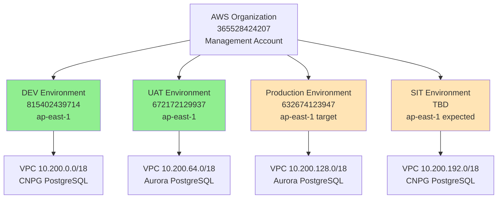
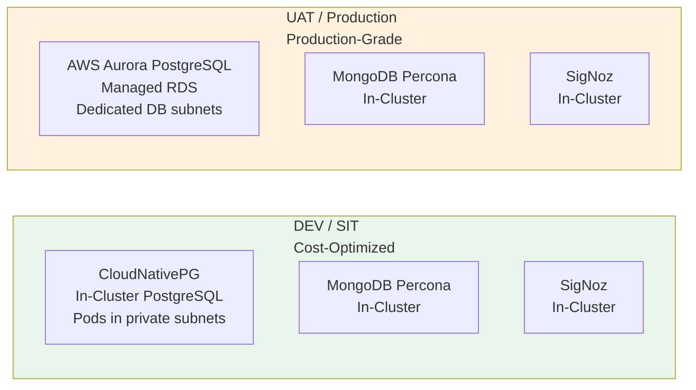

# Environment Reference

**Date:** 2026-08-06  
**Status:** Living document — update when environments change  
**Owner:** Infrastructure Architecture

## Overview

This document provides a single source of truth for all OMS environments: AWS account IDs, regions, CIDR allocations, component inventory, and architectural differences.

---

## Environment Topology

| Environment | AWS Account ID | Region | Purpose | Status |
|---|---|---|---|---|
| **DEV** | `815402439714` | `ap-east-1` | Development/testing | ✅ Active |
| **UAT** | `672172129937` | `ap-east-1` | Pre-production validation | ✅ Active |
| **Production** | `632674123947` | `ap-east-1` (target) | Production workloads | 🚧 Not provisioned yet (account exists, used as sandbox in `us-east-1` today) |
| **SIT** | TBD | `ap-east-1` (expected) | System integration testing | 📋 Planned |

**Multi-account separation**: Each environment is a **separate AWS account** under the same AWS Organization (management account `365528424207`). This provides blast radius isolation and enables separate billing/cost allocation per environment.

**Sandbox account migration**: Account `632674123947` currently hosts a sandbox environment in `us-east-1` for cheap testing. This sandbox will be **fully torn down** before the production environment is provisioned in `ap-east-1` (the real production region). See `docs/references/sandbox-teardown-runbook.md`.

---

## Network Architecture

### CIDR Allocation (`10.200.0.0/16` shared across all environments)

The entire OMS project shares a single `/16` CIDR block (`10.200.0.0/16` = 65,536 addresses total), carved into **non-overlapping** per-environment allocations. This design enables future **Transit Gateway or VPC peering** without renumbering (overlapping CIDRs would block both).

| Environment | VPC CIDR | Public Subnets | Private Subnets | DB Subnets (Aurora only) |
|---|---|---|---|---|
| **DEV** | `10.200.0.0/18` (16,384 IPs) | `10.200.0.0/24` (AZ-a), `10.200.1.0/24` (AZ-b) | `10.200.10.0/23` (AZ-a), `10.200.12.0/23` (AZ-b) | N/A (CNPG in-cluster) |
| **UAT** | `10.200.64.0/18` (16,384 IPs) | `10.200.64.0/24` (AZ-a), `10.200.65.0/24` (AZ-b) | `10.200.74.0/23` (AZ-a), `10.200.76.0/23` (AZ-b) | `10.200.80.0/24` (AZ-a), `10.200.81.0/24` (AZ-b) |
| **Production** | `10.200.128.0/18` (16,384 IPs) | `10.200.128.0/24` (AZ-a), `10.200.129.0/24` (AZ-b) | `10.200.138.0/23` (AZ-a), `10.200.140.0/23` (AZ-b) | `10.200.144.0/24` (AZ-a), `10.200.145.0/24` (AZ-b) |
| **SIT** | `10.200.192.0/18` (16,384 IPs) | `10.200.192.0/24` (AZ-a), `10.200.193.0/24` (AZ-b) | `10.200.202.0/23` (AZ-a), `10.200.204.0/23` (AZ-b) | N/A (CNPG in-cluster) |

**Design rationale**: See `docs/superpowers/specs/2026-07-29-vpc-subnet-and-boomi-routing-design.md` for full CIDR allocation math, AWS hard constraints (ALB requires `/27` + 8 free IPs, RDS requires ≥2 AZs), and Boomi networking requirements.

**Cross-account connectivity**: Managed by a separate infrastructure team via company-wide AWS Landing Zone. This repository's Terraform never creates Transit Gateway or VPC peering resources.

---

## Component Inventory by Environment

### Core Data Layer Components

| Component | DEV | UAT | Production | SIT | Notes |
|---|---|---|---|---|---|
| **PostgreSQL** | CNPG (in-cluster) | Aurora (managed RDS) | Aurora (managed RDS) | CNPG (in-cluster) | Dev/SIT use CloudNativePG for cost savings; UAT/Prod use Aurora for identical engine validation |
| **MongoDB** | Percona (in-cluster) | Percona (in-cluster) | Percona (in-cluster) | Percona (in-cluster) | Same version across all environments (audit trail DB) |
| **SigNoz** | ✅ Deployed | ✅ Deployed | 📋 Planned | 📋 Planned | Telemetry platform (traces, metrics, logs) |

### Platform Components (all environments)

| Component | Namespace | Purpose |
|---|---|---|
| **EKS Cluster** | N/A (AWS managed) | Kubernetes control plane |
| **Flux (Helm + Source)** | `flux-system` | GitOps delivery — reconciles Helm charts from git |
| **Kyverno** | `kyverno` | Policy enforcement — admission-time resource validation |
| **cert-manager** | `cert-manager` | TLS automation — issues and renews certificates |
| **AWS EBS CSI Driver** | `kube-system` | Block storage — provisions gp3 EBS volumes for PVCs |
| **EKS Pod Identity Agent** | `kube-system` | IAM binding — maps ServiceAccounts to IAM roles |

### Environment-Specific Monitoring

| Monitoring Component | DEV | UAT | Production | SIT |
|---|---|---|---|---|
| **SigNoz K8s Infra Monitoring** | ✅ | ✅ | 📋 Planned | 📋 Planned |
| **MongoDB Metrics Collector** | ✅ | ✅ | 📋 Planned | 📋 Planned |
| **PostgreSQL Metrics Collector** | ✅ (CNPG metrics) | ✅ (Aurora CloudWatch → SigNoz) | 📋 Planned | 📋 Planned |

---

## Database Engine Split

**Cost-optimization decision**: Dev and SIT use **in-cluster CNPG** (free beyond EBS storage), while UAT and Production use **AWS Aurora** (managed RDS, higher cost but enterprise support).

| Environment | PostgreSQL Engine | Rationale |
|---|---|---|
| **DEV** | CloudNativePG (CNPG), self-managed in-cluster | Cost-cutting; dev load is light |
| **SIT** | CloudNativePG (CNPG), self-managed in-cluster | Cost-cutting; SIT load is light |
| **UAT** | AWS Aurora PostgreSQL (managed RDS) | Same engine version as Prod for realistic validation |
| **Production** | AWS Aurora PostgreSQL (managed RDS) | Enterprise support, multi-AZ HA, automated backups |

**Version alignment**: Dev/SIT track the same PostgreSQL engine version as UAT/Prod where possible. When CNPG's available community image doesn't exactly match Aurora's supported version, Dev/SIT may run a slightly newer version for patch testing ahead of promotion.

**Design decision source**: `docs/superpowers/specs/2026-07-29-vpc-subnet-and-boomi-routing-design.md` § "Database Engine Decision"

---

## Architectural Differences by Environment

### DEV (815402439714)

**Purpose**: Developer sandbox for testing infrastructure changes before UAT promotion.

**Key characteristics**:
- CNPG PostgreSQL (no dedicated DB subnets needed — pods share private EKS subnets)
- Smaller instance sizes (cost optimization)
- Terraform state: `s3://sml-oms-terraform-state/oms/dev/`
- Legacy provisioning path: `scripts/provision.sh <scope>` (no `--env` flag)
- **Promotion mode**: `modeled` (changes tested here first)

**Namespace conventions**:
- MongoDB: `mongodb` (no `-dev` suffix on legacy path)
- SigNoz: `signoz` (no `-dev` suffix on legacy path)

**Access**:
- EKS API: Private endpoint only (`endpoint_public_access = false`) + VPN
- Aurora: N/A (using CNPG)

---

### UAT (672172129937)

**Purpose**: Pre-production validation with production-like architecture.

**Key characteristics**:
- Aurora PostgreSQL (dedicated DB subnets in 2 AZs: `10.200.80.0/24`, `10.200.81.0/24`)
- Production-like instance sizes
- Terraform state: `s3://sml-oms-terraform-state/oms/uat/`
- Unified provisioning path: `scripts/provision.sh --env uat <scope>`
- **Promotion mode**: `uat-build` (changes promoted from Dev, validated here before Prod)

**Namespace conventions**:
- MongoDB: `mongodb-uat` (explicit `-uat` suffix)
- SigNoz: `signoz-uat` (explicit `-uat` suffix)

**Access**:
- EKS API: Private endpoint only (`endpoint_public_access = false`) + VPN
- Aurora: Private subnets only, accessed via VPN (no public endpoint)
- IAM Identity Center permission sets (4 workforce roles): `UATInfraAdminEA`, `UATApplicationDeveloper`, `UATBoomiAdmin`, `UATBoomiProcessOwner`

**Blockers**:
- Identity Center permission sets not created yet (see `docs/references/aws-organization-requirements.md`)
- `eks-access` scope not yet provisioned (waiting on Identity Center setup)

---

### Production (632674123947)

**Purpose**: Production workloads (not yet provisioned).

**Current state**: Account exists but currently hosts a **sandbox environment in `us-east-1`** for cheap testing. Sandbox must be **fully torn down** before production provisioning begins.

**Target characteristics** (when provisioned in `ap-east-1`):
- Aurora PostgreSQL (dedicated DB subnets in 2 AZs: `10.200.144.0/24`, `10.200.145.0/24`)
- Production-grade instance sizes
- Multi-AZ high availability
- Automated backups with 7-day retention minimum
- Terraform state: `s3://sml-oms-terraform-state/oms/prod/` (expected)
- Unified provisioning path: `scripts/provision.sh --env prod <scope>`
- **Promotion mode**: (TBD — likely `prod-manual-approval`)

**Namespace conventions** (expected):
- MongoDB: `mongodb-prod` (explicit `-prod` suffix)
- SigNoz: `signoz-prod` (explicit `-prod` suffix)

**Access** (expected):
- EKS API: Private endpoint only + VPN
- Aurora: Private subnets only + VPN
- IAM Identity Center permission sets: (TBD — likely similar to UAT structure)

**Sandbox teardown**: See `docs/references/sandbox-teardown-runbook.md` before provisioning production.

---

### SIT (TBD)

**Purpose**: System integration testing (not yet provisioned).

**Target characteristics**:
- CNPG PostgreSQL (cost optimization, no dedicated DB subnets)
- Similar to DEV architecture
- CIDR allocation: `10.200.192.0/18` (reserved but not yet deployed)
- AWS Account ID: **TBD** (not yet created)

---

## Cross-Account S3 for Boomi ELT

**Business requirement**: Boomi processes running in **Production** need to read/write S3 buckets in **UAT**, **DEV**, and **SIT** for Extract-Load-Transform (ELT) operations.

**Solution**: AssumeRole cross-account pattern with external IDs for security.

| Environment | S3 Bucket Name | IAM Role | External ID | Trust From |
|---|---|---|---|---|
| **Production** | `sml-elt-prod` | `sml-elt-admin-prod` (attached to Boomi atom EC2) | N/A | EC2 service |
| **UAT** | `sml-elt-uat` | `sml-elt-cross-account-uat` | `boomi-elt-uat` | Production role |
| **DEV** | `sml-elt-dev` | `sml-elt-cross-account-dev` | `boomi-elt-dev` | Production role |
| **SIT** | `sml-elt-sit` | `sml-elt-cross-account-sit` | `boomi-elt-sit` | Production role |

**Status**: Terraform modules created, Groovy library created, not yet deployed (waiting on account IDs to be set).

**Documentation**: See `docs/references/aws-organization-requirements.md` § "Cross-Account S3 Access for Boomi ELT"

---

## Environment Constants (Immutable)

The following values are **hardcoded** in `scripts/lib/environment-contracts.sh` and are the single source of truth. Any configuration file (`.env`, `.tfvars`) that disagrees with these constants will cause a fail-closed error.

```bash
# DEV
EXPECTED_AWS_ACCOUNT_ID=815402439714
AWS_REGION=ap-east-1
TF_STATE_PREFIX=oms/dev
PROMOTION_MODE=modeled

# UAT
EXPECTED_AWS_ACCOUNT_ID=672172129937
AWS_REGION=ap-east-1
TF_STATE_PREFIX=oms/uat
PROMOTION_MODE=uat-build

# Production (when provisioned)
EXPECTED_AWS_ACCOUNT_ID=632674123947
AWS_REGION=ap-east-1  # Target region (sandbox currently uses us-east-1)
TF_STATE_PREFIX=oms/prod  # Expected
PROMOTION_MODE=(TBD)

# SIT (when provisioned)
EXPECTED_AWS_ACCOUNT_ID=(TBD)
AWS_REGION=ap-east-1  # Expected
TF_STATE_PREFIX=oms/sit  # Expected
PROMOTION_MODE=(TBD)
```

---

## Architecture Diagrams

### Multi-Account Topology



### Component Differences: DEV/SIT vs UAT/Production



---

## Namespace Naming Conventions

| Environment | MongoDB Namespace | SigNoz Namespace | PostgreSQL |
|---|---|---|---|
| **DEV** | `mongodb` (legacy, no suffix) | `signoz` (legacy, no suffix) | CNPG pods in `postgresql` namespace |
| **UAT** | `mongodb-uat` (explicit suffix) | `signoz-uat` (explicit suffix) | Aurora (no namespace, AWS managed) |
| **Production** | `mongodb-prod` (expected) | `signoz-prod` (expected) | Aurora (no namespace, AWS managed) |
| **SIT** | `mongodb-sit` (expected) | `signoz-sit` (expected) | CNPG pods in `postgresql-sit` namespace (expected) |

**Rationale**: Explicit environment suffixes prevent confusion when operating in UAT/Prod. DEV retains legacy names for backward compatibility with existing scripts.

---

## Related Documents

- **Network CIDR design**: `docs/superpowers/specs/2026-07-29-vpc-subnet-and-boomi-routing-design.md`
- **Environment provisioning design**: `docs/superpowers/specs/2026-07-22-unified-environment-provisioning-design.md`
- **AWS Organization requirements**: `docs/references/aws-organization-requirements.md` (Identity Center + cross-account S3)
- **Sandbox teardown procedure**: `docs/references/sandbox-teardown-runbook.md`
- **Component catalog**: `docs/references/component-catalog.md`
- **Architect reference**: `docs/guides/architect-reference.md`

---

## Revision History

| Date       | Author       | Changes                                      |
|------------|--------------|----------------------------------------------|
| 2026-08-06 | Claude Code  | Initial version — consolidated environment topology, CIDR allocations, component inventory, and architectural differences |
