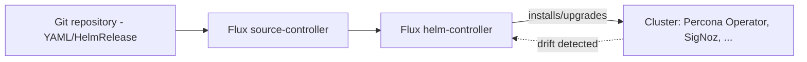
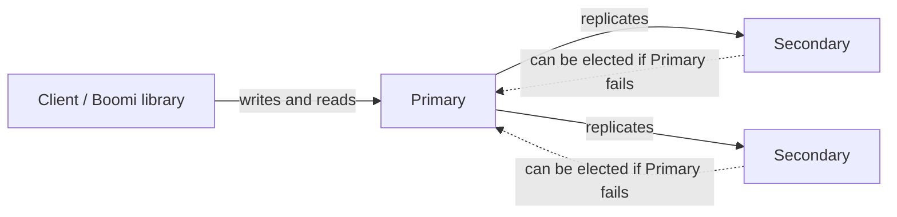
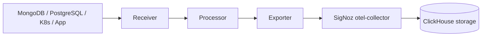

# Glossary & Concept Reference

Single lookup point for jargon and acronyms used across this repository's
docs and scripts. If a doc uses a term you don't recognize, it should link
here — if it doesn't, that's a documentation bug (see [docs/operations/README.md § Update Order](../operations/README.md#update-order)).

**How to use this page:**
- Brand new to Kubernetes/AWS/Terraform? Start with
  [Environment Setup § Core Concepts](../guides/environment-setup.md#core-concepts-read-before-you-run-any-command) —
  it explains the five ideas everything else builds on (cluster/Pod/Namespace,
  `kubectl`, port-forward, Secrets, Terraform state) with diagrams. This page
  does not repeat those diagrams; it links to them.
- Already know the basics but hit a repo-specific or domain-specific term
  (`HelmRelease`, `PBM`, `WiredTiger`, `taint`, ...)? Use the category tables
  below — they're what this page is mainly for.

## Kubernetes Basics

| Term | Meaning | Why it matters here |
|---|---|---|
| **Cluster** | A set of machines (nodes) running Kubernetes as one system. This repo uses one EKS cluster (`EKS-boomi-runtime-cluster`). | Everything (MongoDB, SigNoz, their supporting controllers) runs inside this one cluster. |
| **Node** | A single machine (VM) that is part of the cluster and runs Pods. | Node CPU/memory capacity is why some dev-cluster checks show pods `Pending` — see [Recovery Procedures](recovery-procedures.md). |
| **Pod** | The smallest deployable unit in Kubernetes — one running instance of a container/program. | `psmdb-rs0-0`, `signoz-0` are Pods you'll see constantly in commands and logs. |
| **Namespace** | A logical folder inside the cluster that groups one application's resources and keeps them separate from another's. | This repo uses `mongodb`, `signoz`, `flux-system`, `kyverno`, `cert-manager`, `kube-system`. |
| **Deployment** | A controller that keeps a set of identical Pods running and handles rolling updates. | Most stateless workloads (metrics collectors, SigNoz query-service) use this. |
| **StatefulSet** | Like a Deployment, but for workloads that need stable identity and storage per Pod (each Pod keeps its own name and disk across restarts). | MongoDB (`psmdb-rs0`) and SigNoz's ClickHouse both need this — a database can't just get a random new disk on every restart. |
| **Service** | A stable network name/address that routes traffic to a set of Pods, even as individual Pods are replaced. | `svc/signoz` is what `kubectl port-forward` and Ingress both point at — never a Pod name directly. |
| **PVC / PV** | PersistentVolumeClaim (a request for storage) and PersistentVolume (the actual storage granted). | MongoDB and ClickHouse both need a PVC per Pod so data survives Pod restarts. |
| **CR / CRD** | Custom Resource and its Custom Resource Definition — how Kubernetes is extended with new object types beyond the built-in ones. | The Percona Operator and Flux both add their own CRDs (`PerconaServerMongoDB`, `HelmRelease`). |
| **ServiceAccount** | An identity that a Pod uses to talk to the Kubernetes API or (via Pod Identity) to AWS. | `psmdb-db` is the ServiceAccount MongoDB Pods use to get their IAM permissions. |
| **RBAC** | Role-Based Access Control — Kubernetes' permission system (who/what can do what to which resources). | Not something you configure directly in this repo, but it's why some `kubectl` commands fail with "Forbidden" if your identity lacks a role. |
| **ConfigMap** | Like a Secret, but for non-sensitive configuration data. | Used for things like collector pipeline configuration. |
| **Secret** | Cluster-stored sensitive data (passwords, keys, tokens) a Pod can read without it being written into a YAML file you edit. | Full explanation: [Environment Setup § Secrets](../guides/environment-setup.md#secrets-where-passwords-and-keys-actually-live). |
| **Ingress** | A permanent, stable URL into the cluster, normally protected by SSO/OIDC. | The production alternative to port-forward — see [Environment Setup § Port-Forwarding](../guides/environment-setup.md#port-forwarding-a-temporary-personal-tunnel-into-the-cluster). |
| **Admission policy / webhook** | A rule the cluster checks *before* accepting a new/changed resource (can block or auto-fix it). | Kyverno enforces these — see [Kyverno](#platform-controllers--gitops) below. |
| **kubectl** | The command-line tool used to talk to the cluster. | Full explanation: [Environment Setup § kubectl](../guides/environment-setup.md#kubectl-your-remote-control-for-the-cluster). |
| **Port-forward** | A temporary, private tunnel from a port on your laptop into a Pod's port inside the cluster. | Full explanation with diagram: [Environment Setup § Port-Forwarding](../guides/environment-setup.md#port-forwarding-a-temporary-personal-tunnel-into-the-cluster). |
| **Finalizer** | A marker on a Kubernetes object that blocks its deletion until some cleanup logic finishes. | If a `Terminating` namespace never disappears, a stuck finalizer (commonly ClickHouse's) is almost always why — see [Recovery Procedures](recovery-procedures.md#component-by-component-teardown). |

## Platform Controllers & GitOps

| Term | Meaning | Why it matters here |
|---|---|---|
| **GitOps** | The practice of describing desired infrastructure/app state in git, with an automated controller continuously reconciling the live system to match it — instead of operators running imperative commands by hand. | This repo uses Flux for this; you edit YAML in git, Flux applies it. |
| **Flux** | The GitOps toolkit used here. Its `source-controller` watches Helm chart repositories; its `helm-controller` installs/upgrades charts based on `HelmRelease` objects. | Both the Percona Operator and SigNoz are installed this way, not via `helm install`. |
| **HelmRelease** | A Flux custom resource declaring "install this Helm chart, at this version, with these values." | If a HelmRelease shows `Ready=False`, the chart failed to install/upgrade — see [Recovery Procedures § Flux HelmRelease Stuck](recovery-procedures.md#flux-helmrelease-stuck). |
| **HelmRepository** | A Flux custom resource pointing at a Helm chart repository URL, so `HelmRelease` objects know where to pull charts from. | |
| **Reconciliation** | The control loop where a controller compares desired state (git/CRD) to actual cluster state and corrects any drift. | This is *why* re-running a provisioning script is safe — Flux/Terraform both reconcile, they don't blindly re-create things. |
| **Kyverno** | A policy engine that validates, blocks, or auto-fixes resources at admission time (before they're created). | Used here to enforce storage-class binding mode and sidecar resource limits — see [Component Catalog § Kyverno](component-catalog.md#kyverno). |
| **cert-manager** | An add-on that automates issuing and renewing TLS certificates from an `Issuer`, storing the result in a Secret. | MongoDB's internal and client TLS certificates are managed this way — see [Component Catalog § cert-manager](component-catalog.md#cert-manager). |
| **Issuer / Certificate** | cert-manager's custom resources: an `Issuer` is a certificate authority configuration; a `Certificate` requests one specific cert from it. | |

## AWS Basics

| Term | Meaning | Why it matters here |
|---|---|---|
| **EKS** | Amazon's managed Kubernetes control plane. | The cluster this whole repo provisions onto (`EKS-boomi-runtime-cluster`). |
| **IAM Role** | An AWS identity with a set of permissions (a policy) that something (a person, or here, a Pod) can assume temporarily. | MongoDB's backup agent and the metrics collectors each use a dedicated IAM role, never long-lived AWS access keys. |
| **Pod Identity** (vs. legacy IRSA) | The newer, simpler EKS mechanism for letting a Kubernetes ServiceAccount assume an IAM role, without requiring an OIDC provider to be configured for the cluster. | This cluster's OIDC issuer doesn't have a matching IAM OIDC provider, so Pod Identity is used instead of IRSA everywhere in this repo. |
| **ARN** | Amazon Resource Name — the unique identifier string for any AWS resource (for example an IAM role or S3 bucket). | You'll see these in Terraform outputs and IAM commands. |
| **VPC / Subnet** | A VPC is an isolated private network in AWS; subnets are smaller IP ranges within it, often tied to an availability zone. | Aurora PostgreSQL is provisioned into specific private subnets for network isolation. |
| **Security Group** | A virtual firewall controlling inbound/outbound traffic for AWS resources (like Aurora). | Controls what can talk to the PostgreSQL cluster over the network. |
| **S3 bucket** | AWS's object storage service. This repo uses two buckets: one for Terraform state, one for MongoDB backups (PBM). | See [Component Catalog § Terraform S3 State Backend](component-catalog.md#terraform-s3-state-backend). |
| **AWS SSO / IAM Identity Center** | Centralized login: you authenticate once in a browser, then CLI tools use short-lived temporary credentials instead of long-lived access keys. | Required before any `aws` or `terraform` command works — see [Environment Setup](../guides/environment-setup.md#configure-aws-cli-with-sso). |
| **Aurora cluster vs. writer instance** | The "cluster" is the logical database (endpoint, storage, backups); the "writer instance" is the actual compute node currently accepting writes. | Destroying/creating the writer instance (not the cluster) is what takes the ~4-5 minutes seen during PostgreSQL provisioning. |
| **CloudWatch** | AWS's built-in metrics/logs service. Aurora publishes CPU, IOPS, connection, and replication-lag metrics here automatically. | The PostgreSQL Metrics Collector reads these and forwards them into SigNoz — see [Component Catalog § PostgreSQL Metrics Collector](component-catalog.md#postgresql-metrics-collector). |

## Terraform Basics

| Term | Meaning | Why it matters here |
|---|---|---|
| **Terraform** | A tool that creates real cloud resources from code, and tracks what it created. | Full explanation: [Environment Setup § Terraform State](../guides/environment-setup.md#terraform-state-why-we-never-run-terraform-apply-by-hand-here). |
| **Terraform state** | The record of what Terraform has already created, so it knows what to change/leave alone on the next run. | Stored remotely (see below), never on your laptop. |
| **State key** | The path/filename of one Terraform root's state file inside the shared S3 bucket (S3 has no real folders — this is just a naming convention). | See the full mapping table in [Component Catalog § Terraform S3 State Backend](component-catalog.md#terraform-s3-state-backend). |
| **Root / Module** | A "root" is a folder where you actually run Terraform (`mongodb`, `postgresql`, `signoz-observability`); a "module" (like `reusable`) is shared code with no state of its own. | |
| **Provider** | A plugin that lets Terraform talk to a specific system (AWS, Kubernetes, SigNoz's own API). | This repo uses `hashicorp/aws`, `hashicorp/kubernetes`, and `SigNoz/signoz`. |
| **tfvars** | A file providing input values (like `cluster_name`, `db_master_password`) to a Terraform root. Never committed to git. | Created by copying `terraform.tfvars.sample` — see the Operator Runbook. |
| **Plan / Apply** | `plan` previews what would change without doing it; `apply` actually makes the change. | Wrapper scripts always run `plan` then `apply` for you. |
| **Taint** | A marker on a resource in state meaning "destroy and recreate it on the next apply," instead of updating it in place. | A known SigNoz provider bug incorrectly taints alert resources on first apply — auto-healed by `provision-signoz-observability.sh`, see that Terraform root's [README](../../platform-prerequisites/terraform/signoz-observability/README.md). |
| **Import** | Telling Terraform "this real resource already exists, start tracking it in state" without creating anything new. | Used to recover from state drift — see [Recovery Procedures § Terraform State Recovery](recovery-procedures.md#terraform-state-recovery). |

## MongoDB / Percona Specific

| Term | Meaning | Why it matters here |
|---|---|---|
| **Replica set** | A group of MongoDB nodes (here, 3) holding copies of the same data. One node is elected **Primary** (accepts writes); the others are **Secondaries** (replicate from the primary, serve as failover candidates). | Clients must always write to the Primary — writing to a Secondary directly is a common integration bug (see the Boomi Integration Guide's note about the `replicaSet` URI parameter). |
| **PSMDB** | Percona Server for MongoDB — the specific MongoDB distribution this repo runs. | |
| **Percona Operator** | A Kubernetes controller that automates MongoDB replica-set lifecycle: startup, scaling, backup, restore, upgrades. | You interact with it by editing the `PerconaServerMongoDB` custom resource, not by running `mongod` commands directly. |
| **PBM** | Percona Backup for MongoDB — the backup agent/sidecar that writes replica-set backups to the PBM S3 bucket. | See [Component Catalog § PBM Backup Bucket](component-catalog.md#pbm-backup-bucket). |
| **WiredTiger cache** | MongoDB's storage engine's in-memory cache size setting. | Configured in the dev overlay (`cacheSizeGB`) — see [Configuration Catalog](../operations/dev-configuration-catalog.md). |
| **Encryption key / escrow file** | MongoDB's data-at-rest encryption key. "Escrow file" here means a local backup copy of a secret's value kept outside the cluster (e.g. `.local-dev-encryption-key.txt`), used to recreate a Secret if it's ever deleted. | Losing both the cluster Secret and the escrow file makes encrypted data permanently unrecoverable — see [Recovery Procedures § MongoDB Encryption Key Lost](recovery-procedures.md#mongodb-encryption-key-lost). |
| **clusterAdmin / clusterMonitor / userAdmin / backup** | The four built-in Percona-Operator user roles this repo provisions credentials for: cluster administration, read-only monitoring, user management, and backup operations respectively. | Created by `scripts/bootstrap-dev-secrets.sh`. |
| **Split-brain** | A failure mode where more than one node believes it is the Primary at the same time, risking data divergence. | Why credential rotation should be coordinated with the Operator's own rotation mechanism rather than done ad hoc — see [Recovery Procedures § MongoDB Credential Rotation](recovery-procedures.md#mongodb-credential-rotation). |

## SigNoz / Observability Specific

| Term | Meaning | Why it matters here |
|---|---|---|
| **OTLP** | OpenTelemetry Protocol — the standard format used to send logs, traces, and metrics to SigNoz. | The Boomi library and metrics collectors all speak this protocol. |
| **OTel Collector** | A pipeline process with three stages: **receivers** (accept incoming telemetry), **processors** (transform/batch it), **exporters** (send it onward — here, to SigNoz). | Each metrics collector (MongoDB, PostgreSQL, k8s-infra) is one of these pipelines, differently configured. |
| **ClickHouse** | The column-oriented database SigNoz uses internally to store all telemetry data. | If SigNoz's ClickHouse PVC/data is corrupted, telemetry history is lost — see [Recovery Procedures § SigNoz Recovery](recovery-procedures.md#signoz-recovery). |
| **Dashboard** | A saved collection of visualizations (panels) over telemetry data in SigNoz. | This repo manages 5 baseline dashboards as Terraform code — see [SigNoz Dashboard Import Pack](signoz-dashboard-import-pack.md). |
| **Alert (rule)** | A condition SigNoz continuously evaluates against telemetry data, firing a notification when it's met. | This repo manages 5 baseline alerts as Terraform code — same reference as above. |
| **Notification channel** | Where an alert's firing notification is sent (Slack, webhook, email). Not configured by default in this dev environment. | See [SigNoz Dashboard Import Pack § Alert rationale and ownership](signoz-dashboard-import-pack.md). |
| **SigNoz Service Account / API key** | SigNoz's own internal concept of a machine identity + token, separate from a human login — required so Terraform can authenticate to SigNoz's API. | Auto-created by `scripts/bootstrap-signoz-service-account.sh`. |
| **Root user** | SigNoz's built-in mechanism for auto-provisioning the first admin account from a Kubernetes Secret, instead of a manual "first signup wins" race. | See [Operator Runbook § SigNoz Admin Account Bootstrap](../guides/operator-runbook.md#step-7a-signoz-admin-account-bootstrap-automated-no-manual-signup). |

## Boomi / Application Specific

| Term | Meaning | Why it matters here |
|---|---|---|
| **Audit log / audit trail** | An immutable record of a business event (who did what, when, to what resource) written to MongoDB for compliance and traceability. | The core purpose of the MongoDB database in this repo. |
| **Audit Log Contract** | The canonical fixed document shape, field semantics, naming rules, and module extension policy for every audit producer. | Prevents Boomi and other modules from inventing incompatible audit records. See [Audit Log Contract](audit-log-contract.md). |
| **Trace ID** | A correlation identifier shared by the audit records and telemetry for one logical operation. Multiple records may use the same value. | Used to reconstruct a cross-system timeline; it is not a unique record ID. |
| **Groovy library** | `BoomiAuditLogLibrary.groovy` — the production code Boomi processes call to write audit logs and resolve secrets. Distinct from the test-harness script with a similar name. | See [Boomi Integration Guide § Audit Log Library](../guides/boomi-integration-guide.md#audit-log-library). |

## Related Docs

- [Environment Setup § Core Concepts](../guides/environment-setup.md#core-concepts-read-before-you-run-any-command) — the foundational concepts with full diagrams
- [Component Catalog](component-catalog.md) — what/why/how for every deployed component
- [Architect Reference](../guides/architect-reference.md) — architecture diagrams and state model
- [docs/index.md](../index.md) — central navigation hub
