# Provisioning Flows & Per-Environment Infrastructure Diagrams

**Audience:** Enterprise Architect review, and anyone who needs to see exactly
what each script/Terraform root/GitOps path does before it runs — not a
narrative summary.

**Status of this document:** Reflects the **actual current code**, verified by
reading every script/root/manifest referenced below (not by reading other
docs). Where current code differs from what other docs imply, that is called
out explicitly with a **⚠ Gap** note.

## Table of Contents

1. [What This Repo Is Trying To Provision](#1-what-this-repo-is-trying-to-provision)
2. [Top-Level Entrypoint Routing](#2-top-level-entrypoint-routing)
3. [Legacy Dev Path — What Actually Runs Today](#3-legacy-dev-path--what-actually-runs-today)
   - [3a. `provision-k8s-components.sh mongodb`](#3a-provision-k8s-componentssh-mongodb--detailed-steps)
   - [3b. `provision-k8s-components.sh postgresql`](#3b-provision-k8s-componentssh-postgresql--detailed-steps)
   - [3c. `provision-k8s-components.sh signoz`](#3c-provision-k8s-componentssh-signoz--detailed-steps)
   - [3d. `signoz-observability`](#3d-signoz-observability--dashboards-alerts-as-code)
4. [Destroy Flow](#4-destroy-flow)
   - [4a. Legacy destroy — scope granularity](#4a-legacy-destroy--scope-granularity-answers-can-i-destroy-just-one-component)
   - [4b. Unified orchestrator destroy — two-pass evidence protocol](#4b-unified-orchestrator-destroy--two-pass-evidence-protocol)
5. [Scope Implementation Status](#5-scope-implementation-status-unified-orchestrator---env-devuat)
6. [AWS Account-ID Guard Chain](#6-aws-account-id-guard-chain-verified-defense-in-depth)
7. [Per-Environment Infrastructure Diagrams](#7-per-environment-infrastructure--whats-actually-different)
8. [Provisioning Command Reference — Full Component Lists](#8-provisioning-command-reference--full-component-lists)
9. [Repo Scope Coverage Assessment](#9-repo-scope-coverage-assessment-does-this-repo-do-what-its-for)
   - [Boomi Provisioning Boundary](#boomi-provisioning-boundary)
   - [Deferred — Needs Scoping](#deferred--needs-scoping-not-started-pending-a-scoping-conversation)
10. [Open Items](#10-open-items-tracked-separately-not-fixed-by-this-document)

---

## 1. What This Repo Is Trying To Provision

Per its stated purpose, this repo is meant to provision **the full data-layer
and supporting infrastructure for OMS**, including:

- **Base AWS network/identity infra:** VPC, subnets (public/private/database),
  Internet Gateway, NAT Gateway, route tables, S3 VPC endpoint, security
  groups, IAM roles (cluster, node, OIDC, autoscaler, load-balancer
  controller), EKS cluster + managed node group + addons, EFS, AWS Backup
  vault.
- **Application data stores:** Aurora PostgreSQL (**core** — implemented;
  **brand** — see §9 gap), MongoDB (Percona/PSMDB on K8s).
- **Telemetry:** SigNoz (traces/metrics/logs) plus dashboards/alerts as code.
- **Integration workload:** Boomi runtime (namespace exists; scope
  unimplemented — see §9).
- **Two deployment surfaces:** `dev` and `uat` are both meant to run the same
  components — MongoDB and SigNoz always via Kubernetes/GitOps regardless of
  environment; PostgreSQL via managed Aurora regardless of environment.

**Why this matters for reading the rest of this document:** every diagram
below is checked against this stated scope. Where a diagram shows something
missing, it's missing *relative to this stated purpose*, not relative to an
arbitrary standard.

---

## 2. Top-Level Entrypoint Routing

Both public entrypoints (`provision.sh`, `destroy.sh`) are thin routers. They
make exactly one decision — is `--env` the first argument? — and hand off
completely to one of two independent implementations.

**Why two implementations exist at all:** the legacy path (`scripts/legacy/dev/`)
is the original, frozen, dev-only implementation — it is the one that
*actually provisions real infrastructure today*. The unified orchestrator
(`scripts/lib/orchestrator.sh`) is a newer system built to eventually run
`dev` and `uat` through one shared code path, with much stronger safety
guarantees (account-ID guards, two-pass destroy evidence). It is being built
incrementally — some scopes are real, some are still stubs (§5).

**As of this change**, a bare invocation with no `--env` now prints an
explicit notice before falling through to the legacy dev path, so it's never
silently ambiguous which environment a command targets:

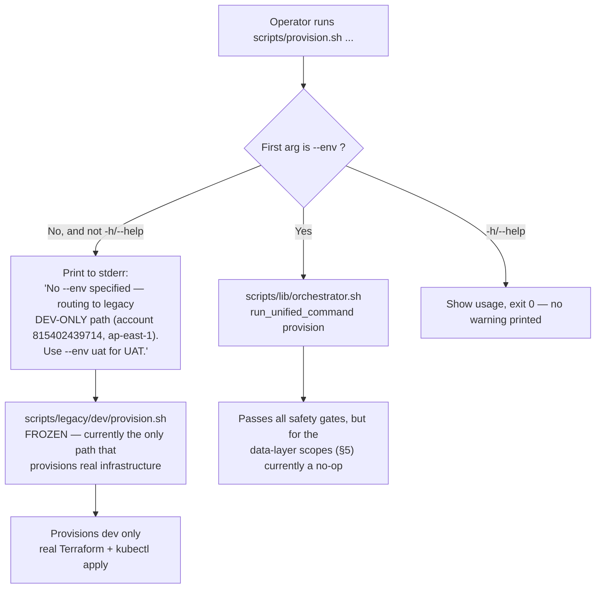

---

## 3. Legacy Dev Path — What Actually Runs Today

This is the **only path that currently provisions real infrastructure**, and
only for the `dev` environment (account `815402439714`, region `ap-east-1`).

**What it's trying to achieve:** stand up the complete dev data layer —
MongoDB prerequisites (IAM/S3) via Terraform, then the MongoDB workload via
Kustomize; PostgreSQL (Aurora) fully via Terraform; SigNoz fully via
Kustomize/Flux. **Why split this way:** MongoDB needs both an AWS side
(backup IAM role + S3 bucket) and a K8s side (the actual replica set), so it
runs through both `provision-platform-prereq.sh` (Terraform) and
`provision-k8s-components.sh` (kubectl). PostgreSQL's data plane is fully
AWS-managed (Aurora), so it only needs the Terraform half plus a thin K8s
overlay for the CNPG cluster object. SigNoz needs no Terraform prerequisites
at all — it's pure Kubernetes/Helm.

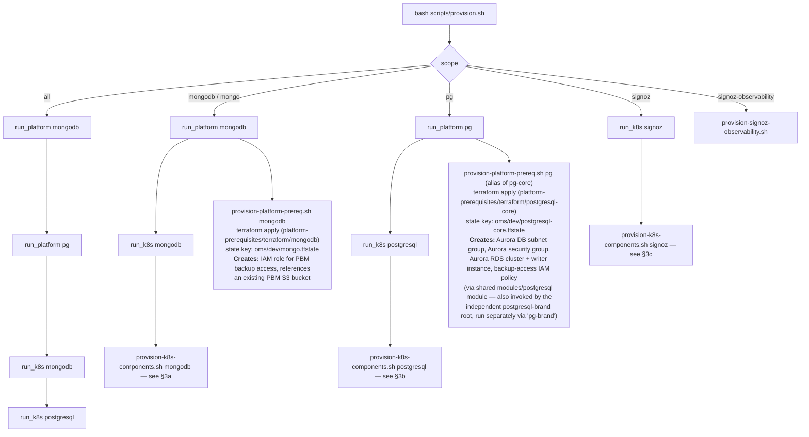

**⚠ Gap:** `provision-platform-prereq.sh` hardcodes `TF_STATE_BUCKET` default
to `sml-oms-dev-tfstate` and always reads a single `terraform.tfvars` file per
root — there is no `--env` parameter and no `uat.tfvars` for the `mongodb` or
`postgresql` Terraform roots. This script cannot target UAT even in
principle without code changes (tracked in §10).

### 3a. `provision-k8s-components.sh mongodb` — detailed steps

**What it's trying to achieve:** get a running, TLS-secured, policy-compliant
Percona MongoDB replica set with credentials in place. **Why this order:**
Flux CRDs must exist before the operator HelmRelease can be applied;
Kyverno's ClusterPolicy CRD must exist before policies are applied; secrets
must exist before the MongoDB CR is created (the CR references them); the
MongoDB CRD itself must be `Established` before the actual cluster CR is
applied, or the apply fails outright.

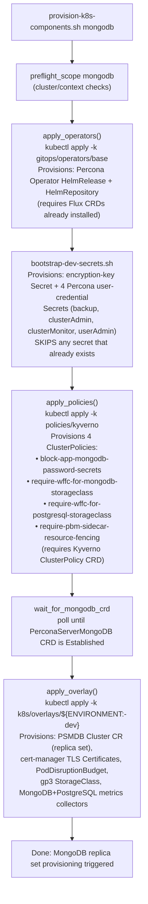

### 3b. `provision-k8s-components.sh postgresql` — detailed steps

**What it's trying to achieve:** deploy the CloudNativePG (CNPG) operator and
the `Cluster` custom resource that connects to the already-Terraform-provisioned
Aurora instance. **Why CNPG at all if Aurora is AWS-managed:** CNPG here
manages the in-cluster credentials/connection wiring and health checks for
the application side, not the database engine itself.

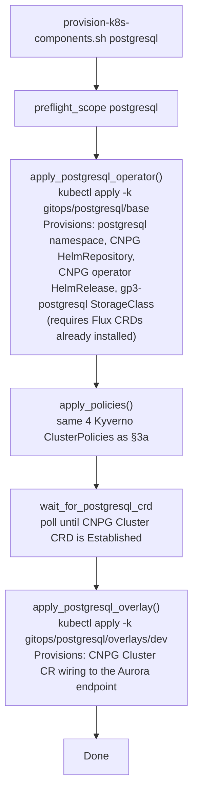

### 3c. `provision-k8s-components.sh signoz` — detailed steps

**What it's trying to achieve:** a running SigNoz stack with an
auto-bootstrapped admin account, avoiding the manual "first person to sign up
becomes admin" race condition that SigNoz has by default.

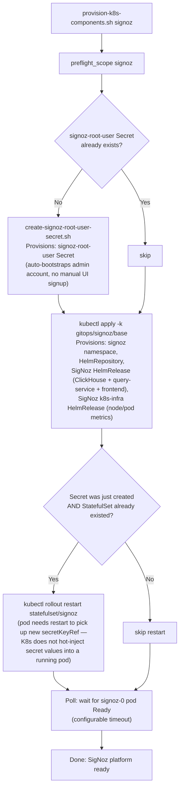

### 3d. `signoz-observability` — dashboards/alerts as code

**What it's trying to achieve:** apply SigNoz dashboards and alert rules as
Terraform-managed resources instead of manual JSON import, so they're
versioned and reproducible. **Why it needs a browser automation step:**
SigNoz's API-key creation for Terraform requires a one-time UI action; rather
than making an operator do this by hand, a headless Playwright script does it
once and caches the result as a K8s Secret.

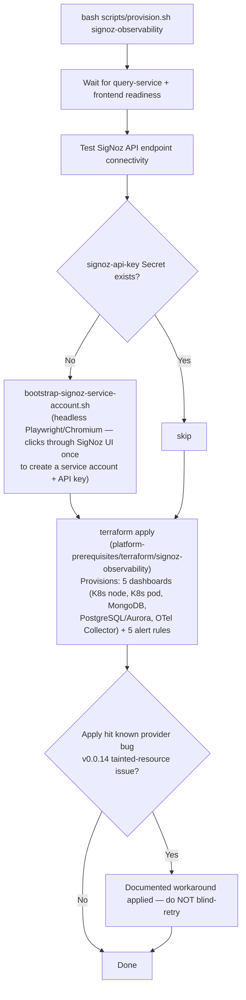

---

## 4. Destroy Flow

### 4a. Legacy destroy — scope granularity (answers "can I destroy just one component?")

**Updated:** `scripts/destroy.sh` (legacy path) now supports the same
finer-grained scopes `provision-k8s-components.sh` supports for provisioning
— `operators`, `policies`, and per-database `overlay`/`postgresql-overlay` —
in addition to the original whole-scope bundles (`mongodb`, `pg`/`postgresql`,
`signoz`, `signoz-observability`, `all`). Within `mongodb`/`pg` themselves,
the K8s workload and Terraform prerequisites still tear down together as one
step — use the finer scopes below if you need just one layer.

**Ordering constraint:** destroy `overlay`/`postgresql-overlay` **before**
`operators` — removing the operator HelmRelease while a live
Cluster/PSMDB CR still exists orphans its StatefulSet/Pods (no controller
left to reconcile them). This is the reverse of provisioning order, where
operators are applied first. `policies` (Kyverno ClusterPolicies) has no
such constraint — safe to destroy independently at any time.

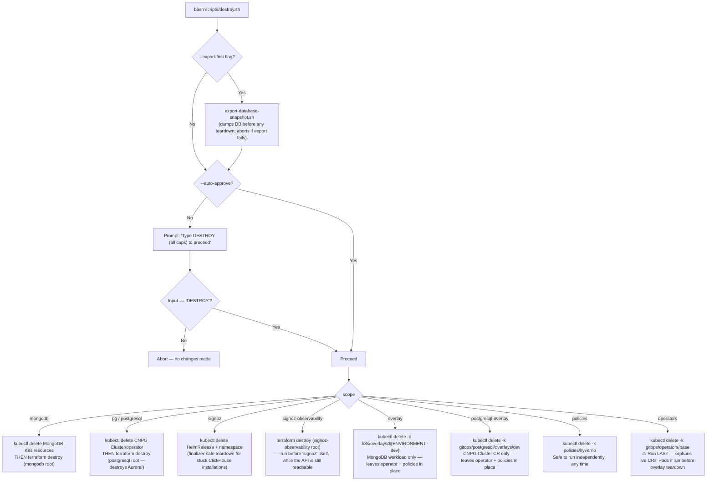

### 4b. Unified orchestrator destroy — two-pass evidence protocol

This is real, implemented logic (unlike the data-layer provision/verify
stubs in §5) — it gates any `--env dev|uat` destroy, regardless of whether
the underlying scope's own destroy handler is a stub or real. **Why it
exists:** to prevent an operator from destroying the wrong scope/environment
by mistake, with a tamper-evident, single-use confirmation artifact instead
of just a typed prompt.

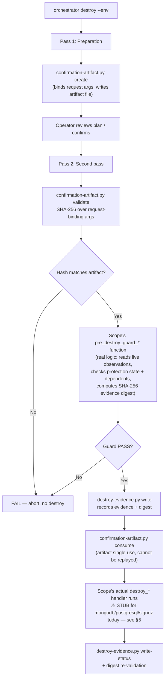

---

## 5. Scope Implementation Status (Unified Orchestrator, `--env dev|uat`)

Verified by reading every handler file directly — not inferred from
comments elsewhere.

| Scope | Provision | Destroy | Verify | Pre-destroy guard |
|---|---|---|---|---|
| `backend` | Real | Blocked by design (break-glass only) | — | — |
| `access-governance` | Real | Blocked by design (retained-control) | — | — |
| `eks-access` | Real | **Missing** (no handler file) | Real | — |
| `eks-platform` | Real (identity/drift-vector logic) | Real | Real | Real |
| `platform-controllers` | Real | Real | Real | Real |
| `workload-identity` | Real | Real | Real | Real |
| `mongodb` | **Stub** (`printf INFO; return 0`) | **Stub** | **Stub** (`printf PASS; return 0`) | Real |
| `mongodb-access` | **Stub** | **Stub** | **Stub** | Real |
| `postgresql-core` | **Stub** | **Stub** | **Stub** | Real |
| `postgresql-brand` | **Stub** | **Stub** | **Stub** | Real |
| `signoz` | **Stub** | **Stub** | **Stub** | Real |
| `signoz-observability` | **Stub** | **Stub** | **Stub** | Real |
| `boomi-runtime` | **Missing entirely** | Missing | Missing | Missing |
| `database-access-core` | **Missing entirely** | Missing | Missing | Missing |
| `database-access-brand` | **Missing entirely** | Missing | Missing | Missing |

"Stub" = function exists, is called correctly by the orchestrator, but its
body only prints an INFO/PASS line and returns success — it never calls
Terraform or `kubectl`. Source: `scripts/lib/packages/{30-mongodb,
40-postgresql,50-signoz}/internal/{lifecycle-handlers,verifiers}.sh`, each
file's own header literally says `(stubs)`.

---

## 6. AWS Account-ID Guard Chain (Verified, Defense in Depth)

This is real and currently enforced for everything in the "Real" column
above. **Why four layers instead of one:** each layer catches a different
failure mode — a stale/copy-pasted `.env` file (Layer 2), a misconfigured
`AWS_PROFILE` in the operator's shell (Layer 3), and a Terraform-level typo
that bypasses the shell entirely if someone runs `terraform apply` by hand
(Layer 4).

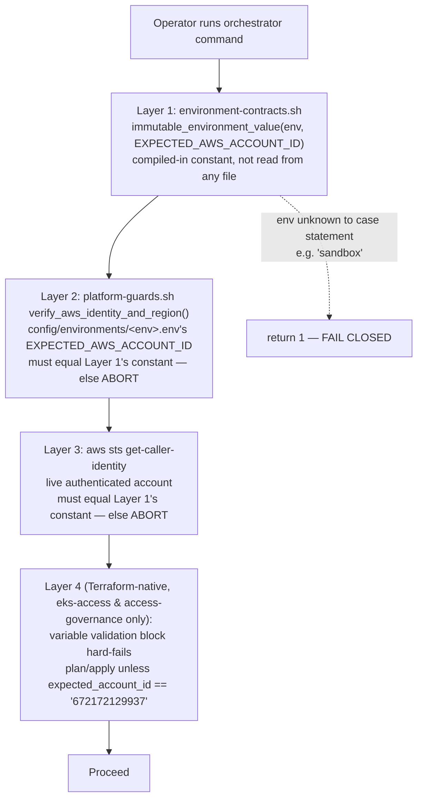

| Environment | Account ID | Region | Guarded? |
|---|---|---|---|
| `dev` | `815402439714` | `ap-east-1` | Yes (Layers 1-3) |
| `uat` | `672172129937` | `ap-east-1` | Yes (Layers 1-4 for eks-access/access-governance) |
| `sandbox` | *(none in contract)* | `us-east-1` | **No** — see §9 for why this is safe to ignore. |

**⚠ Known gap (legacy path only):** `scripts/legacy/dev/provision.sh`,
`destroy.sh`, and `provision-platform-prereq.sh` have **no account-ID guard at
all** — zero hits for `get-caller-identity`/account comparisons.
`verify-platform-health.sh --preflight` only *reports* the authenticated
account (does not compare/abort). This means the legacy path — the one that
actually provisions dev today — would not stop a misconfigured `AWS_PROFILE`
from touching the wrong account. This is a real exposure, independent of the
UAT/sandbox questions above (tracked in §10).

---

## 7. Per-Environment Infrastructure — What's Actually Different

### `dev` (account `815402439714`, region `ap-east-1`) — fully provisioned today

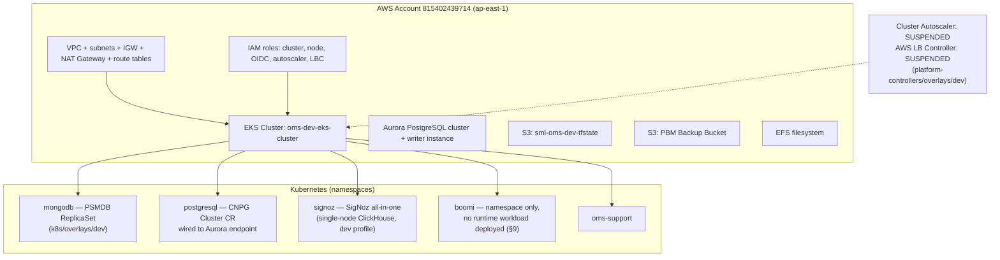

### `uat` (account `672172129937`, region `ap-east-1`) — Access Foundation only; data layer NOT provisioned

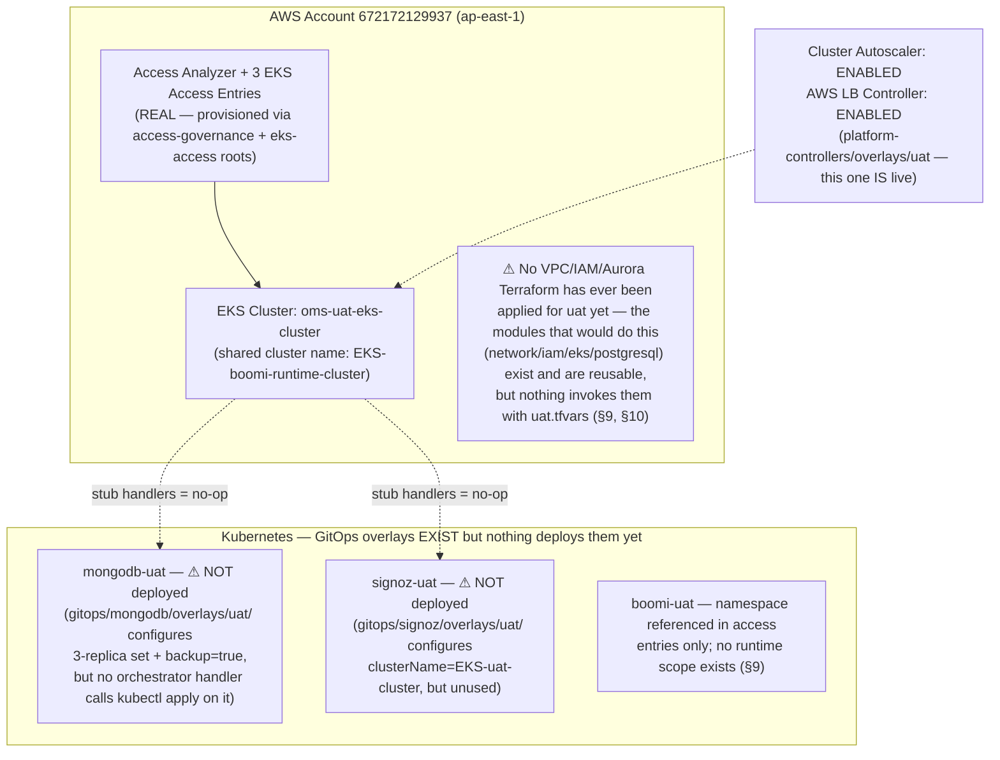

**Key finding:** GitOps-level UAT configuration (3-replica MongoDB with
backup enabled, real UAT cluster ARN, autoscaler/LB-controller enabled
instead of suspended) already exists in `gitops/*/overlays/uat/` — someone
has already designed what UAT *should* look like. It's just not reachable
from any provisioning script yet.

### `sandbox` — historical only, being decommissioned (see §9 for why you can ignore it)

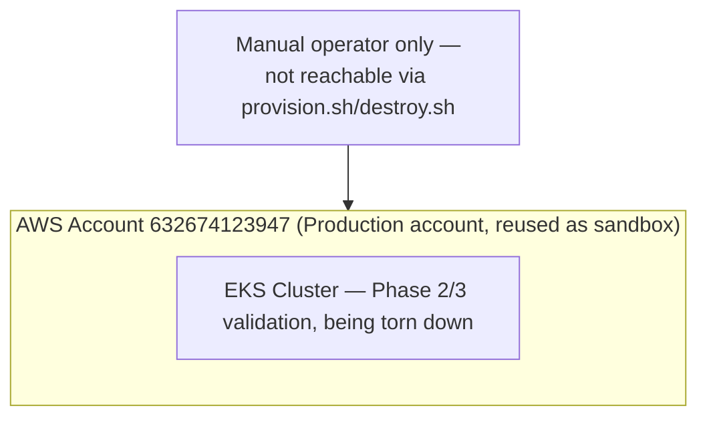

---

## 8. Provisioning Command Reference — Full Component Lists

| Command | Full list of what it provisions | Environment |
|---|---|---|
| `bash scripts/provision.sh all` | **Terraform:** MongoDB backup IAM role + S3 reference; Aurora subnet group + security group + RDS cluster + writer instance + backup IAM policy. **Kubernetes:** Percona Operator HelmRelease, 4 credential/encryption Secrets, 4 Kyverno ClusterPolicies, PSMDB Cluster CR + TLS certs + PDB + gp3 StorageClass + metrics collectors; CNPG operator HelmRelease + gp3-postgresql StorageClass + CNPG Cluster CR wired to Aurora. | dev only |
| `bash scripts/provision.sh mongodb` | Same MongoDB-specific items as above (Terraform IAM/S3 + Percona operator + secrets + policies + PSMDB CR + certs + PDB + metrics collectors). | dev only |
| `bash scripts/provision.sh pg` | Same PostgreSQL-specific items as above (Aurora subnet group/SG/cluster/instance via Terraform + CNPG operator + Cluster CR via Kustomize). | dev only |
| `bash scripts/provision.sh signoz` | signoz-root-user Secret, SigNoz namespace, HelmRepository, SigNoz HelmRelease (ClickHouse + query-service + frontend), SigNoz k8s-infra HelmRelease (node/pod metrics). No Terraform. | dev only |
| `bash scripts/provision.sh signoz-observability` | signoz-api-key Secret (via one-time Playwright bootstrap if missing), 5 Terraform-managed dashboards (K8s node, K8s pod, MongoDB, PostgreSQL/Aurora, OTel Collector), 5 alert rules. | dev only |
| `bash scripts/provision.sh --env uat access-governance` | Real: AWS Access Analyzer for the UAT account. | uat |
| `bash scripts/provision.sh --env uat eks-access` | Real: exactly 3 EKS access entries + policy associations (Infra Admin/EA, Application Developer get cluster admin; Boomi Admin gets admin scoped to `boomi-uat` only). | uat |
| `bash scripts/provision.sh --env uat mongodb` | **Nothing** — prints an INFO line, returns success. No Terraform, no kubectl. | uat |
| `bash scripts/provision.sh --env uat postgresql-core` | **Nothing** — same stub behavior. | uat |
| `bash scripts/provision.sh --env uat signoz` | **Nothing** — same stub behavior. | uat |
| Any command targeting `sandbox` via these scripts | Rejected — not a recognized `--env` value. | n/a |
| `bash scripts/destroy.sh <scope>` | Removes everything the matching `provision.sh <scope>` created, in one combined step (K8s + Terraform together — see §4a). `signoz` destroy additionally clears stuck ClickHouse finalizers. `pg` destroy includes destroying the live Aurora cluster. | dev only |

---

## 9. Repo Scope Coverage Assessment (does this repo do what it's for?)

Checked directly against §1's stated scope:

| Component | Status | Evidence |
|---|---|---|
| VPC, subnets, IGW, NAT Gateway, route tables, S3 VPC endpoint | ✅ Real | `platform-prerequisites/terraform/modules/network/main.tf` |
| Security groups | ✅ Real (for Aurora) | `platform-prerequisites/terraform/modules/postgresql/main.tf` |
| IAM (cluster/node/OIDC/autoscaler/LBC roles) | ✅ Real | `platform-prerequisites/terraform/modules/iam/main.tf` |
| EKS cluster + node group + addons | ✅ Real | `platform-prerequisites/terraform/modules/eks/main.tf` |
| EFS, AWS Backup vault | ✅ Real | `modules/efs/`, `modules/backup/` |
| S3 (general-purpose) | ✅ Real (reusable module) | `platform-prerequisites/terraform/reusable/main.tf` |
| Aurora PostgreSQL — **core** | ✅ Real | `platform-prerequisites/terraform/postgresql-core/main.tf` |
| Aurora PostgreSQL — **brand** | ✅ Built, not yet applied | `platform-prerequisites/terraform/postgresql-brand/` — independent sibling root invoking the same `modules/postgresql` module; `terraform.tfvars.sample` has placeholder VPC/subnet/IAM values pending real UAT/prod infra IDs |
| MongoDB (Percona/PSMDB via K8s) | ✅ Real, dev only | §3a |
| SigNoz (K8s/GitOps) + dashboards/alerts as code | ✅ Real, dev only | §3c, §3d |
| Boomi runtime | ✅ By design, not a gap | No Boomi workload exists, and none should — see [§ Boomi Provisioning Boundary](#boomi-provisioning-boundary) below |
| `dev` environment, fully wired | ✅ | §7 |
| `uat` environment — Access Foundation | ✅ | §7, §8 |
| `uat` environment — data layer (MongoDB/PostgreSQL/SigNoz) | ❌ **Stub only** | §5 |

**Bottom line:** the foundational infra layer (network/IAM/EKS/storage/backup)
is genuinely complete and reusable across environments. The real gaps
against this repo's stated purpose are: **Aurora brand DB (never built,
required for prod)** and **UAT data-layer wiring (built as stubs, not real
implementations)**. Boomi runtime is intentionally out of scope (see below),
not a gap. These are tracked in §10 and the "Deferred — Needs Scoping"
section that follows.

---

## Boomi Provisioning Boundary

**This repo provisions no Boomi workload — by design, not by omission.**
Verified by full-repo search: there is no Deployment, StatefulSet,
HelmRelease, or namespace manifest for Boomi anywhere in `k8s/` or `gitops/`.
Boomi requires its own license key; a Boomi admin deploys/configures Boomi
processes independently, onto whichever environment holds a valid license,
using Boomi's own platform tooling — entirely outside this repo's
provisioning path.

What this repo *does* provision, as Boomi-adjacent plumbing only — never
bundled implicitly into `all` or any core-infra scope:

| Artifact | File(s) | What it actually is |
|---|---|---|
| Namespace name | `BOOMI_NAMESPACE` in `config/environments/*.env` (`boomi` / `boomi-uat`) | A name string other resources reference. The namespace *object* itself has no manifest in this repo today. |
| EKS access entry | `platform-prerequisites/terraform/eks-access/` (`boomi_admin_role_arn` variable + `aws_eks_access_entry`/`aws_eks_access_policy_association`) | Grants a Boomi Admin IAM principal cluster access scoped to the Boomi namespace, so Boomi's own tooling can reach the cluster. Independently provisionable via `scripts/provision.sh --env uat eks-access` — never coupled to MongoDB/PostgreSQL/SigNoz provisioning. |
| Connection secret | `scripts/create-audit-writer-secret.sh` → `oms-audit-writer` K8s Secret | A MongoDB connection URI for an *external* Boomi process to consume. Not a pod spec — nothing runs from this Secret inside the cluster. |
| Groovy libraries | `scripts/groovy/boomi/BoomiAuditLogLibrary.groovy`, `BoomiOtelLibrary.groovy` | Code meant to execute *inside Boomi's own* scripting runtime (both files declare `package boomi`), not a Kubernetes workload this repo deploys. |

The `boomi-runtime` scope in `scripts/lib/scope-registry.sh` exists in the
registry (dependency graph, state-key naming) but has **zero handler
implementation** — every call fails closed with "requires work package 5."
This is consistent with the boundary above: there is no in-cluster Boomi
runtime for this repo to provision, so the scope correctly has nothing
behind it. If a future need arises to deploy Boomi *components* inside this
cluster (not just grant access to an external Boomi), that would be a new,
explicitly-scoped decision — not an accidental gap to silently fill.

---

## Deferred — Needs Scoping (not started, pending a scoping conversation)

These are real, confirmed gaps against this repo's stated purpose, but each
is large enough (or requires a design decision) that it should not be
started without an explicit go-ahead and its own plan:

1. **Make `--env` mandatory for every environment, including `dev`,
   eliminating the silent legacy-path default.** Blocked on: every unified
   orchestrator data-layer scope (`mongodb`, `postgresql-core`,
   `postgresql-brand`, `signoz`, `signoz-observability`, `mongodb-access`,
   `database-access-core/brand`) is currently an unconditional-fail
   placeholder (§5) — the real Terraform-apply/`kubectl apply`/secret-bootstrap
   logic exists *only* in `scripts/legacy/dev/*.sh`, hardcoded to the `dev`
   account/region. Making `--env` mandatory today, before porting that logic
   into the unified handlers (or having them shell out to parameterized
   versions of the legacy scripts), would make provisioning fail for every
   environment, including dev. This also requires reconciling scope naming
   — legacy `pg`/`mongo` have no unified equivalent yet (unified splits `pg`
   into `postgresql-core`/`postgresql-brand`).

~~2. Aurora "brand" database~~ — **done.** `platform-prerequisites/terraform/modules/postgresql/`
is a reusable module invoked by two independent sibling roots
(`postgresql-core/`, `postgresql-brand/`), matching the state-key convention
already defined in `config/environments/*.env`. See
[enterprise-architecture.md § Production Readiness — Now](../guides/enterprise-architecture.md#now)
for current status (built, not yet applied to any real environment).

---

## 10. Open Items (tracked separately, not fixed by this document)

1. ~~Fill in real logic for `mongodb`/`postgresql-core`/`postgresql-brand`/`signoz`/`signoz-observability` handlers, OR create `uat.tfvars` for those Terraform roots~~ — superseded by "Deferred — Needs Scoping" item 1 above, which captures this with full context.
2. Add an account-ID guard to the legacy path (`scripts/legacy/dev/*.sh`), matching the 4-layer pattern already used for `uat`'s Access Foundation.
3. Implement `database-access-core`, `database-access-brand` scopes (currently absent entirely). `boomi-runtime` is intentionally excluded from this list — see § Boomi Provisioning Boundary above.
4. ~~Build an Aurora "brand" database~~ — superseded by "Deferred — Needs Scoping" item 2 above.
5. Implement `eks-access` destroy handler (currently missing; provision exists).

