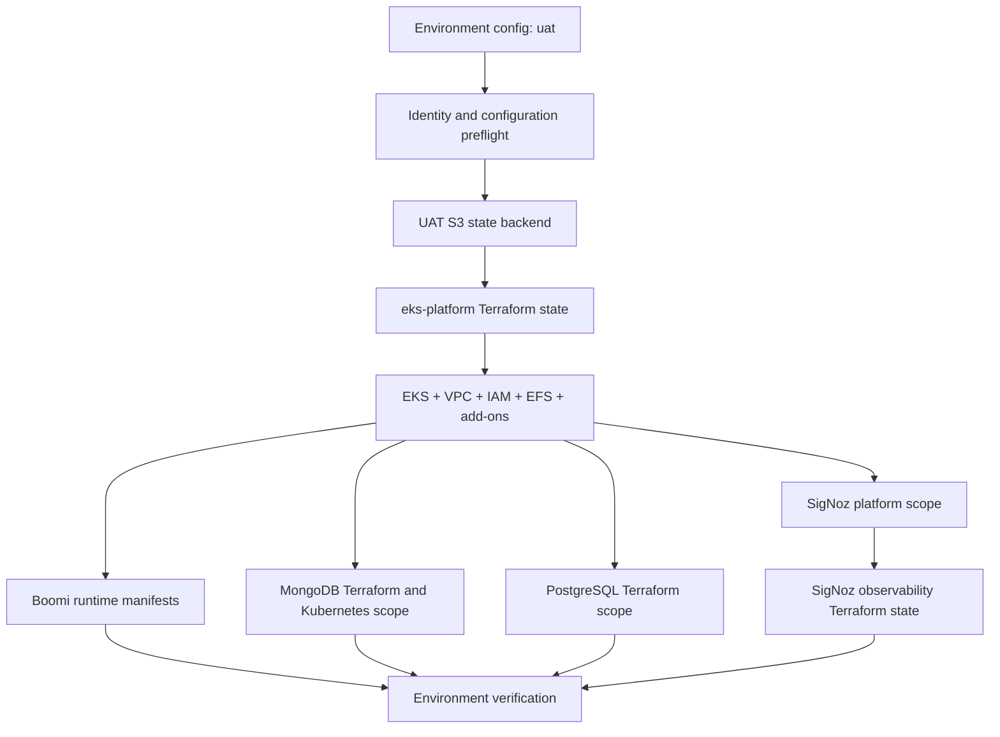

# UAT Platform Consolidation Design

**Date:** 2026-07-21

**Status:** Approved design

## Purpose

Consolidate the AWS network, EKS platform, Boomi runtime, MongoDB, PostgreSQL,
and SigNoz provisioning paths into this repository so one operator workflow can
provision complete `dev` and `uat` environments.

UAT is the first implementation and validation target because it is new and can
be rebuilt without affecting the working dev environment. Dev remains unchanged
until UAT passes the full acceptance and teardown/rebuild gates in this design.

## Goals

1. Add the missing VPC, EKS, node-group, IAM, EFS, backup, add-on, and Boomi
   runtime capabilities to this repository.
2. Preserve the existing independently deployable MongoDB, PostgreSQL, SigNoz,
   and SigNoz observability scopes.
3. Support `dev` and `uat` through explicit, reviewed environment configuration.
4. Make accidental cross-account, cross-environment, and cross-state operations
   fail before Terraform initialization or Kubernetes mutation.
5. Base the Boomi runtime implementation on current official Boomi guidance and
   keep it recognizable for future Boomi Support cases.
6. Review every imported script, Terraform resource, module, manifest, and
   configuration value instead of copying the untested migration wholesale.
7. Produce repeatable evidence that UAT can be provisioned, validated,
   destroyed, and rebuilt end to end.

## Non-Goals

- Migrating or adopting the existing live dev EKS state during the UAT phase.
- Applying the untested `../../Boomi/boomi-infra/infra` Terraform root as-is.
- Replacing the standard private Boomi runtime cluster with a Runtime Cloud or
  Elastic Executions architecture without confirmed entitlement and intent.
- Creating a private Helm chart for the standard `boomi/molecule` runtime.
- Enabling unattended Boomi image updates or HPA scale-down before UAT proves
  lifecycle safety and Boomi confirms support-sensitive behavior.
- Combining all infrastructure into one Terraform state.

## Evidence And Decision Hierarchy

Implementation decisions use this precedence order:

1. Current official Boomi documentation, official Boomi container images, and
   the `officialboomi/runtime-containers` reference architecture.
2. Current AWS, Kubernetes, Terraform, and provider documentation for platform
   behavior not specified by Boomi.
3. Proven behavior and operational knowledge in the broader
   `../../Boomi/boomi-infra/` repository.
4. Existing working patterns and verification scripts in this repository.
5. Candidate code in `../../Boomi/boomi-infra/infra`, which is an untested
   AI-assisted Terraform migration and is never accepted without review and UAT
   evidence.

When sources conflict, the higher-precedence source controls. Any intentional
deviation from an official Boomi invariant must be documented with its reason,
UAT evidence, and Boomi Support response when supportability is uncertain.

## Boomi Product Choice

The initial target is a **standard private Boomi runtime cluster**, formerly
called a Molecule. It uses the official `boomi/molecule` version 5 image and is
single-tenant.

It is not the separate Runtime Cloud with Elastic Executions. The official
`runtime-cloud` and `runtime-elastic-controller` Helm charts apply only to that
product path and must not be used for this standard runtime cluster.

The Boomi implementation must preserve these official-reference invariants:

- Official, unmodified `boomi/molecule:release` image, or `release-rhel` when
  SAP JCo compatibility requires RHEL.
- A StatefulSet with at least three stable runtime-node identities for steady
  state.
- One shared runtime name in `BOOMI_ATOMNAME`.
- A unique, persistent `ATOM_LOCALHOSTID` derived from the StatefulSet pod name.
- One shared `ReadWriteMany` installation filesystem mounted at `/mnt/boomi`.
- Filesystem access for UID and GID `1000`.
- A short-lived `INSTALL_TOKEN` for first installation.
- Readiness endpoint `/_admin/readiness` and liveness endpoint
  `/_admin/liveness` on port `9090`.
- Graceful node shutdown with an initial
  `terminationGracePeriodSeconds: 900`, pending UAT measurement and Boomi
  confirmation.
- No simultaneous restart of all runtime nodes.
- Resource requests above JVM heap requirements, using Boomi's documented
  memory headroom guidance.
- Supported cluster communication configured explicitly after confirming
  whether unicast TCP `7800` or multicast UDP `45588` is appropriate on EKS.

Boomi publishes an EKS reference architecture but no standard-runtime Flux
reference, operator, or official Helm chart. The initial UAT workload therefore
uses versioned Kubernetes manifests closely derived from the official EKS
reference and applied by a repository script. Flux may be installed as a
platform capability, but it does not own the Boomi StatefulSet until Boomi
confirms that continuous GitOps reconciliation does not affect support and UAT
proves the reconciliation behavior.

## Architecture



One repository-level orchestrator composes independently owned layers. It does
not merge their state or hide their individual plan and verification results.

### Terraform Ownership

The UAT backend bucket is created by an idempotent AWS CLI bootstrap script. It
is intentionally outside ordinary Terraform state because Terraform cannot use
the remote backend it is creating. The script creates or verifies the bucket,
encryption, versioning, public-access block, locking mechanism, tags, and bucket
policy. It refuses to modify a bucket owned by another account or environment.

| Root | Ownership | UAT state key |
|---|---|---|
| `eks-platform` | VPC, subnets, routes, NAT, EKS, node groups, IAM, EFS, AWS Backup, managed add-ons, and platform outputs | `oms/uat/eks-platform.tfstate` |
| `mongodb` | MongoDB namespace identity, PBM storage/IAM, and existing prerequisites | `oms/uat/mongo.tfstate` |
| `postgresql` | Aurora PostgreSQL and metrics-collector identity | `oms/uat/pg.tfstate` |
| `signoz-observability` | SigNoz dashboards and alert rules | `oms/uat/signoz-observability.tfstate` |

The SigNoz Kubernetes platform remains a separate script/Kubernetes scope as it
is today. The Boomi runtime remains a separate Kubernetes scope with protected
storage and bootstrap semantics.

### Proposed Repository Structure

```text
platform-prerequisites/terraform/
  eks-platform/
  modules/
    network/
    eks/
    node-groups/
    iam/
    efs/
    backup/
    addons/
  environments/
    dev/
    uat/
  mongodb/
  postgresql/
  signoz-observability/

gitops/
  boomi-runtime/
    base/
    overlays/
      dev/
      uat/

scripts/
  platform-env.sh
  bootstrap-terraform-backend.sh
  provision.sh
  destroy.sh
  provision-boomi-runtime.sh
  bootstrap-boomi-runtime-secret.sh
  verify-platform-health.sh
```

Exact file decomposition may follow current repository naming where that keeps
the implementation smaller. Responsibilities and state boundaries must remain
as specified.

## Platform Output Contract

The `eks-platform` root publishes a small, stable contract consumed by later
layers:

- AWS account ID and region.
- Environment name.
- EKS cluster name, ARN, endpoint, certificate authority data, and version.
- VPC ID and private/public subnet IDs by Availability Zone.
- Cluster and workload security-group IDs.
- Node-group names and worker Availability Zones.
- EFS filesystem and access-point IDs.
- EFS security-group ID.
- Managed add-on versions and Pod Identity role ARNs required downstream.

Downstream roots consume these values through explicit environment-specific
remote-state wiring or generated non-secret configuration. Operators must not
manually copy VPC, subnet, cluster, EFS, or security-group identifiers between
roots.

## Environment Contract

Every public provisioning, verification, and destruction command requires
`--env dev` or `--env uat`. There is no default environment.

Committed environment configuration includes only non-secret values:

- Expected AWS account ID and region.
- Cluster, VPC, subnet, database, bucket, IAM, and workload names.
- VPC and subnet CIDRs.
- Availability Zones.
- Node-group instance types, minimum, desired, and maximum sizes.
- Kubernetes and add-on versions.
- Boomi runtime name, namespace, image selector, resources, and replica policy.
- Environment tags and state-key prefix.

UAT uses AWS account `672172129937`. Its backend is an encrypted and versioned
S3 bucket in that account with locking enabled and a separate key for every
Terraform root.

Preflight must fail before Terraform initialization when any of these checks
fails:

1. Authenticated AWS account does not equal the environment's expected account.
2. AWS region differs from the configured region.
3. Selected backend bucket is absent, inaccessible, in the wrong account, or
   lacks required encryption/versioning/locking controls.
4. Current Kubernetes context points to another environment after EKS exists.
5. VPC or subnet CIDRs overlap each other or known connected networks.
6. Required tools or supported versions are missing.
7. Required environment configuration is missing, malformed, or contains
   unresolved sample values.
8. A generated Terraform plan references resources tagged for another
   environment.

Dev configuration may be modeled and statically validated during this phase,
but the orchestrator rejects dev apply/destroy until the UAT promotion gate is
explicitly opened.

## Secrets

Secrets are never committed, echoed, placed in command history by generated
instructions, or written into ordinary plan artifacts.

### Boomi Bootstrap

The install token is supplied through a protected environment variable or an
ignored local file. An idempotent bootstrap script:

1. Verifies UAT identity and cluster context.
2. Refuses an empty, sample, or expired-looking input where detectable.
3. Creates or replaces a narrowly scoped Kubernetes Secret without printing the
   token.
4. Starts only the initial StatefulSet ordinal against an empty installation
   path.
5. Waits for Boomi readiness and verifies runtime registration.
6. Removes the token reference from the steady-state pod template.
7. Deletes the bootstrap Secret.
8. Scales to the approved steady-state replica count only after ordinal `0` is
   healthy.

If bootstrap fails, the script preserves diagnostic logs and events, prevents
additional ordinals from starting, and prints a recovery path without exposing
the token.

### Database And Platform Secrets

Database credentials and other sensitive values remain sensitive inputs through
the existing secret/bootstrap mechanisms. Terraform variables and outputs that
can contain secrets are marked sensitive, but this is not treated as preventing
their inclusion in Terraform state. Remote state access is therefore restricted
and audited.

## Operator Workflow

The intended top-level UAT flow is:

```text
preflight
  -> bootstrap UAT backend
  -> plan/apply eks-platform
  -> verify EKS, nodes, add-ons, EFS, and backups
  -> apply platform controllers
  -> bootstrap/apply Boomi runtime
  -> apply MongoDB and PostgreSQL scopes
  -> apply SigNoz then SigNoz observability
  -> run component checks and end-to-end smoke tests
```

Each layer emits its own plan, asks for approval unless `--auto-approve` was
explicitly supplied, waits for readiness, and stops the sequence on failure.
`--auto-approve` never bypasses identity, context, plan-safety, or dependency
checks.

Narrow scopes remain available so operators can change or verify one component
without reapplying the entire platform.

Destroy runs only in reverse dependency order:

1. SigNoz observability objects.
2. SigNoz platform.
3. Boomi runtime workloads after graceful scale-down and explicit confirmation.
4. MongoDB workloads and prerequisites, honoring backup and data-retention
   policy.
5. PostgreSQL after explicit database-destruction approval.
6. EKS/platform only after all dependents are gone and EFS/database backup
   evidence is recorded.
7. State backend only through a separate break-glass procedure, never through
   ordinary `destroy all`.

Persistent data resources require a stronger confirmation than stateless
resources. The environment, account, resource name, and retention consequence
must be shown before confirmation.

## Imported-Code Review Method

Every source file and logical resource from `../../Boomi/boomi-infra/infra` is
recorded in a migration review matrix with one disposition:

- **Keep:** behavior and implementation are current, correct, and fit the target
  ownership boundary.
- **Rewrite:** required behavior is valid but the implementation is unsafe,
  outdated, coupled, or inconsistent with this repository.
- **Replace:** an existing repository or official module/pattern provides the
  same behavior more safely.
- **Reject:** behavior is obsolete, unsupported, unnecessary, or conflicts with
  the target architecture.

Each decision records source path, target path, resource ownership, evidence,
risk, tests, and any official-reference deviation.

### Review Checklist

The review covers, at minimum:

- Shell strict mode, quoting, traps, cleanup, exit-code preservation,
  idempotency, retries, timeouts, and interrupted-run recovery.
- Input schemas, variable validation, preconditions, account assertions, and
  environment-qualified names.
- Secret exposure through Git, Terraform state, plans, process arguments,
  environment dumps, logs, and generated files.
- Terraform and provider constraints, lockfiles, deprecated fields, import
  requirements, state locking, and concurrent-run behavior.
- Dependency cycles and provider initialization before EKS availability.
- CIDR overlap, Availability Zone availability, NAT cost/failure model, AWS
  quotas, service-linked roles, and regional feature support.
- IAM least privilege, Pod Identity trust policy, EKS access entries, and
  separation of platform and workload privileges.
- Singular ownership of EKS add-ons, Flux, metrics-server, cluster autoscaler,
  EBS CSI, and EFS CSI.
- EFS encryption, mount targets, security groups, access-point permissions,
  throughput mode, backups, restore behavior, deletion protection, and NFS
  locking expectations.
- Kubernetes API compatibility, selectors, immutable fields, probes, resource
  requests/limits, affinity, topology, PDB behavior, and safe StatefulSet update
  semantics.
- Boomi bootstrap ordering, stable identity, shared-path permissions, graceful
  shutdown, image support, cluster communication, and queue-sensitive scaling.
- Load balancer exposure, TLS, source restrictions, health checks, and whether
  public ingress is required at all.
- Destruction ordering, finalizers, retained storage, backup evidence, and
  partial-failure recovery.
- Documentation accuracy, example safety, and agreement between scripts,
  Terraform defaults, environment configuration, and runbooks.

Minor findings are fixed or documented; they are not silently ignored. Critical
and high findings block UAT apply. Medium findings require an explicit decision
and test. Low findings may be scheduled only when they do not affect safety,
supportability, repeatability, or operator understanding.

## Error Handling

- Scripts use explicit phases and return non-zero on any unmet invariant.
- Cleanup traps remove temporary files and local port-forwards while preserving
  the original failure code.
- Retries are bounded and limited to classified transient failures. Validation,
  authorization, configuration, and Terraform plan errors are never blindly
  retried.
- Readiness waits have documented timeouts and emit the relevant events, pod
  descriptions, logs, and Terraform context on failure.
- A failed layer prevents dependent layers from running.
- Terraform plans are saved and applied unchanged. A changed configuration or
  stale plan requires replanning.
- Plans containing unexpected destroy or replacement actions fail an automated
  safety check and require explicit review.
- Partial applies are followed by state and cloud inventory reconciliation
  before retry.
- Boomi recovery work suspends ordinary reconciliation and prevents parallel
  first-node bootstrap.
- Destructive recovery never force-deletes a StatefulSet pod or persistent
  resource without an explicit documented break-glass action.

## UAT Validation Strategy

### Static And Offline Gates

- Terraform formatting, initialization without backend where possible,
  validation, provider-lock verification, and policy/security scanning.
- Shell syntax and lint checks.
- Kustomize render and Kubernetes schema validation against the selected EKS
  version.
- Secret-pattern scan of tracked and generated files.
- Environment-schema validation and CIDR-overlap tests.
- Unit tests for argument parsing, environment selection, identity mismatch,
  plan-safety checks, and cleanup behavior.
- A source-to-target migration review matrix with no unclassified resources.

### UAT Platform Gates

1. Apply the UAT backend and prove encryption, versioning, locking, and account
   ownership.
2. Review an `eks-platform` plan with no unresolved critical/high findings.
3. Apply VPC/EKS and verify subnets, routes, NAT, nodes, access, add-ons, Pod
   Identity, EFS mount targets, backups, and deletion controls.
4. Re-run the platform plan and require no unexplained drift.

### Boomi Runtime Experiments

1. Bootstrap one ordinal on an empty EFS path with a fresh token.
2. Verify one runtime cluster is registered and the first node becomes ready.
3. Delete the token Secret and restart ordinal `0`; verify reuse without a
   duplicate runtime or reinstall.
4. Scale from one to three and verify stable unique host IDs and one shared
   runtime cluster.
5. Reschedule every ordinal across nodes and Availability Zones.
6. Validate shared-filesystem behavior under concurrent integration workloads.
7. Measure graceful shutdown under active and queued work.
8. Drain a node and verify PDB, termination, replacement, and continued
   processing.
9. Test a controlled EFS mount failure and recovery.
10. Upgrade the Boomi v5 container image one ordinal at a time using the same
    runtime name, host ID, and installation directory.
11. Inject an invalid image and prove the documented rollback procedure,
    including manual pod deletion if the StatefulSet controller stalls.
12. Prove that manifest removal and ordinary platform destruction cannot delete
    retained Boomi data without the break-glass path.
13. Restore an EFS backup into an isolated path and verify identity-safe recovery.
14. Test expired-token and interrupted-first-bootstrap recovery.

HPA and automated image updates remain disabled during the baseline tests. HPA
is introduced only after fixed-size lifecycle tests pass, Atom Queue usage is
known, and Boomi's current scaling guidance is confirmed.

### Integrated Platform Gates

- Run the existing MongoDB replica-set and audit-write verification.
- Run PostgreSQL availability and metrics checks.
- Run SigNoz readiness, dashboard/alert provisioning, and telemetry checks.
- Run the end-to-end audit log and telemetry smoke test.
- Verify Boomi workload telemetry and platform alerts.
- Re-run every Terraform plan and require no unexplained create, replace,
  destroy, or perpetual drift beyond explicitly documented provider defects.

### Full Lifecycle Gate

Perform at least one complete UAT destroy and rebuild using only documented
repository commands. Record durations, failures, retries, state transitions,
backup evidence, and final smoke-test results. The rebuilt environment must
produce the same outputs and pass the same checks without undocumented manual
steps.

## Boomi Support Confirmation

Before dev promotion, obtain or document Boomi responses for:

- Current supported EKS/Kubernetes versions.
- EFS CSI and EFS mode suitability for the shared runtime filesystem.
- Required or preferred EKS cluster communication mode.
- Supported StatefulSet update, disruption, and graceful-shutdown settings.
- HPA behavior for standard runtime clusters and Atom Queue restrictions.
- Image digest pinning and reproduction requirements on the `release` tag.
- Whether Flux, Argo CD, Terraform, or Kustomize delivery affects support when
  rendered resources retain official-reference behavior.
- Accepted method for supplying the short-lived install token.
- Required topology and ingress/load-balancer behavior.

Support evidence should include rendered manifests, image tag and digest, EKS
and node versions, EFS/CSI configuration, pod events and descriptions, container
logs, Boomi runtime log archives with bin logs/configuration, Cluster Status
evidence, and node local-host-ID files.

## Dev Promotion Gate

Dev migration planning begins only when all of these conditions are true:

1. UAT has passed static, platform, Boomi, integrated, and full lifecycle gates.
2. No unresolved critical or high review findings remain.
3. Medium findings have explicit accepted risks and regression tests.
4. Support-sensitive Boomi unknowns are answered or explicitly accepted by the
   platform owner with a documented fallback.
5. UAT plans converge without unexplained drift.
6. Operator and recovery documentation has been exercised by someone other than
   the implementer.
7. The authoritative live dev state and resource inventory have been located,
   backed up, and reconciled before any dev import or move operation.

Dev resources must be adopted through reviewed state migration/import. The new
code must never issue a create plan against names already owned by the live dev
platform.

## Implementation Decomposition

This design is delivered through four separately reviewed implementation plans.
Each phase must leave a working, testable result and must pass its own checks
before the next phase starts.

1. **Environment safety and EKS platform:** environment schema, identity guards,
  backend bootstrap, reviewed platform modules, UAT VPC/EKS/EFS/add-ons, and
  platform verification.
2. **Boomi runtime:** official-reference comparison, current Kubernetes
  manifests, secret bootstrap, lifecycle operations, Boomi-specific UAT tests,
  and support evidence collection.
3. **Existing data and observability scopes:** make MongoDB, PostgreSQL, SigNoz,
  and observability environment-aware; consume the platform output contract;
  preserve current dev behavior; validate UAT integration.
4. **Unified lifecycle and promotion evidence:** top-level orchestration,
  reverse-order destroy, full UAT rebuild, runbooks, acceptance report, and dev
  adoption prerequisites.

No phase may silently broaden the ownership of an earlier state or bypass its
verification contract.

## Documentation Deliverables

- Updated documentation hub and architecture guide.
- Environment setup for dev and UAT.
- UAT provisioning, verification, recovery, and destruction runbooks.
- Terraform root and platform output contract references.
- Boomi runtime supportability and official-reference deviation record.
- Imported-code migration review matrix.
- UAT execution evidence and acceptance report.
- A support-case checklist and diagnostic artifact collection guide.

## Acceptance Criteria

The consolidation is complete for UAT when:

- One repository command flow provisions every UAT layer in dependency order.
- Every state is remote, isolated, encrypted, locked, and environment-qualified.
- Identity and context guards prevent cross-account/environment operations.
- No secret is committed or printed, and bootstrap secrets are removed after use.
- The Boomi runtime retains official-reference behavior and passes all specified
  lifecycle experiments.
- MongoDB, PostgreSQL, SigNoz, and end-to-end smoke tests pass.
- Every imported source resource has a reviewed disposition and evidence.
- A complete UAT destroy/rebuild succeeds without undocumented manual steps.
- Plans converge without unexplained drift.
- Dev remains unchanged until its separate adoption plan is approved.

## Official Boomi References

Accessed 2026-07-21:

- [Boomi Runtime Containers](https://bitbucket.org/officialboomi/runtime-containers)
- [Boomi Amazon EKS Reference](https://bitbucket.org/officialboomi/runtime-containers/src/master/eks/README.md)
- [Boomi Molecule Image](https://hub.docker.com/r/boomi/molecule)
- [Docker Installation Of A Runtime](https://help.boomi.com/docs/Atomsphere/Integration/Atom,%20Molecule,%20and%20Atom%20Cloud%20setup/c-atm-Docker_installation_of_an_Atom_Molecule_or_Cloud_9e6d09ec-c6a9-42d2-92e8-dd3352a83edf)
- [Runtime Cluster](https://help.boomi.com/docs/Atomsphere/Integration/Getting%20started/c-atm-Molecules_e9469404-7628-4aa7-a63b-7ae57fb13a3e)
- [Runtime Cluster System Requirements](https://help.boomi.com/docs/Atomsphere/Integration/Atom,%20Molecule,%20and%20Atom%20Cloud%20setup/r-atm-Molecule_system_requirements_41f9a675-ab11-4f3b-bf51-1655394aba5b)
- [Runtime Clouds](https://help.boomi.com/docs/Atomsphere/Integration/Getting%20started/c-atm-Atom_Clouds_b835095b-048e-4871-a42d-b2186707e314)
- [Elastic Scaling In Kubernetes](https://help.boomi.com/docs/Atomsphere/Integration/Atom%2C%20Molecule%2C%20and%20Atom%20Cloud%20setup/int-Installing_a_cloud_cluster_with_elastic_scaling_in_Kubernetes)
- [Downloading Runtime Logs](https://help.boomi.com/docs/Atomsphere/Integration/Integration%20management/int-Downloading_an_Atom_Molecule_or_Clouds_log_files_95dbc40e-335a-4f01-815f-74ece4bd5fa3)