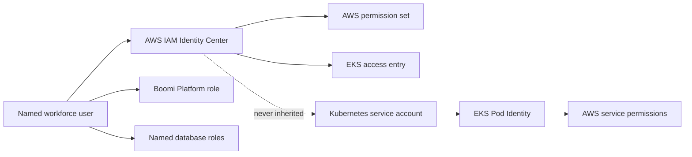

# UAT Workforce Access Design

**Date:** 2026-07-21

**Status:** Approved design

## Purpose

Define the workforce, Kubernetes, database, S3, Boomi Platform, and workload
identity model for the new UAT platform in AWS account `672172129937`.

This design gives UAT a clean access baseline without interrupting development
in the live dev account `815402439714`. The dev IAM audit is evidence for what
UAT must avoid; it is not authorization to change dev.

## Scope And Safety Boundary

The implementation governed by this design may create or change resources only
in UAT. It must not detach dev policies, alter dev groups or users, change the
dev EKS cluster, rotate dev credentials, or modify either existing S3 bucket.

Before every UAT mutation, automation must verify:

1. The authenticated AWS account is `672172129937`.
2. The selected environment is explicitly `uat`.
3. The EKS cluster and Kubernetes context are the UAT targets.
4. The plan contains no dev account, cluster, role, group, user, or state ARN.

Dev regrouping remains a future, separately approved migration. Legacy IAM
password, MFA, and access-key remediation is also out of scope.

## Decision Context

Boomi does not require ordinary developers to have AWS or EKS administrator
access. Boomi Platform privileges cover integration build, packaging,
deployment, and runtime administration. AWS and Kubernetes permissions are an
organization-specific operating choice.

This design intentionally grants Application Developers substantially broader
UAT access than Boomi requires. Full Kubernetes cluster administration,
MongoDB administration, PostgreSQL administration, and S3 administration are
accepted UAT operating requirements. They are not characterized as least
privilege and must not automatically promote to production.

## Identity Architecture

Use AWS IAM Identity Center groups and permission sets for human AWS access.
Do not create UAT IAM users or long-lived access keys. Use named individual
database identities and named Boomi Platform users; do not share administrator
credentials.

Human access, Kubernetes authorization, database authorization, Boomi Platform
authorization, and workload AWS access are separate security domains:

UAT groups and permission sets must be environment-qualified. Membership is
managed through Identity Center groups, not direct policy attachments to users.

## Workforce Roles

### Infra Admin / Enterprise Architect

Initial member: `frankcheong`.

Responsibilities and access:

- Own the complete AWS and EKS architecture, networking, IAM, storage,
  observability, Terraform, access entries, cluster RBAC, add-ons, Pod
  Identity, backup, and recovery model.
- Administer the EKS cluster and all namespaces.
- Administer MongoDB for architecture, recovery, and break-glass operations.
- Own the AWS control plane for both PostgreSQL instances.
- Administer S3 architecture and security controls.
- Use short, MFA-backed Identity Center sessions with administrative activity
  logged and alerted.

### Application Developer

Initial members: `yczhang`, `xavierlee`, and `jiaweima` after their UAT Identity
Center identities are established.

Approved UAT access:

- Full Kubernetes API administration of the UAT EKS cluster and every
  namespace.
- MongoDB cluster and application-data administration.
- Database administration on both the main and brand PostgreSQL instances.
- Full S3 administration of `sml-boomi` and `sml-public-data` if cross-account
  UAT access to those dev-owned buckets is separately approved and configured.
- Boomi Platform runtime and administrative privileges.

These are accepted high-risk exceptions. Cluster administrator access permits
reading Secrets, changing RBAC, and granting access to other principals. S3
administration permits changing bucket policies, encryption, ownership,
versioning, lifecycle, and public access, and deleting buckets or data.

The UAT permission set must not add AWS IAM, VPC, EKS cluster lifecycle,
node-group, add-on, or RDS control-plane administration merely to support
Kubernetes and database workflows. Those remain Infra Admin / EA duties.

### Boomi Admin

Initial members: `JesusRosario` and `jacklee` after their UAT Identity Center
identities are established.

Approved UAT access:

- Boomi Platform runtime and administrative privileges.
- Full Kubernetes administration in the UAT Boomi namespace only.
- MongoDB application-data read/write access, with no MongoDB user, role,
  replica-set, backup, or cluster administration.
- No access to the main PostgreSQL instance.
- Database administration on the brand PostgreSQL instance.
- S3 list/read/write/delete and multipart operations only in explicitly
  assigned `<application>/uat/*` prefixes.
- AWS access limited to EKS describe/connect and relevant logs and metrics.

Boomi Admin does not receive IAM, VPC, EKS lifecycle, OpenSearch, RDS
secret/KMS, load-balancer-controller, storage-class, node, or cluster-scoped
RBAC administration.

### Boomi Process Owner

There are no initial members. Create the role contract now and assign it only
when a named Process Owner is approved.

Approved UAT access:

- No EKS or Kubernetes access.
- Read-only queries against approved MongoDB application data, with no writes
  or MongoDB administration.
- No access to the main PostgreSQL instance.
- Database administration on the brand PostgreSQL instance.
- S3 list/read/write/delete and multipart operations only in explicitly
  assigned `<application>/uat/*` prefixes.
- Boomi process-owner visibility and operation privileges without runtime
  infrastructure administration.

## Authorization Matrix

| Capability | Infra Admin / EA | Application Developer | Boomi Admin | Boomi Process Owner |
|---|---|---|---|---|
| AWS/EKS architecture | Full | None | None | None |
| Kubernetes API | Cluster admin | Cluster admin | Admin in Boomi namespace | None |
| MongoDB platform administration | Full/break-glass | Full | None | None |
| MongoDB application data | As required | Admin/read/write | Read/write | Read-only |
| Main PostgreSQL | AWS and DB break-glass | DB admin | None | None |
| Brand PostgreSQL | AWS and DB break-glass | DB admin | DB admin | DB admin |
| S3 | Architecture admin | `s3:*` on both named buckets | Assigned UAT prefixes | Assigned UAT prefixes |
| Boomi Platform | Support as required | Runtime/admin | Runtime/admin | Process owner |

PostgreSQL database administration includes connecting, creating databases,
schemas, tables, and application roles, and performing DDL and DML. It does not
include RDS instance deletion, networking, KMS, parameter-group, backup, or IAM
administration.

## EKS Authorization

Configure EKS authentication with access entries rather than the deprecated
`aws-auth` ConfigMap.

- Associate the Application Developer Identity Center role with
  `AmazonEKSClusterAdminPolicy` at cluster scope.
- Associate the Boomi Admin role with namespace-scoped administrator access for
  the exact UAT Boomi namespace.
- Do not create an EKS access entry for Boomi Process Owner.
- Give Infra Admin / EA cluster administration and the AWS permissions required
  to maintain EKS infrastructure.

The Application Developer grant intentionally defeats namespace isolation for
that role. Kubernetes namespace controls still protect workloads from Boomi
Admins and Process Owners, but not from cluster administrators.

## Database Authorization

### MongoDB

Create database-native named roles:

- Infra Admin / EA: administrative and recovery role.
- Application Developer: administrative role covering the UAT cluster and
  application databases.
- Boomi Admin: read/write role on approved application databases only.
- Boomi Process Owner: read-only role on approved application databases only.

Database roles must not be implemented by distributing one shared URI.
MongoDB audit logging must attribute authentication, role changes, DDL, and
data changes to named principals.

### PostgreSQL

Use separate role grants on the two PostgreSQL instances:

- Main instance: Application Developer database administrators; no Boomi Admin
  or Boomi Process Owner login.
- Brand instance: Application Developer, Boomi Admin, and Boomi Process Owner
  database administrators.
- Infra Admin / EA: infrastructure owner and documented break-glass database
  access.

Enable connection, DDL, role-change, and administrative statement logging.
Do not reuse an RDS Proxy secret or Kubernetes workload secret as a human
administrator credential.

## S3 Authorization

The agreed object convention is `<application>/<environment>/...`, for example
`orders/uat/...`.

Application Developers receive `s3:*` on these exact resources if the existing
bucket owners approve UAT cross-account administration:

- `arn:aws:s3:::sml-boomi`
- `arn:aws:s3:::sml-boomi/*`
- `arn:aws:s3:::sml-public-data`
- `arn:aws:s3:::sml-public-data/*`

Boomi Admin and Boomi Process Owner policies use exact assigned prefix ARNs and
condition `s3:ListBucket` with matching `s3:prefix` values. They do not receive
bucket policy, public-access, encryption, ownership, lifecycle, replication,
logging, versioning, or bucket deletion actions.

This UAT design does not modify either bucket. Both buckets are in dev account
`815402439714` and `us-east-1`, while UAT is account `672172129937` and EKS is
planned for `ap-east-1`. Cross-account bucket policies or access points must be
separately reviewed before UAT principals can use them.

Verified current posture, retained without change:

- `sml-boomi` is private, AES-256 encrypted, bucket-owner enforced,
  unversioned, and currently contains the `Testing/` top-level prefix.
- `sml-public-data` is anonymously readable through wildcard `GetObject`, has
  all four S3 public-access blocks disabled, is AES-256 encrypted,
  bucket-owner enforced, unversioned, and appeared empty during the audit.

The design records, but does not remediate, public exposure, unversioned-delete
risk, cross-account administration risk, cross-region latency and transfer
cost, and dependency on `us-east-1` from an `ap-east-1` runtime.

## Workload And Automation Identity

Human permission sets must never be reused by pods or CI/CD.

- Associate each AWS-enabled Kubernetes service account with an
  environment-qualified EKS Pod Identity role.
- Scope workload roles to the exact AWS APIs and resources required by that
  application.
- Store database passwords, Boomi installer tokens, and non-AWS application
  credentials in supported Boomi configuration, protected Kubernetes Secrets,
  or an approved external secret store.
- Do not grant workload AWS access through broad worker-node policies.
- Use a separate automation identity for deployment when CI/CD is introduced;
  its authorization is independent of the human Application Developer role.

## Non-Legacy Audit Findings And UAT Requirements

### EFS CSI Identity

Dev EFS CSI is configured inconsistently: the add-on uses an IRSA-style
`serviceAccountRoleArn`, the live cluster has no matching OIDC provider, and
the role trusts `pods.eks.amazonaws.com` without `sts:TagSession`. Broad EFS
and EC2 permissions on node roles conceal the defect.

UAT must use EKS Pod Identity consistently. Its EFS CSI role trust policy must
allow `pods.eks.amazonaws.com` to call both `sts:AssumeRole` and
`sts:TagSession`. Remove EFS and EC2 storage permissions from UAT node roles
after mount tests pass.

### Active Workload Roles

Dev uses Pod Identity successfully for EBS CSI and MongoDB PBM. UAT may follow
those patterns with UAT-qualified names, policies, service accounts, and
associations. Do not copy ARNs or roles from dev.

### Stale Federation

Dev has OIDC providers associated with deleted `jhub-cluster` and
`django-poc-cluster`. Do not reproduce them in UAT. Their dev removal is a
future change requiring dependency verification and separate approval.

### Excessive Dev Policy Bundles

The existing dev `BoomiDev` group combines unrestricted S3, full EKS,
OpenSearch, RDS Proxy secret/KMS, and load-balancer-controller permissions.
Dev also has broad `oms-dev-admin` and `oms-dev-backend-developer` groups.

UAT must implement the approved role matrix directly. It must not copy those
groups or policies. OpenSearch is excluded from UAT until separately approved.
RDS Proxy secrets/KMS and load-balancer-controller policies are workload or
platform concerns and must not be attached to Boomi workforce roles.

### Access Analysis

Enable an account-level or organization-level IAM Access Analyzer for UAT.
Run Access Analyzer policy validation on customer-managed policies in CI and
block policy errors or unreviewed security warnings.

## Guardrails And Observability

At minimum, enable and retain:

- CloudTrail management events and S3 data events for both named buckets when
  cross-account UAT access is enabled.
- Alerts for bucket policy, public access, encryption, ownership, versioning,
  and deletion changes.
- Alerts for EKS access-entry and cluster-role-binding changes.
- MongoDB authentication, role, DDL, and administrative audit events.
- PostgreSQL connection, role-change, DDL, and administrative statement logs.
- Alerts on UAT administrative permission-set assignment changes.

Use MFA-backed Identity Center sessions. Administrative roles should use short
session durations. Where AWS Organizations controls are available, evaluate an
SCP that prevents bucket deletion and disabling mandatory audit controls. If
that safeguard conflicts with the approved `s3:*` requirement, record the
exception explicitly rather than silently weakening the control.

## UAT-Only Implementation Sequence

1. Verify UAT account and environment preflight gates.
2. Create UAT Identity Center groups and permission sets.
3. Assign `frankcheong` as Infra Admin / EA.
4. Create UAT EKS access entries and test Infra Admin / EA access.
5. Create named MongoDB and PostgreSQL role definitions and audit settings.
6. Provision UAT platform and workload Pod Identity roles.
7. Onboard Application Developers and validate their approved UAT access.
8. Onboard Boomi Admins and validate their namespace and database boundaries.
9. Leave Boomi Process Owner unassigned until a named owner is approved.
10. Configure cross-account S3 access only after a separate bucket-owner review;
    do not alter either dev bucket as part of the initial UAT build.
11. Record test evidence and unresolved accepted risks before UAT handoff.

There is no dev detachment, regrouping, cleanup, or credential migration step
in this sequence.

## Validation Matrix

Use temporary sessions for the exact target role. Record principal ARN,
account, cluster, database, allowed result, denied result, and timestamp.

| Role | Must succeed | Must fail |
|---|---|---|
| Infra Admin / EA | Maintain UAT AWS and EKS architecture | Any dev-account mutation through UAT automation |
| Application Developer | Cluster-admin operation; MongoDB admin; both PostgreSQL admin workflows | AWS IAM/VPC/EKS lifecycle change through the developer permission set |
| Boomi Admin | Administer Boomi namespace; MongoDB read/write; brand PostgreSQL admin | Access main PostgreSQL; MongoDB platform admin; mutate another namespace |
| Boomi Process Owner | MongoDB read query; brand PostgreSQL admin; assigned-prefix S3 workflow | EKS authentication; MongoDB write/admin; main PostgreSQL login |
| Workload Pod Identity | Access exact application AWS resources | Use human permissions or access another application's resources |

For Application Developer, no Kubernetes namespace-denial test exists because
cluster-wide administration is intentional. S3 policy and security mutations
must be tested only after cross-account access receives separate approval.

## Rollback And Failure Handling

Because UAT is new, rollback removes or disables only newly created UAT access:

1. Remove the affected UAT Identity Center assignment or EKS access entry.
2. Revoke the named database role or login.
3. Remove the UAT Pod Identity association before deleting its role.
4. Preserve CloudTrail and database audit evidence.
5. Correct the policy and rerun positive and negative tests before reassignment.

Rollback must not restore or copy dev groups, policies, users, keys, OIDC
providers, or node-role permissions.

## Deferred Dev Recommendations

These recommendations are documentation only and require a future approval:

- Replace direct IAM human access with Identity Center.
- Regroup current users by actual workforce role.
- Remove RDS secret/KMS, OpenSearch, and controller policies from Boomi users.
- Correct EFS CSI identity, then narrow node-role permissions.
- Verify and remove stale OIDC providers.
- Retire confusing empty or duplicate groups.
- Address legacy passwords, MFA, and long-lived access keys.

No item in this section is a prerequisite for UAT and none may be applied under
this design.

## Supporting Sources

All sources were accessed 2026-07-21.

### Boomi

- [Packaged component and deployment privileges](https://help.boomi.com/docs/Atomsphere/Integration/Deployment/c-atm-Packaging_and_deployment_privileges_0279167d-0370-4208-a66d-e4ba74dc1079)
- [Deployment](https://help.boomi.com/docs/Atomsphere/Integration/Deployment/c-atm-Deployment_4e723d20-3e2b-41b7-8d57-010dccb940b8)
- [Downloading the cluster installer](https://help.boomi.com/docs/Atomsphere/Integration/Atom,%20Molecule,%20and%20Atom%20Cloud%20setup/t-atm-Downloading_the_Molecule_installer_edb2871c-e830-4756-b8fc-846cb5b81652)
- [Runtime cluster installation checklist for Linux](https://help.boomi.com/docs/Atomsphere/Integration/Atom,%20Molecule,%20and%20Atom%20Cloud%20setup/int-Molecule_installation_checklist_Linux_cff53cf9-83a2-400b-9cf0-f4f1a76013df)
- [Docker installation of a runtime](https://help.boomi.com/docs/Atomsphere/Integration/Atom,%20Molecule,%20and%20Atom%20Cloud%20setup/c-atm-Docker_installation_of_an_Atom_Molecule_or_Cloud_9e6d09ec-c6a9-42d2-92e8-dd3352a83edf)
- [Runtime cluster system requirements](https://help.boomi.com/docs/Atomsphere/Integration/Atom,%20Molecule,%20and%20Atom%20Cloud%20setup/r-atm-Molecule_system_requirements_41f9a675-ab11-4f3b-bf51-1655394aba5b)

### AWS, AWS-IA, And Kubernetes

- [AWS-IA Terraform Boomi Kubernetes Molecule](https://github.com/aws-ia/terraform-boomi-kubernetes-molecule)
- [EKS access entries](https://docs.aws.amazon.com/eks/latest/userguide/access-entries.html)
- [EKS access policy permissions](https://docs.aws.amazon.com/eks/latest/userguide/access-policy-permissions.html)
- [Amazon EKS identity and access management best practices](https://docs.aws.amazon.com/eks/latest/best-practices/identity-and-access-management.html)
- [IAM Identity Center permission sets](https://docs.aws.amazon.com/singlesignon/latest/userguide/permissionsetsconcept.html)
- [AWS IAM security best practices](https://docs.aws.amazon.com/IAM/latest/UserGuide/best-practices.html)
- [EKS Pod Identity](https://docs.aws.amazon.com/eks/latest/userguide/pod-identities.html)
- [Required permissions for S3 API operations](https://docs.aws.amazon.com/AmazonS3/latest/userguide/using-with-s3-policy-actions.html)
- [S3 policy condition keys](https://docs.aws.amazon.com/AmazonS3/latest/userguide/amazon-s3-policy-keys.html)
- [Kubernetes RBAC authorization](https://kubernetes.io/docs/reference/access-authn-authz/rbac/)
- [Kubernetes Secret good practices](https://kubernetes.io/docs/concepts/security/secrets-good-practices/)