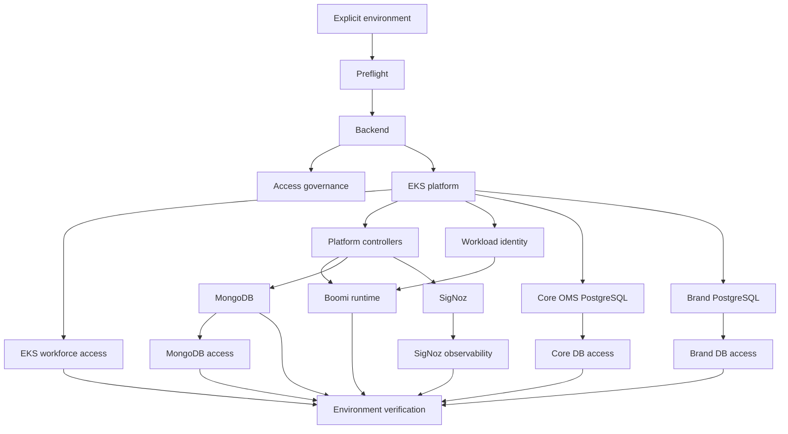

# Unified Environment Provisioning Design

**Date:** 2026-07-22

**Status:** Proposed Phase 2 design

## Purpose

Turn this repository into the single infrastructure provisioning project for
complete OMS `dev` and `uat` environments.

Phase 2 combines the components supported by the previous dev implementation
with the new UAT platform and access components. Operators use one set of
environment-aware entrypoints and choose the target environment explicitly.
Environment configuration supplies account IDs, names, Regions, namespaces,
capacity, state locations, and other approved differences.

This design refines the approved
[UAT Platform Consolidation Design](2026-07-21-uat-platform-consolidation-design.md)
and incorporates the completed UAT access-foundation work. It does not replace
the Phase 1 history or broaden the repository's Identity Center ownership.

## Outcome

The final public interface is consistent across environments after each
environment passes its promotion gate:

```bash
bash scripts/provision.sh --env dev all
bash scripts/provision.sh --env uat all

bash scripts/provision.sh --env uat mongodb
bash scripts/verify-platform-health.sh --env uat --smoke-test
bash scripts/destroy.sh --env uat mongodb
```

The `dev` provisioning example is the post-promotion target interface, not a
currently authorized command. During UAT-first implementation, `--env dev`
supports modeling and read-only readiness checks only; dev apply and destroy
fail closed.

There is no default environment. Omitting `--env`, supplying an unsupported
environment, or authenticating to the wrong AWS account fails before backend,
Terraform, Kubernetes, or generated-file mutation.

`all` means the complete repository-managed infrastructure foundation, not
only MongoDB and PostgreSQL. Narrow scopes remain available for routine changes
and recovery. The exact completeness boundary is defined below so external
identity/SaaS ownership and separately approved cross-account access are not
misrepresented as repository-managed infrastructure.

## Goals

1. Preserve all components provisioned by the existing dev implementation.
2. Add the missing network, EKS platform, Boomi runtime, governance, and
   workforce-access components.
3. Make the complete component catalog available through the same scripts for
   `dev` and `uat`.
4. Keep environment differences in reviewed configuration rather than copied
   scripts or copied Terraform implementations.
5. Isolate Terraform state, generated files, local secrets, Kubernetes
   resources, plans, locks, and verification evidence by environment.
6. Preserve narrow component scopes and compose them in a documented dependency
   order.
7. Keep live dev unchanged until UAT proves the implementation and a separate
   no-drift dev adoption plan is approved.
8. Provide clear operator documentation covering what each script and
   Terraform root does, why it exists, configuration ownership, examples, quick
   starts, verification, and recovery.

## Non-Goals

- Applying or testing infrastructure during Phase 2 development.
- Mutating dev while building or statically reviewing the UAT-first model.
- Copying the unvalidated `../../Boomi/boomi-infra/infra` implementation.
- Combining all components or environments into one Terraform state.
- Managing IAM Identity Center permission sets, groups, memberships, or account
  assignments from this repository.
- Making dev and UAT identical where capacity, retention, network, access, or
  lifecycle requirements legitimately differ.
- Hiding destructive behavior behind a broad `all` command without component
  plans, confirmations, and retention gates.

## Component Catalog

The intended catalog is available to both environments after each environment
passes its promotion gate.

| Scope | Components | Provisioning owner |
|---|---|---|
| `backend` | Environment-owned S3 Terraform backend, encryption, versioning, public-access controls, native state locking | Guarded bootstrap script |
| `eks-platform` | VPC, subnets, routing, NAT, EKS control plane, node groups, IAM, EFS, AWS Backup, and AWS-managed EKS add-ons | Terraform |
| `access-governance` | Account-level IAM Access Analyzer, CloudTrail management-event baseline, EKS access-change event rules, and environment-level governance alerts | Terraform |
| `eks-access` | EKS access entries and policy associations for externally supplied workforce roles | Terraform |
| `platform-controllers` | cert-manager, Kyverno, and Flux where still required | Kubernetes/Helm with environment overlays |
| `boomi-runtime` | Standard private Boomi runtime cluster, bootstrap Secret lifecycle, shared EFS, services and disruption controls | Versioned Kubernetes manifests and guarded scripts |
| `mongodb` | PBM storage/IAM, namespace identity, Percona operator, MongoDB cluster, policies, secrets and collectors | Terraform and Kubernetes |
| `postgresql-core` | Core OMS Aurora PostgreSQL cluster, subnet/security configuration, backup, logging, and lifecycle controls | Terraform |
| `postgresql-brand` | Brand-specific Aurora PostgreSQL cluster, subnet/security configuration, backup, logging, and lifecycle controls | Terraform |
| `signoz` | SigNoz platform and Kubernetes telemetry collectors | Kubernetes |
| `signoz-observability` | Dashboards and alerts as code | Terraform using the SigNoz API |
| `database-access-core` | Approved core OMS PostgreSQL workforce/database roles, grants, and audit settings | Guarded database configuration after core PostgreSQL is ready |
| `database-access-brand` | Approved brand PostgreSQL workforce/database roles, grants, and audit settings | Guarded database configuration after brand PostgreSQL is ready |
| `mongodb-access` | Approved MongoDB workforce/database roles, grants, and audit settings | Guarded database configuration after MongoDB is ready |
| `workload-identity` | Approved application and collector Pod Identity roles and associations not owned by a component root | Terraform |
| `verification` | Component readiness, account/context checks and environment smoke tests | Guarded verification scripts |

AWS-managed add-on ownership is singular:

| Capability | Owner |
|---|---|
| EBS CSI driver | `eks-platform` managed add-on |
| EFS CSI driver | `eks-platform` managed add-on |
| EKS Pod Identity agent | `eks-platform` managed add-on |
| VPC CNI, CoreDNS, kube-proxy | `eks-platform` managed add-ons |
| metrics-server | `eks-platform` managed add-on when supported in the selected EKS version; otherwise a pinned `platform-controllers` Helm release |
| cluster autoscaler | `eks-platform` IAM/Pod Identity plus a pinned `platform-controllers` Helm release; replace with EKS Auto Mode only through a separate design decision |
| AWS Load Balancer Controller | `eks-platform` IAM/Pod Identity plus a pinned `platform-controllers` Helm release when an approved ingress scope requires it; otherwise explicitly disabled |
| cert-manager | `platform-controllers` |
| Kyverno | `platform-controllers` |
| Flux | `platform-controllers`, only while an approved workload still uses it |
| Percona operator | `mongodb` |

`boomi-runtime` depends on EFS, the EFS CSI driver, Pod Identity where used,
and cert-manager only if its approved manifest contract requires cert-manager.
It does not run directly after a bare EKS cluster.

The complete repository-managed infrastructure foundation includes the
approved database-access and workload-identity work packages. Cross-account S3
application access is an optional, separately approved scope and is excluded
from `all` until both bucket owners approve it. IAM Identity Center assignments
and Boomi Platform authorization remain externally owned prerequisites; the
repository validates their resulting identifiers but does not claim to
provision them.

Mandatory audit and alert ownership is explicit:

| Control | Owner |
|---|---|
| IAM Access Analyzer | `access-governance` |
| CloudTrail management events and governance-change event rules | `access-governance` |
| EKS access-entry change alerts | `access-governance` |
| Kubernetes RBAC/admission audit signals | `platform-controllers`, exported to the approved telemetry sink |
| MongoDB authentication, role, DDL, and administrative audit configuration | `mongodb-access` |
| Core PostgreSQL connection, role, DDL, and administrative statement logging | `database-access-core` |
| Brand PostgreSQL connection, role, DDL, and administrative statement logging | `database-access-brand` |
| Database and workload alert rules in SigNoz | `signoz-observability` |
| Identity Center assignment alerts | External identity owner; repository documentation and verification evidence only |
| S3 data events for approved cross-account application prefixes | Future cross-account S3 scope, enabled only with bucket-owner approval |

Controls owned outside this repository are explicit acceptance prerequisites,
not silently omitted repository resources. Ordinary destroy retains
environment-level audit trails and governance alerts along with Access
Analyzer.

## Public Scope Semantics

The stable command shape is:

```text
scripts/provision.sh --env <dev|uat> <scope> [options]
scripts/destroy.sh --env <dev|uat> <scope> [options]
scripts/verify-platform-health.sh --env <dev|uat> [mode]
```

Provisioning scopes:

```text
backend
eks-platform
access-governance
eks-access
platform-controllers
boomi-runtime
mongodb
postgresql-core
postgresql-brand
mongodb-access
database-access-core
database-access-brand
workload-identity
signoz
signoz-observability
all
```

Aliases such as `mongo` and `pg` may remain during a documented compatibility
period, but documentation uses canonical scope names.

`all` runs the complete dependency graph and reports each component result
separately. A failure stops all downstream components. Re-running `all` is safe
only because each component is independently idempotent and state-owned.

`verification` is a separate entrypoint and mode, not a provisionable or
destroyable scope.

The implementation must not retain a separate public
`provision-uat-access.sh` workflow. Its reviewed account, context, role-input,
approval, concurrency, state-ownership, and cleanup safeguards are moved into
shared libraries and called by the unified `access-governance` and `eks-access`
scopes. A temporary compatibility wrapper may forward to the unified command
and must be removed after documented migration.

## Environment Contract

### Selection

Every public mutating and verification command requires exactly one explicit
environment:

```bash
--env dev
--env uat
```

Environment selection is parsed before scope dispatch. Scripts do not infer an
environment from an AWS profile, Kubernetes context, current directory,
Terraform workspace, namespace, or resource name.

### Committed Non-Secret Configuration

Each environment has one validated configuration contract under
`config/environments/`:

```text
config/environments/
  dev.env
  uat.env
```

The schema is identical across environments and includes:

- Environment name and expected AWS account ID.
- Deployment Region and Terraform backend Region.
- EKS cluster name and Kubernetes version.
- Namespace names for Boomi, MongoDB, SigNoz, and environment-specific support
  workloads.
- Terraform backend bucket and one state key per Terraform scope.
- VPC CIDR, subnet CIDRs, Availability Zones, and approved connected-network
  CIDRs.
- Resource name prefixes and explicit names where external integrations require
  stability.
- Node-group capacity, database sizing, storage sizing, retention, backup, and
  deletion-protection settings.
- Independent core OMS and brand PostgreSQL identifiers, database names,
  engine versions, instance classes, writer placement, ingress sources,
  retention, logging, deletion protection, and final-snapshot policy.
- Boomi runtime name, image selector, replica policy, resources, probes, and
  graceful-shutdown settings.
- Environment tags and feature/promotion gates.

Environment files use a non-executable UTF-8 dotenv subset:

- One `KEY=VALUE` assignment per line.
- ASCII key names matching `[A-Z][A-Z0-9_]*`.
- Blank lines and lines beginning with `#` are allowed.
- Values are unquoted strings with leading and trailing whitespace removed.
- Shell expansion, command substitution, backticks, escapes, `export`, inline
  comments, duplicate keys, and multiline values are rejected.
- Files must be regular, non-symlink files and must not be group/world writable.

The parser reads and validates text; it never `source`s an environment file.
It validates a closed schema before exporting values. The loader rejects
missing keys, duplicate or malformed values, unresolved examples, unknown keys,
invalid names, overlapping CIDRs, and values that do not match immutable
environment constants compiled into the validator. Dev and UAT account IDs and
approved workforce role-name prefixes cannot be changed merely by editing the
same environment file that supplies resource values.

### Operator-Local Inputs

Sensitive or externally assigned values are never stored in committed
environment files. Examples include:

```text
config/environments/dev.local/
config/environments/uat.local/
```

Exact local input paths and schemas are documented and validated, for example:

```text
config/environments/dev.local/workforce-principals.json
config/environments/uat.local/workforce-principals.json
config/environments/dev.local/database-secrets.json
config/environments/uat.local/database-secrets.json
```

Local directories and files must be regular, non-symlink paths owned by the
operator, mode `0700` for directories and `0600` for files. Typical local
inputs are:

- Workforce `AWSReservedSSO_*` role ARNs supplied by the authorized Identity
  Center owner.
- PostgreSQL administrator credentials or approved secret references.
- Boomi installation token.
- SigNoz bootstrap credentials or API token when not sourced from a Kubernetes
  Secret.
- KMS or security identifiers classified as local by organizational policy.

Committed `.example` files define exact shape and clearly non-runnable
placeholders. Validators transform approved local inputs into narrowly scoped
generated files.

### Generated And Local State

All generated artifacts are environment-qualified:

```text
.local/dev/
.local/uat/
```

This includes credential escrow, generated Terraform variable files, saved
plans, port-forward logs, rendered secret inputs, orchestration locks, and
verification evidence. Cleanup for one environment must not read, overwrite,
or delete another environment's files.

Generated non-secret Terraform inputs are removed after a saved plan captures
their values. Secrets are never printed or embedded in documentation examples.

Secret delivery is component-specific:

- Boomi installation tokens and Kubernetes bootstrap credentials are delivered
  directly to guarded secret/bootstrap commands and never enter Terraform.
- SigNoz API credentials are read from a protected Kubernetes Secret or
  process environment only for the API operation and are not written to a
  saved plan.
- Database passwords are created or resolved through an approved secret store
  and delivered to the database/Kubernetes bootstrap path. Terraform receives
  a secret reference where the provider supports it.
- A credential may enter Terraform state only when the provider/API makes that
  unavoidable and the owning work package documents the exact field, why it is
  unavoidable, state-reader permissions, rotation, and recovery.

Secret-bearing Terraform variable files and saved plans are prohibited by
default. An explicitly approved exception uses mode `0600`, an
environment-qualified private directory, immediate cleanup after apply or
abort, cleanup on normal signals, documented crash recovery, and a statement
that Terraform `sensitive` redacts display but does not remove values from plan
or state.

## Terraform Architecture

### State Boundaries

Each environment and Terraform-owned component has a separate remote state
object:

```text
oms/<env>/eks-platform.tfstate
oms/<env>/access-governance.tfstate
oms/<env>/eks-access.tfstate
oms/<env>/workload-identity.tfstate
oms/<env>/mongo.tfstate
oms/<env>/postgresql-core.tfstate
oms/<env>/postgresql-brand.tfstate
oms/<env>/signoz-observability.tfstate
```

Backend selection is configuration, not a Terraform variable. The orchestrator
passes the selected environment's reviewed bucket and state key to backend
initialization. It verifies bucket ownership, Region, encryption, versioning,
public-access controls, and native lock support before Terraform initializes.

Every AWS root declares `allowed_account_ids` using the selected environment's
validated expected account. Every resource receives environment and ownership
tags. Plans referencing another environment's account, state, names, or tags
are rejected.

### Reuse Model

One logical implementation is shared by both environments. The preferred
structure is reusable modules plus thin runnable roots where provider lifecycle
or dependency boundaries require them:

```text
platform-prerequisites/terraform/
  modules/
    network/
    eks/
    iam/
    efs/
    backup/
    mongodb-prerequisites/
    postgresql-cluster/
  eks-platform/
  access-governance/
  eks-access/
  workload-identity/
  mongodb/
  postgresql-core/
  postgresql-brand/
  signoz-observability/
  environments/
    dev/
    uat/
```

Environment directories contain reviewed non-secret tfvars and backend
metadata, not copied Terraform resources. A root may remain shared when it can
consume `-var-file` safely. Thin environment wrappers are used only when
provider initialization or lifecycle boundaries cannot be represented safely
in one root. Terraform workspaces are not used for environment isolation.

The `workload-identity` root owns cross-component application and collector
Pod Identity roles/associations. Component-specific identities remain in their
component roots to avoid split ownership. Shared IAM policy/trust construction
belongs in reusable modules called by the owning root.

The two PostgreSQL roots call one reusable `postgresql-cluster` module. They do
not copy Aurora resources. Each root has its own backend state, input file,
provider guard, outputs, saved plan, approval, and lifecycle controls. Shared
CloudWatch collector IAM/Pod Identity is owned by `workload-identity`, not
duplicated in either database root.

`database-access-core` and `database-access-brand` call one reusable
PostgreSQL-access implementation with different closed role matrices and
connection inputs. They maintain separate generated inputs, locks, evidence,
verification, and cleanup. Neither scope initializes, connects to, or requires
the other cluster. `mongodb-access` remains independently callable for the same
reason.

The core OMS and brand clusters are independent failure and change domains.
Operators can plan, scale, retain, restore, or destroy one without initializing
or changing the other's state. Environment configuration must give them unique
cluster identifiers, subnet/security-group names, database names, Secrets
Manager references, monitoring dimensions, and final-snapshot identifiers.

### PostgreSQL Authorization And Operations

The two clusters implement different authorization boundaries from the
approved workforce design:

| Role | Core OMS cluster | Brand cluster |
|---|---|---|
| Infra Admin / EA | AWS owner and documented DB break-glass | AWS owner and documented DB break-glass |
| Application Developer | Database administrator | Database administrator |
| Boomi Admin | No login or network/database grant | Database administrator |
| Boomi Process Owner | No login or network/database grant | Database administrator |

Database administration permits database/schema/table/application-role
management and DDL/DML. It does not grant RDS control-plane, networking, KMS,
backup, or IAM administration.

Each cluster has distinct master-secret references and distinct named human and
workload roles. Credentials, RDS Proxy/workload Secrets, connection strings,
security-group ingress, parameter groups, and database audit settings are not
shared between clusters. A credential or grant for the brand cluster must not
authenticate to or reach the core OMS cluster.

Both clusters enable connection, role-change, DDL, and approved administrative
statement logging. Monitoring queries and dashboards carry a cluster-role
dimension (`core` or `brand`) and an environment dimension so health and alerts
cannot aggregate the two clusters into one ambiguous signal.

The current single dev PostgreSQL state is a legacy compatibility object. The
UAT-first implementation creates two new UAT states. Dev promotion must decide,
with evidence, whether the existing dev cluster maps to `postgresql-core` or
`postgresql-brand`, adopt it into exactly that state, and create/adopt the
missing cluster through a separate reviewed plan. It must not duplicate the
existing cluster or split one state implicitly.

If business migration requires temporary retention of a third legacy cluster,
that cluster is outside the final repository-managed dev topology. It requires
a named owner, read/write status, data-migration plan, retirement deadline, and
explicit gate blocking declaration of dev completion until it is retired or
formally transferred outside this project.

Kubernetes/Helm-owned `platform-controllers` has no Terraform state. Its
rendered inventory and release names are environment-qualified and recorded as
verification evidence.

### Platform Output Contract

`eks-platform` publishes the stable output contract defined in the UAT
consolidation design: account, Region, cluster, VPC, subnets, security groups,
node groups, EFS, backup, add-on, and workload identity outputs.

Downstream roots consume outputs through environment-specific remote state or
generated non-secret configuration. Operators never manually copy VPC, subnet,
cluster, security-group, EFS, or add-on identifiers between scopes.

### Existing State Adoption

UAT is built from new environment-qualified state. Existing dev state keys and
resource names are frozen during UAT implementation.

Dev support has two stages:

1. **Modeled:** committed dev configuration can be statically validated and
   used for read-only comparison, but unified dev apply/destroy remains blocked.
2. **Promoted:** after UAT lifecycle acceptance, a reviewed adoption plan maps
   every existing dev resource and state object to the shared implementation.

Dev promotion requires state backup, inventory, imports or state moves where
needed, and a plan proving no unintended create, replace, or destroy. The new
code must never create a duplicate resource using an existing dev name.

## Kubernetes Architecture

Invariant workload structure belongs in bases. Environment-specific values
belong in sibling overlays:

```text
k8s/
  base/
  overlays/
    dev/
    uat/

gitops/
  operators/
    base/
    overlays/
      dev/
      uat/
  signoz/
    base/
    overlays/
      dev/
      uat/
  boomi-runtime/
    base/
    overlays/
      dev/
      uat/
```

Overlays own namespaces, environment labels, bucket names, database
identifiers, endpoints, sizing, storage, retention, and environment-dependent
policy values. Bases must not contain dev-only names.

The orchestrator renders the selected overlay, verifies the rendered
namespaces and environment labels, checks the canonical cluster ARN, and only
then applies it. There is one declared owner for each EKS add-on, controller,
CRD, policy, and workload; Terraform and Kubernetes scripts must not both
reconcile the same component.

## Dependency And Provisioning Order



The detailed `all` sequence is:

1. Validate environment schema and required tools.
2. Verify AWS account and Region.
3. Bootstrap or verify the selected environment backend.
4. Apply access governance.
5. Plan and apply EKS platform.
6. Verify cluster identity, authentication mode, nodes, add-ons, EFS, backup,
   and platform outputs.
7. Apply EKS workforce access after offline role validation.
8. Apply AWS/application workload identity scopes.
9. Apply platform controllers.
10. Verify required storage drivers/controllers, then bootstrap and apply the
  Boomi runtime.
11. Apply MongoDB prerequisites, secrets, operator, policies, and workload.
12. Apply core OMS PostgreSQL.
13. Apply brand PostgreSQL.
14. Verify each cluster independently, then apply `database-access-core` and
  `database-access-brand` independently using their distinct approved role
  matrices. Apply `mongodb-access` after MongoDB readiness.
15. Apply SigNoz.
16. Apply SigNoz observability.
17. Run component verification and the environment smoke test.

Independent branches may run only when their dependencies and state locks are
proven independent. Initial implementation remains sequential for clarity and
failure isolation.

## Destruction And Recovery

Destroy accepts explicit environment and approved destroyable scopes.
`destroy all` runs reverse dependency order and never deletes the backend or
mandatory retained governance controls:

1. SigNoz observability.
2. SigNoz platform.
3. Boomi runtime after graceful shutdown and runtime-specific confirmation.
4. The matching database-native access scope for each selected database, after
  audit evidence is retained and before that database becomes unavailable.
5. MongoDB workload and prerequisites after backup/retention checks.
6. Brand PostgreSQL after its own backup, final-snapshot, deletion-protection,
  and typed-confirmation checks.
7. Core OMS PostgreSQL after a separate, stronger production-data retention
  review, final snapshot, deletion-protection decision, and typed confirmation.
8. Workload-identity bindings after their consumers are absent.
9. Platform controllers that are not required by remaining workloads.
10. EKS access entries where approved.
11. EKS platform only after all dependents are absent and data-retention evidence
   is recorded.

Persistent-data scopes require stronger typed confirmation that includes
environment, account, resource, and retention consequence. Backend deletion is
a separate break-glass procedure.

`access-governance` is retained by ordinary component and `all` destruction.
Removing Access Analyzer, mandatory audit controls, or the backend requires a
separate named break-glass procedure, security-owner approval, retained
evidence, and an explicit account-qualified confirmation.

Every narrow destroy scope has dependency preconditions:

- `eks-platform` fails while any managed access entry, controller, workload,
  node-dependent resource, or retained data attachment remains.
- `platform-controllers` fails while a remaining workload requires its CRDs or
  admission/webhook behavior.
- `mongodb` separates workload removal, backup/retention verification, retained
  storage, and prerequisite destruction; partial completion is reported and
  resumable.
- `postgresql-core` and `postgresql-brand` each require their own
  backup/final-snapshot and deletion-protection decisions before Terraform
  destroy. Approval for one cluster never authorizes destruction of the other.
- `eks-access` fails while its removal would eliminate the only approved
  recovery principal.

Each precondition is checked again immediately before mutation. A partial
failure records completed phases and requires reconciliation before retry.

An environment-specific orchestration lock prevents concurrent provision and
destroy operations. Native S3 lockfiles protect each Terraform state. Cleanup
preserves original failures and never removes another environment's plan,
generated input, lock, or credential file.

## Safety Controls

Every mutating scope inherits the Phase 1 UAT safeguards and generalizes them
through the environment contract:

- Exact AWS account and Region verification before backend access.
- Rejection of endpoint, Terraform CLI, workspace, provider reattachment, and
  variable environment overrides that can bypass reviewed configuration.
- Backend expected-owner and baseline-control verification.
- Canonical Kubernetes cluster ARN verification rather than context-label
  matching.
- EKS API authentication-mode verification before access entries.
- Offline principal validation; no IAM Identity Center API calls.
- Saved Terraform plans applied unchanged after explicit confirmation.
- Environment-qualified local and remote locks.
- No `--auto-approve` bypass of identity, context, dependency, state, plan, or
  retention checks.
- No automatic import based only on a resource name. Adoption requires a
  reviewed environment-specific migration record.

## Compatibility Strategy

Phase 2 does not immediately reinterpret existing commands.

1. Existing dev commands and exact state mappings remain available as frozen
  compatibility paths for current dev operations. They are not modified to use
  Phase 2 modules, are not called by unified automation, and cannot target UAT.
  Any maintenance use follows the existing dev approval process.
2. Shared libraries and the explicit `--env` parser are introduced.
3. UAT scopes are implemented and validated behind the unified interface.
4. Old UAT access commands become forwarding wrappers, then are deprecated.
5. UAT completes provision, no-drift, destroy, rebuild, and smoke gates.
6. A separate dev adoption plan maps existing state and resources.
7. After approved dev promotion, old no-`--env` compatibility commands are
  changed to migration errors or removed. The unified interface never silently
  defaults to dev.

This sequence preserves the working dev environment while still converging on
one public interface and one implementation.

Legacy dev compatibility is isolated rather than generalized: existing scripts
continue their current dev-only behavior while UAT is built, but no new Phase 2
scope, configuration, module, or flag may route through them. This preserves
current dev operations without allowing the new UAT-first implementation to
mutate or adopt dev. Dev convergence occurs only through the approved adoption
plan.

## Documentation Contract

The repository must explain the complete model from the root README.

### Root README

- State that the repository provisions complete dev and UAT infrastructure.
- Show the component/environment capability matrix and current promotion
  status.
- Provide an executable UAT quick start and a clearly labeled dev modeling/
  readiness quick start while dev mutation is blocked. Executable dev
  provision/destroy examples appear only after the dev promotion gate passes.
- Explain that `all` is the complete environment and list narrow scopes.
- Link configuration, architecture, runbook, verification, and recovery guides.
- Never claim an environment is deployed or tested without recorded evidence.

### Environment Provisioning Guide

A canonical guide explains:

- What every script, Terraform root, Kubernetes base/overlay, and generated
  artifact does.
- Why components have separate states and why environment selection is
  mandatory.
- Which files operators edit, which are generated, and which must never be
  committed.
- Field-by-field configuration ownership and selection guidance.
- Safe `.example` files for each local configuration shape.
- Full and narrow quick starts for both environments.
- PostgreSQL quick starts showing how to provision, verify, grant access to,
  back up, restore, and destroy `postgresql-core` and `postgresql-brand`
  independently, including the separate confirmation and retention evidence
  required for each cluster.
- Plan review, apply approval, verification, destroy, and recovery workflows.
- How to add a new component or environment without copying implementation.
- The exact completeness boundary, including externally owned Identity Center
  and Boomi Platform authorization and separately approved cross-account S3.

### Terraform Overview And Navigation

The Terraform README inventories every root, environment, dependency, state
key, inputs, outputs, and approved entrypoint. `docs/index.md` links the unified
guide, current environment status, Phase 2 design, and future implementation
plan.

The migration guide maps the legacy `pg` command and `oms/dev/pg.tfstate` to
the evidence-selected core or brand destination. It documents the separate
plan for the missing second cluster and prohibits treating one legacy state as
ownership of both clusters.

## Validation Strategy

### Static Development Gates

- A source-to-target migration review matrix classifies every script,
  Terraform resource/module, manifest, and configuration value considered from
  `../../Boomi/boomi-infra/infra` as keep, rewrite, replace, or reject. No UAT
  plan or apply is permitted while an imported source item is unclassified.
- Unit tests for explicit environment parsing and rejection of missing/unknown
  environments.
- Scope graph and ordering tests for `all`, narrow scopes, and reverse destroy.
- Account, Region, backend owner/control, context, and override-rejection tests
  for both environment contracts.
- Environment schema and CIDR-overlap tests.
- Static Terraform account guards, state-key mapping, provider locks, and
  cross-environment reference tests.
- Kustomize render tests proving dev and UAT output only their approved
  namespaces, names, and labels.
- Secret and generated-artifact path isolation tests.
- Documentation tests for commands, examples, links, and component inventory.
- Tests proving unified commands without `--env` fail before AWS, backend,
  Terraform, Kubernetes, or local generated-file mutation, and proving UAT
  commands never dispatch legacy dev compatibility scripts.
- PostgreSQL isolation tests proving core and brand use distinct cluster and
  writer identifiers, endpoints, secret ARNs, security groups, parameter
  groups, state keys, plan paths, locks, and final-snapshot names.
- Authorization tests proving Application Developers administer both clusters,
  Boomi Admins and Process Owners administer only brand, and Infra database
  access is an attributed break-glass workflow.
- Negative connectivity/authentication tests proving brand credentials and
  network paths cannot reach or authenticate to core OMS PostgreSQL.
- Audit tests proving connection, role, DDL, and administrative events identify
  both the named principal and `cluster_role` (`core` or `brand`).
- Observability tests proving PostgreSQL dashboards and alerts filter on both
  `environment` and `cluster_role` rather than aggregating the clusters.
- Lifecycle tests proving plan, change, restore, access update, and destroy of
  one PostgreSQL cluster do not initialize, mutate, or drift the other cluster
  or state.

### UAT Runtime Gates

When deployment and testing are separately authorized:

1. Preflight proves UAT identity and configuration.
2. Every Terraform root validates and produces a reviewed saved plan.
3. Complete UAT provisioning succeeds in dependency order.
4. Replanning shows no unexplained drift.
5. Component and integrated smoke tests pass.
6. Complete reverse-order destroy succeeds with retention evidence.
7. Rebuild succeeds using only documented commands.

### Dev Promotion Gates

Dev apply/destroy remains blocked until:

1. UAT passes all static and runtime lifecycle gates.
2. Every live dev resource and state object is inventoried and backed up.
3. The UAT source-to-target migration review matrix is complete and its
  implementation decisions have passed UAT acceptance.
4. A legacy-command/state mapping records every old command, Terraform address,
   state object, Kubernetes resource, local artifact, and destination unified
   scope as reused, moved, imported, or retired.
5. Proposed imports and state moves are peer-reviewed.
6. The unified dev plan contains no unintended create, replace, or destroy.
7. Explicit approval enables the dev promotion gate.

## Phase 2 Work Packages

1. **Environment schema and shared safety libraries**
   - Generalize UAT guards to exact `dev` and `uat` contracts.
   - Add explicit environment parsing, local artifact isolation, and promotion
     gates.
2. **Unified scope orchestration**
   - Define the complete scope graph in `provision.sh`, `destroy.sh`, and
     verification entrypoints.
   - Integrate the reviewed access-foundation behavior.
3. **EKS platform and backend**
   - Review and implement network, EKS, IAM, EFS, backup, and add-on modules.
   - Publish the platform output contract.
4. **Environment-aware data and telemetry**
   - Parameterize MongoDB, both PostgreSQL roots, SigNoz, observability,
     secrets, and overlays without changing live dev.
   - Implement independent core/brand PostgreSQL access scopes and
     cluster-qualified audit, monitoring, backup, restore, and lifecycle paths.
5. **Boomi runtime**
   - Implement official-reference manifests, bootstrap, lifecycle controls, and
     supportability evidence.
6. **Documentation and examples**
   - Rewrite the README front door, add the canonical provisioning guide,
     examples, Terraform inventory, runbook, verification, and recovery paths.
7. **UAT acceptance and dev adoption planning**
   - Perform authorized UAT lifecycle validation.
  - Produce the migration review matrix, legacy-to-unified mapping, and a
    separate reviewed plan for live dev state adoption.

Each work package receives its own implementation plan and review gates. No
package may broaden state ownership, environment permissions, or destructive
behavior inherited from an earlier package without an explicit design update.

## Acceptance Criteria

Phase 2 implementation is complete for UAT when:

- One explicit environment-aware command flow provisions every supported UAT
  component in dependency order.
- The same scripts and logical implementations model dev without copied
  environment-specific code.
- Every Terraform state and local artifact is component- and
  environment-isolated.
- All account, Region, backend, Kubernetes context, access, plan, and retention
  safeguards fail closed.
- `all` means the complete environment and narrow scopes remain independently
  usable.
- Documentation explains every script, root, configuration class, example,
  quick start, verification path, and current deployment status.
- UAT passes the authorized provision, no-drift, destroy, and rebuild gates.
- Dev remains unchanged until its separate adoption plan is approved.

The project supports complete dev provisioning only after the dev promotion
gates pass. Until then, documentation must label dev as the existing legacy
environment plus a modeled future unified path, not as an already migrated
environment.