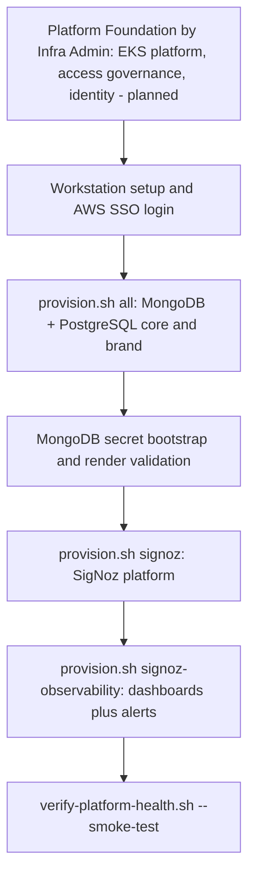

# Target Operator Runbook — Draft Blueprint (Not Live)

Status: **DRAFT BLUEPRINT — not authoritative, not linked from the live
documentation set.** This is a "Working Backwards" style operator-experience
target captured for architecture review only.

Why this file exists: while researching the multi-environment / dual-PostgreSQL
build-out, an earlier pass in this session edited the live root `README.md`
directly to describe the target ownership-plane / `--env` / core-brand
operating model. `docs/superpowers/plans/2026-07-22-phase2-documentation-acceptance-adoption.md`
requires that documentation changes land **last**, only after the foundation,
EKS-platform, data-telemetry, and Boomi-runtime work packages are actually
frozen, and forbids speculating about names/flags that are not yet landed. The
root `README.md` is a **live document** operators may use to recover a real
environment right now — it must not describe commands, scopes, or flags
(`--env`, `eks-platform`, `postgresql-core`/`postgresql-brand`) that do not
exist yet, since a mistaken copy-paste against a live environment can fail or
cause harm.

This draft preserves that "doc-first" target-experience thinking without
polluting the live README. `README.md` itself has been reverted to its last
committed state (`3dda011`). When
`2026-07-22-phase2-documentation-acceptance-adoption.md` actually executes (its
own Task 2, "Publish The Capability Matrix And Environment-Aware Front Door"),
it should use this draft as directional input, then verify every name, flag,
and scope against the landed interfaces before writing the real
`README.md` — never copy this draft in verbatim without that verification.

---

## Captured Draft Content (as of this session, before revert)

The sections below are the exact ownership-plane / dev-reality / provisioning
language drafted this session. Treat every command, scope name, and flag below
as **unverified and possibly renamed** by the time the real documentation
package executes.

### Who Provisions What (Ownership Planes)

Provisioning is split by **who is authorized to run it** and **how often it
changes**. Each plane holds only the credentials it needs, and day-2
configuration never shares a blast radius with base infrastructure.

| Plane | Owner | Scope | Credential | Changes |
|---|---|---|---|---|
| **Base infrastructure** | **Infra Admin** | All Terraform — EKS platform, access governance, workload identity, MongoDB prerequisites, PostgreSQL core + brand | Elevated AWS IAM | Rarely |
| **Platform workloads** | Platform Operator | Kubernetes workloads — Percona operator, MongoDB cluster, policies, SigNoz install. Target owner is GitOps/Flux (continuous reconciliation); today bootstrapped by one-shot `provision-k8s-components.sh` applies. | Cluster RBAC (not cloud admin) | Continuously reconciled (target); one-shot apply (today) |
| **Observability config** | Observability owner | SigNoz dashboards + alerts (`signoz-observability`) | SigNoz API token only | Frequently |
| **Data-access governance** | DBA / data owner | Database roles, grants, audit settings (governed per database) | Database admin creds | As access changes |

> Environment model: `--env` is not just a naming prefix — it selects a
> different AWS account, IAM/VPC space, and AWS SSO profile, following the
> same account/profile-resolution pattern as
> `../../Boomi/boomi-infra/infra/scripts/aws_sso_helper.sh`. UAT is built
> first; dev stays unchanged until a separate adoption step.

### Dev Reality vs. Target Operating Model

The ownership planes above are the **target operating model**, not what
today's scripts enforce:

- **Today (dev, local bootstrap):** one operator, holding elevated dev AWS and
  cluster-admin credentials, runs every plane by hand. `provision.sh all` is a
  legacy convenience wrapper bridging Terraform and `kubectl apply`; planned to
  be severed.
- **Target (UAT/production):** each plane runs under a distinct CI/CD identity
  scoped to only that plane's credentials.
- **Kubernetes workloads:** `provision-k8s-components.sh` is a bootstrap/Day-1
  imperative apply; target Day-2 owner is GitOps/Flux.

### Onboarding Flow (target, with Platform Foundation stage)

### Provisioning Choices (target, with core/brand split)

| Goal | Command | Why not merged into `all` |
|---|---|---|
| Platform Foundation (*planned*) | `bash scripts/provision.sh eks-platform` (*planned*) | Base infra is a distinct, high-privilege ownership plane changed rarely. |
| Full baseline | `bash scripts/provision.sh all` | Legacy convenience wrapper bridging Terraform + kubectl-apply planes. |
| MongoDB path only | `bash scripts/provision.sh mongodb` | Limits blast radius to MongoDB changes. |
| Core OMS PostgreSQL only | `bash scripts/provision.sh pg` → `postgresql-core` (*planned*) | Isolated compute/credential domain; shares VPC/network unless separately networked. |
| Brand PostgreSQL only (*planned*) | `bash scripts/provision.sh postgresql-brand` (*planned*) | Isolated compute/credential domain, independent of core. |
| SigNoz (telemetry) | `bash scripts/provision.sh signoz` | Independent lifecycle from DB infra. |
| SigNoz observability | `bash scripts/provision.sh signoz-observability --auto-approve` | Requires live SigNoz API/token. |

---

## Reconciliation Note

The actual landed interface names (schema keys, scope names, script flags)
must come from the frozen output of:
- `2026-07-22-phase2-environment-orchestration-foundation.md` (the real `--env`
  mechanism, registry scope names, `PROMOTION_MODE`)
- `2026-07-22-phase2-eks-platform.md` (the real EKS/platform scope names and
  outputs)
- `2026-07-22-phase2-data-telemetry.md` (the real `postgresql-core` /
  `postgresql-brand` schema keys, e.g. `POSTGRESQL_CORE_CLUSTER_IDENTIFIER`)
- `2026-07-22-phase2-boomi-runtime.md` (the real Boomi runtime scope/contract)

Do not assume this draft's exact command spellings survive unchanged.
