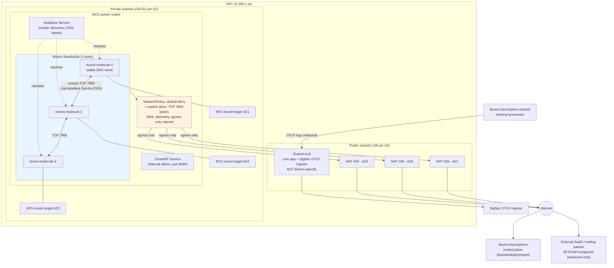

# VPC Subnet Allocation and Boomi Networking Design

**Date:** 2026-07-29
**Status:** Approved (converged across multiple research/verification rounds)

## Context

The `oms` project's real allocated IP block is `10.200.0.0/16` (65,536 addresses total),
shared across **all** environments (Prod, UAT, Dev, SIT) — not one `/16` per environment
as the existing placeholder Terraform (`platform-prerequisites/terraform/environments/`)
currently assumes (`dev=10.70.0.0/16`, `uat=10.80.0.0/16`, `sandbox=10.90.0.0/16`).

**Multi-account topology (verified from actual tfvars, previously undocumented):** every
environment is already a **separate AWS account**, not a shared account with separate VPCs:

| Environment | AWS Account | Region |
|---|---|---|
| Dev | `815402439714` | `ap-east-1` |
| UAT | `672172129937` | `ap-east-1` |
| Sandbox (today) / **Production (target)** | `632674123947` (comment: *"Production account"*) | Sandbox uses `us-east-1` (cheap testing); Production will use `ap-east-1` (real prod region), after sandbox is fully torn down in that account |

A single non-overlapping `/16` address plan across separate accounts is the standard
pattern for keeping future **Transit Gateway or VPC peering** possible without renumbering
later (overlapping CIDRs block both). Cross-account connectivity itself is owned by a
separate infra team via a company-wide Landing Zone (resolved, see 4-Perspective Critique
Findings below) — this repo's Terraform never creates TGW/peering resources.

## Database Engine Decision

| Environment | Postgres engine | Rationale |
|---|---|---|
| Dev / SIT | CloudNativePG (CNPG), self-managed in-cluster | Cost-cutting; dev/sit load is light |
| UAT / Prod | AWS Aurora PostgreSQL (managed RDS) | Same engine version kept in lockstep between UAT and Prod for realistic pre-prod validation |

Dev/SIT should track the same PG engine version as UAT/Prod where possible; where CNPG's
available community image version doesn't exactly match Aurora's supported version, dev/sit
may run a slightly newer version, since dev/sit is explicitly used to test upcoming patches
ahead of promotion.

**Implication:** Dev/SIT need **no dedicated DB subnet tier** — CNPG Postgres runs as pods
sharing the same private EKS subnets as everything else. Only UAT/Prod need a dedicated
Aurora DB subnet group.

## AWS Hard Constraints (verified directly against AWS documentation)

- **RDS/Aurora DB subnet groups must span ≥2 Availability Zones** — an AWS API-level
  requirement, not a preference: *"You need to do this even for Single-AZ deployments."*
  Verified by fetching the live page (2026-07-29): [Working with DB subnet groups](https://docs.aws.amazon.com/AmazonRDS/latest/UserGuide/USER_VPC.WorkingWithRDSInstanceinaVPC.html#USER_VPC.Subnets)
  — exact quote confirmed on page: *"Each DB subnet group should have subnets in at least two
  Availability Zones in a given AWS Region."*
- **DB subnet groups should be private-only.** Office access to a private-only Aurora
  instance is achieved via Site-to-Site VPN / AWS Client VPN into the VPC, not a public
  subnet — same pattern already used for EKS API access (`endpoint_public_access = false`
  in `platform-prerequisites/terraform/environments/uat/eks-platform.tfvars`).
- **ALB subnets must be ≥`/27` with at least 8 free IPs per AZ** — AWS's own documented
  failure mode if violated: *"the Application Load Balancer will run with insufficient
  capacity... might cause 5xx errors or timeouts."* Verified by fetching the live page
  (2026-07-29): [Subnets for your load balancer](https://docs.aws.amazon.com/elasticloadbalancing/latest/application/application-load-balancers.html#availability-zones)
  — exact quote confirmed on page: *"verify that each Availability Zone subnet for your load
  balancer has a CIDR block with at least a `/27` bitmask... and at least eight free IP
  addresses per subnet."*
- **EKS cluster subnets**: technical floor is "6 IPs, recommend 16" for the control
  plane's own ENIs — real sizing must instead fit actual node/pod counts. AWS recommends
  nodes/pods in private subnets only; public subnets host only NAT gateways and
  internet-facing load balancers.

## Boomi Molecule Networking (verified against this repo's own approved design AND the
real `aws-ia/terraform-boomi-kubernetes-molecule` AWS reference module)

**Boomi Molecule requires NO public subnet presence.** Verified two ways:

1. This repo's own approved design (`docs/superpowers/specs/2026-07-21-uat-platform-consolidation-design.md`,
   `docs/superpowers/plans/2026-07-22-phase2-boomi-runtime.md`) only creates internal
   cluster-discovery Services and a NetworkPolicy — no Ingress, no public Service, no ALB.
2. The real AWS reference Terraform module (`github.com/aws-ia/terraform-boomi-kubernetes-molecule`)
   contains **no `aws_lb`/ALB/Ingress resource anywhere**. Its larger public subnet
   defaults (`/20`) exist because it deploys a **Bastion Host EC2 Auto Scaling Group**
   for SSH admin access — a different access pattern than ours (we already use
   `endpoint_public_access = false` + VPN, matching the same pattern as Aurora DB access).
   No KEDA / Elastic Executions exists in that module either — that's a separate,
   optional Boomi product tier (Runtime Cloud), explicitly out of scope per this repo's
   own design ("Non-Goal: Replacing the standard private Boomi runtime cluster with a
   Runtime Cloud or Elastic Executions architecture without confirmed entitlement").

**Boomi Molecule's actual network footprint:**
- **StatefulSet, 3+ stable pods**, private subnet only (shares the same private subnet as
  core app / MongoDB / SigNoz)
- **RWX EFS mount** at `/mnt/boomi` (mount targets consume a handful of private IPs per AZ)
- **Outbound only** via NAT Gateway: license/deploy/report calls to the Boomi AtomSphere
  control plane, and any external SaaS API calls
- **Inter-pod cluster communication: unicast TCP `7800`.** AWS VPCs do not support native
  multicast (would require Transit Gateway Multicast Domains, a separate, complex service),
  so multicast UDP `45588` is not viable on standard VPC networking — unicast TCP `7800` is
  the technically correct choice, not a judgment call between two equally valid options.
  **Correction:** an earlier draft of this document overstated this as "resolved." The
  formal decision record required by `docs/superpowers/plans/2026-07-22-phase2-boomi-runtime.md`
  Task 1 (`docs/references/boomi-runtime-communication-decision.md`, which must start in
  `**Status:** Decision required` and gates `apply` until set) has **not been created yet**.
  This document's conclusion should feed that decision record; it does not replace it.
- **Cluster discovery mechanism is already correctly planned** in the approved Boomi runtime
  plan: `gitops/boomi-runtime/base/services.yaml` provides a headless Service for
  DNS-based member discovery (StatefulSet pod DNS names), which continues to work correctly
  across pod reschedules — unlike a static IP list, which would break. No change needed here.

**What actually needs the public subnet (Boomi-adjacent):** Boomi's *external* AtomSphere-hosted
processes call **into** our SigNoz OTLP ingress endpoint (`docs/guides/boomi-integration-guide.md`
Endpoint Contract: `Production (ingress) | https://<signoz-ingress-host>/v1/logs | Network-restricted`).
This is the **core app / SigNoz shared ingress ALB**, not a Boomi-Molecule-specific ALB.

## Public Subnet Sizing

Given the verified `/27` AWS minimum (with the documented 5xx-failure risk below it), and
that Boomi needs no dedicated public presence:

- **Per-AZ public subnet: `/26` (64 addresses)** — covers 1 NAT Gateway + 1 shared ALB
  (core app + SigNoz ingress) with 2x the AWS-documented minimum as real headroom.
- The `aws-ia` reference module's `/20` default does not apply here — it assumes a
  dedicated bastion host and a fully isolated per-environment `/16`, neither of which
  matches this project's constraints.

## Final CIDR Allocation

**Deployment model (user-confirmed 2026-07-29):** all environments under `10.200.0.0/16`
are **net-new builds** via this repo's provisioning scripts. There is no in-place CIDR
mutation of the existing POC VPCs (`10.70.0.0/16`/`10.80.0.0/16`/`10.90.0.0/16`). Once the
new environments are verified working, the user will manually decommission the old POC
VPCs themselves — this repo's automation does not perform that decommission.

**Ordering rationale (user-confirmed):** Production and SIT are the two environments
expected to potentially grow; Dev and UAT are fixed-size and not expected to expand. The
block order is therefore `Production, Reserved, SIT, Dev, UAT` so the single Reserved pool
sits contiguously between Production and SIT and can extend either one.

### Top-Level Split (within `10.200.0.0/16`)

| Order | Block | CIDR | Addresses |
|---|---|---|---|
| 1 | Production | `10.200.0.0/17` | 32,768 (50%) |
| 2 | Reserved (growth buffer for Production or SIT) | `10.200.128.0/18` | 16,384 |
| 3 | SIT | `10.200.192.0/20` | 4,096 |
| 4 | Dev (fixed) | `10.200.208.0/21` | 2,048 |
| 5 | UAT (fixed) | `10.200.216.0/21` | 2,048 |
| 6 | Unallocated tail (spare) | `10.200.224.0/19` | 8,192 |

Total: 32,768 + 16,384 + 4,096 + 2,048 + 2,048 + 8,192 = 65,536 = the full `/16`. Every
address in the block is accounted for, either assigned or explicitly marked spare.

**SIT capacity check (user's actual question: is 4,096 enough for 10 environments?):**
Yes, with large headroom. At clean `/24`-per-environment alignment (256 addresses per SIT
env, for simple tooling), `10.200.192.0/20` (4,096) fits **16 environments** — 6 more than
needed. At raw (non-aligned) division of the 192-address-per-env footprint below, it fits
21. Either way, 10 environments consumes well under half the block, leaving room to grow
toward Reserved if SIT ever needs more than 16.

### Per-Environment Subnet Breakdown

**Prod** (`10.200.0.0/17`, 3 AZs):
- 3× private k8s (app + MongoDB + SigNoz + Boomi Molecule): `/19` each (8,192 × 3 = 24,576):
  `10.200.0.0/19`, `10.200.32.0/19`, `10.200.64.0/19`
- 3× public (NAT + shared ALB only): `/26` each (64 × 3 = 192): `10.200.96.0/26`,
  `10.200.96.64/26`, `10.200.96.128/26`
- 3× private Aurora DB subnets (brand-db + lookup-db share one DB subnet group): `/24` each
  (256 × 3 = 768): `10.200.97.0/24`, `10.200.98.0/24`, `10.200.99.0/24`
- Remainder (`10.200.96.192/26` plus `10.200.100.0 \u2013 127.255`, 7,232 addresses total) held
  as environment-local headroom for future subnets; further growth beyond this consumes
  from the Reserved block (item 2 above)

**UAT** (`10.200.216.0/21`, 2 AZs, fixed size):
- **Correction (2026-07-29, round 8):** an earlier draft labeled this tier `/22`, which is
  1,024 addresses, not the 512 stated alongside it — a mislabeling bug that survived 8
  rounds of critique because no round did the actual arithmetic. The correct prefix for
  512 addresses is `/23`.
- 2× private k8s: `/23` each (512 × 2 = 1,024): `10.200.216.0/23`, `10.200.218.0/23`
- 2× public: `/26` each (64 × 2 = 128): `10.200.220.0/26`, `10.200.220.64/26`
- 2× private Aurora DB subnets: `/25` each (128 × 2 = 256): `10.200.220.128/25`, `10.200.221.0/25`
- Remainder `10.200.221.128 \u2013 10.200.223.255` (640 addresses) held as headroom

**Dev** (`10.200.208.0/21`, **2 AZs — corrected 2026-07-29 round 8**, fixed size):
- **Correction:** an earlier draft of this section said "1 AZ," which conflicts with a hard
  validation in `platform-prerequisites/terraform/modules/network/variables.tf`
  (`length(var.availability_zones) >= 2`, enforced via a `validation` block) and with
  `environments/dev/eks-platform.tfvars`, which already runs 2 AZs
  (`ap-east-1a`, `ap-east-1b`) live today. Recomputed for 2 AZs within the same `/21`:
- 2× private `/23` each (512 × 2 = 1,024): `10.200.208.0/23`, `10.200.210.0/23`
- 2× public `/26` each (64 × 2 = 128): `10.200.212.0/26`, `10.200.212.64/26`
- Remainder `10.200.212.128 – 10.200.215.255` (896 addresses) held as headroom
- No DB subnet (CNPG shares the k8s private subnet)

**SIT** (`10.200.192.0/20`, `/24`-aligned per environment, up to 16
environments — comfortably covers the current need of 10):
- **Same constraint applies and must be accounted for when SIT is eventually implemented:**
  the network module's `>= 2 AZ` validation means each SIT environment also needs 2 AZs, not
  1. Per SIT env within its `/24` (256 addresses): 2× private `/26` (64 × 2 = 128) + 2×
  public `/27` (32 × 2 = 64), leaving 64 addresses of headroom — revised from the earlier
  "1 AZ, `/25` private + `/26` public" draft, which would fail the same module validation.
  This does not change the top-level `/20` sizing or the 16-environment capacity, only the
  per-environment internal split. Deferred with SIT itself; recorded here so whoever
  implements SIT later doesn't repeat the same mistake this document just corrected for Dev.
- No DB subnet (CNPG)

## Open Items For Follow-Up (not blocking this design)

- Write `docs/references/boomi-runtime-communication-decision.md` recording the unicast
  TCP 7800 decision (currently blocks Boomi runtime plan's UAT acceptance readiness).
- Confirm exact Aurora engine version to pin for UAT/Prod parity, and the closest matching
  CNPG community image version for Dev/SIT.
- Add a `prod` environment tfvars file (does not exist yet in
  `platform-prerequisites/terraform/environments/`).
- **Still unresolved (user confirmed unknown, needs Boomi process owner input):** whether
  any current/planned Boomi process requires an inbound listener (Web Services Server, AS2,
  webhook). Design proceeds on the "outbound/polling only" assumption as provisional and
  reversible — if an inbound listener turns out to be required, a separate exposure design
  (likely an additional Ingress/ALB path) will be needed for that specific process.

## 4-Perspective Critique Findings (2026-07-29) — Must Resolve Before Terraform Implementation

This section records issues found by actually verifying claims against this repo's real
files and AWS documentation, not by accepting a pasted external critique at face value.

### AWS Architect

1. **VPC CIDR migration risk — resolved by user decision (2026-07-29).** Dev/uat ARE live
   today under the old CIDRs, but they are POC-grade environments. The new `10.200.0.0/16`
   scheme will be built as entirely new, net-new VPCs via this repo's provisioning scripts,
   not an in-place CIDR mutation of the existing VPCs. The user will manually decommission
   the old POC VPCs after the new ones are verified working; that decommission is out of
   scope for this repo's automation.
2. **Resolved (engineering default, no architectural decision needed):** EKS pod IP
   density. Enable `ENABLE_PREFIX_DELEGATION=true` on the VPC CNI for every environment —
   this is a standard AWS best practice, not a project-specific tradeoff, and is now an
   implementation task for the next plan rather than an open design question.

   **Verified detail (fetched AWS EKS Best Practices Guide, 2026-07-29):** confirmed exact
   quote — *"you can now configure Amazon VPC CNI to assign /28 (16 IP addresses) IPv4
   address prefixes."* Two consequences worth recording:
   - AWS explicitly recommends enabling prefix delegation on **new** subnets/node groups
     rather than converting existing ones, since `/28` prefixes need a contiguous free
     block and already-fragmented subnets can fail prefix attachment. This is a point in
     favor of the net-new-build decision already made above — no extra action needed.
   - Prefix delegation allocates IPs in fixed 16-address chunks (plus a default
     `WARM_PREFIX_TARGET=1`, i.e. one full spare prefix held per node). Negligible for
     Prod (`/19`), UAT/Dev (`/22`), but the planned SIT per-environment private subnet
     (`/25`, ~123 usable addresses) only fits **~7 prefix-attachments total** — likely fine
     for one small node, tight for more. Not a live blocker since SIT is already deferred,
     but its per-env private subnet should be sized larger than `/25` when SIT is actually
     implemented, given this 16-address granularity.
3. **Folded into the existing tracked Boomi risk (not a separate open item):** NAT Gateway
   EIP allowlisting for external trading partners depends on the same unknown as the Boomi
   inbound-listener risk already tracked below (both hinge on whether any external partner
   integration needs a fixed source IP). Tracked as one combined risk, not two.
4. **Reserved CIDR block purpose — resolved by user decision.** The single `10.200.128.0/18`
   Reserved block sits contiguously between Production and SIT specifically so either can
   expand into it (Production and SIT are the two environments expected to potentially
   grow; Dev/UAT are fixed-size). See Final CIDR Allocation above.
5. **Resolved by the Landing Zone decision below.** VPN client CIDR pool overlap is the
   infra team's responsibility, since they own all cross-account/VPN routing and are
   already required to keep every attached range non-overlapping on their side.
6. **Resolved as an explicit decision:** IPv6 is out of scope. Nothing in this repo's
   Terraform, Kubernetes manifests, or design touches IPv6 anywhere — IPv4-only.

### DevOps

1. **Deferred into the next deliverable, not a spec blocker:** an automated CIDR-overlap
   validation test (checking new allocations don't collide) should be part of the
   `writing-plans` output's verification strategy, not something resolved at design-spec
   stage.
2. The Aurora Terraform root does not exist yet. This is not a new decision — the
   2026-07-21 approved design already scoped `postgresql` root = "Aurora PostgreSQL and
   metrics-collector identity" for UAT — but `platform-prerequisites/terraform/postgresql/main.tf`
   today only attaches a CNPG backup IAM policy. Needs real `aws_rds_cluster` + DB subnet
   group resources. This is precisely what the next plan must implement.
3. SIT "up to N environments" per-instance workflow — resolved by deferral: SIT itself is
   deferred (needs a new AWS account that doesn't exist yet), so this workflow design is out
   of scope for the current implementation plan.

### Software Architect

1. SIT `/20` fits 21 environments by raw division (192 addresses each) but only 16 on clean
   `/24`-aligned boundaries. The doc should state that 16 comes from `/24` alignment for
   simpler allocation/tooling, not from a raw division limit.
2. **Resolved:** the Reserved block's purpose and placement (between Production and SIT,
   the two variable-size environments) is now documented in Final CIDR Allocation above.

### Boomi Architect

1. **Correction to this document's own earlier claim:** the TCP-7800-vs-multicast question
   is technically clear, but the formal decision record
   (`docs/references/boomi-runtime-communication-decision.md`) required by
   `docs/superpowers/plans/2026-07-22-phase2-boomi-runtime.md` Task 1 has **not been created**
   yet — it was incorrectly described as "resolved" in an earlier draft of this document.
2. **Inbound listener processes: a real, still-open gap, not an assumption to wave away.**
   `BOOMI-0002`'s disposition in the Boomi runtime plan explicitly states *"External ingress
   requires a separate approved exposure design."* The current design has no answer for
   Boomi process types needing inbound connections (Web Services Server listener, AS2,
   webhook-style listeners). The one integration example found
   (`docs/guides/boomi-integration-guide.md`'s EDI trading-partner file retrieval) reads as
   outbound/pull-initiated by Boomi, consistent with "no inbound needed" — but this is
   inference from a single illustrative example, not a confirmed inventory of all Boomi
   process types in use. **Needs explicit confirmation from whoever owns the Boomi process
   inventory before finalizing "Boomi needs zero public subnet exposure."**
3. Cluster discovery via headless Service (DNS-based) is already correctly planned and
   compatible with unicast TCP 7800 across pod reschedules — no issue found here.

### Boomi-in-Kubernetes Architecture (as requested)

The diagram makes explicit that the only inbound path related to Boomi is external
AtomSphere-hosted processes calling the shared SigNoz ingress ALB — nothing calls into the
Boomi Molecule pods themselves from outside the cluster. **This holds only if Boomi
Architect finding #2 above (no inbound listener processes) is confirmed, not assumed.**

4. **Correction to an external reassurance (2026-07-29 round 2):** a claim that spare public
   subnet IPs alone make the design "safe regardless of the Boomi listener decision" is
   incomplete. Raw IP headroom in a `/26` does not solve the actual mechanism problem: Boomi
   listener processes (Web Services Server, AS2) commonly bind to a **specific** Atom/Molecule
   node rather than round-robining across all StatefulSet pods, and protocols like AS2 need
   session affinity. If an inbound listener turns out to be required, the real work is
   per-ordinal Kubernetes routing (dedicated Service/Ingress rules with node affinity), not
   just "add another ALB" — that part of the risk is not closed by subnet sizing alone.

### New Finding (2026-07-29 round 2) — Multi-Account Topology, Previously Undocumented

Verified directly from `platform-prerequisites/terraform/environments/*/eks-platform.tfvars`:
every environment is already a **separate AWS account** (Dev `815402439714`, UAT
`672172129937`, Sandbox `632674123947` — the latter commented as *"Production account"*, but
currently used in `us-east-1` for cost-optimized testing rather than the real prod region).

This was never stated in the design and materially affects the Terraform implementation:

1. **Resolved:** Transit Gateway / VPC peering / all cross-account routing is owned by a
   separate infra team through a company-wide **Landing Zone**. This repo's Terraform does
   not create TGW attachments, RAM shares, or routing resources for that — the infra team
   handles 100% of landing-zone attachment once our VPCs exist. Our scope stays limited to
   provisioning correctly-sized, non-overlapping VPCs/subnets.
2. **Resolved:** `10.200.0.0/16` is **statically self-managed** by this project (not an AWS
   IPAM pool owned by the landing zone). VPCs are declared with a hardcoded `cidr_block`,
   not an `ipv4_ipam_pool_id` allocation request — no IPAM-specific Terraform resource design
   needed.
3. **Resolved:** the new Production VPC (`10.200.0.0/17`) **fully replaces** the existing
   `sandbox` environment in account `632674123947`. This requires a **complete teardown of
   every sandbox Terraform state** (`eks-platform`, `mongodb`, `postgresql`,
   `workload-identity`) with verification of zero leftover resources, executed *before*
   provisioning Production in that account — explicitly not a soft/partial replace, to avoid
   any leftover sandbox resource affecting the future production build.

   **Verified destroy order (evidence-checked, not assumed):** consumers first, then
   `workload-identity`, then `eks-platform` last — i.e. `mongodb` + `postgresql` →
   `workload-identity` → `eks-platform`. This is the reverse of the earlier proposed order
   (`workload-identity` → `postgresql` → `mongodb` → `eks-platform`), which was checked
   against the actual code and found backwards: `platform-prerequisites/terraform/workload-identity/main.tf`
   creates `aws_iam_role.identity` resources trusted by `pods.eks.amazonaws.com` (EKS Pod
   Identity), and `environments/sandbox/mongodb.tfvars` /
   `environments/sandbox/postgresql.tfvars` reference those exact roles
   (`operator_iam_role_arn`, `postgresql_operator_iam_role_arn`). Destroying
   `workload-identity` before `mongodb`/`postgresql` would revoke the IAM permissions those
   operators need to perform their own teardown (e.g., backup cleanup, S3/KMS access) mid-way
   through the process. `eks-platform` stays last because `workload-identity` itself reads
   its remote state (`terraform_remote_state.eks_platform`) and would fail without it.

   **Precision correction:** the actual failure mode of destroying in the wrong order is a
   **partial/failed destroy** (an IAM `AccessDenied` mid-teardown, some resources destroyed,
   some not) requiring manual state remediation — not a Terraform state *lock*. A state lock
   is the separate DynamoDB/S3 concurrent-access mechanism and is not the risk here; an
   external critique conflated the two.

   **New finding (2026-07-29, round 4) — a plain `terraform destroy` will fail regardless of
   ordering, on a different resource.** `platform-prerequisites/terraform/modules/efs/main.tf`
   sets `lifecycle { prevent_destroy = true }` on `aws_efs_file_system.this`, used by the
   `eks-platform` root. This blocks `terraform destroy` outright on that resource
   (`Instance cannot be destroyed... resource has lifecycle.prevent_destroy set`) independent
   of the ordering fix above. This guard must **not** be permanently removed from the shared
   module — it is the correct safety rail protecting the *future* Production EFS filesystem
   from accidental destroy. The teardown plan needs an explicit, scoped, temporary step (for
   example, a targeted change flipping `prevent_destroy` to `false` only for the sandbox
   environment's apply/destroy cycle, confirmed reverted to `true` before Production is
   provisioned with the same module). Checked for equivalent guards on other destroy-blocking
   resource types (`force_destroy` on S3 buckets, `deletion_window_in_days` on KMS keys) —
   none exist in this repo's Terraform modules, so this is the only lifecycle guard of this
   kind currently in scope.
4. **Resolved:** SIT is **deferred**. It requires a brand-new AWS account that does not exist
   yet; it is out of scope for the current implementation plan. (The user also indicated a
   fresh `sandbox`-equivalent environment may be created as its own new account in the
   future, separate from the one being torn down now.)

### Gating Rule

Per the Superpowers Creator perspective: all open items in this section, including the new
multi-account topology questions above, should be resolved (explicit answers, not
assumptions) before moving to `writing-plans` for the Terraform implementation.

**Status as of 2026-07-29 (round 4, corrected after a full re-read of this document):**

An earlier version of this status line claimed "all gating items resolved except one
tracked risk," which was inaccurate — 5 items (AWS-2, AWS-3, AWS-5, AWS-6, DevOps-1) were
identified in the sections above but never actually closed. They are now explicitly
resolved above (engineering defaults, scope decisions, or deferral into the next
deliverable), so the claim is now actually true:

- Multi-account topology, Landing Zone scope, CIDR ownership model, sandbox-teardown
  sequencing (including the `prevent_destroy` EFS blocker), EKS pod IP density, VPN CIDR
  overlap, and IPv6 scope are all explicit, closed decisions.
- The Aurora Terraform gap and CIDR-overlap test are known, tracked **implementation
  tasks** for the next deliverable, not open design questions.
- **One tracked, non-blocking risk remains:** the Boomi inbound-listener confirmation
  (folded together with the NAT EIP allowlisting question, since both hinge on the same
  external-partner unknown). Proceeding on "outbound/polling only," reversible if wrong.
- **Separately, out of this plan's scope:** `docs/references/boomi-runtime-communication-decision.md`
  is a pre-existing deliverable of a *different*, already-approved plan
  (`docs/superpowers/plans/2026-07-22-phase2-boomi-runtime.md` Task 1). It is not part of
  the network/CIDR redesign or UAT provisioning plan and should not block it.

**Ready to proceed to `writing-plans`.**
