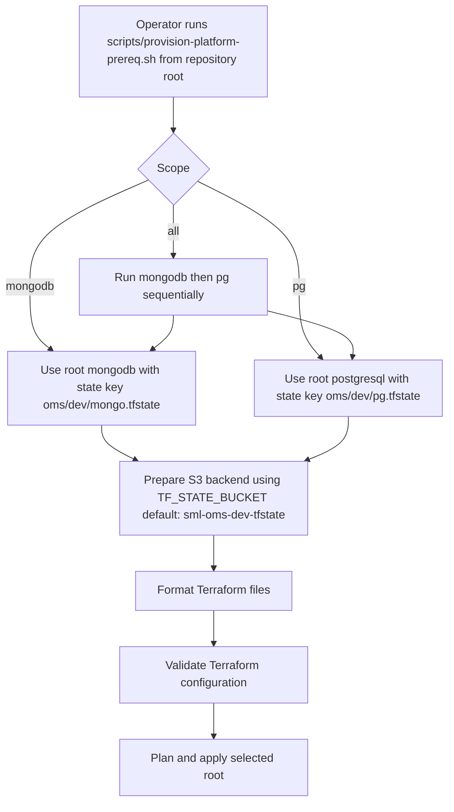
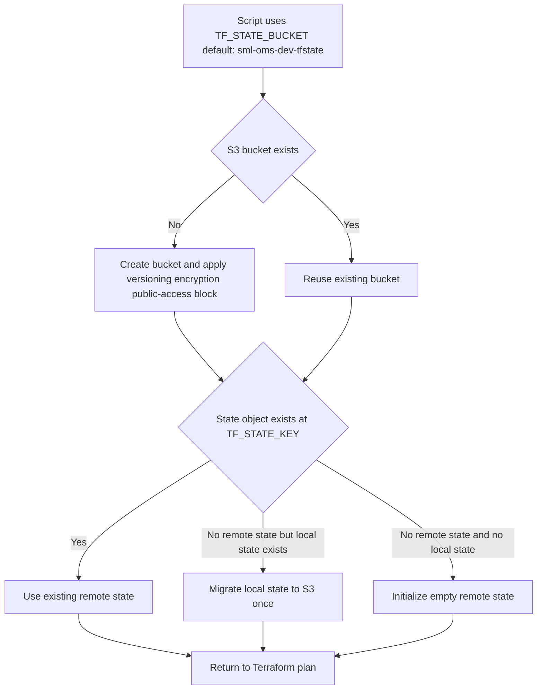
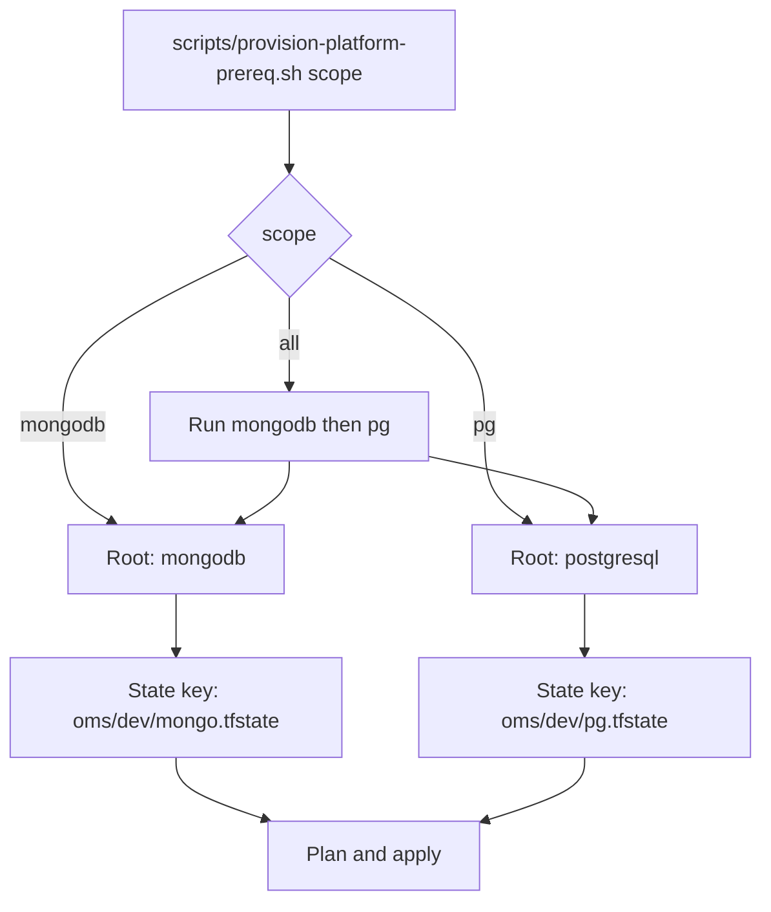
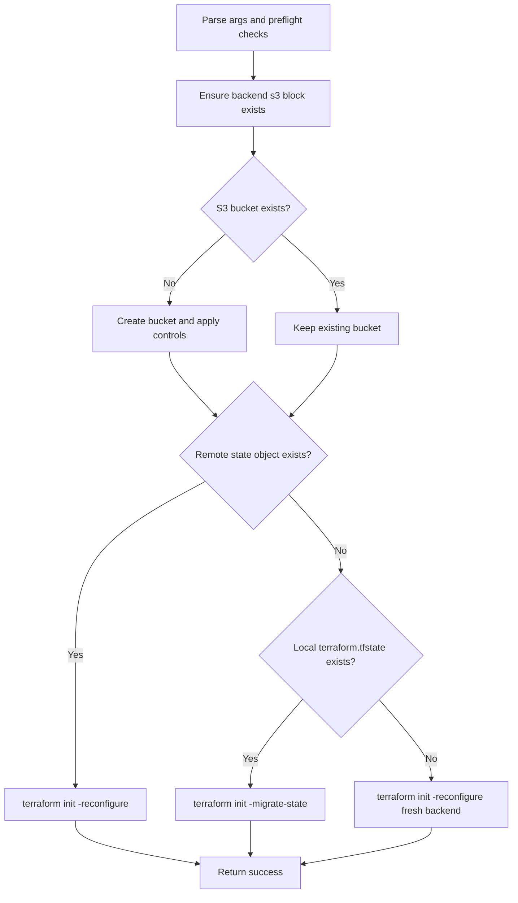
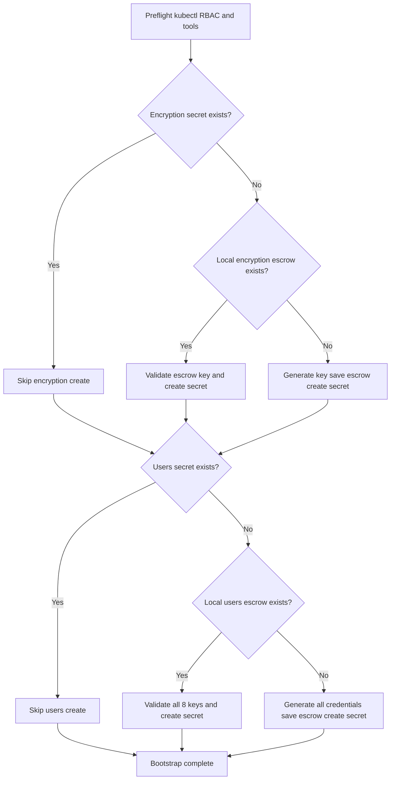
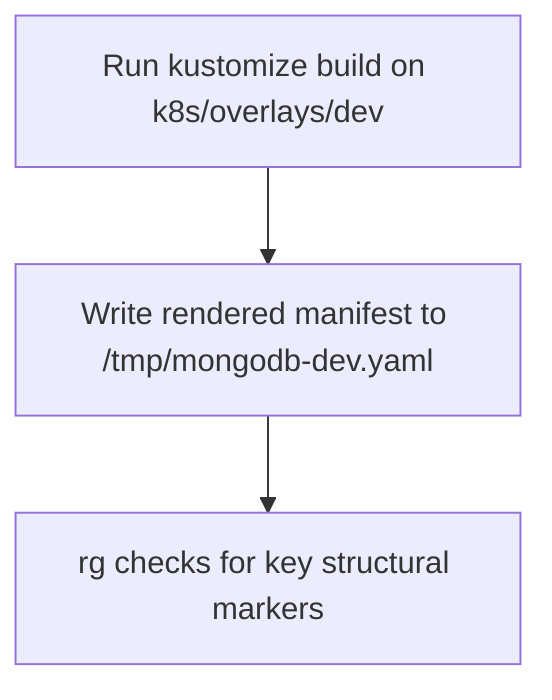
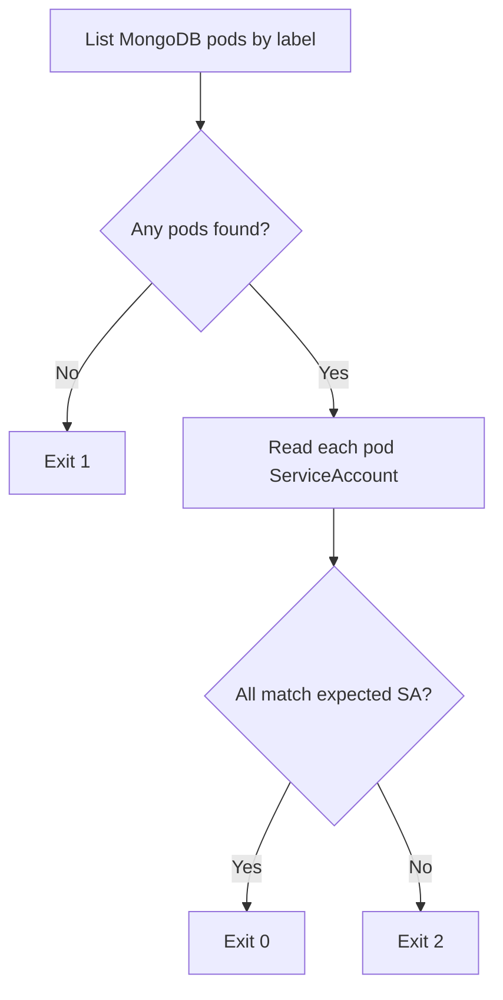
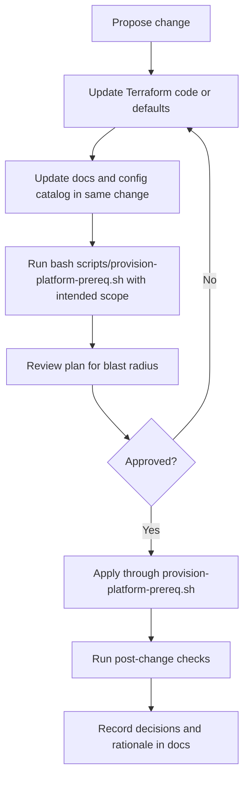

# Platform Prerequisites Terraform

## Purpose
This document is the operating guide for the Terraform stack that provisions the **OMS (Order Management System) data-layer prerequisites** in the dev environment.

The OMS application has three backend services:
- **PostgreSQL** (Aurora) — primary application database for orders, inventory, and operational data.
- **MongoDB** (Percona on EKS) — audit trail database for immutable compliance event records.
- **SigNoz** — application telemetry (traces, metrics, logs) for OMS services.

This Terraform stack prepares the AWS and Kubernetes infrastructure that MongoDB and PostgreSQL need before their workloads can run. SigNoz is provisioned separately via Kubernetes manifests only (no Terraform prerequisites).

## Read This First

| Question | Answer |
|---|---|
| What does this Terraform stack create? | AWS and Kubernetes prerequisites for the OMS audit trail (MongoDB) and primary database (PostgreSQL). |
| Why does it exist? | To prepare shared infrastructure in a repeatable way before Kubernetes workload manifests are deployed. |
| When do I run it? | Before the first MongoDB workload deployment, and again whenever Terraform inputs or prerequisite infrastructure need to change. |
| Where do I run it from? | Run commands from the repository root, using [scripts/provision.sh](../../scripts/provision.sh) or [scripts/provision-platform-prereq.sh](../../scripts/provision-platform-prereq.sh). Terraform runs from the scope-selected root (`mongodb` or `postgresql`). |
| Which state does it use? | Remote S3 state in bucket `sml-oms-dev-tfstate` (region `ap-east-1`). State key is scope-dependent: `mongodb` uses `oms/dev/mongo.tfstate`, `pg` uses `oms/dev/pg.tfstate`, `all` runs both sequentially. In plain language, Terraform state is the record file Terraform uses to remember what it created. |
| Who should run it? | An operator with AWS permissions for IAM, S3, EKS discovery, RDS, VPC/security groups, and Kubernetes authorization for the target EKS cluster. |
| How do I know it worked? | The selected `scripts/provision-platform-prereq.sh` scope completes successfully, MongoDB secret bootstrap succeeds, and the dev overlay render check passes. |

## Documentation Ownership

This is the canonical operator runbook for provisioning and troubleshooting.

Related docs:
- Repository overview and architecture guardrails: [README.md](../../README.md)
- MongoDB-root local context: [platform-prerequisites/terraform/mongodb/README.md](mongodb/README.md)
- PostgreSQL-root local context: [platform-prerequisites/terraform/postgresql/README.md](postgresql/README.md)
- Configuration inventory only: [docs/operations/dev-configuration-catalog.md](../../docs/operations/dev-configuration-catalog.md)
- Historical execution snapshot only: [docs/history/operations/execution-status-2026-06-23.md](../../docs/history/operations/execution-status-2026-06-23.md)
- Operations docs map: [docs/operations/README.md](../../docs/operations/README.md)

## Scope

This stack provisions:
- MongoDB (audit trail) prerequisites on EKS, including namespace, ServiceAccount/IAM wiring, and PBM backup bucket controls
- Aurora PostgreSQL (primary app database) for dev, using a provisioned cluster with a single writer instance

This stack does not provision:
- MongoDB workload manifests under `k8s/` (applied after prerequisites)
- Percona Operator manifests under `gitops/` (applied via Flux)
- Kyverno policy application under `policies/` (applied separately)
- SigNoz telemetry manifests under `gitops/signoz/` (no Terraform prerequisites needed)
- CI/CD automation

## Key Terms (Plain Language)

| Term | Plain Meaning | Why It Matters |
|---|---|---|
| Terraform root | A folder where Terraform runs for one scope. | Different roots let you apply only what you need. |
| Scope | The target you choose: `all`, `mongodb`, or `pg`. | Scope selects both the root and the state key. |
| Terraform state | A record file Terraform uses to track real infrastructure it created. | Without stable state, Terraform can create duplicates or lose ownership history. |
| State key | The object path of a state file in S3. | Different keys separate ownership between roots/scopes. |
| Reusable layer | Shared Terraform code called by roots. | Keeps MongoDB prerequisite logic in one place and avoids duplication. |
| Escrow file | A local-only copy of generated secrets saved on your laptop. Named "escrow" because it holds material you may need to recover later. | If you lose an escrow file and the cluster secret is deleted, the credential or encryption key is gone. |
| PBM | Percona Backup for MongoDB — the backup agent that runs as a sidecar inside each MongoDB pod. | PBM needs an S3 bucket and IAM role provisioned by this stack. |
| PSMDB | Percona Server for MongoDB — the database operator that manages the MongoDB replica set. | The Kubernetes CR (`PerconaServerMongoDB`) and user secrets are built for this operator. |
| Flux | A GitOps toolkit that reconciles Helm charts from git-tracked `HelmRelease` manifests. | The Percona operator and SigNoz are installed via Flux. |
| cert-manager | A Kubernetes add-on that issues and renews TLS certificates automatically. | MongoDB TLS certificates are defined as cert-manager `Certificate` resources. |
| Kyverno | A Kubernetes policy engine that enforces rules on resources at admission time. | Policies under `policies/kyverno/` guard storage class and sidecar resource settings. |
| `rg` (ripgrep) | A fast text search tool used by validation scripts. Installed as `ripgrep`, invoked as `rg`. | `scripts/validate-dev-render.sh` uses `rg` to check rendered manifest content. |

## Why These Terraform Directories Exist

| Path | Role | When You Use It | State Ownership |
|---|---|---|---|
| `platform-prerequisites/terraform/mongodb` | MongoDB-only root. | MongoDB prerequisite changes. Used by scopes `mongodb` and `all`. | `oms/dev/mongo.tfstate` |
| `platform-prerequisites/terraform/postgresql` | PostgreSQL-only root. | PostgreSQL prerequisite changes. Used by scopes `pg` and `all`. | `oms/dev/pg.tfstate` |
| `platform-prerequisites/terraform/reusable` | Shared module code for MongoDB prerequisites. Not a standalone root. | Maintainer edits to shared MongoDB prerequisite logic used by `mongodb` root. | No direct state; called by `mongodb` root. |

## State Partitioning Strategy

Terraform root and state key are selected by script scope:

| Scope | Terraform Root | Default State Key |
|---|---|---|
| `all` | Runs `mongodb` then `pg` sequentially | Two separate state keys (see below) |
| `mongodb` | `platform-prerequisites/terraform/mongodb` | `oms/dev/mongo.tfstate` |
| `pg` | `platform-prerequisites/terraform/postgresql` | `oms/dev/pg.tfstate` |

Safety rule:
- `all` is a convenience shortcut that runs `mongodb` then `pg`. It does not create a third state.
- Each scope always uses its own root and state key.
- Do not reuse one state key across multiple roots.

## Operating Model

The workflow has three phases. Keep them separate when debugging.

| Phase | Purpose | Main Command | Result |
|---|---|---|---|
| Prepare | Create runtime configuration and choose local or remote state. | Copy and edit the scope-specific `terraform.tfvars` file; optionally export `TF_STATE_*`. | Terraform has real environment inputs and a known state location. |
| Plan and Apply | Build/apply Terraform changes for full or selective scopes (MongoDB/PG). | `scripts/provision-platform-prereq.sh <all|mongodb|pg>` | AWS/Kubernetes prerequisite resources are created or updated. |
| Verify MongoDB Readiness | Create required dev secrets and confirm the MongoDB overlay renders before workload deployment. | `scripts/bootstrap-dev-secrets.sh`, then `scripts/validate-dev-render.sh`. | MongoDB workload manifests can be applied with the expected prerequisites in place. |

## Quick Start By Goal

Use this section first. Detailed explanations come later.

| Goal | What It Does | Command |
|---|---|---|
| Full baseline | Runs MongoDB root then PostgreSQL root, each with its own state. | `bash scripts/provision-platform-prereq.sh all` |
| MongoDB only | Applies MongoDB-only root with its own state key. | `bash scripts/provision-platform-prereq.sh mongodb` |
| PostgreSQL only | Applies PostgreSQL-only root with its own state key. | `bash scripts/provision-platform-prereq.sh pg` |
| End-to-end with k8s follow-up | Runs scope-based infra and related k8s steps via one entrypoint. | `bash scripts/provision.sh <all|mongodb|pg|signoz>` |

After any MongoDB scope completes, you must also run the secret bootstrap and render check before MongoDB pods can start:

```bash
scripts/bootstrap-dev-secrets.sh
scripts/validate-dev-render.sh
```

## Table Of Contents
- [Platform Prerequisites Terraform](#platform-prerequisites-terraform)
  - [Purpose](#purpose)
  - [Read This First](#read-this-first)
  - [Documentation Ownership](#documentation-ownership)
  - [Scope](#scope)
  - [Key Terms (Plain Language)](#key-terms-plain-language)
  - [Why These Terraform Directories Exist](#why-these-terraform-directories-exist)
  - [State Partitioning Strategy](#state-partitioning-strategy)
  - [Operating Model](#operating-model)
  - [Quick Start By Goal](#quick-start-by-goal)
  - [Table Of Contents](#table-of-contents)
  - [Provisioned Resource Inventory](#provisioned-resource-inventory)
    - [AWS Resources](#aws-resources)
    - [Kubernetes Resources](#kubernetes-resources)
    - [Local-Only Files Created By Scripts](#local-only-files-created-by-scripts)
  - [Workstation Setup](#workstation-setup)
    - [Required Information](#required-information)
    - [Install Required Tools](#install-required-tools)
      - [macOS](#macos)
      - [Ubuntu](#ubuntu)
      - [Windows](#windows)
    - [Configure AWS CLI With SSO](#configure-aws-cli-with-sso)
    - [Configure Kubernetes Access](#configure-kubernetes-access)
    - [Confirm Repository Location](#confirm-repository-location)
  - [Standard Operator Procedure](#standard-operator-procedure)
  - [Audience And Primary Tasks](#audience-and-primary-tasks)
  - [Experienced Operator Shortcut](#experienced-operator-shortcut)
  - [What Happens When The Main Script Runs](#what-happens-when-the-main-script-runs)
  - [Required Safety Gates](#required-safety-gates)
  - [Remote State Behavior](#remote-state-behavior)
  - [Runbook Commands](#runbook-commands)
  - [Troubleshooting](#troubleshooting)
    - [Common First-Run Issues](#common-first-run-issues)
    - [Detailed Troubleshooting Tables](#detailed-troubleshooting-tables)
    - [Preflight And Tooling](#preflight-and-tooling)
    - [AWS SSO And Credentials](#aws-sso-and-credentials)
    - [EKS Kubeconfig](#eks-kubeconfig)
    - [SigNoz Telemetry Install](#signoz-telemetry-install)
    - [Terraform Plan And Inputs](#terraform-plan-and-inputs)
    - [Remote State And Backend](#remote-state-and-backend)
    - [Kubernetes Access And Secrets](#kubernetes-access-and-secrets)
    - [Render And Post-Deploy Checks](#render-and-post-deploy-checks)
  - [Architecture Summary](#architecture-summary)
  - [Terraform Provisioning Model](#terraform-provisioning-model)
  - [Repository Structure](#repository-structure)
  - [Design Decisions And Boundaries](#design-decisions-and-boundaries)
  - [Access And Permissions Model](#access-and-permissions-model)
  - [Admin Deep Dive](#admin-deep-dive)
  - [State Backend Strategy](#state-backend-strategy)
  - [Script Contracts](#script-contracts)
  - [Script Execution Flows](#script-execution-flows)
    - [scripts/bootstrap-terraform-s3-backend.sh](#scriptsbootstrap-terraform-s3-backendsh)
    - [scripts/bootstrap-dev-secrets.sh](#scriptsbootstrap-dev-secretssh)
    - [scripts/validate-dev-render.sh](#scriptsvalidate-dev-rendersh)
    - [scripts/verify-dev-identity.sh](#scriptsverify-dev-identitysh)
  - [Configuration Reference](#configuration-reference)
  - [Security Posture](#security-posture)
  - [Operations And Day-2 Maintenance](#operations-and-day-2-maintenance)
  - [Change Flow (Day-2)](#change-flow-day-2)
  - [Change Management Rules](#change-management-rules)
  - [Handoff To Central Platform Terraform](#handoff-to-central-platform-terraform)

## Provisioned Resource Inventory

This table answers what gets created and which file or script owns it. Use it during plan review, troubleshooting, and change review.

### AWS Resources

| Resource | Purpose | Owner | Applied By |
|---|---|---|---|
| PBM S3 bucket | Stores Percona Backup for MongoDB backup objects. | `platform-prerequisites/terraform/reusable/main.tf` (`aws_s3_bucket.pbm`) | `scripts/provision-platform-prereq.sh all` or `scripts/provision-platform-prereq.sh mongodb` |
| PBM S3 bucket versioning | Keeps object versions for backup bucket safety. | `platform-prerequisites/terraform/reusable/main.tf` (`aws_s3_bucket_versioning.pbm`) | Terraform apply |
| PBM S3 bucket encryption | Enables AES256 server-side encryption on the PBM bucket. | `platform-prerequisites/terraform/reusable/main.tf` (`aws_s3_bucket_server_side_encryption_configuration.pbm`) | Terraform apply |
| PBM S3 public access block | Blocks public ACLs/policies on the PBM bucket. | `platform-prerequisites/terraform/reusable/main.tf` (`aws_s3_bucket_public_access_block.pbm`) | Terraform apply |
| MongoDB PBM IAM role | Role assumed by the MongoDB workload ServiceAccount for S3/KMS access. | `platform-prerequisites/terraform/reusable/main.tf` (`aws_iam_role.mongodb_pbm`) | Terraform apply |
| MongoDB PBM IAM inline policy | Grants PBM S3 access and optional KMS actions. | `platform-prerequisites/terraform/reusable/main.tf` (`aws_iam_role_policy.mongodb_pbm`) | Terraform apply |
| EKS Pod Identity association | Binds the MongoDB workload ServiceAccount to the PBM IAM role when `use_pod_identity = true`. | `platform-prerequisites/terraform/reusable/main.tf` (`aws_eks_pod_identity_association.mongodb_workload`) | Terraform apply |
| Terraform state S3 bucket | Stores Terraform state for selected root/state key when remote state is enabled. | `scripts/bootstrap-terraform-s3-backend.sh` | `scripts/provision-platform-prereq.sh` when `TF_STATE_BUCKET` is set |
| Terraform state bucket controls | Applies versioning, AES256 encryption, and public access block to a newly created backend bucket. | `scripts/bootstrap-terraform-s3-backend.sh` | Backend bootstrap script |
| Aurora PostgreSQL subnet group | Places Aurora PostgreSQL in existing private subnets. | `platform-prerequisites/terraform/postgresql/main.tf` (`aws_db_subnet_group.postgresql`) | Terraform apply |
| Aurora PostgreSQL security group | Controls network access to PostgreSQL. | `platform-prerequisites/terraform/postgresql/main.tf` (`aws_security_group.postgresql`) | Terraform apply |
| PostgreSQL ingress rules | Allows port `5432` from the configured app security group and/or approved CIDRs. | `platform-prerequisites/terraform/postgresql/main.tf` (`aws_vpc_security_group_ingress_rule.*`) | Terraform apply |
| PostgreSQL egress rule | Allows outbound traffic from the PostgreSQL security group. | `platform-prerequisites/terraform/postgresql/main.tf` (`aws_vpc_security_group_egress_rule.postgresql_all_outbound`) | Terraform apply |
| Aurora PostgreSQL cluster | Creates the dev Aurora PostgreSQL cluster. | `platform-prerequisites/terraform/postgresql/main.tf` (`aws_rds_cluster.postgresql`) | Terraform apply |
| Aurora PostgreSQL writer instance | Creates the single provisioned writer instance for dev. | `platform-prerequisites/terraform/postgresql/main.tf` (`aws_rds_cluster_instance.postgresql_writer`) | Terraform apply |

### Kubernetes Resources

| Resource | Purpose | Owner | Applied By |
|---|---|---|---|
| `mongodb` namespace | Namespace for MongoDB workload and secrets. | `platform-prerequisites/terraform/reusable/main.tf` (`kubernetes_namespace.mongodb`) | Terraform apply |
| MongoDB workload ServiceAccount | ServiceAccount used by MongoDB pods for AWS workload identity. | `platform-prerequisites/terraform/reusable/main.tf` (`kubernetes_service_account.mongodb_workload`) | Terraform apply |
| `psmdb-encryption-key` secret | MongoDB encryption bootstrap material. | `scripts/bootstrap-dev-secrets.sh` | Secret bootstrap script |
| `psmdb-secrets` secret | All Percona operator user credentials (backup, clusterAdmin, clusterMonitor, userAdmin — 4 usernames and 4 passwords). | `scripts/bootstrap-dev-secrets.sh` | Secret bootstrap script |
| Percona HelmRepository | Points Flux to the Percona chart repository. | `gitops/operators/base/helmrepositories.yaml` | GitOps/manual apply of `gitops/operators/base` |
| Percona Operator HelmRelease | Installs the Percona Server for MongoDB Operator. | `gitops/operators/base/helmreleases.yaml` | Flux Helm controller after operator layer apply |
| SigNoz namespace | Namespace for SigNoz application telemetry resources. | `gitops/signoz/base/namespace.yaml` | GitOps/manual apply of `gitops/signoz/base` |
| SigNoz HelmRepository | Points Flux to the SigNoz chart repository. | `gitops/signoz/base/helmrepositories.yaml` | GitOps/manual apply of `gitops/signoz/base` |
| SigNoz HelmRelease | Installs the SigNoz application telemetry stack. | `gitops/signoz/base/helmreleases.yaml` | Flux Helm controller after SigNoz base apply |
| MongoDB StorageClass | Defines EBS-backed `gp3-mongodb` storage with MongoDB-specific defaults. | `k8s/base/storageclass-gp3-mongodb.yaml` | Apply `k8s/overlays/dev` |
| MongoDB certificates and issuer | Provides cert-manager issuer/certificates for MongoDB TLS/client identity. | `k8s/base/certificates.yaml` | Apply `k8s/overlays/dev` |
| MongoDB PerconaServerMongoDB CR | Defines the MongoDB replica set, storage, TLS, backup settings, and runtime topology. | `k8s/base/psmdb-cluster.yaml` and `k8s/overlays/dev/patch-psmdb.yaml` | Apply `k8s/overlays/dev` |
| MongoDB PodDisruptionBudget | Protects replica-set availability during voluntary disruption. | `k8s/base/pdb.yaml` | Apply `k8s/overlays/dev` |
| Kyverno policy: storage class guardrail | Requires WaitForFirstConsumer volume binding (delays disk creation until a pod is scheduled, so the disk lands in the correct availability zone). | `policies/kyverno/require-wffc-storageclass.yaml` | Apply `policies/kyverno` |
| Kyverno policy: app password secret guardrail | Blocks app-managed MongoDB password secrets where policy applies. | `policies/kyverno/block-app-mongo-password-secrets.yaml` | Apply `policies/kyverno` |
| Kyverno policy: PBM sidecar resources | Requires PBM sidecar resource fencing. | `policies/kyverno/require-pbm-sidecar-resources.yaml` | Apply `policies/kyverno` |

### Local-Only Files Created By Scripts

| File | Purpose | Owner |
|---|---|---|
| `platform-prerequisites/terraform/mongodb/tfplan` | Plan artifact for `mongodb` scope. | `scripts/provision-platform-prereq.sh mongodb` |
| `platform-prerequisites/terraform/postgresql/tfplan` | Plan artifact for `pg` scope. | `scripts/provision-platform-prereq.sh pg` |
| `.local-dev-encryption-key.txt` | Local escrow copy for the MongoDB encryption key. | `scripts/bootstrap-dev-secrets.sh` |
| `.local-dev-user-passwords.txt` | Local escrow copy for all Percona user credentials. | `scripts/bootstrap-dev-secrets.sh` |
| `/tmp/mongodb-dev.yaml` | Rendered dev overlay used for local validation. | `scripts/validate-dev-render.sh` |

## Workstation Setup

Complete this once per workstation before running the operator procedure.

### Required Information

Get these values from the platform or AWS account owner before starting:

| Value | Why You Need It |
|---|---|
| AWS SSO start URL | Used by `aws configure sso` to create a login profile. |
| AWS SSO region | Region where IAM Identity Center is configured. This may differ from the workload region. |
| AWS account ID | Confirms you are logged into the intended account. |
| AWS SSO permission set/role | Determines whether Terraform can create IAM, S3, RDS, VPC security group, and EKS-related resources. |
| Workload AWS region | Used by Terraform providers and AWS CLI commands. |
| EKS cluster name | Used by Terraform and `aws eks update-kubeconfig`. |
| VPC ID and private subnet IDs | Required for Aurora PostgreSQL networking. |
| Remote state bucket name | Required for shared S3 Terraform state. The state key is optional — the script picks a default by scope if you don't override it. |

### Install Required Tools

Required commands:
- `aws`
- `terraform` version `>= 1.5.0`
- `kubectl`
- `kustomize`
- `rg`
- `openssl`

Use your organization-approved package source when one exists. The commands below are practical defaults for a local workstation.

#### macOS

Using Homebrew:

```bash
brew install awscli terraform kubectl kustomize ripgrep openssl
```

#### Ubuntu

Install base packages:

```bash
sudo apt-get update
sudo apt-get install -y curl wget unzip gnupg lsb-release ca-certificates ripgrep openssl
```

Install AWS CLI v2:

```bash
curl "https://awscli.amazonaws.com/awscli-exe-linux-x86_64.zip" -o "awscliv2.zip"
unzip awscliv2.zip
sudo ./aws/install
rm -rf aws awscliv2.zip
```

Install Terraform from the HashiCorp apt repository:

```bash
wget -O- https://apt.releases.hashicorp.com/gpg | sudo gpg --dearmor -o /usr/share/keyrings/hashicorp-archive-keyring.gpg
echo "deb [signed-by=/usr/share/keyrings/hashicorp-archive-keyring.gpg] https://apt.releases.hashicorp.com $(lsb_release -cs) main" | sudo tee /etc/apt/sources.list.d/hashicorp.list
sudo apt-get update
sudo apt-get install -y terraform
```

Install `kubectl` from the Kubernetes apt repository:

```bash
sudo install -d -m 0755 /etc/apt/keyrings
curl -fsSL https://pkgs.k8s.io/core:/stable:/v1.30/deb/Release.key | sudo gpg --dearmor -o /etc/apt/keyrings/kubernetes-apt-keyring.gpg
echo 'deb [signed-by=/etc/apt/keyrings/kubernetes-apt-keyring.gpg] https://pkgs.k8s.io/core:/stable:/v1.30/deb/ /' | sudo tee /etc/apt/sources.list.d/kubernetes.list
sudo apt-get update
sudo apt-get install -y kubectl
```

Install `kustomize`:

```bash
curl -s "https://raw.githubusercontent.com/kubernetes-sigs/kustomize/master/hack/install_kustomize.sh" | bash
sudo mv kustomize /usr/local/bin/kustomize
```

#### Windows

Use PowerShell.

With `winget`:

```powershell
winget install --id Amazon.AWSCLI -e
winget install --id Hashicorp.Terraform -e
winget install --id Kubernetes.kubectl -e
winget install --id Kubernetes.kustomize -e
winget install --id BurntSushi.ripgrep.MSVC -e
winget install --id ShiningLight.OpenSSL.Light -e
```

If your workstation uses Chocolatey instead:

```powershell
choco install awscli terraform kubernetes-cli kustomize ripgrep openssl -y
```

Open a new terminal after installing tools so PATH changes are loaded.

Verify the tools are available:

```bash
command -v aws terraform kubectl kustomize rg openssl
terraform version
aws --version
kubectl version --client
```

On Windows PowerShell, use:

```powershell
Get-Command aws, terraform, kubectl, kustomize, rg, openssl
terraform version
aws --version
kubectl version --client
```

The Terraform root requires Terraform `>= 1.5.0`, AWS provider `>= 5.0`, and Kubernetes provider `>= 2.26`.

### Configure AWS CLI With SSO

This repository uses AWS SSO session `oms-dev`.

Configured accounts/profiles in this environment:
- account `815402439714` (OMS dev): profile `default` and `AdministratorAccess-815402439714`
- account `307506882994`: profile `AdministratorAccess-307506882994`

How to locate available profiles on your workstation:

```bash
aws configure list-profiles
```

How to inspect profile/account mapping:

```bash
cat ~/.aws/config
```

Quick copy/paste flow for OMS dev account (`815402439714`):

```bash
aws sso login --profile default
export AWS_PROFILE=default
export AWS_REGION=ap-east-1
aws sts get-caller-identity
```

Alternative equivalent profile for the same OMS dev account:

```bash
aws sso login --profile AdministratorAccess-815402439714
export AWS_PROFILE=AdministratorAccess-815402439714
export AWS_REGION=ap-east-1
aws sts get-caller-identity
```

If SSO profile setup is missing on a new workstation, create it first:

```bash
aws configure sso --profile <profile-name>
```

The prompt asks for:
- SSO start URL
- SSO region
- AWS account
- permission set/role
- default workload region
- output format, usually `json`

Log in:

```bash
aws sso login --profile default
```

Use the profile in this shell:

```bash
export AWS_PROFILE=default
export AWS_REGION=ap-east-1
```

On Windows PowerShell:

```powershell
$env:AWS_PROFILE = "default"
$env:AWS_REGION = "ap-east-1"
```

Confirm the login is correct:

```bash
aws sts get-caller-identity
aws configure get region
```

Expected result: account `815402439714`, role `AdministratorAccess`, and region `ap-east-1`.

### Configure Kubernetes Access

Create or update kubeconfig for the target EKS cluster:

```bash
aws eks update-kubeconfig \
  --name <cluster-name> \
  --region ap-east-1 \
  --profile "$AWS_PROFILE"
```

Confirm the active context and cluster authentication:

```bash
kubectl config current-context
kubectl cluster-info
```

Expected result: the context points to the intended cluster and `kubectl` can contact the Kubernetes API.

After Terraform creates the `mongodb` namespace, confirm secret permissions before running `scripts/bootstrap-dev-secrets.sh`:

```bash
kubectl get ns mongodb
kubectl auth can-i get secrets -n mongodb
kubectl auth can-i create secrets -n mongodb
```

### Verify Cluster Add-On Prerequisites (Flux, Kyverno, cert-manager, and EBS CSI)

`scripts/provision.sh mongodb` includes Kubernetes apply steps that require Flux, Kyverno, cert-manager, and the AWS EBS CSI driver.

Required CRDs:
- `helmreleases.helm.toolkit.fluxcd.io` (Flux Helm controller)
- `helmrepositories.source.toolkit.fluxcd.io` (Flux Source controller)
- `clusterpolicies.kyverno.io` (Kyverno)
- `certificates.cert-manager.io` (cert-manager Certificate)
- `issuers.cert-manager.io` (cert-manager Issuer)

Required storage driver:
- `ebs.csi.aws.com` (AWS EBS CSI driver)

Check all required CRDs before running MongoDB scope:

```bash
kubectl get crd \
  helmreleases.helm.toolkit.fluxcd.io \
  helmrepositories.source.toolkit.fluxcd.io \
  clusterpolicies.kyverno.io \
  certificates.cert-manager.io \
  issuers.cert-manager.io

kubectl get csidriver ebs.csi.aws.com
```

Expected result: all five CRDs exist and `ebs.csi.aws.com` is present as a CSI driver.

If any are missing, ask the platform team to install/enable the corresponding controllers in this cluster first, then rerun provisioning.

If you have cluster-admin permissions and need to bootstrap controllers directly, install with Helm:

```bash
# Flux controllers that provide HelmRelease + HelmRepository CRDs
helm repo add fluxcd-community https://fluxcd-community.github.io/helm-charts
helm repo update
kubectl create namespace flux-system --dry-run=client -o yaml | kubectl apply -f -
helm upgrade --install flux2 fluxcd-community/flux2 -n flux-system

# Kyverno controller that provides ClusterPolicy CRD
helm repo add kyverno https://kyverno.github.io/kyverno/
helm repo update
kubectl create namespace kyverno --dry-run=client -o yaml | kubectl apply -f -
helm upgrade --install kyverno kyverno/kyverno -n kyverno

# cert-manager controller that provides Certificate + Issuer CRDs
helm repo add jetstack https://charts.jetstack.io
helm repo update
kubectl create namespace cert-manager --dry-run=client -o yaml | kubectl apply -f -
helm upgrade --install cert-manager jetstack/cert-manager -n cert-manager --set crds.enabled=true

# AWS EBS CSI driver addon for gp3 persistent volumes
aws eks create-addon \
  --cluster-name EKS-boomi-runtime-cluster \
  --addon-name aws-ebs-csi-driver \
  --addon-version v1.62.0-eksbuild.1 \
  --pod-identity-associations serviceAccount=ebs-csi-controller-sa,roleArn=<ebs-csi-role-arn> \
  --resolve-conflicts OVERWRITE
```

If this cluster does not have the matching IAM OIDC provider for its EKS issuer, prefer EKS Pod Identity for the EBS CSI addon. The bootstrap script now detects that case automatically, ensures the `eks-pod-identity-agent` addon exists, and recreates the EBS CSI addon with Pod Identity instead of IRSA.

Re-check CRDs after installation:

```bash
kubectl get crd \
  helmreleases.helm.toolkit.fluxcd.io \
  helmrepositories.source.toolkit.fluxcd.io \
  clusterpolicies.kyverno.io \
  certificates.cert-manager.io \
  issuers.cert-manager.io

kubectl get csidriver ebs.csi.aws.com
```

### Platform Admin Bootstrap Mode

If you are a platform admin with cluster-admin permissions and `helm` installed, you can have the provisioning script bootstrap these controllers for you.

MongoDB full path with controller bootstrap:

```bash
./scripts/provision.sh mongodb --bootstrap-platform-controllers
```

SigNoz-only path with Flux bootstrap:

```bash
./scripts/provision.sh signoz --bootstrap-platform-controllers
```

What this flag does:
- installs the AWS EBS CSI driver addon for EBS-backed PVC provisioning
- uses EKS Pod Identity automatically for the EBS CSI addon when the cluster does not have the matching IAM OIDC provider
- installs Flux controllers via the `flux2` Helm chart
- installs Kyverno (for MongoDB scope)
- installs cert-manager (for MongoDB scope)
- re-checks required CRDs before continuing

Use this mode only when your role is allowed to install cluster-scoped controllers.

### Confirm Repository Location

Run scripts from the repository root:

```bash
pwd
test -d platform-prerequisites/terraform/mongodb && echo "repo root confirmed"
```

On Windows PowerShell:

```powershell
Get-Location
Test-Path platform-prerequisites/terraform/mongodb
```

## Standard Operator Procedure

Follow this path for a first run or a shared environment.

0. Complete workstation setup.

Purpose: confirms the local machine has AWS SSO login, Terraform, Kubernetes access, and required CLI tools before any infrastructure command runs.

Expected result: `aws sts get-caller-identity`, `terraform version`, and `kubectl config current-context` all return the intended environment.

1. Choose scope and create the runtime variable file.

Scope to root mapping:
- `all` -> runs `mongodb` then `pg` sequentially (create BOTH tfvars files below)
- `mongodb` -> `platform-prerequisites/terraform/mongodb`
- `pg` -> `platform-prerequisites/terraform/postgresql`

For `mongodb` (always needed for scopes `all` or `mongodb`):

```bash
cp platform-prerequisites/terraform/mongodb/terraform.tfvars.sample platform-prerequisites/terraform/mongodb/terraform.tfvars
```

For `pg` (always needed for scopes `all` or `pg`):

```bash
cp platform-prerequisites/terraform/postgresql/terraform.tfvars.sample platform-prerequisites/terraform/postgresql/terraform.tfvars
```

Purpose: creates the local input file Terraform reads during plan/apply.

Expected result: selected root has local `terraform.tfvars` file and it is not committed.

2. Fill required values in the selected root's `terraform.tfvars`.

Required minimum values:
- `mongodb`: `cluster_name`
- `pg`: `vpc_id`, `private_subnet_ids`, `db_master_password` (Aurora requires at least 8 characters, printable ASCII only, no `/`, `"`, or `@`)
- `all`: fill both mongodb and pg tfvars files

Purpose: binds this reusable Terraform root to one real AWS/EKS environment.

Expected result: no required value is empty or left as a placeholder.

3. (Optional) Override remote state environment variables.

The provisioning scripts default to the OMS dev remote state bucket. You only need to export these if you want to use a different bucket or region:

| Variable | Default (hardcoded in script) | When to override |
|---|---|---|
| `TF_STATE_BUCKET` | `sml-oms-dev-tfstate` | Only if you need a different state bucket. |
| `TF_STATE_REGION` | `ap-east-1` | Only if your state bucket is in a different region. |
| `TF_STATE_KEY` | Auto-selected by scope (`oms/dev/mongo.tfstate` or `oms/dev/pg.tfstate`) | Only if you intentionally want a non-default state key. |

If you are using the standard OMS dev environment, **skip this step** — the defaults are already correct and the script uses remote S3 state automatically.

To override (only if needed):

```bash
export TF_STATE_BUCKET="my-other-bucket"
export TF_STATE_REGION="us-east-1"
```

Expected result: the script always uses S3 remote state. No local state fallback exists.

4. Run script-driven provisioning for your scope.

```bash
bash scripts/provision-platform-prereq.sh all
```

Alternative scopes:

```bash
bash scripts/provision-platform-prereq.sh mongodb
bash scripts/provision-platform-prereq.sh pg
```

Optional flag — `--auto-approve` skips the interactive plan confirmation prompt. Use only when you have already reviewed the plan or are re-running a known-good apply:

```bash
bash scripts/provision-platform-prereq.sh mongodb --auto-approve
```

Purpose: initializes Terraform backend/state, validates configuration, and applies the selected scope.

What the command does:
- uses remote S3 state (defaults to bucket `sml-oms-dev-tfstate` in `ap-east-1`; overridable via `TF_STATE_BUCKET`/`TF_STATE_REGION`)
- bootstraps the S3 backend bucket if needed
- migrates local state to S3 once when remote state is new and local state exists
- runs `terraform fmt -recursive` (auto-fixes whitespace/indentation only — safe, no logic changes)
- runs `terraform validate`
- selects root and default state key by scope (`all|mongodb|pg`)
- runs `terraform plan -out=tfplan`
- runs `terraform apply tfplan`

Expected result: selected scope applies successfully and `tfplan` is created in that scope's Terraform root.

5. Create MongoDB dev secrets.

The bootstrap script creates two Kubernetes secrets in the `mongodb` namespace.

**How the script decides what to do (for both secrets):**

The script checks two things in order:
1. Does the secret already exist in the cluster? → If yes, **skip it entirely** (no overwrite, no error).
2. Does the local escrow file exist on your laptop? → If yes, **read credentials from it**. If no, **auto-generate credentials, save them to the escrow file, then create the secret**.

In short: **file exists → use it; file missing → generate everything automatically.** The script never asks you to choose — it decides based on what it finds on disk.

**Secret 1: `psmdb-encryption-key`**
- Contains a 32-byte random key used by MongoDB for data-at-rest encryption.
- Local escrow file: `.local-dev-encryption-key.txt`
- If the escrow file already exists, the script validates and uses it.
- If the escrow file does not exist, the script generates a new key and saves it.

**Secret 2: `psmdb-secrets`**
- Contains all Percona PSMDB operator user credentials.
- Local escrow file: `.local-dev-user-passwords.txt`
- The operator uses these users internally for replica set management, backup, and monitoring.

| Key | Default Username | Purpose |
|---|---|---|
| `MONGODB_BACKUP_USER` / `MONGODB_BACKUP_PASSWORD` | `backup` | PBM backup agent. Used by the sidecar to run and restore backups. |
| `MONGODB_CLUSTER_ADMIN_USER` / `MONGODB_CLUSTER_ADMIN_PASSWORD` | `clusterAdmin` | Replica set administration. The operator uses this to manage the cluster. |
| `MONGODB_CLUSTER_MONITOR_USER` / `MONGODB_CLUSTER_MONITOR_PASSWORD` | `clusterMonitor` | Health checks and monitoring. Used by readiness/liveness probes. |
| `MONGODB_USER_ADMIN_USER` / `MONGODB_USER_ADMIN_PASSWORD` | `userAdmin` | User and role management inside MongoDB. |

**Option A — auto-generate (recommended for first-time dev setup).**

Do nothing beforehand — just run the script. Because no escrow file exists yet, the script generates all passwords automatically:

```bash
scripts/bootstrap-dev-secrets.sh
```

All four passwords are auto-generated (32-character base64 strings via `openssl rand -base64 24`) and saved to `.local-dev-user-passwords.txt`.

After the script finishes, open that file to see the generated credentials:

```bash
cat .local-dev-user-passwords.txt
```

**Option B — bring your own passwords (use when you need specific credentials).**

Create the escrow file BEFORE running the script. Because the file exists, the script reads it instead of generating:

```bash
cp .local-dev-user-passwords.txt.sample .local-dev-user-passwords.txt
```

Open the file in your text editor (for example `nano`, `vim`, or `code`) and replace every `CHANGE_ME` with a real password:

```bash
nano .local-dev-user-passwords.txt       # or: vim, code, etc.
```

Then run the bootstrap script — it detects the file and uses your passwords:

```bash
scripts/bootstrap-dev-secrets.sh
```

**Escrow file format** (`.local-dev-user-passwords.txt`):

```
MONGODB_BACKUP_USER=backup
MONGODB_BACKUP_PASSWORD=<generated-or-custom>
MONGODB_CLUSTER_ADMIN_USER=clusterAdmin
MONGODB_CLUSTER_ADMIN_PASSWORD=<generated-or-custom>
MONGODB_CLUSTER_MONITOR_USER=clusterMonitor
MONGODB_CLUSTER_MONITOR_PASSWORD=<generated-or-custom>
MONGODB_USER_ADMIN_USER=userAdmin
MONGODB_USER_ADMIN_PASSWORD=<generated-or-custom>
```

Both escrow files are git-ignored and created with mode 600 (only the file owner can read them). Do not commit them.

**Backup recommendation:** Copy both escrow files to a secure location (for example a password manager or an encrypted vault) immediately after the first successful bootstrap. If the escrow files are lost and the cluster secrets are also deleted, the encryption key cannot be recovered and existing encrypted MongoDB data may be permanently inaccessible.

Expected result: `psmdb-encryption-key` and `psmdb-secrets` exist in the `mongodb` namespace.

6. Validate the MongoDB dev overlay before applying workload manifests.

```bash
scripts/validate-dev-render.sh
```

Purpose: renders the dev Kustomize overlay locally and checks for required structural markers.

Expected result: render validation succeeds and `/tmp/mongodb-dev.yaml` is written.

## Audience And Primary Tasks
Use this section to jump directly to your role.

| Audience | Primary Questions | Read First |
|---|---|---|
| Platform Admin | What permissions and risks matter? | [Access And Permissions Model](#access-and-permissions-model), [Security Posture](#security-posture), [Admin Deep Dive](#admin-deep-dive) |
| Infra Operator | How do I run this safely? | [Read This First](#read-this-first), [Standard Operator Procedure](#standard-operator-procedure), [Runbook Commands](#runbook-commands) |
| Platform Admin (bootstrap mode) | How do I provision app resources and bootstrap missing cluster controllers and storage driver in one flow? | [Verify Cluster Add-On Prerequisites (Flux, Kyverno, cert-manager, and EBS CSI)](#verify-cluster-add-on-prerequisites-flux-kyverno-cert-manager-and-ebs-csi), [Platform Admin Bootstrap Mode](#platform-admin-bootstrap-mode), [Runbook Commands](#runbook-commands) |
| System Designer | How is provisioning structured? | [Architecture Summary](#architecture-summary), [Terraform Provisioning Model](#terraform-provisioning-model), [Design Decisions And Boundaries](#design-decisions-and-boundaries) |
| Maintainer | How do I change defaults and keep behavior stable? | [Configuration Reference](#configuration-reference), [Operations And Day-2 Maintenance](#operations-and-day-2-maintenance) |
| Incident Responder | How do I diagnose common failures quickly? | [Troubleshooting](#troubleshooting) |

## Experienced Operator Shortcut

Use this only after you understand the target environment and state location.

```bash
# Create tfvars for both roots (required for scope 'all')
cp platform-prerequisites/terraform/mongodb/terraform.tfvars.sample platform-prerequisites/terraform/mongodb/terraform.tfvars
cp platform-prerequisites/terraform/postgresql/terraform.tfvars.sample platform-prerequisites/terraform/postgresql/terraform.tfvars
nano platform-prerequisites/terraform/mongodb/terraform.tfvars
nano platform-prerequisites/terraform/postgresql/terraform.tfvars

# Remote state uses default bucket (sml-oms-dev-tfstate) — no export needed

# Provision
bash scripts/provision-platform-prereq.sh all
scripts/bootstrap-dev-secrets.sh
scripts/validate-dev-render.sh
```

This shortcut does not replace plan review. Stop before apply if the generated plan does not match the intended infrastructure change.

## What Happens When The Main Script Runs

`scripts/provision-platform-prereq.sh` is the apply entrypoint for infrastructure scopes and state selection.

It exists so operators use the same initialization, formatting, validation, backend, and plan behavior every time.



Step meaning:
- Prepare backend: bootstraps the S3 state bucket if needed and configures Terraform to use remote state.
- Format files: auto-fixes whitespace and indentation in Terraform files. This is cosmetic only and does not change logic.
- Validate configuration: catches syntax, provider, module, and input contract errors before planning.
- Plan and apply: records changes and applies them for the selected root.
- `all` scope runs this flow twice (mongodb then pg), each with its own root and state key.

The script stops on init, formatting, validation, backend, planning, or apply errors.

## Required Safety Gates

Do not apply infrastructure until these gates are satisfied.

| Gate | Required Evidence | Stop If |
|---|---|---|
| Environment | AWS account, region, cluster, VPC, and private subnet IDs are confirmed. | Any target value is guessed. |
| Access | AWS identity has required permissions and Kubernetes access to the target cluster works. | AWS or Kubernetes returns Unauthorized/Forbidden. |
| Tooling | `terraform`, `aws`, `kubectl`, `kustomize`, `rg`, and `openssl` are available. | Any required command is missing. |
| Configuration | `terraform.tfvars` exists, is local only, and required values are real. | Required values are empty or placeholders. |
| State | Script defaults to `sml-oms-dev-tfstate` in `ap-east-1`. Only override `TF_STATE_BUCKET`/`TF_STATE_REGION` if intentionally targeting a different bucket. | State location changed accidentally via env var override. |
| Plan/Apply | `bash scripts/provision-platform-prereq.sh <scope>` succeeds for the intended scope. | Init, backend setup, validate, plan, or apply fails. |
| Kubernetes controllers | Flux (Helm + Source CRDs), Kyverno (ClusterPolicy CRD), cert-manager (Certificate/Issuer CRDs), and EBS CSI driver exist in the target cluster. | Controller/storage preflight fails before k8s apply. |
| MongoDB readiness | Secret bootstrap and render validation succeed. | Secret creation, RBAC, or render validation fails. |

## Remote State Behavior

Remote state is always enabled. The script defaults to bucket `sml-oms-dev-tfstate` in region `ap-east-1`. There is no local-state mode.

Plain-language definition:
- Remote state: Terraform's record file is stored in S3 so all operators share one consistent infrastructure history.
- The script always uses S3 remote state — you cannot accidentally end up with local-only state.

The defaults are hardcoded in `scripts/provision-platform-prereq.sh`. Override only if needed:

```bash
export TF_STATE_BUCKET="my-other-bucket"
export TF_STATE_REGION="us-east-1"
```

Optional override:
- `TF_STATE_KEY` can override the scope default key.
- If not set, the script chooses the key by scope.

The provisioning script calls `scripts/bootstrap-terraform-s3-backend.sh` before plan/apply.



Important rules:
- Keep the same `TF_STATE_KEY` for the same environment.
- Changing the key creates a different state file and can split infrastructure ownership.
- Backend migration is one-time behavior; later runs reuse the existing remote state.
- Scope defaults when `TF_STATE_KEY` is unset:
  - `mongodb`: `oms/dev/mongo.tfstate`
  - `pg`: `oms/dev/pg.tfstate`
  - `all`: runs `mongodb` then `pg`, each with its own default key

## Runbook Commands

| Command | What It Does | When To Run | Success Looks Like |
|---|---|---|---|
| `bash scripts/provision.sh <all|mongodb|pg|signoz>` | Unified script entrypoint for full or selective provisioning. | Day-1 provisioning and selective reruns. | Selected scope completes successfully. |
| `bash scripts/provision.sh <mongodb|signoz> --bootstrap-platform-controllers` | Same as above, but also bootstraps missing platform controllers when the caller has cluster-admin access. | Platform-admin-managed clusters missing these controllers. | Controllers install successfully and the selected scope proceeds without CRD preflight failure. |
| `bash scripts/provision-platform-prereq.sh <all|mongodb|pg>` | Applies full or targeted Terraform scopes for prerequisites. | Infra provisioning only. | Terraform applies selected scope successfully. |
| `bash scripts/provision-k8s-components.sh <mongodb|signoz|operators|policies|overlay|all>` | Applies selected Kubernetes stacks/components from git-tracked manifests. | Kubernetes/GitOps provisioning only. | Selected k8s scope applies successfully. |
| `bash scripts/provision-k8s-components.sh <mongodb|signoz|operators|policies|all> --bootstrap-platform-controllers` | Applies selected Kubernetes scopes and bootstraps required controllers first. | Platform-admin direct Kubernetes apply flow. | Missing controller CRDs are installed before resource apply. |
| `scripts/bootstrap-terraform-s3-backend.sh` | Creates or reuses the backend bucket and configures/migrates remote state. | Usually through `scripts/provision-platform-prereq.sh`; run directly only for backend recovery. | Terraform backend is initialized against the intended S3 bucket/key. |
| `scripts/bootstrap-dev-secrets.sh` | Creates missing MongoDB dev secrets from local escrow or generated values. | After Terraform apply and before MongoDB workload manifests. | Required secrets exist in namespace `mongodb`. |
| `scripts/validate-dev-render.sh` | Renders `k8s/overlays/dev` and checks expected manifest structure. | Before applying MongoDB workload manifests. | Render succeeds and structural checks pass. |
| `scripts/verify-dev-identity.sh` | Checks that running MongoDB pods use the expected ServiceAccount. | After MongoDB pods are running. | Exits 0 when all checked pods match the expected ServiceAccount. |

MongoDB and SigNoz scopes depend on Flux CRDs; MongoDB scope also depends on Kyverno, cert-manager, and the EBS CSI driver. Use `--bootstrap-platform-controllers` if you want the script to install them automatically.

## Troubleshooting

### Common First-Run Issues

Most failures are caused by missing context, not by Terraform syntax. Check these before debugging the scripts.

| What Was Missed | Why It Matters | How To Check | Fix |
|---|---|---|---|
| Wrong AWS account or region | Terraform may create resources in the wrong place or fail to find the EKS/VPC inputs. | `aws sts get-caller-identity`; `aws configure get region` | Switch AWS profile/region before running the scripts. |
| AWS SSO not configured or not logged in | AWS CLI and Terraform cannot authenticate. | `aws sts get-caller-identity` | Run `aws configure sso --profile default`, then `aws sso login --profile default`. |
| Wrong Kubernetes context | Secret bootstrap and pod checks may target the wrong cluster. | `kubectl config current-context`; `kubectl get ns mongodb` | Update kubeconfig for the target EKS cluster. |
| Scope `terraform.tfvars` not created | Terraform plan cannot resolve required environment inputs. | Check selected root for local `terraform.tfvars`. | Copy the sample in the selected root and fill real values. |
| Placeholder values left in selected `terraform.tfvars` | Plan may fail or create unusable infrastructure. | Review required values for the selected scope. | Replace placeholders with real environment values. |
| Unexpected state bucket override | An env var override may point Terraform at a different bucket. | `echo "$TF_STATE_BUCKET" "$TF_STATE_REGION" "$TF_STATE_KEY"` | Unset overrides (`unset TF_STATE_BUCKET TF_STATE_REGION TF_STATE_KEY`) to restore script defaults. |
| Missing CLI tools | Scripts fail before doing useful work. | `command -v terraform aws kubectl kustomize rg openssl` | Install missing tools and rerun from the repository root. |
| Missing Flux, Kyverno, cert-manager, or EBS CSI prerequisites | `kubectl apply -k` for operators/policies/overlay fails with `no matches for kind ...` errors, or PVCs remain `Pending`. | `kubectl get crd helmreleases.helm.toolkit.fluxcd.io helmrepositories.source.toolkit.fluxcd.io clusterpolicies.kyverno.io certificates.cert-manager.io issuers.cert-manager.io && kubectl get csidriver ebs.csi.aws.com` | Install/enable the missing platform components in the cluster, then rerun `./scripts/provision.sh mongodb`. |
| No Kubernetes RBAC in `mongodb` namespace | Secret bootstrap fails even if AWS auth works. | `kubectl auth can-i get secrets -n mongodb`; `kubectl auth can-i create secrets -n mongodb` | Fix EKS Access Entry/RBAC for the operator identity. |
| Running pod identity verification too early | `scripts/verify-dev-identity.sh` exits `1` when no MongoDB pods exist yet. | `kubectl get pods -n mongodb -l app.kubernetes.io/name=percona-server-mongodb` | Apply the workload manifests first, then rerun after pods are created. |

### Detailed Troubleshooting Tables

Use the symptom text first, then run the check command to confirm the cause before changing files or state.

### Preflight And Tooling

| Symptom | Likely Cause | Confirm With | Fix |
|---|---|---|---|
| `required command not found` | A required CLI is missing from PATH. | `command -v terraform aws kubectl kustomize rg openssl` | Install the missing command and open a new shell if PATH changed. |
| `terraform` fails before init/validate with a local version error | Local Terraform version manager is misconfigured. | `terraform version` | Fix the local version manager or use a direct Terraform binary. |
| Script cannot find repository paths | Command was run from an unexpected location or the checkout is incomplete. | `pwd`; `test -d platform-prerequisites/terraform/mongodb && echo ok` | Run from the repository root and verify the checkout is complete. |

### AWS SSO And Credentials

| Symptom | Likely Cause | Confirm With | Fix |
|---|---|---|---|
| `The config profile (...) could not be found` | `AWS_PROFILE` points to a profile that does not exist. | `aws configure list-profiles` | Run `aws configure sso --profile default` (or `AdministratorAccess-815402439714`) and export the correct profile name. |
| Browser login never happened or expired | SSO session is missing or expired. | `aws sts get-caller-identity` | Run `aws sso login --profile default` again. |
| `Unable to locate credentials` or Terraform cannot find credentials | `AWS_PROFILE` is not exported in the shell running Terraform. | `echo "$AWS_PROFILE"`; `aws sts get-caller-identity` | Export `AWS_PROFILE=default` and rerun from the same shell. |
| Terraform or AWS CLI uses the wrong region | `AWS_REGION` or profile default region is wrong or missing. | `echo "$AWS_REGION"`; `aws configure get region` | Export `AWS_REGION=<workload-region>` or update the SSO profile region. |
| `AccessDenied` from IAM, S3, RDS, EC2, or EKS APIs | SSO permission set/role is not powerful enough for this stack. | Check the failing AWS API in the error output. | Ask the platform/AWS account owner for a role with the required permissions. |

### EKS Kubeconfig

| Symptom | Likely Cause | Confirm With | Fix |
|---|---|---|---|
| `kubectl` points to the wrong cluster | Kubeconfig was not updated after selecting the AWS profile/region. | `kubectl config current-context` | Run `aws eks update-kubeconfig --name <cluster-name> --region ap-east-1 --profile "$AWS_PROFILE"`. |
| `aws eks update-kubeconfig` fails with cluster not found | Wrong cluster name, region, or account. | `aws eks describe-cluster --name <cluster-name> --region <workload-region>` | Correct the cluster name, AWS profile, or workload region. |
| `kubectl` returns `You must be logged in to the server` | AWS SSO session expired after kubeconfig was written. | `aws sts get-caller-identity` | Run `aws sso login --profile default` and retry `kubectl`. |
| `kubectl` returns `Forbidden` after kubeconfig succeeds | AWS identity is authenticated but not authorized by EKS/RBAC. | `kubectl auth can-i get secrets -n mongodb` | Add/fix EKS Access Entry or Kubernetes RBAC for the SSO role. |

### SigNoz Telemetry Install

SigNoz provides application telemetry (traces, metrics, logs) for OMS services. It is provisioned separately from the Terraform stack because it needs only Kubernetes manifests:

```bash
bash scripts/provision.sh signoz
```

Expected result: Flux reconciles the `signoz` HelmRelease and SigNoz pods start in namespace `signoz`.

Default posture in this repository:
- open-source SigNoz chart (no enterprise requirement)
- dev all-in-one profile
- dev access uses local port-forward via `bash scripts/open-signoz-ui.sh`

Production access pattern:
- do not rely on `kubectl port-forward` as the standard operator/user access path
- expose SigNoz through an ingress controller (AWS ALB ingress controller or NGINX ingress controller)
- require identity-aware access (SSO/OIDC) and network restrictions (allowed CIDRs, private routing, or VPN)
- use `bash scripts/open-signoz-ui.sh --mode ingress --namespace signoz --ingress signoz` to fetch the currently configured dashboard URL

### Terraform Plan And Inputs

| Symptom | Likely Cause | Confirm With | Fix |
|---|---|---|---|
| Plan asks for variables or fails on required inputs | Scope `terraform.tfvars` is missing or incomplete. | Check the selected root for `terraform.tfvars`. | Create the file from scope sample and fill required values. |
| Plan references the wrong cluster | `cluster_name` points to the wrong EKS cluster or AWS profile/region is wrong. | `aws eks describe-cluster --name <cluster_name>` | Correct `cluster_name`, AWS profile, or region. |
| PostgreSQL subnet group or security group creation fails | `vpc_id` or `private_subnet_ids` do not belong together. | `aws ec2 describe-subnets --subnet-ids <ids>` | Use private subnet IDs from the same VPC as `vpc_id`. |
| PostgreSQL password validation fails | `db_master_password` is empty, weak, or placeholder text. | Review `db_master_password` in local `terraform.tfvars`. | Set a strong dev password and keep the file uncommitted. |

### Remote State And Backend

| Symptom | Likely Cause | Confirm With | Fix |
|---|---|---|---|
| State points at an unexpected bucket | `TF_STATE_BUCKET` was overridden in the shell environment. | `echo "$TF_STATE_BUCKET"` | Unset the override (`unset TF_STATE_BUCKET`) to restore the default `sml-oms-dev-tfstate`. |
| Backend bucket creation fails | Missing S3 permissions, invalid bucket name, or wrong region. | `aws s3api head-bucket --bucket "$TF_STATE_BUCKET"` | Use a valid globally unique bucket name and an identity allowed to create/configure it. |
| Backend points at an unexpected state | `TF_STATE_KEY` changed between runs. | `echo "$TF_STATE_KEY"`; check `s3://$TF_STATE_BUCKET/$TF_STATE_KEY` | Restore the intended key before planning. Do not apply from an accidental new state. |
| Terraform asks about migrating state unexpectedly | Local state exists and remote state is missing at the configured key. | Check for local `terraform.tfstate` in the selected root; `aws s3api head-object --bucket "$TF_STATE_BUCKET" --key "$TF_STATE_KEY"` | Confirm this is the first remote-state run before accepting migration. |

### Kubernetes Access And Secrets

| Symptom | Likely Cause | Confirm With | Fix |
|---|---|---|---|
| `Unauthorized` or `Forbidden` from Kubernetes | AWS identity is authenticated but not authorized in EKS/RBAC. | `kubectl auth can-i get secrets -n mongodb` | Add/fix EKS Access Entry or RBAC mapping for the operator identity. |
| `namespace-scoped preflight failed for 'mongodb'` | Terraform prerequisites were not applied, wrong cluster is selected, or namespace access is missing. | `kubectl config current-context`; `kubectl get ns mongodb` | Select the correct cluster, apply Terraform prerequisites, or fix namespace access. |
| `required CRD not found: helmreleases.helm.toolkit.fluxcd.io` or `helmrepositories.source.toolkit.fluxcd.io` | Flux Helm/Source controllers are not installed in the cluster. | `kubectl get crd helmreleases.helm.toolkit.fluxcd.io helmrepositories.source.toolkit.fluxcd.io` | Install Flux Source + Helm controllers, then rerun `./scripts/provision.sh mongodb`. |
| `required CRD not found: clusterpolicies.kyverno.io` | Kyverno is not installed in the cluster. | `kubectl get crd clusterpolicies.kyverno.io` | Install Kyverno, then rerun `./scripts/provision.sh mongodb`. |
| `required CRD not found: certificates.cert-manager.io` or `issuers.cert-manager.io` | cert-manager is not installed in the cluster. | `kubectl get crd certificates.cert-manager.io issuers.cert-manager.io` | Install cert-manager, then rerun `./scripts/provision.sh mongodb`. |
| PVC stays `Pending` with `ebs.csi.aws.com` | The AWS EBS CSI driver is not installed in the cluster, or its controller cannot assume the IAM role. | `kubectl get csidriver ebs.csi.aws.com`; `aws eks describe-addon --cluster-name EKS-boomi-runtime-cluster --addon-name aws-ebs-csi-driver`; `kubectl -n kube-system logs deployment/ebs-csi-controller -c ebs-plugin` | Install the EBS CSI addon, confirm the controller auth mode is correct for this cluster, then rerun `./scripts/provision.sh mongodb`. |
| `cannot create secrets` | Identity can read namespace resources but cannot create secrets. | `kubectl auth can-i create secrets -n mongodb` | Grant create permission for secrets in namespace `mongodb`. |
| Escrow file is invalid | `.local-dev-encryption-key.txt` was edited or corrupted. | `wc -c .local-dev-encryption-key.txt`; rerun `scripts/bootstrap-dev-secrets.sh` | Restore the original escrow file if existing encrypted volumes depend on it. For a fresh dev environment only, remove the bad escrow and regenerate. |
| User credentials escrow has missing keys | `.local-dev-user-passwords.txt` is incomplete. | Check for all `MONGODB_*` keys in the file. | Restore the file, or delete it and regenerate for a fresh environment. |

### Render And Post-Deploy Checks

| Symptom | Likely Cause | Confirm With | Fix |
|---|---|---|---|
| `kustomize build` fails | Overlay path, resource reference, or manifest syntax is invalid. | `kustomize build k8s/overlays/dev` | Fix the reported manifest path or syntax error. |
| Render validation writes `/tmp/mongodb-dev.yaml` but `rg` finds nothing | Expected MongoDB markers are missing from the rendered overlay. | `rg -n "kind: PerconaServerMongoDB|size: 3|backup:" /tmp/mongodb-dev.yaml` | Check overlay patches and resource inclusion. |
| `scripts/verify-dev-identity.sh` exits `1` | MongoDB pods do not exist yet. | `kubectl get pods -n mongodb -l app.kubernetes.io/name=percona-server-mongodb` | Apply the operator and workload manifests, wait for pods, then rerun. |
| `scripts/verify-dev-identity.sh` exits `2` | MongoDB pods use a different ServiceAccount than expected. | `kubectl get pod <pod> -n mongodb -o jsonpath='{.spec.serviceAccountName}'` | Fix the workload ServiceAccount reference or pass the expected ServiceAccount as the second script argument. |

## Architecture Summary
This Terraform layout separates shared logic from runnable roots.

- Reusable layer: `platform-prerequisites/terraform/reusable`
  - no provider or backend lock-in
  - shared MongoDB prerequisite logic
- MongoDB root: `platform-prerequisites/terraform/mongodb`
  - provider and backend wiring for MongoDB prerequisites
  - state key: `oms/dev/mongo.tfstate`
- PostgreSQL root: `platform-prerequisites/terraform/postgresql`
  - provider and backend wiring for PostgreSQL resources
  - state key: `oms/dev/pg.tfstate`

Execution contract:
- one selected root per run (`mongodb` or `postgresql`; `all` runs both)
- one plan artifact (`tfplan`) in that root
- one state key for that root

## Terraform Provisioning Model

This model shows ownership.

Read it as: script scope selects one Terraform root and one state key. `all` runs both sequentially.



## Repository Structure

| Path | Role |
|---|---|
| `platform-prerequisites/terraform/reusable` | Reusable Terraform layer for portable module logic. |
| `platform-prerequisites/terraform/mongodb` | MongoDB-only runnable root. |
| `platform-prerequisites/terraform/postgresql` | PostgreSQL-only runnable root. |
| `platform-prerequisites/terraform/mongodb/README.md` | MongoDB-only root quick guide. |
| `platform-prerequisites/terraform/postgresql/README.md` | PostgreSQL-only root quick guide. |
| `scripts/provision.sh` | Unified script entrypoint for full and selective provisioning scopes. |
| `scripts/provision-platform-prereq.sh` | Primary Terraform apply workflow for `all|mongodb|pg` scopes. |
| `scripts/provision-k8s-components.sh` | Kubernetes apply workflow for `mongodb|signoz|operators|policies|overlay|all` scopes. |
| `scripts/bootstrap-terraform-s3-backend.sh` | Idempotent S3 backend bootstrap and one-time state migration helper. |
| `scripts/bootstrap-dev-secrets.sh` | Creates missing MongoDB dev secrets without mutating tracked manifests. |
| `scripts/validate-dev-render.sh` | Offline Kustomize render checks for MongoDB dev overlay. |
| `scripts/verify-dev-identity.sh` | Post-deploy ServiceAccount verification helper. |

## Design Decisions And Boundaries
Naming alignment follows parent convention:
- source: `naming-convention-design.md` in `tf_generator`
- pattern: `{provider}-{location}{site}-{env}-{app}-{role}-{type}-{seq}`

Current PBM bucket default:
- `sml-aw-gb0-d-oms-gen-s3-01`

Boundary decisions:
- Terraform here prepares platform prerequisites, not workload manifests.
- Dev settings prioritize repeatable operations and lower complexity.
- PostgreSQL is Aurora with a single writer for dev.
- This phase uses manual DB credentials (stored in Terraform state).
- Production direction is managed credentials (Secrets Manager-backed).

## Access And Permissions Model
The identity running Terraform needs both:
- AWS permissions for IAM, S3, EKS read/discovery, and RDS/VPC resources used by this stack
- Kubernetes API authorization in the target EKS cluster for resources like namespace and ServiceAccount

Without EKS API authorization, AWS authentication can succeed while Kubernetes resources fail with Unauthorized/Forbidden.

For pipeline adoption later:
- create an EKS Access Entry (or equivalent RBAC mapping) for the pipeline IAM role

For current manual-first flow:
- use a bastion/admin IAM identity already mapped to required Kubernetes RBAC

## Admin Deep Dive

This section is for advanced administrators who need operational depth beyond quick execution.

Control-plane and trust boundaries:
- Terraform state and execution context: `platform-prerequisites/terraform/mongodb` and `platform-prerequisites/terraform/postgresql`
- Reusable logic boundary: `platform-prerequisites/terraform/reusable`
- Kubernetes runtime boundary: `mongodb` namespace resources and ServiceAccounts

Data sensitivity map:
- High sensitivity:
  - Terraform state (includes PostgreSQL master password in current dev posture)
  - local `terraform.tfvars` values
  - local escrow files generated by `scripts/bootstrap-dev-secrets.sh`
- Medium sensitivity:
  - IAM role and policy metadata
  - DB endpoint outputs

Operational risk notes:
- A runner can be AWS-authenticated but still fail Kubernetes creation if EKS API auth is missing.
- A wrong `TF_STATE_KEY` can split ownership and create state drift.
- If escrow files are lost while encrypted MongoDB volumes remain, old encrypted data may not be recoverable.

## State Backend Strategy
Backend migration is intentionally idempotent.

Script:
- `scripts/bootstrap-terraform-s3-backend.sh`

Behavior:
- creates backend S3 bucket if missing
- applies baseline controls when bucket is created:
  - versioning enabled
  - AES256 server-side encryption enabled
  - public access block enabled
- if remote state object exists: reuse remote state
- if remote is missing and local state exists: migrate local state once
- if both are missing: initialize a new remote state file

Default state keys by scope:
- `mongodb`: `oms/dev/mongo.tfstate`
- `pg`: `oms/dev/pg.tfstate`
- `all`: runs both of the above sequentially

## Script Contracts

| Script | Inputs | Outputs | Exit Behavior |
|---|---|---|---|
| `scripts/bootstrap-terraform-s3-backend.sh` | `--tf-dir`, `--bucket`, `--region`, `--key`; AWS + Terraform CLI access | Backend configured for remote state or migrated state | Non-zero on arg/preflight/AWS/Terraform failures |
| `scripts/provision-platform-prereq.sh` | Scope (`all|mongodb|pg`), optional `--auto-approve`, optional `TF_STATE_*` env | Full or targeted Terraform apply result | Non-zero on backend/init/validate/plan/apply failure |
| `scripts/provision-k8s-components.sh` | Scope (`mongodb|signoz|operators|policies|overlay|all`); Kubernetes access | Selected Kubernetes manifests applied | Non-zero on kubectl/bootstrap failures |
| `scripts/provision.sh` | Scope (`all|mongodb|pg|signoz`), optional `--auto-approve` | End-to-end selected provisioning path | Non-zero if any delegated step fails |
| `scripts/bootstrap-dev-secrets.sh` | Kubernetes access to namespace `mongodb`; optional local escrow files | Secrets `psmdb-encryption-key` and `psmdb-secrets` (all Percona user credentials); local escrow files if generated | Non-zero on RBAC/tool/validation/secret creation failure |
| `scripts/validate-dev-render.sh` | `kustomize` and `rg`; `k8s/overlays/dev` present | `/tmp/mongodb-dev.yaml` and structural checks output | Non-zero when render/checks fail |
| `scripts/verify-dev-identity.sh` | Optional args: `namespace`, `expected SA`; running MongoDB pods | SA verification output by pod | `0` success, `1` no pods, `2` SA mismatch |

## Script Execution Flows

These diagrams describe script internals. Use this section when debugging behavior or onboarding maintainers.

### scripts/bootstrap-terraform-s3-backend.sh



### scripts/bootstrap-dev-secrets.sh



### scripts/validate-dev-render.sh



### scripts/verify-dev-identity.sh



## Configuration Reference

| File | Owns | Typical Changes |
|---|---|---|
| `platform-prerequisites/terraform/reusable/variables.tf` | Shared module defaults for MongoDB prerequisite layer. | Baseline defaults shared across roots. |
| `platform-prerequisites/terraform/reusable/main.tf` | Shared module resources and IAM/S3/Kubernetes wiring. | Architecture-level resource changes. |
| `platform-prerequisites/terraform/mongodb/variables.tf` | MongoDB root input contract. | Root defaults for region/cluster/IAM/SA wiring. |
| `platform-prerequisites/terraform/mongodb/main.tf` | MongoDB root execution and module call. | Provider/backend/root wiring. |
| `platform-prerequisites/terraform/mongodb/outputs.tf` | MongoDB root outputs. | Expose new outputs or adjust output contracts. |
| `platform-prerequisites/terraform/mongodb/terraform.tfvars.sample` | Operator template for MongoDB runtime values. | Update sample values and required fields guidance. |
| `platform-prerequisites/terraform/postgresql/variables.tf` | PostgreSQL root input contract. | Root defaults for region/network/db sizing/credentials. |
| `platform-prerequisites/terraform/postgresql/main.tf` | PostgreSQL root execution and Aurora resources. | Provider/backend/root wiring and PG resource topology. |
| `platform-prerequisites/terraform/postgresql/outputs.tf` | PostgreSQL root outputs. | Expose new outputs or adjust output contracts. |
| `platform-prerequisites/terraform/postgresql/terraform.tfvars.sample` | Operator template for PostgreSQL runtime values. | Update sample values and required fields guidance. |

Broader configuration catalog:
- [docs/operations/dev-configuration-catalog.md](../../docs/operations/dev-configuration-catalog.md)

## Security Posture
Current dev posture:
- manual PostgreSQL credentials via local `terraform.tfvars`
- PostgreSQL password is sensitive and stored in Terraform state
- PostgreSQL writer is non-public
- S3 backend bootstrap enforces baseline bucket controls

Operational safeguards:
- do not commit `terraform.tfvars`
- restrict backend bucket access to least privilege
- treat Terraform state as sensitive data
- rotate dev credentials in shared environments

## Operations And Day-2 Maintenance
Routine workflow:
- rerun `bash scripts/provision-platform-prereq.sh <all|mongodb|pg>` after Terraform code/default changes
- review Terraform plan output before apply to confirm blast radius
- keep `dev/terraform.tfvars.sample` aligned with actual variable contract
- keep `mongodb/terraform.tfvars.sample` and `postgresql/terraform.tfvars.sample` aligned with their root contracts
- validate MongoDB render and secret bootstrap before workload deployment

Maintenance checklist:
- verify provider versions remain compatible with root and module constraints
- review IAM policy scope whenever new integrations are added
- keep this README synchronized whenever behavior, inputs, or runbooks change

## Change Flow (Day-2)



## Change Management Rules
When changing Terraform behavior:
- keep root/state contracts intact unless intentionally redesigning them
- update this README and [docs/operations/dev-configuration-catalog.md](../../docs/operations/dev-configuration-catalog.md) in the same change
- prefer additive defaults with explicit migration notes over silent behavior changes

When changing security-sensitive settings:
- document the threat/risk tradeoff in this README
- include rollback and verification steps in the same PR/change set

## Handoff To Central Platform Terraform
This repository keeps the reusable layer intentionally portable for later integration.

Handoff expectation:
- `platform-prerequisites/terraform/reusable` can be absorbed into central platform Terraform