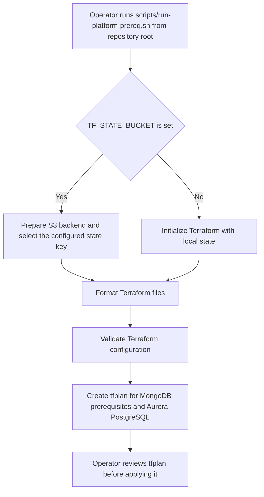
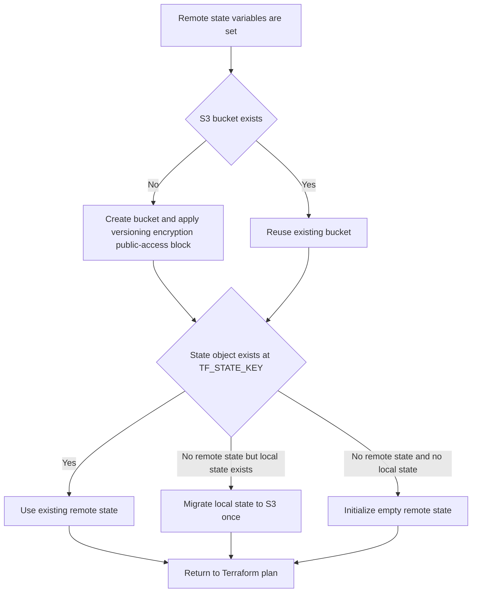
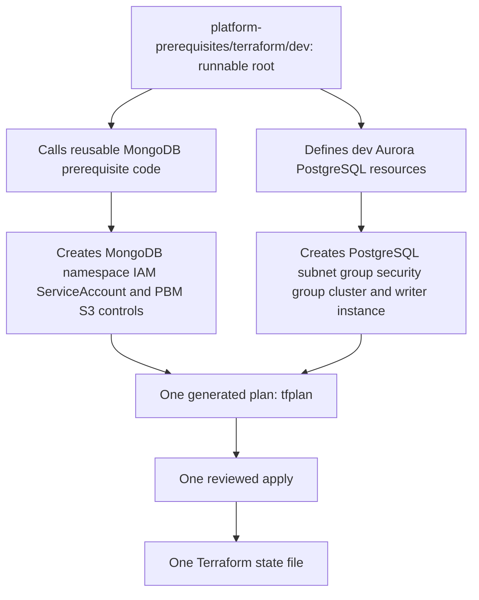
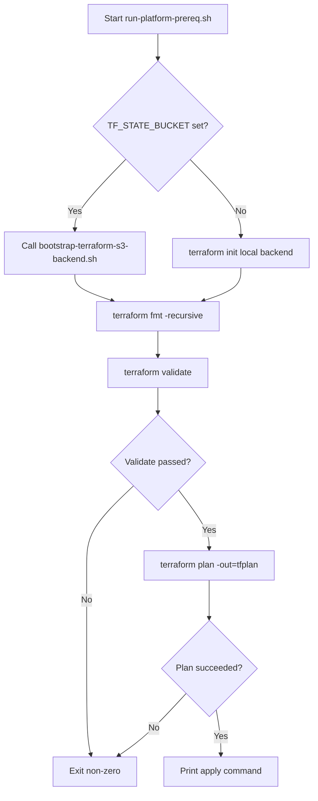
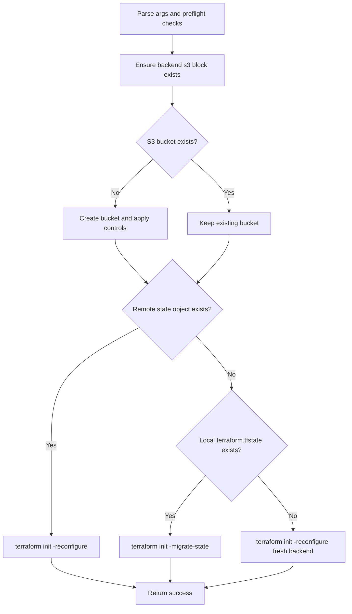
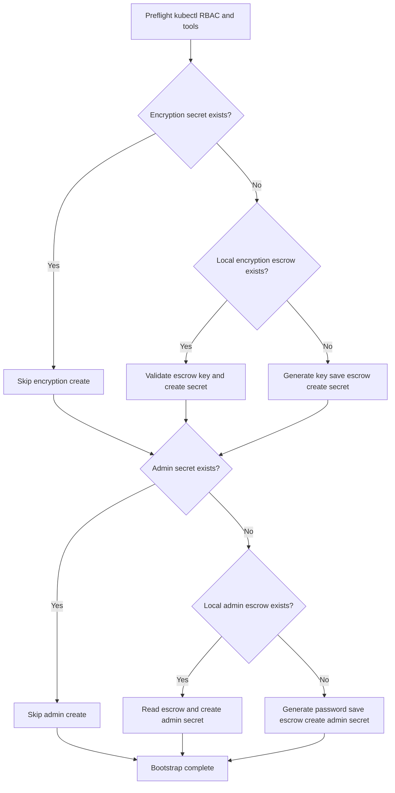
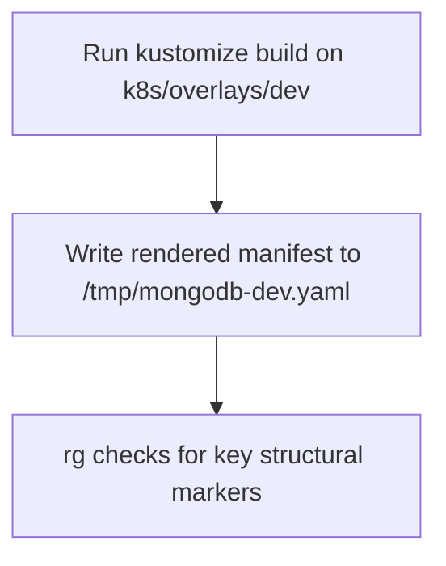
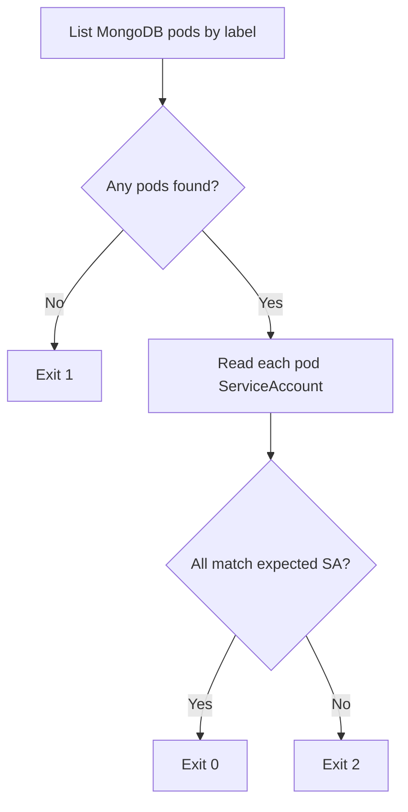
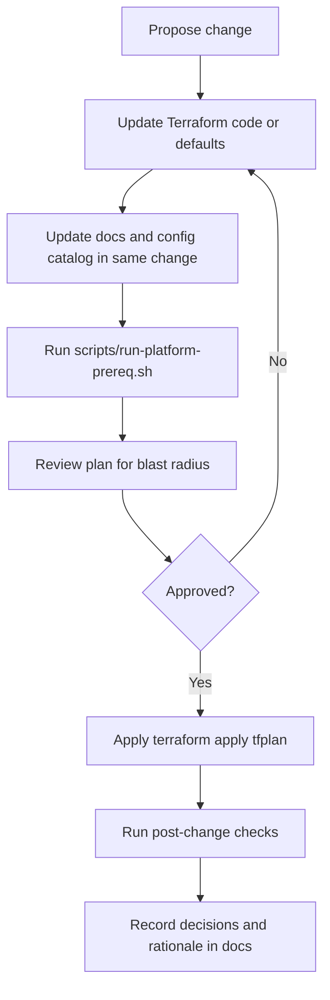

# Platform Prerequisites Terraform

## Purpose
This document is the operating guide for the Terraform stack in this repository.

Use it to provision the platform prerequisites needed before deploying the MongoDB workload manifests and the dev Aurora PostgreSQL database.

## Read This First

| Question | Answer |
|---|---|
| What does this Terraform stack create? | MongoDB platform prerequisites on EKS and one provisioned Aurora PostgreSQL dev database. |
| Why does it exist? | To prepare shared infrastructure in a repeatable way before Kubernetes workload manifests are deployed. |
| When do I run it? | Before the first MongoDB workload deployment, and again whenever Terraform inputs or prerequisite infrastructure need to change. |
| Where do I run it from? | The repository root, using `scripts/run-platform-prereq.sh`. Terraform itself runs from `platform-prerequisites/terraform/dev`. |
| Which state does it use? | One Terraform state for both MongoDB prerequisites and PostgreSQL. Remote S3 state is recommended for shared environments. |
| Who should run it? | An operator with AWS permissions for IAM, S3, EKS discovery, RDS, VPC/security groups, and Kubernetes authorization for the target EKS cluster. |
| How do I know it worked? | `tfplan` is created, `terraform apply tfplan` succeeds, MongoDB secret bootstrap succeeds, and the dev overlay render check passes. |

## Scope

This stack provisions:
- MongoDB prerequisites on EKS, including namespace, ServiceAccount/IAM wiring, and PBM backup bucket controls
- Aurora PostgreSQL for dev, using a provisioned cluster with a single writer instance

This stack does not provision:
- MongoDB workload manifests under `k8s/`
- Percona Operator manifests under `gitops/`
- Kyverno policy application under `policies/`
- CI/CD automation

## Operating Model

The workflow has three phases. Keep them separate when debugging.

| Phase | Purpose | Main Command | Result |
|---|---|---|---|
| Prepare | Create runtime configuration and choose local or remote state. | Edit `platform-prerequisites/terraform/dev/terraform.tfvars`; optionally export `TF_STATE_*`. | Terraform has real environment inputs and a known state location. |
| Plan and Apply | Build a Terraform plan for MongoDB prerequisites and PostgreSQL, then apply the reviewed plan. | `scripts/run-platform-prereq.sh`, then `terraform apply tfplan`. | AWS/Kubernetes prerequisite resources are created or updated. |
| Verify MongoDB Readiness | Create required dev secrets and confirm the MongoDB overlay renders before workload deployment. | `scripts/bootstrap-dev-secrets.sh`, then `scripts/validate-dev-render.sh`. | MongoDB workload manifests can be applied with the expected prerequisites in place. |

## Workstation Setup

Complete this once per workstation before running the operator procedure.

### Required Information

Get these values from the platform or AWS account owner before starting:

| Value | Why You Need It |
|---|---|
| AWS SSO start URL | Used by `aws configure sso` to create a login profile. |
| AWS SSO region | Region where IAM Identity Center is configured. This may differ from the workload region. |
| AWS account ID | Confirms you are logged into the intended account. |
| AWS SSO permission set/role | Determines whether Terraform can create IAM, S3, RDS, VPC security group, and EKS-related resources. |
| Workload AWS region | Used by Terraform providers and AWS CLI commands. |
| EKS cluster name | Used by Terraform and `aws eks update-kubeconfig`. |
| VPC ID and private subnet IDs | Required for Aurora PostgreSQL networking. |
| Remote state bucket name and state key | Required for shared S3 Terraform state. |

### Install Required Tools

Required commands:
- `aws`
- `terraform` version `>= 1.5.0`
- `kubectl`
- `kustomize`
- `rg`
- `openssl`

On macOS with Homebrew:

```bash
brew install awscli terraform kubectl kustomize ripgrep openssl
```

Verify the tools are available:

```bash
command -v aws terraform kubectl kustomize rg openssl
terraform version
aws --version
kubectl version --client
```

The Terraform root requires Terraform `>= 1.5.0`, AWS provider `>= 5.0`, and Kubernetes provider `>= 2.26`.

### Configure AWS CLI With SSO

Create an AWS CLI profile for the target account:

```bash
aws configure sso --profile <profile-name>
```

The prompt asks for:
- SSO start URL
- SSO region
- AWS account
- permission set/role
- default workload region
- output format, usually `json`

Log in:

```bash
aws sso login --profile <profile-name>
```

Use the profile in this shell:

```bash
export AWS_PROFILE=<profile-name>
export AWS_REGION=<workload-region>
```

Confirm the login is correct:

```bash
aws sts get-caller-identity
aws configure get region
```

Expected result: the account ID and role match the intended environment.

### Configure Kubernetes Access

Create or update kubeconfig for the target EKS cluster:

```bash
aws eks update-kubeconfig \
  --name <cluster-name> \
  --region <workload-region> \
  --profile <profile-name>
```

Confirm the active context and cluster authentication:

```bash
kubectl config current-context
kubectl cluster-info
```

Expected result: the context points to the intended cluster and `kubectl` can contact the Kubernetes API.

After Terraform creates the `mongodb` namespace, confirm secret permissions before running `scripts/bootstrap-dev-secrets.sh`:

```bash
kubectl get ns mongodb
kubectl auth can-i get secrets -n mongodb
kubectl auth can-i create secrets -n mongodb
```

### Confirm Repository Location

Run scripts from the repository root:

```bash
pwd
test -d platform-prerequisites/terraform/dev && echo "repo root confirmed"
```

## Table Of Contents
- [Platform Prerequisites Terraform](#platform-prerequisites-terraform)
  - [Purpose](#purpose)
  - [Read This First](#read-this-first)
  - [Scope](#scope)
  - [Operating Model](#operating-model)
  - [Workstation Setup](#workstation-setup)
  - [Standard Operator Procedure](#standard-operator-procedure)
  - [Audience And Primary Tasks](#audience-and-primary-tasks)
  - [Experienced Operator Shortcut](#experienced-operator-shortcut)
  - [What Happens When The Main Script Runs](#what-happens-when-the-main-script-runs)
  - [Required Safety Gates](#required-safety-gates)
  - [Remote State Behavior](#remote-state-behavior)
  - [Runbook Commands](#runbook-commands)
  - [Common Problems For New Operators](#common-problems-for-new-operators)
  - [Troubleshooting](#troubleshooting)
  - [Architecture Summary](#architecture-summary)
  - [Terraform Provisioning Model](#terraform-provisioning-model)
  - [Repository Structure](#repository-structure)
  - [Design Decisions And Boundaries](#design-decisions-and-boundaries)
  - [Access And Permissions Model](#access-and-permissions-model)
  - [Admin Deep Dive](#admin-deep-dive)
  - [State Backend Strategy](#state-backend-strategy)
  - [Script Contracts](#script-contracts)
  - [Script Execution Flows](#script-execution-flows)
  - [Configuration Reference](#configuration-reference)
  - [Security Posture](#security-posture)
  - [Operations And Day-2 Maintenance](#operations-and-day-2-maintenance)
  - [Change Flow (Day-2)](#change-flow-day-2)
  - [Change Management Rules](#change-management-rules)
  - [Handoff To Central Platform Terraform](#handoff-to-central-platform-terraform)

## Standard Operator Procedure

Follow this path for a first run or a shared environment.

0. Complete workstation setup.

Purpose: confirms the local machine has AWS SSO login, Terraform, Kubernetes access, and required CLI tools before any infrastructure command runs.

Expected result: `aws sts get-caller-identity`, `terraform version`, and `kubectl config current-context` all return the intended environment.

1. Create the runtime variable file.

```bash
cp platform-prerequisites/terraform/dev/terraform.tfvars.sample platform-prerequisites/terraform/dev/terraform.tfvars
```

Purpose: creates the local input file Terraform reads during plan/apply.

Expected result: `platform-prerequisites/terraform/dev/terraform.tfvars` exists locally and is not committed.

2. Fill required values in `platform-prerequisites/terraform/dev/terraform.tfvars`.

Required minimum values:
- `cluster_name`
- `vpc_id`
- `private_subnet_ids`
- `db_master_password`

Purpose: binds this reusable Terraform root to one real AWS/EKS environment.

Expected result: no required value is empty or left as a placeholder.

3. Configure remote state for shared or persistent environments.

```bash
export TF_STATE_BUCKET="your-terraform-state-bucket"
export TF_STATE_REGION="us-east-1"
export TF_STATE_KEY="mongodb/platform-prerequisites/dev/terraform.tfstate"
```

Purpose: stores Terraform state in S3 so multiple operators do not create independent local state files.

Expected result: future runs use the same bucket and key for the unified MongoDB + PostgreSQL state.

For throwaway local testing only, omit these variables and Terraform will use local state.

4. Build the plan.

```bash
scripts/run-platform-prereq.sh
```

Purpose: initializes Terraform, formats files, validates configuration, and writes a plan file named `tfplan`.

What the command does:
- uses remote S3 state if `TF_STATE_BUCKET` is set
- bootstraps the S3 backend bucket if needed
- migrates local state to S3 once when remote state is new and local state exists
- runs `terraform fmt -recursive`
- runs `terraform validate`
- runs `terraform plan -out=tfplan`

Expected result: `platform-prerequisites/terraform/dev/tfplan` exists and the command exits successfully.

5. Review and apply the plan.

```bash
cd platform-prerequisites/terraform/dev && terraform apply tfplan
```

Purpose: applies exactly the plan you reviewed, instead of recalculating a new plan at apply time.

Expected result: Terraform reports a successful apply and updates the unified state.

6. Create MongoDB dev secrets if missing.

```bash
scripts/bootstrap-dev-secrets.sh
```

Purpose: creates required MongoDB secrets in the cluster without mutating tracked Kubernetes manifests.

Expected result: `psmdb-encryption-key` and `psmdb-secrets` exist in the `mongodb` namespace.

7. Validate the MongoDB dev overlay before applying workload manifests.

```bash
scripts/validate-dev-render.sh
```

Purpose: renders the dev Kustomize overlay locally and checks for required structural markers.

Expected result: render validation succeeds and `/tmp/mongodb-dev.yaml` is written.

## Audience And Primary Tasks
Use this section to jump directly to your role.

| Audience | Primary Questions | Read First |
|---|---|---|
| Platform Admin | What permissions and risks matter? | [Access And Permissions Model](#access-and-permissions-model), [Security Posture](#security-posture), [Admin Deep Dive](#admin-deep-dive) |
| Infra Operator | How do I run this safely? | [Read This First](#read-this-first), [Standard Operator Procedure](#standard-operator-procedure), [Runbook Commands](#runbook-commands) |
| System Designer | How is provisioning structured? | [Architecture Summary](#architecture-summary), [Terraform Provisioning Model](#terraform-provisioning-model), [Design Decisions And Boundaries](#design-decisions-and-boundaries) |
| Maintainer | How do I change defaults and keep behavior stable? | [Configuration Reference](#configuration-reference), [Operations And Day-2 Maintenance](#operations-and-day-2-maintenance) |
| Incident Responder | How do I diagnose common failures quickly? | [Troubleshooting](#troubleshooting) |

## Experienced Operator Shortcut

Use this only after you understand the target environment and state location.

```bash
cp platform-prerequisites/terraform/dev/terraform.tfvars.sample platform-prerequisites/terraform/dev/terraform.tfvars
$EDITOR platform-prerequisites/terraform/dev/terraform.tfvars
export TF_STATE_BUCKET="your-terraform-state-bucket"
export TF_STATE_REGION="us-east-1"
export TF_STATE_KEY="mongodb/platform-prerequisites/dev/terraform.tfstate"
scripts/run-platform-prereq.sh
cd platform-prerequisites/terraform/dev && terraform apply tfplan
cd ../../../..
scripts/bootstrap-dev-secrets.sh
scripts/validate-dev-render.sh
```

This shortcut does not replace plan review. Stop before apply if the generated plan does not match the intended infrastructure change.

## What Happens When The Main Script Runs

`scripts/run-platform-prereq.sh` is a plan builder. It does not apply infrastructure.

It exists so operators use the same initialization, formatting, validation, backend, and plan behavior every time.



Step meaning:
- Prepare backend: decides where state is stored before Terraform reads or writes state.
- Format files: keeps Terraform formatting consistent and prevents style-only drift.
- Validate configuration: catches syntax, provider, module, and input contract errors before planning.
- Create `tfplan`: records the exact infrastructure changes to review and apply.
- Review plan: confirms the intended resources are created, changed, or destroyed before any apply.

The script stops on init, formatting, validation, backend, or planning errors.

## Required Safety Gates

Do not apply infrastructure until these gates are satisfied.

| Gate | Required Evidence | Stop If |
|---|---|---|
| Environment | AWS account, region, cluster, VPC, and private subnet IDs are confirmed. | Any target value is guessed. |
| Access | AWS identity has required permissions and Kubernetes access to the target cluster works. | AWS or Kubernetes returns Unauthorized/Forbidden. |
| Tooling | `terraform`, `aws`, `kubectl`, `kustomize`, `rg`, and `openssl` are available. | Any required command is missing. |
| Configuration | `terraform.tfvars` exists, is local only, and required values are real. | Required values are empty or placeholders. |
| State | Shared environments use stable `TF_STATE_BUCKET`, `TF_STATE_REGION`, and `TF_STATE_KEY` values. | State location is unknown or changed accidentally. |
| Plan | `scripts/run-platform-prereq.sh` succeeds and creates `tfplan`. | Init, backend setup, validate, or plan fails. |
| Apply | `terraform apply tfplan` succeeds after human plan review. | Plan contains unexpected changes or apply fails. |
| MongoDB readiness | Secret bootstrap and render validation succeed. | Secret creation, RBAC, or render validation fails. |

## Remote State Behavior

Remote state is recommended whenever the environment will outlive one local test session or be touched by more than one operator.

Set remote state before running `scripts/run-platform-prereq.sh`:

```bash
export TF_STATE_BUCKET="your-terraform-state-bucket"
export TF_STATE_REGION="us-east-1"
export TF_STATE_KEY="mongodb/platform-prerequisites/dev/terraform.tfstate"
```

When `TF_STATE_BUCKET` is set, the runner calls `scripts/bootstrap-terraform-s3-backend.sh` before planning.



Important rules:
- Keep the same `TF_STATE_KEY` for the same environment.
- Changing the key creates a different state file and can split infrastructure ownership.
- Backend migration is one-time behavior; later runs reuse the existing remote state.

## Runbook Commands

| Command | What It Does | When To Run | Success Looks Like |
|---|---|---|---|
| `scripts/run-platform-prereq.sh` | Initializes Terraform state, formats files, validates configuration, and writes `tfplan`. | Before every Terraform apply. | Command exits 0 and `platform-prerequisites/terraform/dev/tfplan` exists. |
| `cd platform-prerequisites/terraform/dev && terraform apply tfplan` | Applies the reviewed plan for MongoDB prerequisites and PostgreSQL. | After plan review. | Terraform reports successful apply and state is updated. |
| `scripts/bootstrap-terraform-s3-backend.sh` | Creates or reuses the backend bucket and configures/migrates remote state. | Usually through `scripts/run-platform-prereq.sh`; run directly only for backend recovery. | Terraform backend is initialized against the intended S3 bucket/key. |
| `scripts/bootstrap-dev-secrets.sh` | Creates missing MongoDB dev secrets from local escrow or generated values. | After Terraform apply and before MongoDB workload manifests. | Required secrets exist in namespace `mongodb`. |
| `scripts/validate-dev-render.sh` | Renders `k8s/overlays/dev` and checks expected manifest structure. | Before applying MongoDB workload manifests. | Render succeeds and structural checks pass. |
| `scripts/verify-dev-identity.sh` | Checks that running MongoDB pods use the expected ServiceAccount. | After MongoDB pods are running. | Exits 0 when all checked pods match the expected ServiceAccount. |

## Common Problems For New Operators

Most failures are caused by missing context, not by Terraform syntax. Check these before debugging the scripts.

| What Was Missed | Why It Matters | How To Check | Fix |
|---|---|---|---|
| Wrong AWS account or region | Terraform may create resources in the wrong place or fail to find the EKS/VPC inputs. | `aws sts get-caller-identity`; `aws configure get region` | Switch AWS profile/region before running the scripts. |
| AWS SSO not configured or not logged in | AWS CLI and Terraform cannot authenticate. | `aws sts get-caller-identity` | Run `aws configure sso --profile <profile-name>`, then `aws sso login --profile <profile-name>`. |
| Wrong Kubernetes context | Secret bootstrap and pod checks may target the wrong cluster. | `kubectl config current-context`; `kubectl get ns mongodb` | Update kubeconfig for the target EKS cluster. |
| `terraform.tfvars` not created | Terraform plan cannot resolve required environment inputs. | `test -f platform-prerequisites/terraform/dev/terraform.tfvars && echo ok` | Copy the sample file and fill real values. |
| Placeholder values left in `terraform.tfvars` | Plan may fail or create unusable infrastructure. | Review `cluster_name`, `vpc_id`, `private_subnet_ids`, and `db_master_password`. | Replace placeholders with real environment values. |
| Remote state bucket/key not decided | Different operators may create separate states for the same environment. | `echo "$TF_STATE_BUCKET" "$TF_STATE_REGION" "$TF_STATE_KEY"` | Set stable `TF_STATE_*` values before the first shared run. |
| Missing CLI tools | Scripts fail before doing useful work. | `command -v terraform aws kubectl kustomize rg openssl` | Install missing tools and rerun from the repository root. |
| No Kubernetes RBAC in `mongodb` namespace | Secret bootstrap fails even if AWS auth works. | `kubectl auth can-i get secrets -n mongodb`; `kubectl auth can-i create secrets -n mongodb` | Fix EKS Access Entry/RBAC for the operator identity. |
| Running pod identity verification too early | `scripts/verify-dev-identity.sh` exits `1` when no MongoDB pods exist yet. | `kubectl get pods -n mongodb -l app.kubernetes.io/name=percona-server-mongodb` | Apply the workload manifests first, then rerun after pods are created. |

## Troubleshooting

Use the symptom text first, then run the check command to confirm the cause before changing files or state.

### Preflight And Tooling

| Symptom | Likely Cause | Confirm With | Fix |
|---|---|---|---|
| `required command not found` | A required CLI is missing from PATH. | `command -v terraform aws kubectl kustomize rg openssl` | Install the missing command and open a new shell if PATH changed. |
| `terraform` fails before init/validate with a local version error | Local Terraform version manager is misconfigured. | `terraform version` | Fix the local version manager or use a direct Terraform binary. |
| Script cannot find repository paths | Command was run from an unexpected location or the checkout is incomplete. | `pwd`; `test -d platform-prerequisites/terraform/dev && echo ok` | Run from the repository root and verify the checkout is complete. |

### AWS SSO And Credentials

| Symptom | Likely Cause | Confirm With | Fix |
|---|---|---|---|
| `The config profile (...) could not be found` | `AWS_PROFILE` points to a profile that does not exist. | `aws configure list-profiles` | Run `aws configure sso --profile <profile-name>` or export the correct profile name. |
| Browser login never happened or expired | SSO session is missing or expired. | `aws sts get-caller-identity` | Run `aws sso login --profile <profile-name>` again. |
| `Unable to locate credentials` or Terraform cannot find credentials | `AWS_PROFILE` is not exported in the shell running Terraform. | `echo "$AWS_PROFILE"`; `aws sts get-caller-identity` | Export `AWS_PROFILE=<profile-name>` and rerun from the same shell. |
| Terraform or AWS CLI uses the wrong region | `AWS_REGION` or profile default region is wrong or missing. | `echo "$AWS_REGION"`; `aws configure get region` | Export `AWS_REGION=<workload-region>` or update the SSO profile region. |
| `AccessDenied` from IAM, S3, RDS, EC2, or EKS APIs | SSO permission set/role is not powerful enough for this stack. | Check the failing AWS API in the error output. | Ask the platform/AWS account owner for a role with the required permissions. |

### EKS Kubeconfig

| Symptom | Likely Cause | Confirm With | Fix |
|---|---|---|---|
| `kubectl` points to the wrong cluster | Kubeconfig was not updated after selecting the AWS profile/region. | `kubectl config current-context` | Run `aws eks update-kubeconfig --name <cluster-name> --region <workload-region> --profile <profile-name>`. |
| `aws eks update-kubeconfig` fails with cluster not found | Wrong cluster name, region, or account. | `aws eks describe-cluster --name <cluster-name> --region <workload-region>` | Correct the cluster name, AWS profile, or workload region. |
| `kubectl` returns `You must be logged in to the server` | AWS SSO session expired after kubeconfig was written. | `aws sts get-caller-identity` | Run `aws sso login --profile <profile-name>` and retry `kubectl`. |
| `kubectl` returns `Forbidden` after kubeconfig succeeds | AWS identity is authenticated but not authorized by EKS/RBAC. | `kubectl auth can-i get secrets -n mongodb` | Add/fix EKS Access Entry or Kubernetes RBAC for the SSO role. |

### Terraform Plan And Inputs

| Symptom | Likely Cause | Confirm With | Fix |
|---|---|---|---|
| Plan asks for variables or fails on required inputs | `terraform.tfvars` is missing or incomplete. | `ls platform-prerequisites/terraform/dev/terraform.tfvars` | Create the file from the sample and fill required values. |
| Plan references the wrong cluster | `cluster_name` points to the wrong EKS cluster or AWS profile/region is wrong. | `aws eks describe-cluster --name <cluster_name>` | Correct `cluster_name`, AWS profile, or region. |
| PostgreSQL subnet group or security group creation fails | `vpc_id` or `private_subnet_ids` do not belong together. | `aws ec2 describe-subnets --subnet-ids <ids>` | Use private subnet IDs from the same VPC as `vpc_id`. |
| PostgreSQL password validation fails | `db_master_password` is empty, weak, or placeholder text. | Review `db_master_password` in local `terraform.tfvars`. | Set a strong dev password and keep the file uncommitted. |

### Remote State And Backend

| Symptom | Likely Cause | Confirm With | Fix |
|---|---|---|---|
| Runner says it is using local state | `TF_STATE_BUCKET` is not set. | `echo "$TF_STATE_BUCKET"` | Export `TF_STATE_BUCKET`, `TF_STATE_REGION`, and `TF_STATE_KEY`, then rerun. |
| Backend bucket creation fails | Missing S3 permissions, invalid bucket name, or wrong region. | `aws s3api head-bucket --bucket "$TF_STATE_BUCKET"` | Use a valid globally unique bucket name and an identity allowed to create/configure it. |
| Backend points at an unexpected state | `TF_STATE_KEY` changed between runs. | `echo "$TF_STATE_KEY"`; check `s3://$TF_STATE_BUCKET/$TF_STATE_KEY` | Restore the intended key before planning. Do not apply from an accidental new state. |
| Terraform asks about migrating state unexpectedly | Local state exists and remote state is missing at the configured key. | `ls platform-prerequisites/terraform/dev/terraform.tfstate`; `aws s3api head-object --bucket "$TF_STATE_BUCKET" --key "$TF_STATE_KEY"` | Confirm this is the first remote-state run before accepting migration. |

### Kubernetes Access And Secrets

| Symptom | Likely Cause | Confirm With | Fix |
|---|---|---|---|
| `Unauthorized` or `Forbidden` from Kubernetes | AWS identity is authenticated but not authorized in EKS/RBAC. | `kubectl auth can-i get secrets -n mongodb` | Add/fix EKS Access Entry or RBAC mapping for the operator identity. |
| `namespace-scoped preflight failed for 'mongodb'` | Terraform prerequisites were not applied, wrong cluster is selected, or namespace access is missing. | `kubectl config current-context`; `kubectl get ns mongodb` | Select the correct cluster, apply Terraform prerequisites, or fix namespace access. |
| `cannot create secrets` | Identity can read namespace resources but cannot create secrets. | `kubectl auth can-i create secrets -n mongodb` | Grant create permission for secrets in namespace `mongodb`. |
| Escrow file is invalid | `.local-dev-encryption-key.txt` was edited or corrupted. | `wc -c .local-dev-encryption-key.txt`; rerun `scripts/bootstrap-dev-secrets.sh` | Restore the original escrow file if existing encrypted volumes depend on it. For a fresh dev environment only, remove the bad escrow and regenerate. |
| Admin password escrow is empty | `.local-dev-admin-password.txt` exists but has no password. | `wc -c .local-dev-admin-password.txt` | Restore the original password file, or delete it only for a fresh environment where regenerating is acceptable. |

### Render And Post-Deploy Checks

| Symptom | Likely Cause | Confirm With | Fix |
|---|---|---|---|
| `kustomize build` fails | Overlay path, resource reference, or manifest syntax is invalid. | `kustomize build k8s/overlays/dev` | Fix the reported manifest path or syntax error. |
| Render validation writes `/tmp/mongodb-dev.yaml` but `rg` finds nothing | Expected MongoDB markers are missing from the rendered overlay. | `rg -n "kind: PerconaServerMongoDB|size: 3|backup:" /tmp/mongodb-dev.yaml` | Check overlay patches and resource inclusion. |
| `scripts/verify-dev-identity.sh` exits `1` | MongoDB pods do not exist yet. | `kubectl get pods -n mongodb -l app.kubernetes.io/name=percona-server-mongodb` | Apply the operator and workload manifests, wait for pods, then rerun. |
| `scripts/verify-dev-identity.sh` exits `2` | MongoDB pods use a different ServiceAccount than expected. | `kubectl get pod <pod> -n mongodb -o jsonpath='{.spec.serviceAccountName}'` | Fix the workload ServiceAccount reference or pass the expected ServiceAccount as the second script argument. |

## Architecture Summary
The Terraform layout separates reusable resource logic from the runnable dev root.

- Reusable layer: `platform-prerequisites/terraform/reusable`
  - no provider/backend lock-in
  - contains portable resource logic for MongoDB prerequisites
- Unified root: `platform-prerequisites/terraform/dev`
  - contains provider configuration, backend integration, and root-level inputs
  - provisions MongoDB prerequisites and PostgreSQL resources in a single state/apply

Single execution contract:
- one root (`dev`)
- one plan (`tfplan`)
- one state key (`mongodb/platform-prerequisites/dev/terraform.tfstate` by default)

## Terraform Provisioning Model

This model explains ownership. It shows which part of the repository is responsible for each infrastructure area.

Read it as: one runnable Terraform root calls reusable MongoDB prerequisite logic and also owns the dev PostgreSQL resources. Both areas are planned, applied, and tracked in one state file.



## Repository Structure

| Path | Role |
|---|---|
| `platform-prerequisites/terraform/reusable` | Reusable Terraform layer for portable module logic. |
| `platform-prerequisites/terraform/dev` | Unified runnable root for MongoDB prerequisites + PostgreSQL. |
| `scripts/run-platform-prereq.sh` | Primary plan workflow (init/fmt/validate/plan) for unified root. |
| `scripts/bootstrap-terraform-s3-backend.sh` | Idempotent S3 backend bootstrap and one-time state migration helper. |
| `scripts/bootstrap-dev-secrets.sh` | Creates missing MongoDB dev secrets without mutating tracked manifests. |
| `scripts/validate-dev-render.sh` | Offline Kustomize render checks for MongoDB dev overlay. |
| `scripts/verify-dev-identity.sh` | Post-deploy ServiceAccount verification helper. |

## Design Decisions And Boundaries
Naming alignment follows parent convention:
- source: `naming-convention-design.md` in `tf_generator`
- pattern: `{provider}-{location}{site}-{env}-{app}-{role}-{type}-{seq}`

Current PBM bucket default:
- `sml-aw-gb0-d-oms-gen-s3-01`

Boundary decisions:
- Terraform here prepares platform prerequisites, not workload manifests.
- Dev posture favors operational simplicity and repeatability.
- PostgreSQL is provisioned Aurora with single writer for dev.
- Manual DB credentials are used in this phase (stored in Terraform state).
- Production direction is managed credentials (Secrets Manager-backed).

## Access And Permissions Model
The Terraform runner identity must have:
- AWS permissions for IAM, S3, EKS read/auth discovery, and RDS/VPC resources used by this stack
- Kubernetes API authorization in the target EKS cluster for resources such as namespace/service account

Without EKS API authorization, AWS authentication can succeed while Kubernetes resources fail with Unauthorized/Forbidden.

For pipeline adoption later:
- create an EKS Access Entry (or equivalent RBAC mapping) for the pipeline IAM role

For current manual-first flow:
- use a bastion/admin IAM identity already mapped to required Kubernetes RBAC

## Admin Deep Dive

This section is for advanced administrators who need operational depth beyond quick execution.

Control-plane and trust boundaries:
- Terraform state and execution context: `platform-prerequisites/terraform/dev`
- Reusable logic boundary: `platform-prerequisites/terraform/reusable`
- Kubernetes runtime boundary: `mongodb` namespace resources and ServiceAccounts

Data sensitivity map:
- High sensitivity:
  - Terraform state (contains PostgreSQL master password in dev posture)
  - local `terraform.tfvars` values
  - local escrow files generated by `scripts/bootstrap-dev-secrets.sh`
- Medium sensitivity:
  - IAM role and policy metadata
  - DB endpoint outputs

Operational risk notes:
- Any identity without EKS API auth can still appear AWS-authenticated while failing Kubernetes resource creation.
- Incorrect `TF_STATE_KEY` can fragment state and create drift between expected and actual ownership.
- Lost escrow material with retained encrypted MongoDB volumes prevents recovery of old encrypted data.

## State Backend Strategy
Backend migration is intentionally idempotent.

Script:
- `scripts/bootstrap-terraform-s3-backend.sh`

Behavior:
- creates backend S3 bucket if missing
- applies bucket baseline controls on create:
  - versioning enabled
  - AES256 server-side encryption enabled
  - public access block enabled
- if remote state object exists: use remote state
- if remote is missing and local state exists: migrate local state once
- if both are missing: initialize fresh remote backend

Default state key for unified root:
- `mongodb/platform-prerequisites/dev/terraform.tfstate`

## Script Contracts

| Script | Inputs | Outputs | Exit Behavior |
|---|---|---|---|
| `scripts/run-platform-prereq.sh` | Optional `TF_STATE_BUCKET`, `TF_STATE_REGION`, `TF_STATE_KEY`; Terraform files in `platform-prerequisites/terraform/dev` | `tfplan` in unified root | Non-zero on backend/init/validate/plan failure |
| `scripts/bootstrap-terraform-s3-backend.sh` | `--tf-dir`, `--bucket`, `--region`, `--key`; AWS + Terraform CLI access | Backend configured for remote state or migrated state | Non-zero on arg/preflight/AWS/Terraform failures |
| `scripts/bootstrap-dev-secrets.sh` | Kubernetes access to namespace `mongodb`; optional local escrow files | Secrets `psmdb-encryption-key` and `psmdb-secrets`; local escrow files if generated | Non-zero on RBAC/tool/validation/secret creation failure |
| `scripts/validate-dev-render.sh` | `kustomize` and `rg`; `k8s/overlays/dev` present | `/tmp/mongodb-dev.yaml` and structural checks output | Non-zero when render/checks fail |
| `scripts/verify-dev-identity.sh` | Optional args: `namespace`, `expected SA`; running MongoDB pods | SA verification output by pod | `0` success, `1` no pods, `2` SA mismatch |

## Script Execution Flows

These diagrams describe script internals. Use this section when debugging behavior or onboarding maintainers.

### scripts/run-platform-prereq.sh



### scripts/bootstrap-terraform-s3-backend.sh



### scripts/bootstrap-dev-secrets.sh



### scripts/validate-dev-render.sh



### scripts/verify-dev-identity.sh



## Configuration Reference

| File | Owns | Typical Changes |
|---|---|---|
| `platform-prerequisites/terraform/reusable/variables.tf` | Shared module defaults for MongoDB prerequisite layer. | Baseline defaults shared across roots. |
| `platform-prerequisites/terraform/reusable/main.tf` | Shared module resources and IAM/S3/Kubernetes wiring. | Architecture-level resource changes. |
| `platform-prerequisites/terraform/dev/variables.tf` | Unified root input contract (MongoDB + PostgreSQL). | Root defaults for region/network/db sizing/runtime behavior. |
| `platform-prerequisites/terraform/dev/main.tf` | Unified root execution and PostgreSQL resources. | Provider/backend/root wiring and PG resource topology. |
| `platform-prerequisites/terraform/dev/outputs.tf` | Unified outputs for operators and downstream usage. | Expose new outputs or adjust output contracts. |
| `platform-prerequisites/terraform/dev/terraform.tfvars.sample` | Operator template for local runtime values. | Update sample values and required fields guidance. |

Broader configuration catalog:
- `docs/operations/dev-configuration-catalog.md`

## Security Posture
Current dev posture:
- manual credentials for PostgreSQL via local `terraform.tfvars`
- PostgreSQL password remains sensitive but is stored in Terraform state
- PostgreSQL writer is non-public
- S3 backend bootstrap enforces baseline bucket controls

Operational safeguards:
- do not commit `terraform.tfvars`
- restrict backend bucket access to least privilege
- treat Terraform state as sensitive data
- rotate dev credentials when environments are shared

## Operations And Day-2 Maintenance
Routine workflow:
- rerun `scripts/run-platform-prereq.sh` after Terraform code/default changes
- inspect plan diff before every apply
- keep `dev/terraform.tfvars.sample` aligned with actual variable contract
- validate MongoDB render and secret bootstrap before workload deployment

Maintenance checklist:
- verify provider versions remain compatible with root and module constraints
- review IAM policy scope whenever new integrations are added
- keep this README synchronized whenever behavior, inputs, or runbooks change

## Change Flow (Day-2)



## Change Management Rules
When changing Terraform behavior:
- keep unified root/state contract intact unless intentionally redesigned
- update this README and `docs/operations/dev-configuration-catalog.md` in the same change
- prefer additive defaults with explicit migration notes over silent behavioral changes

When changing security-sensitive settings:
- document the threat/risk tradeoff directly in this README
- include rollback and verification steps in the same PR/change set

## Handoff To Central Platform Terraform
This repository keeps the reusable layer intentionally portable for later integration.

Handoff expectation:
- `platform-prerequisites/terraform/reusable` can be absorbed into central platform Terraform
- current unified root (`dev`) is an operator-oriented local entrypoint and can be replaced after integration