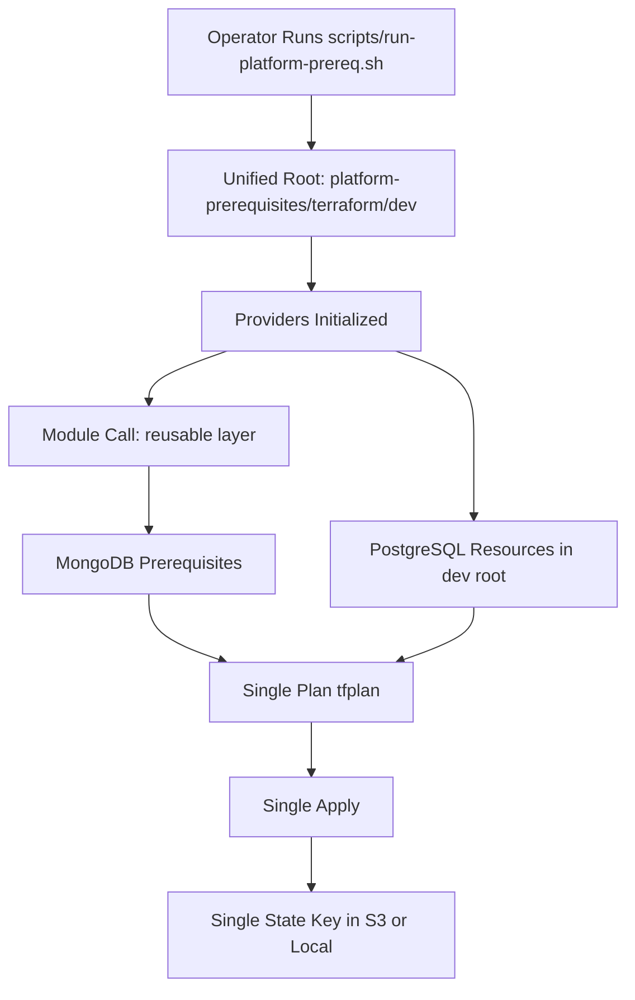
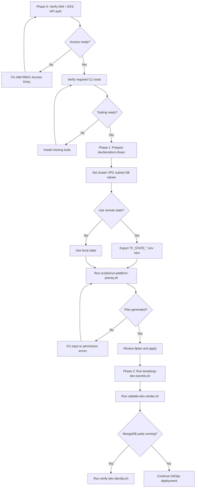
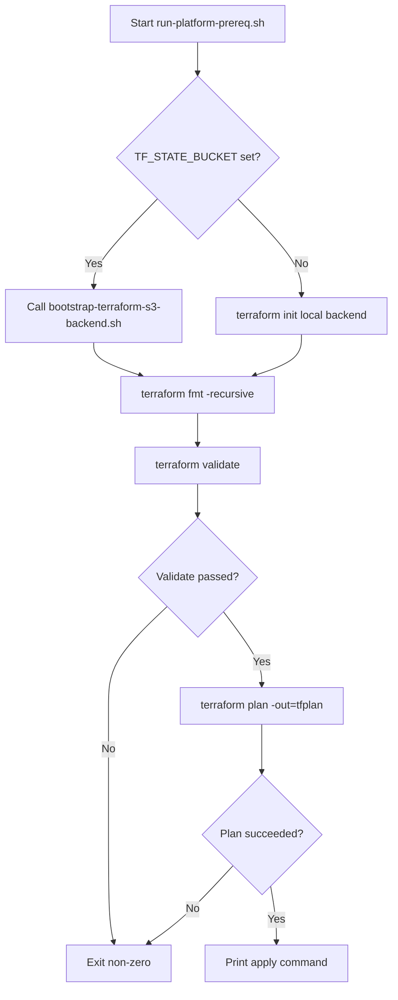
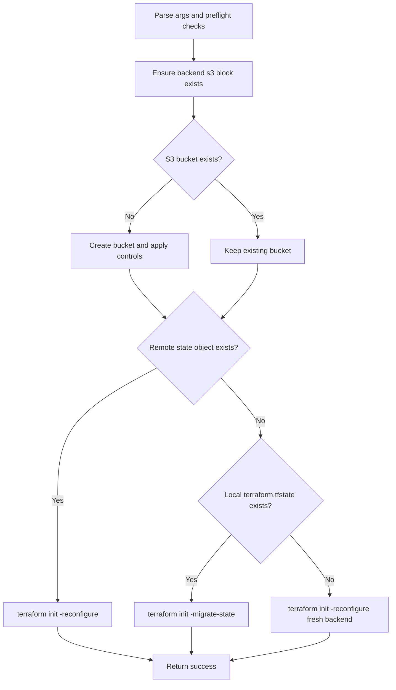
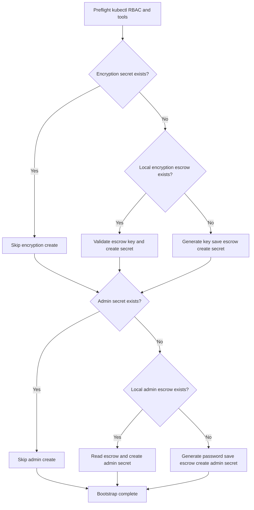
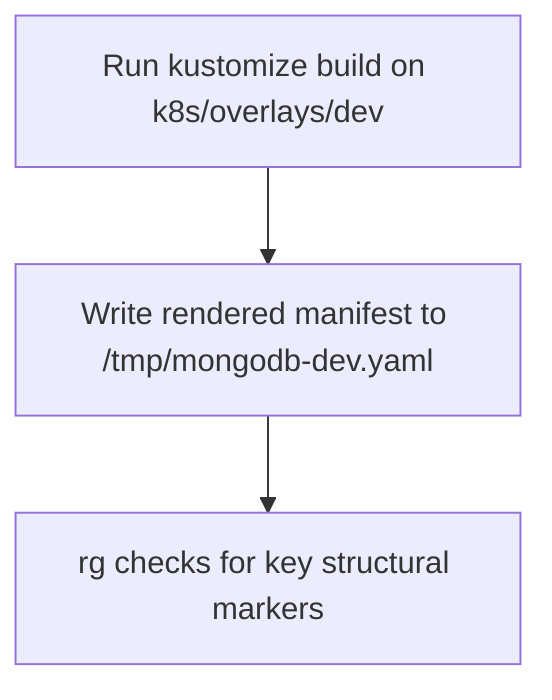
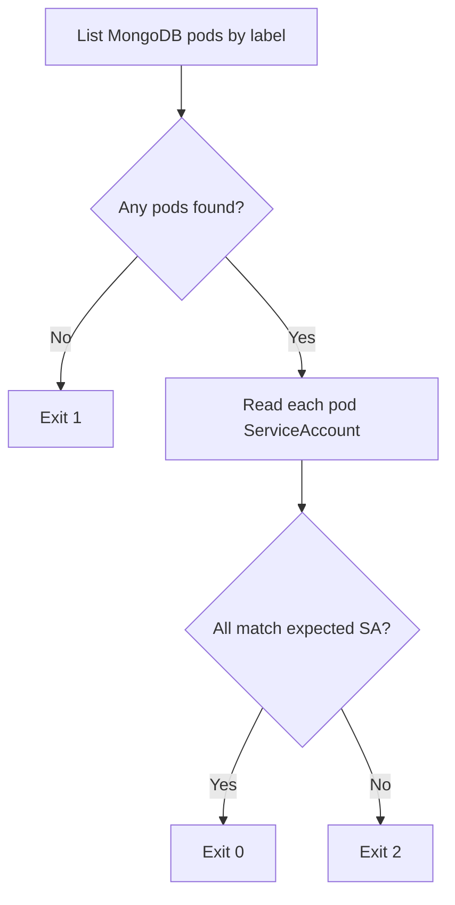
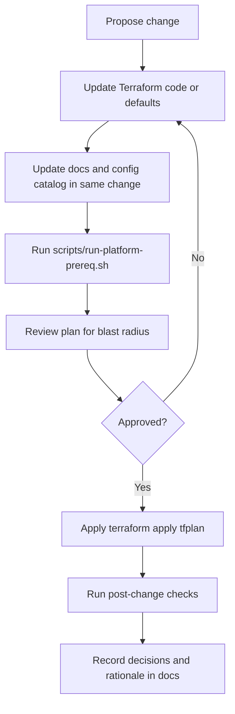

# Platform Prerequisites Terraform

## Purpose
This document is the single source of truth for provisioning platform prerequisites in this repository.

It covers:
- architecture and design intent
- admin responsibilities and access requirements
- operator runbooks for planning and applying infrastructure
- maintenance and change-management guidance
- troubleshooting and recovery expectations

It provisions both in one Terraform run/state:
- MongoDB prerequisites on EKS
- PostgreSQL (Aurora PostgreSQL, dev posture)

It does not provision:
- MongoDB workload manifests in `k8s/`
- CI/CD automation (manual-first workflow only)

## Fast Path (Impatient Operator)
If you need to get to first successful apply quickly, do only this:

1. Create runtime vars file:

```bash
cp platform-prerequisites/terraform/dev/terraform.tfvars.sample platform-prerequisites/terraform/dev/terraform.tfvars
```

2. Fill required values in `platform-prerequisites/terraform/dev/terraform.tfvars`:
- `cluster_name`
- `vpc_id`
- `private_subnet_ids`
- `db_master_password`

3. Optional remote state (recommended):

```bash
export TF_STATE_BUCKET="your-terraform-state-bucket"
export TF_STATE_REGION="us-east-1"
export TF_STATE_KEY="mongodb/platform-prerequisites/dev/terraform.tfstate"
```

4. Plan and apply:

```bash
scripts/run-platform-prereq.sh
cd platform-prerequisites/terraform/dev && terraform apply tfplan
```

5. MongoDB readiness checks:

```bash
scripts/bootstrap-dev-secrets.sh
scripts/validate-dev-render.sh
```

## Table Of Contents
- [Platform Prerequisites Terraform](#platform-prerequisites-terraform)
  - [Purpose](#purpose)
  - [Fast Path (Impatient Operator)](#fast-path-impatient-operator)
  - [Audience And Primary Tasks](#audience-and-primary-tasks)
  - [Operator Onboarding Flow](#operator-onboarding-flow)
  - [Operator Readiness Gates](#operator-readiness-gates)
  - [Quick Start (Unified Apply)](#quick-start-unified-apply)
  - [Runbook Commands](#runbook-commands)
  - [Troubleshooting](#troubleshooting)
  - [Architecture Summary](#architecture-summary)
  - [Architecture Flow Chart](#architecture-flow-chart)
  - [Repository Structure](#repository-structure)
  - [Design Decisions And Boundaries](#design-decisions-and-boundaries)
  - [Access And Permissions Model](#access-and-permissions-model)
  - [Admin Deep Dive](#admin-deep-dive)
  - [State Backend Strategy](#state-backend-strategy)
  - [Script Contracts](#script-contracts)
  - [Script Execution Flows](#script-execution-flows)
  - [Configuration Reference](#configuration-reference)
  - [Security Posture](#security-posture)
  - [Operations And Day-2 Maintenance](#operations-and-day-2-maintenance)
  - [Change Flow (Day-2)](#change-flow-day-2)
  - [Change Management Rules](#change-management-rules)
  - [Handoff To Central Platform Terraform](#handoff-to-central-platform-terraform)

## Audience And Primary Tasks
Use this section to jump directly to your role.

| Audience | Primary Questions | Read First |
|---|---|---|
| Platform Admin | What permissions are required? What is the security posture? | [Access And Permissions Model](#access-and-permissions-model), [Security Posture](#security-posture) |
| Infra Operator | How do I run this safely and repeatably? | [Quick Start (Unified Apply)](#quick-start-unified-apply), [Runbook Commands](#runbook-commands) |
| System Designer | Why is this split into reusable and root layers? | [Architecture Summary](#architecture-summary), [Design Decisions And Boundaries](#design-decisions-and-boundaries) |
| Maintainer | How do I change defaults and keep behavior stable? | [Configuration Reference](#configuration-reference), [Operations And Day-2 Maintenance](#operations-and-day-2-maintenance) |
| Incident Responder | How do I diagnose common failures quickly? | [Troubleshooting](#troubleshooting) |

## Architecture Summary
The Terraform layout intentionally separates reusable logic from execution context.

- Reusable layer: `platform-prerequisites/terraform/reusable`
  - no provider/backend lock-in
  - contains portable resource logic for MongoDB prerequisites
- Unified root: `platform-prerequisites/terraform/dev`
  - contains provider configuration, backend integration, and root-level inputs
  - provisions MongoDB prerequisites and PostgreSQL resources in a single state/apply

Single execution contract:
- one root (`dev`)
- one plan (`tfplan`)
- one state key (`mongodb/platform-prerequisites/dev/terraform.tfstate` by default)

## Architecture Flow Chart



## Operator Onboarding Flow

This section defines the minimum complete path from first access to first successful platform apply.

Onboarding phases:
- Phase 0: environment and access readiness.
- Phase 1: Terraform planning and apply.
- Phase 2: MongoDB operational readiness checks.



Definition of done for onboarding:
- `scripts/run-platform-prereq.sh` completes and produces `tfplan`
- `terraform apply tfplan` succeeds for unified root
- `scripts/bootstrap-dev-secrets.sh` succeeds
- `scripts/validate-dev-render.sh` succeeds

## Operator Readiness Gates

| Gate | Required Evidence | Stop Condition |
|---|---|---|
| Access Gate | `kubectl get serviceaccount default -n mongodb` succeeds and AWS identity has required rights | Any Unauthorized/Forbidden result |
| Tooling Gate | `terraform`, `aws`, `kubectl`, `kustomize`, `rg`, `openssl` are available in PATH | Any required tool missing |
| Config Gate | `platform-prerequisites/terraform/dev/terraform.tfvars` exists and required fields are set (`cluster_name`, `vpc_id`, `private_subnet_ids`, `db_master_password`) | Empty or placeholder critical values |
| Plan Gate | `scripts/run-platform-prereq.sh` finishes and writes `tfplan` | Init/validate/plan error |
| Apply Gate | `terraform apply tfplan` succeeds | Partial or failed apply |
| MongoDB Readiness Gate | `scripts/bootstrap-dev-secrets.sh` and `scripts/validate-dev-render.sh` succeed | Secret/bootstrap/render validation error |

## Quick Start (Unified Apply)
1. Prepare local variables:

```bash
cp platform-prerequisites/terraform/dev/terraform.tfvars.sample platform-prerequisites/terraform/dev/terraform.tfvars
```

2. Edit `platform-prerequisites/terraform/dev/terraform.tfvars` with environment values.

3. Optional remote state setup (recommended):

```bash
export TF_STATE_BUCKET="your-terraform-state-bucket"
export TF_STATE_REGION="us-east-1"
export TF_STATE_KEY="mongodb/platform-prerequisites/dev/terraform.tfstate"
```

4. Build plan:

```bash
scripts/run-platform-prereq.sh
```

5. Review and apply:

```bash
cd platform-prerequisites/terraform/dev && terraform apply tfplan
```

6. For MongoDB overlay readiness, bootstrap secrets and verify render:

```bash
scripts/bootstrap-dev-secrets.sh
scripts/validate-dev-render.sh
```

## Runbook Commands

| Command | Purpose | Use When |
|---|---|---|
| `scripts/run-platform-prereq.sh` | Executes `init`, `fmt`, `validate`, `plan` for unified root. | Before each apply and after Terraform changes. |
| `cd platform-prerequisites/terraform/dev && terraform apply tfplan` | Applies unified infrastructure plan. | After plan review and approval. |
| `scripts/bootstrap-terraform-s3-backend.sh` | Bootstraps/validates S3 backend and one-time migration. | First remote-state setup or backend recovery. |
| `scripts/bootstrap-dev-secrets.sh` | Ensures MongoDB dev secrets exist. | Before applying MongoDB manifests. |
| `scripts/validate-dev-render.sh` | Confirms MongoDB dev overlay renders correctly. | Pre-commit and pre-apply safety check. |
| `scripts/verify-dev-identity.sh` | Checks expected ServiceAccount usage at runtime. | Post-deploy identity verification. |

## Troubleshooting

| Symptom | Likely Cause | Action |
|---|---|---|
| `Unauthorized` or `Forbidden` for Kubernetes resources | Runner lacks EKS API authorization/RBAC mapping | Confirm EKS Access Entry or RBAC mapping for runner identity. |
| Backend init/migration does not use S3 | `TF_STATE_BUCKET` not set or incorrect bucket/key | Export backend env vars and rerun `scripts/run-platform-prereq.sh`. |
| Backend bucket creation fails | Missing S3 permissions or region mismatch | Validate IAM permissions and `TF_STATE_REGION`. |
| PostgreSQL resources fail on networking inputs | Invalid `vpc_id` or `private_subnet_ids` | Correct VPC/subnet values in `dev/terraform.tfvars`. |
| Terraform CLI fails before validate in this environment | Local `tfenv` is not configured | Fix local tfenv version configuration or use direct Terraform binary. |

## Repository Structure

| Path | Role |
|---|---|
| `platform-prerequisites/terraform/reusable` | Reusable Terraform layer for portable module logic. |
| `platform-prerequisites/terraform/dev` | Unified runnable root for MongoDB prerequisites + PostgreSQL. |
| `scripts/run-platform-prereq.sh` | Primary plan workflow (init/fmt/validate/plan) for unified root. |
| `scripts/bootstrap-terraform-s3-backend.sh` | Idempotent S3 backend bootstrap and one-time state migration helper. |
| `scripts/bootstrap-dev-secrets.sh` | Creates missing MongoDB dev secrets without mutating tracked manifests. |
| `scripts/validate-dev-render.sh` | Offline Kustomize render checks for MongoDB dev overlay. |
| `scripts/verify-dev-identity.sh` | Post-deploy ServiceAccount verification helper. |

## Design Decisions And Boundaries
Naming alignment follows parent convention:
- source: `naming-convention-design.md` in `tf_generator`
- pattern: `{provider}-{location}{site}-{env}-{app}-{role}-{type}-{seq}`

Current PBM bucket default:
- `sml-aw-gb0-d-oms-gen-s3-01`

Boundary decisions:
- Terraform here prepares platform prerequisites, not workload manifests.
- Dev posture favors operational simplicity and repeatability.
- PostgreSQL is provisioned Aurora with single writer for dev.
- Manual DB credentials are used in this phase (stored in Terraform state).
- Production direction is managed credentials (Secrets Manager-backed).

## Access And Permissions Model
The Terraform runner identity must have:
- AWS permissions for IAM, S3, EKS read/auth discovery, and RDS/VPC resources used by this stack
- Kubernetes API authorization in the target EKS cluster for resources such as namespace/service account

Without EKS API authorization, AWS authentication can succeed while Kubernetes resources fail with Unauthorized/Forbidden.

For pipeline adoption later:
- create an EKS Access Entry (or equivalent RBAC mapping) for the pipeline IAM role

For current manual-first flow:
- use a bastion/admin IAM identity already mapped to required Kubernetes RBAC

## Admin Deep Dive

This section is for advanced administrators who need operational depth beyond quick execution.

Control-plane and trust boundaries:
- Terraform state and execution context: `platform-prerequisites/terraform/dev`
- Reusable logic boundary: `platform-prerequisites/terraform/reusable`
- Kubernetes runtime boundary: `mongodb` namespace resources and ServiceAccounts

Data sensitivity map:
- High sensitivity:
  - Terraform state (contains PostgreSQL master password in dev posture)
  - local `terraform.tfvars` values
  - local escrow files generated by `scripts/bootstrap-dev-secrets.sh`
- Medium sensitivity:
  - IAM role and policy metadata
  - DB endpoint outputs

Operational risk notes:
- Any identity without EKS API auth can still appear AWS-authenticated while failing Kubernetes resource creation.
- Incorrect `TF_STATE_KEY` can fragment state and create drift between expected and actual ownership.
- Lost escrow material with retained encrypted MongoDB volumes prevents recovery of old encrypted data.

## State Backend Strategy
Backend migration is intentionally idempotent.

Script:
- `scripts/bootstrap-terraform-s3-backend.sh`

Behavior:
- creates backend S3 bucket if missing
- applies bucket baseline controls on create:
  - versioning enabled
  - AES256 server-side encryption enabled
  - public access block enabled
- if remote state object exists: use remote state
- if remote is missing and local state exists: migrate local state once
- if both are missing: initialize fresh remote backend

Default state key for unified root:
- `mongodb/platform-prerequisites/dev/terraform.tfstate`

## Script Contracts

| Script | Inputs | Outputs | Exit Behavior |
|---|---|---|---|
| `scripts/run-platform-prereq.sh` | Optional `TF_STATE_BUCKET`, `TF_STATE_REGION`, `TF_STATE_KEY`; Terraform files in `platform-prerequisites/terraform/dev` | `tfplan` in unified root | Non-zero on backend/init/validate/plan failure |
| `scripts/bootstrap-terraform-s3-backend.sh` | `--tf-dir`, `--bucket`, `--region`, `--key`; AWS + Terraform CLI access | Backend configured for remote state or migrated state | Non-zero on arg/preflight/AWS/Terraform failures |
| `scripts/bootstrap-dev-secrets.sh` | Kubernetes access to namespace `mongodb`; optional local escrow files | Secrets `psmdb-encryption-key` and `psmdb-secrets`; local escrow files if generated | Non-zero on RBAC/tool/validation/secret creation failure |
| `scripts/validate-dev-render.sh` | `kustomize` and `rg`; `k8s/overlays/dev` present | `/tmp/mongodb-dev.yaml` and structural checks output | Non-zero when render/checks fail |
| `scripts/verify-dev-identity.sh` | Optional args: `namespace`, `expected SA`; running MongoDB pods | SA verification output by pod | `0` success, `1` no pods, `2` SA mismatch |

## Script Execution Flows

These diagrams describe script internals. Use this section when debugging behavior or onboarding maintainers.

### scripts/run-platform-prereq.sh



### scripts/bootstrap-terraform-s3-backend.sh



### scripts/bootstrap-dev-secrets.sh



### scripts/validate-dev-render.sh



### scripts/verify-dev-identity.sh



## Configuration Reference

| File | Owns | Typical Changes |
|---|---|---|
| `platform-prerequisites/terraform/reusable/variables.tf` | Shared module defaults for MongoDB prerequisite layer. | Baseline defaults shared across roots. |
| `platform-prerequisites/terraform/reusable/main.tf` | Shared module resources and IAM/S3/Kubernetes wiring. | Architecture-level resource changes. |
| `platform-prerequisites/terraform/dev/variables.tf` | Unified root input contract (MongoDB + PostgreSQL). | Root defaults for region/network/db sizing/runtime behavior. |
| `platform-prerequisites/terraform/dev/main.tf` | Unified root execution and PostgreSQL resources. | Provider/backend/root wiring and PG resource topology. |
| `platform-prerequisites/terraform/dev/outputs.tf` | Unified outputs for operators and downstream usage. | Expose new outputs or adjust output contracts. |
| `platform-prerequisites/terraform/dev/terraform.tfvars.sample` | Operator template for local runtime values. | Update sample values and required fields guidance. |

Broader configuration catalog:
- `docs/operations/dev-configuration-catalog.md`

## Security Posture
Current dev posture:
- manual credentials for PostgreSQL via local `terraform.tfvars`
- PostgreSQL password remains sensitive but is stored in Terraform state
- PostgreSQL writer is non-public
- S3 backend bootstrap enforces baseline bucket controls

Operational safeguards:
- do not commit `terraform.tfvars`
- restrict backend bucket access to least privilege
- treat Terraform state as sensitive data
- rotate dev credentials when environments are shared

## Operations And Day-2 Maintenance
Routine workflow:
- rerun `scripts/run-platform-prereq.sh` after Terraform code/default changes
- inspect plan diff before every apply
- keep `dev/terraform.tfvars.sample` aligned with actual variable contract
- validate MongoDB render and secret bootstrap before workload deployment

Maintenance checklist:
- verify provider versions remain compatible with root and module constraints
- review IAM policy scope whenever new integrations are added
- keep this README synchronized whenever behavior, inputs, or runbooks change

## Change Flow (Day-2)



## Change Management Rules
When changing Terraform behavior:
- keep unified root/state contract intact unless intentionally redesigned
- update this README and `docs/operations/dev-configuration-catalog.md` in the same change
- prefer additive defaults with explicit migration notes over silent behavioral changes

When changing security-sensitive settings:
- document the threat/risk tradeoff directly in this README
- include rollback and verification steps in the same PR/change set

## Handoff To Central Platform Terraform
This repository keeps the reusable layer intentionally portable for later integration.

Handoff expectation:
- `platform-prerequisites/terraform/reusable` can be absorbed into central platform Terraform
- current unified root (`dev`) is an operator-oriented local entrypoint and can be replaced after integration