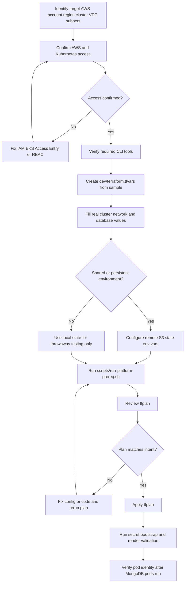
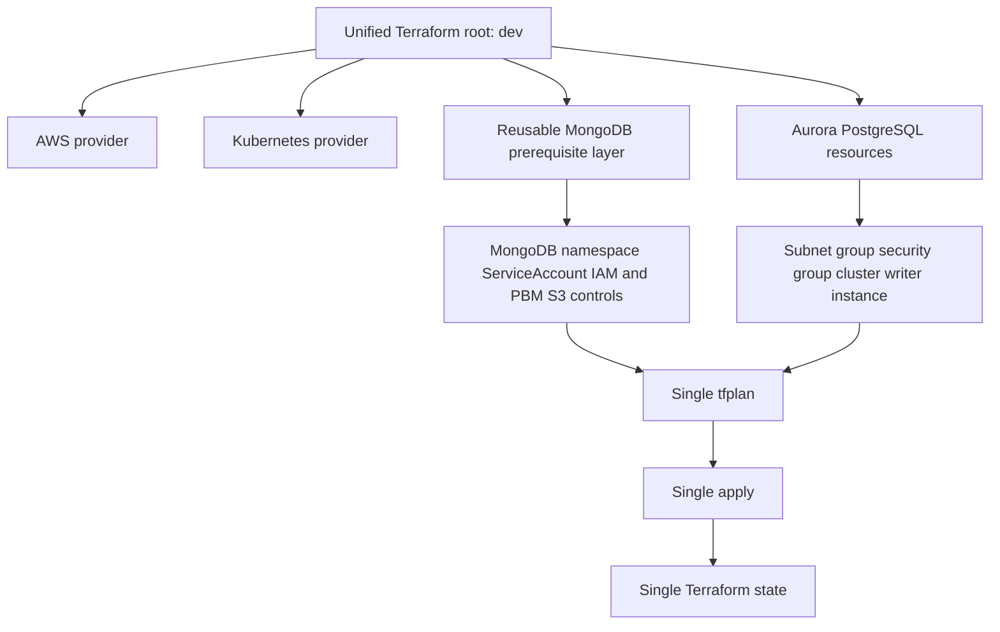
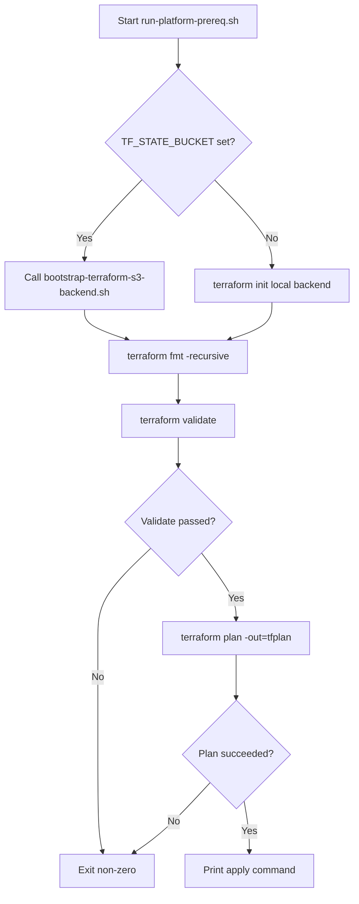
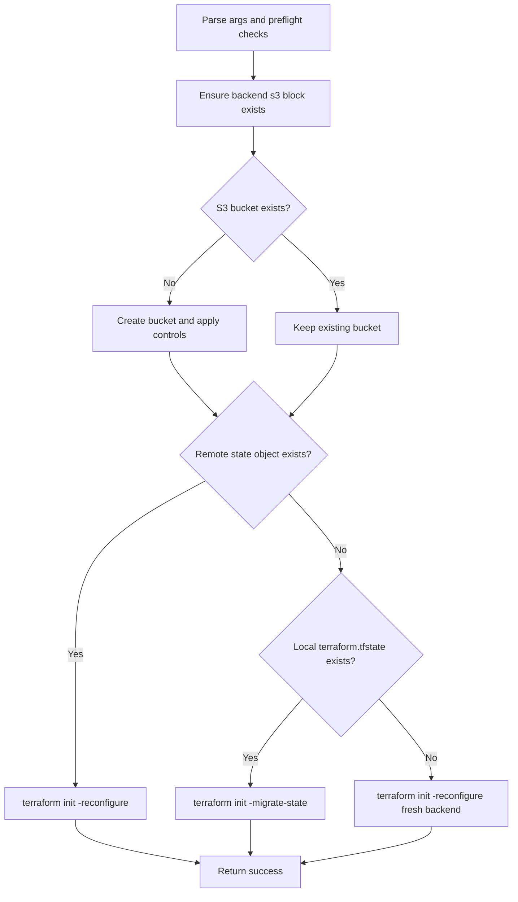
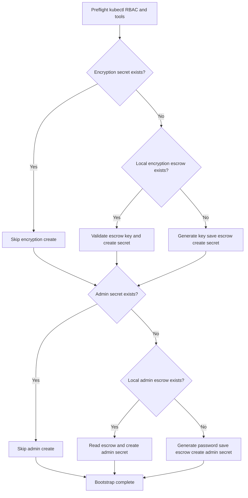
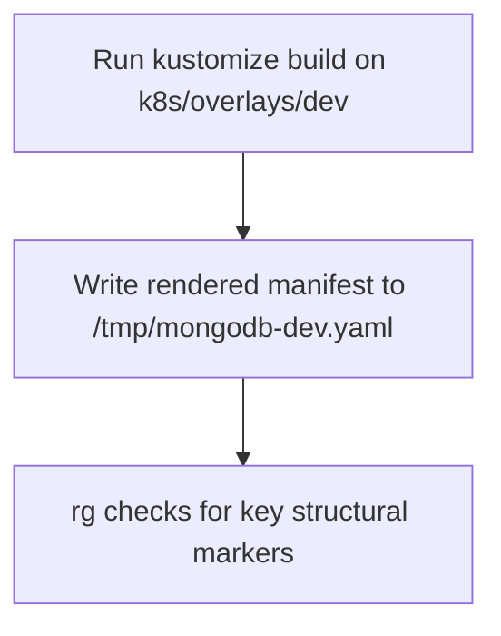
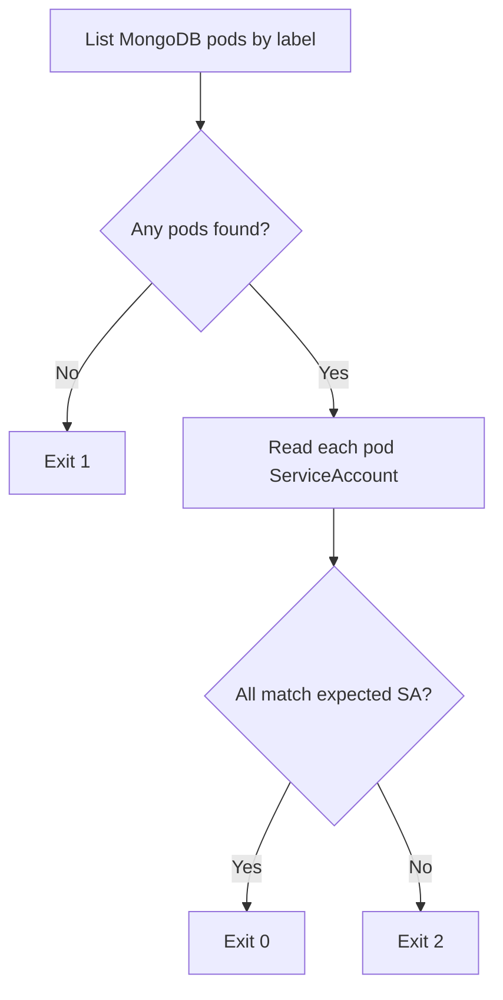
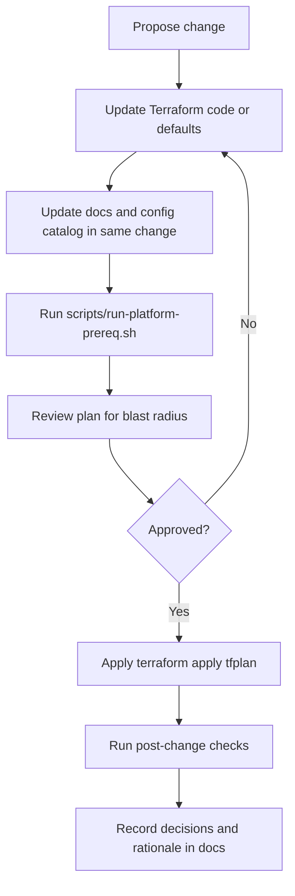

# Platform Prerequisites Terraform

## Purpose
This document is the single source of truth for provisioning platform prerequisites in this repository.

It covers:
- architecture and design intent
- admin responsibilities and access requirements
- operator runbooks for planning and applying infrastructure
- maintenance and change-management guidance
- troubleshooting and recovery expectations

It provisions both in one Terraform run/state:
- MongoDB prerequisites on EKS
- PostgreSQL (Aurora PostgreSQL, dev posture)

It does not provision:
- MongoDB workload manifests in `k8s/`
- CI/CD automation (manual-first workflow only)

## Fast Path (Impatient Operator)
If you need to get to first successful apply quickly, do only this:

1. Create runtime vars file:

```bash
cp platform-prerequisites/terraform/dev/terraform.tfvars.sample platform-prerequisites/terraform/dev/terraform.tfvars
```

2. Fill required values in `platform-prerequisites/terraform/dev/terraform.tfvars`:
  - `cluster_name`
  - `vpc_id`
  - `private_subnet_ids`
  - `db_master_password`

3. Optional remote state (recommended):

```bash
export TF_STATE_BUCKET="your-terraform-state-bucket"
export TF_STATE_REGION="us-east-1"
export TF_STATE_KEY="mongodb/platform-prerequisites/dev/terraform.tfstate"
```

4. Plan and apply:

```bash
scripts/run-platform-prereq.sh
cd platform-prerequisites/terraform/dev && terraform apply tfplan
```

5. MongoDB readiness checks:

```bash
scripts/bootstrap-dev-secrets.sh
scripts/validate-dev-render.sh
```

## Table Of Contents
- [Platform Prerequisites Terraform](#platform-prerequisites-terraform)
  - [Purpose](#purpose)
  - [Fast Path (Impatient Operator)](#fast-path-impatient-operator)
  - [Audience And Primary Tasks](#audience-and-primary-tasks)
  - [First-Time Operator Onboarding](#first-time-operator-onboarding)
  - [Required Safety Gates](#required-safety-gates)
  - [Remote State First-Run Flow](#remote-state-first-run-flow)
  - [Runbook Commands](#runbook-commands)
  - [Troubleshooting](#troubleshooting)
  - [Architecture Summary](#architecture-summary)
  - [Terraform Provisioning Flow](#terraform-provisioning-flow)
  - [Repository Structure](#repository-structure)
  - [Design Decisions And Boundaries](#design-decisions-and-boundaries)
  - [Access And Permissions Model](#access-and-permissions-model)
  - [Admin Deep Dive](#admin-deep-dive)
  - [State Backend Strategy](#state-backend-strategy)
  - [Script Contracts](#script-contracts)
  - [Script Execution Flows](#script-execution-flows)
  - [Configuration Reference](#configuration-reference)
  - [Security Posture](#security-posture)
  - [Operations And Day-2 Maintenance](#operations-and-day-2-maintenance)
  - [Change Flow (Day-2)](#change-flow-day-2)
  - [Change Management Rules](#change-management-rules)
  - [Handoff To Central Platform Terraform](#handoff-to-central-platform-terraform)

## Audience And Primary Tasks
Use this section to jump directly to your role.

| Audience | Primary Questions | Read First |
|---|---|---|
| Platform Admin | What permissions and risks matter? | [Access And Permissions Model](#access-and-permissions-model), [Security Posture](#security-posture), [Admin Deep Dive](#admin-deep-dive) |
| Infra Operator | How do I run this safely? | [Fast Path (Impatient Operator)](#fast-path-impatient-operator), [First-Time Operator Onboarding](#first-time-operator-onboarding), [Runbook Commands](#runbook-commands) |
| System Designer | How is provisioning structured? | [Architecture Summary](#architecture-summary), [Terraform Provisioning Flow](#terraform-provisioning-flow), [Design Decisions And Boundaries](#design-decisions-and-boundaries) |
| Maintainer | How do I change defaults and keep behavior stable? | [Configuration Reference](#configuration-reference), [Operations And Day-2 Maintenance](#operations-and-day-2-maintenance) |
| Incident Responder | How do I diagnose common failures quickly? | [Troubleshooting](#troubleshooting) |

## First-Time Operator Onboarding

Use this section before your first apply. It is written as an operator procedure, not as an internal script trace.

1. Confirm you are targeting the right environment.
   - Know the AWS account, region, EKS cluster, VPC, and private subnets you will use.
   - Confirm the `mongodb` namespace is expected to exist or will be created by this Terraform run.

2. Confirm access before editing files.
   - AWS identity must be allowed to manage the required IAM, S3, EKS discovery, RDS, security group, and subnet-group resources.
   - Kubernetes identity must be authorized against the target EKS cluster.

3. Confirm required tools.
   - Required commands: `terraform`, `aws`, `kubectl`, `kustomize`, `rg`, `openssl`.

4. Create and edit runtime configuration.
   - Copy `platform-prerequisites/terraform/dev/terraform.tfvars.sample` to `platform-prerequisites/terraform/dev/terraform.tfvars`.
   - Replace placeholders with real values.
   - Never commit `terraform.tfvars`.

5. Choose state mode before the first plan.
   - Use remote S3 state for any shared or persistent environment.
   - Use local state only for throwaway local testing.

6. Build, review, and apply the plan.
   - Run `scripts/run-platform-prereq.sh`.
   - Read the generated plan.
   - Apply only if the plan matches the intended changes.

7. Complete MongoDB post-Terraform checks.
   - Run `scripts/bootstrap-dev-secrets.sh`.
   - Run `scripts/validate-dev-render.sh`.
   - Run `scripts/verify-dev-identity.sh` after MongoDB pods exist.



Onboarding is complete when:
- unified Terraform apply succeeds
- MongoDB secret bootstrap succeeds
- MongoDB dev overlay render check succeeds
- pod identity verification succeeds after MongoDB pods are running

## Required Safety Gates

Do not skip these gates in shared, persistent, or production-like environments.
Skipping them can cause failed applies, split Terraform state, or unrecoverable MongoDB data.

| Gate | Required Evidence | Stop If |
|---|---|---|
| Environment Gate | AWS account, region, cluster, VPC, and subnet IDs are known and intentional | Any target value is guessed |
| Access Gate | AWS permissions are available and `kubectl get serviceaccount default -n mongodb` succeeds | Any Unauthorized/Forbidden result |
| Tooling Gate | `terraform`, `aws`, `kubectl`, `kustomize`, `rg`, `openssl` are available in PATH | Any required tool is missing |
| Config Gate | `terraform.tfvars` exists and required values are not placeholders | Critical value is empty or placeholder |
| State Gate | Remote bucket/key are stable for shared environments | `TF_STATE_KEY` is unclear or changed accidentally |
| Plan Gate | `scripts/run-platform-prereq.sh` writes `tfplan` successfully | Init, validate, or plan fails |
| Apply Gate | `terraform apply tfplan` succeeds | Apply fails or partially completes |
| MongoDB Readiness Gate | Secret bootstrap and render validation succeed | Secret, RBAC, or render validation fails |

## Remote State First-Run Flow

Remote state is selected by setting `TF_STATE_BUCKET` before running `scripts/run-platform-prereq.sh`.

First run with remote state:

1. Export backend values:

```bash
export TF_STATE_BUCKET="your-terraform-state-bucket"
export TF_STATE_REGION="us-east-1"
export TF_STATE_KEY="mongodb/platform-prerequisites/dev/terraform.tfstate"
```

2. Run the unified runner:

```bash
scripts/run-platform-prereq.sh
```

3. The runner detects `TF_STATE_BUCKET` and delegates backend setup to `scripts/bootstrap-terraform-s3-backend.sh`.

4. Backend setup checks the bucket:
   - if bucket is missing: create it
   - if bucket exists: reuse it

5. Backend setup applies baseline controls when it creates the bucket:
   - versioning
   - AES256 encryption
   - public access block

6. Backend setup checks the state object:
   - if remote state exists: configure Terraform to use it
   - if remote state is missing and local `terraform.tfstate` exists: migrate local state once
   - if both are missing: initialize an empty remote backend

7. The runner continues with `terraform fmt`, `terraform validate`, and `terraform plan -out=tfplan`.

Later runs:
- keep the same bucket and key
- rerun `scripts/run-platform-prereq.sh`
- Terraform reuses the existing remote state
- migration is not repeated

Never change `TF_STATE_KEY` casually. A different key is a different state file.

## Runbook Commands

| Command | Purpose | Use When |
|---|---|---|
| `scripts/run-platform-prereq.sh` | Executes `init`, `fmt`, `validate`, `plan` for unified root. | Before each apply and after Terraform changes. |
| `cd platform-prerequisites/terraform/dev && terraform apply tfplan` | Applies unified infrastructure plan. | After plan review and approval. |
| `scripts/bootstrap-terraform-s3-backend.sh` | Bootstraps/validates S3 backend and one-time migration. | First remote-state setup or backend recovery. |
| `scripts/bootstrap-dev-secrets.sh` | Ensures MongoDB dev secrets exist. | Before applying MongoDB manifests. |
| `scripts/validate-dev-render.sh` | Confirms MongoDB dev overlay renders correctly. | Pre-commit and pre-apply safety check. |
| `scripts/verify-dev-identity.sh` | Checks expected ServiceAccount usage at runtime. | Post-deploy identity verification. |

## Troubleshooting

| Symptom | Likely Cause | Action |
|---|---|---|
| `Unauthorized` or `Forbidden` for Kubernetes resources | Runner lacks EKS API authorization/RBAC mapping | Confirm EKS Access Entry or RBAC mapping for runner identity. |
| Backend init/migration does not use S3 | `TF_STATE_BUCKET` not set or incorrect bucket/key | Export backend env vars and rerun `scripts/run-platform-prereq.sh`. |
| Backend bucket creation fails | Missing S3 permissions or region mismatch | Validate IAM permissions and `TF_STATE_REGION`. |
| PostgreSQL resources fail on networking inputs | Invalid `vpc_id` or `private_subnet_ids` | Correct VPC/subnet values in `dev/terraform.tfvars`. |
| Terraform CLI fails before validate in this environment | Local `tfenv` is not configured | Fix local tfenv version configuration or use direct Terraform binary. |

## Architecture Summary
The Terraform layout separates reusable resource logic from the runnable dev root.

- Reusable layer: `platform-prerequisites/terraform/reusable`
  - no provider/backend lock-in
  - contains portable resource logic for MongoDB prerequisites
- Unified root: `platform-prerequisites/terraform/dev`
  - contains provider configuration, backend integration, and root-level inputs
  - provisions MongoDB prerequisites and PostgreSQL resources in a single state/apply

Single execution contract:
- one root (`dev`)
- one plan (`tfplan`)
- one state key (`mongodb/platform-prerequisites/dev/terraform.tfstate` by default)

## Terraform Provisioning Flow

This diagram shows what Terraform plans and applies. It is not the operator onboarding sequence.



## Repository Structure

| Path | Role |
|---|---|
| `platform-prerequisites/terraform/reusable` | Reusable Terraform layer for portable module logic. |
| `platform-prerequisites/terraform/dev` | Unified runnable root for MongoDB prerequisites + PostgreSQL. |
| `scripts/run-platform-prereq.sh` | Primary plan workflow (init/fmt/validate/plan) for unified root. |
| `scripts/bootstrap-terraform-s3-backend.sh` | Idempotent S3 backend bootstrap and one-time state migration helper. |
| `scripts/bootstrap-dev-secrets.sh` | Creates missing MongoDB dev secrets without mutating tracked manifests. |
| `scripts/validate-dev-render.sh` | Offline Kustomize render checks for MongoDB dev overlay. |
| `scripts/verify-dev-identity.sh` | Post-deploy ServiceAccount verification helper. |

## Design Decisions And Boundaries
Naming alignment follows parent convention:
- source: `naming-convention-design.md` in `tf_generator`
- pattern: `{provider}-{location}{site}-{env}-{app}-{role}-{type}-{seq}`

Current PBM bucket default:
- `sml-aw-gb0-d-oms-gen-s3-01`

Boundary decisions:
- Terraform here prepares platform prerequisites, not workload manifests.
- Dev posture favors operational simplicity and repeatability.
- PostgreSQL is provisioned Aurora with single writer for dev.
- Manual DB credentials are used in this phase (stored in Terraform state).
- Production direction is managed credentials (Secrets Manager-backed).

## Access And Permissions Model
The Terraform runner identity must have:
- AWS permissions for IAM, S3, EKS read/auth discovery, and RDS/VPC resources used by this stack
- Kubernetes API authorization in the target EKS cluster for resources such as namespace/service account

Without EKS API authorization, AWS authentication can succeed while Kubernetes resources fail with Unauthorized/Forbidden.

For pipeline adoption later:
- create an EKS Access Entry (or equivalent RBAC mapping) for the pipeline IAM role

For current manual-first flow:
- use a bastion/admin IAM identity already mapped to required Kubernetes RBAC

## Admin Deep Dive

This section is for advanced administrators who need operational depth beyond quick execution.

Control-plane and trust boundaries:
- Terraform state and execution context: `platform-prerequisites/terraform/dev`
- Reusable logic boundary: `platform-prerequisites/terraform/reusable`
- Kubernetes runtime boundary: `mongodb` namespace resources and ServiceAccounts

Data sensitivity map:
- High sensitivity:
  - Terraform state (contains PostgreSQL master password in dev posture)
  - local `terraform.tfvars` values
  - local escrow files generated by `scripts/bootstrap-dev-secrets.sh`
- Medium sensitivity:
  - IAM role and policy metadata
  - DB endpoint outputs

Operational risk notes:
- Any identity without EKS API auth can still appear AWS-authenticated while failing Kubernetes resource creation.
- Incorrect `TF_STATE_KEY` can fragment state and create drift between expected and actual ownership.
- Lost escrow material with retained encrypted MongoDB volumes prevents recovery of old encrypted data.

## State Backend Strategy
Backend migration is intentionally idempotent.

Script:
- `scripts/bootstrap-terraform-s3-backend.sh`

Behavior:
- creates backend S3 bucket if missing
- applies bucket baseline controls on create:
  - versioning enabled
  - AES256 server-side encryption enabled
  - public access block enabled
- if remote state object exists: use remote state
- if remote is missing and local state exists: migrate local state once
- if both are missing: initialize fresh remote backend

Default state key for unified root:
- `mongodb/platform-prerequisites/dev/terraform.tfstate`

## Script Contracts

| Script | Inputs | Outputs | Exit Behavior |
|---|---|---|---|
| `scripts/run-platform-prereq.sh` | Optional `TF_STATE_BUCKET`, `TF_STATE_REGION`, `TF_STATE_KEY`; Terraform files in `platform-prerequisites/terraform/dev` | `tfplan` in unified root | Non-zero on backend/init/validate/plan failure |
| `scripts/bootstrap-terraform-s3-backend.sh` | `--tf-dir`, `--bucket`, `--region`, `--key`; AWS + Terraform CLI access | Backend configured for remote state or migrated state | Non-zero on arg/preflight/AWS/Terraform failures |
| `scripts/bootstrap-dev-secrets.sh` | Kubernetes access to namespace `mongodb`; optional local escrow files | Secrets `psmdb-encryption-key` and `psmdb-secrets`; local escrow files if generated | Non-zero on RBAC/tool/validation/secret creation failure |
| `scripts/validate-dev-render.sh` | `kustomize` and `rg`; `k8s/overlays/dev` present | `/tmp/mongodb-dev.yaml` and structural checks output | Non-zero when render/checks fail |
| `scripts/verify-dev-identity.sh` | Optional args: `namespace`, `expected SA`; running MongoDB pods | SA verification output by pod | `0` success, `1` no pods, `2` SA mismatch |

## Script Execution Flows

These diagrams describe script internals. Use this section when debugging behavior or onboarding maintainers.

### scripts/run-platform-prereq.sh



### scripts/bootstrap-terraform-s3-backend.sh



### scripts/bootstrap-dev-secrets.sh



### scripts/validate-dev-render.sh



### scripts/verify-dev-identity.sh



## Configuration Reference

| File | Owns | Typical Changes |
|---|---|---|
| `platform-prerequisites/terraform/reusable/variables.tf` | Shared module defaults for MongoDB prerequisite layer. | Baseline defaults shared across roots. |
| `platform-prerequisites/terraform/reusable/main.tf` | Shared module resources and IAM/S3/Kubernetes wiring. | Architecture-level resource changes. |
| `platform-prerequisites/terraform/dev/variables.tf` | Unified root input contract (MongoDB + PostgreSQL). | Root defaults for region/network/db sizing/runtime behavior. |
| `platform-prerequisites/terraform/dev/main.tf` | Unified root execution and PostgreSQL resources. | Provider/backend/root wiring and PG resource topology. |
| `platform-prerequisites/terraform/dev/outputs.tf` | Unified outputs for operators and downstream usage. | Expose new outputs or adjust output contracts. |
| `platform-prerequisites/terraform/dev/terraform.tfvars.sample` | Operator template for local runtime values. | Update sample values and required fields guidance. |

Broader configuration catalog:
- `docs/operations/dev-configuration-catalog.md`

## Security Posture
Current dev posture:
- manual credentials for PostgreSQL via local `terraform.tfvars`
- PostgreSQL password remains sensitive but is stored in Terraform state
- PostgreSQL writer is non-public
- S3 backend bootstrap enforces baseline bucket controls

Operational safeguards:
- do not commit `terraform.tfvars`
- restrict backend bucket access to least privilege
- treat Terraform state as sensitive data
- rotate dev credentials when environments are shared

## Operations And Day-2 Maintenance
Routine workflow:
- rerun `scripts/run-platform-prereq.sh` after Terraform code/default changes
- inspect plan diff before every apply
- keep `dev/terraform.tfvars.sample` aligned with actual variable contract
- validate MongoDB render and secret bootstrap before workload deployment

Maintenance checklist:
- verify provider versions remain compatible with root and module constraints
- review IAM policy scope whenever new integrations are added
- keep this README synchronized whenever behavior, inputs, or runbooks change

## Change Flow (Day-2)



## Change Management Rules
When changing Terraform behavior:
- keep unified root/state contract intact unless intentionally redesigned
- update this README and `docs/operations/dev-configuration-catalog.md` in the same change
- prefer additive defaults with explicit migration notes over silent behavioral changes

When changing security-sensitive settings:
- document the threat/risk tradeoff directly in this README
- include rollback and verification steps in the same PR/change set

## Handoff To Central Platform Terraform
This repository keeps the reusable layer intentionally portable for later integration.

Handoff expectation:
- `platform-prerequisites/terraform/reusable` can be absorbed into central platform Terraform
- current unified root (`dev`) is an operator-oriented local entrypoint and can be replaced after integration